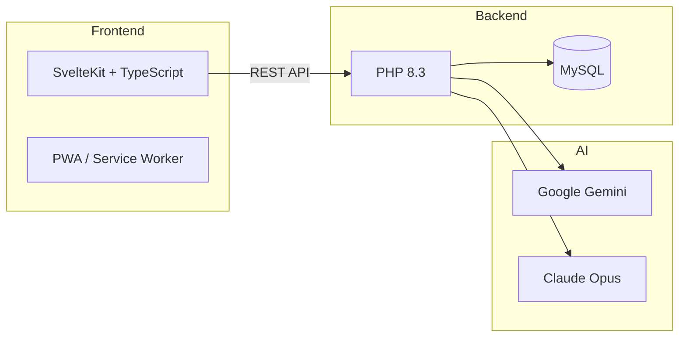
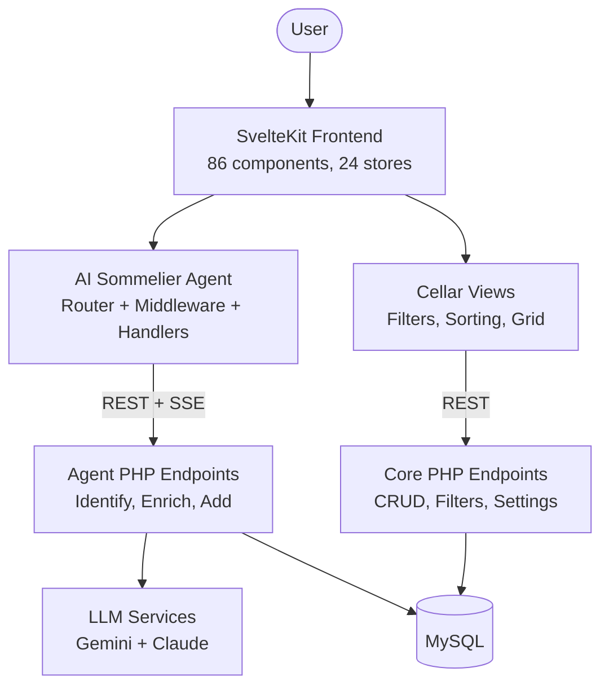

# Qvé Wine App

A personal wine cellar management app with an AI sommelier assistant. Photograph a wine label or describe a wine, and the agent identifies it, enriches it with critic scores and tasting notes, and adds it to your cellar.

## What It Does

- **Cellar Management** — Browse, filter, and sort your wine collection with smart cascading filters and multiple view densities
- **AI Wine Agent** — Conversational sommelier that identifies wines from text or photos, with streaming results and multi-tier LLM escalation
- **Wine Enrichment** — Automatic lookup of grape composition, critic scores, drink windows, tasting notes, and food pairings
- **Drink & Rate** — Track bottles consumed with 10-point ratings and tasting notes
- **History** — Full drink history with sorting and filtering

## Tech Stack



| Layer | Technology |
|-------|-----------|
| Frontend | SvelteKit, TypeScript, Vite, CSS custom properties |
| Backend | PHP 8.3 (stateless REST endpoints) |
| Database | MySQL (28 tables, 3 views) |
| AI | Google Gemini (primary), Claude Opus (escalation) |
| Hosting | Static SvelteKit build on production server |

## Architecture at a Glance



The frontend is a SvelteKit SPA with file-based routing and 24 reactive stores. The AI agent uses a **Router + Middleware + Handlers** pattern with a finite state machine (8 phases) controlling the conversation flow. The PHP backend is stateless — each endpoint handles one concern with no framework overhead.

## Key Features

### AI Sommelier Agent
The agent is the core differentiator. Users interact through a chat-style panel:

1. **Identify** — Submit text or a photo. The agent calls Gemini (with Claude Opus escalation for low-confidence results) and streams identified fields back in real time.
2. **Confirm** — Review the result. If incomplete, provide missing details field-by-field or re-identify.
3. **Enrich** — "Learn More" fetches critic scores, grape composition, tasting notes, drink window, and food pairings.
4. **Add** — Add to cellar with duplicate detection, entity matching (region/producer/wine), and bottle details.

The agent persists state to sessionStorage so mobile users don't lose progress when switching to the camera app.

### Cellar & Collection
- Cascading filters (country, type, region, producer, vintage) that update available options based on active selections
- 9 sort options with compact/comfortable view densities
- Cellar vs All Wines toggle with bottle counts and estimated value
- Mobile-first responsive grid (2-6 columns based on viewport)

## Project Structure

```
wineapp/
├── qve/src/              # SvelteKit frontend
│   ├── lib/agent/        # Agent: router, state machine, 6 handlers, middleware
│   ├── lib/components/   # 86 Svelte components across 8 categories
│   ├── lib/stores/       # 24 stores (17 core + 7 agent)
│   ├── lib/api/          # TypeScript API client
│   └── routes/           # 5 routes (cellar, add, history, edit, drink)
├── resources/php/        # PHP backend (20 core + 9 agent endpoints)
├── resources/sql/        # Database schema
├── docs/                 # Detailed documentation (this directory)
├── scripts/              # JIRA CLI, utilities, deployment with backup/rollback
```

## Getting Started

```bash
# Frontend
cd qve && npm run dev         # http://localhost:5173/qve/

# Backend
php -S localhost:8000         # Serves PHP endpoints via Vite proxy
```

See [DEVELOPMENT.md](DEVELOPMENT.md) for full setup, testing, and deployment instructions.

## Documentation

| Document | What's Inside |
|----------|--------------|
| [ARCHITECTURE.md](ARCHITECTURE.md) | System architecture, data flows, database schema, deployment |
| [AGENT_ARCHITECTURE.md](AGENT_ARCHITECTURE.md) | Agent internals: router, state machine, handlers, middleware, stores, messages |
| [AGENT_FLOW.md](AGENT_FLOW.md) | Agent conversation flows, debugging guide, chip configs, phase/action matrix |
| [COMPONENTS.md](COMPONENTS.md) | All 86 component APIs with props, events, and usage |
| [STORES.md](STORES.md) | All 24 store APIs with state shapes and relationships |
| [API.md](API.md) | TypeScript client methods, PHP endpoints, SSE streaming protocol |
| [DEVELOPMENT.md](DEVELOPMENT.md) | Setup, workflow, testing, deployment, troubleshooting |
| [SOMMELIER_PERSONALITIES.md](SOMMELIER_PERSONALITIES.md) | Agent personality system and message templates |
| [PHASE_2_REARCHITECTURE.md](PHASE_2_REARCHITECTURE.md) | Historical: migration from monolithic to modular agent |
| [PRODUCTION_READINESS_AUDIT.md](PRODUCTION_READINESS_AUDIT.md) | Security and reliability audit with status tracking |

For AI-assisted development sessions, [CLAUDE.md](../CLAUDE.md) provides quick-start context, key patterns, and common gotchas.
