# Agent Architecture Documentation

This document describes the rearchitected wine sommelier agent system, including state machines, message flows, and component relationships.

**Last Updated**: 2026-02-05
**Phase**: 2 (Rearchitecture Complete - Sprint 5)
**Tests**: 534 passing

---

## Table of Contents

1. [High-Level Architecture](#high-level-architecture)
2. [Request Flow](#request-flow)
3. [Directory Structure](#directory-structure)
4. [Middleware System](#middleware-system)
5. [Handler Modules](#handler-modules)
6. [Phase State Machine](#phase-state-machine)
7. [Store Architecture](#store-architecture)
8. [Message System](#message-system)
9. [Action System](#action-system)
10. [Text Input Processing](#text-input-processing)
11. [Identification Flow](#identification-flow)
12. [Add Wine Flow](#add-wine-flow)
13. [Enrichment Flow](#enrichment-flow)
14. [Chip Configurations](#chip-configurations)
15. [Command Detection](#command-detection)
16. [Error Handling](#error-handling)
17. [Handler Contribution Guide](#handler-contribution-guide)
18. [Migration Notes](#migration-notes)

---

## High-Level Architecture

The agent uses a **Router + Middleware + Handlers** pattern with split stores for separation of concerns.

```
                            ┌─────────────────────────────────────────────────────────────┐
                            │                        UI Layer                             │
                            │  AgentPanel.svelte  │  ChatMessage.svelte  │  ActionChips   │
                            └───────────────────────────────┬─────────────────────────────┘
                                                            │ dispatchAction()
                                                            ▼
┌───────────────────────────────────────────────────────────────────────────────────────────┐
│                                    router.ts                                              │
│  ┌─────────────────────────────────────────────────────────────────────────────────────┐  │
│  │                              Middleware Chain                                       │  │
│  │  ┌───────────────────┐   ┌───────────────────┐   ┌──────────────────┐               │  │
│  │  │ withErrorHandling │ → │ withRetryTracking │ → │  withValidation  │ → routeAction │  │
│  │  └───────────────────┘   └───────────────────┘   └──────────────────┘               │  │
│  └─────────────────────────────────────────────────────────────────────────────────────┘  │
└───────────────────────────────────────────────────────────────────────────────────────────┘
                                                            │
                     ┌──────────────┬──────────────┬────────┴────────┬──────────────┐
                     ▼              ▼              ▼                 ▼              ▼
            ┌────────────┐  ┌────────────┐  ┌────────────┐  ┌────────────┐  ┌────────────┐
            │conversation│  │identificat │  │ enrichment │  │  addWine   │  │   forms    │
            │   .ts      │  │    ion.ts  │  │    .ts     │  │    .ts     │  │    .ts     │
            └────────────┘  └────────────┘  └────────────┘  └────────────┘  └────────────┘
                     │              │              │                 │              │
                     └──────────────┴──────────────┴────────┬────────┴──────────────┘
                                                            │
┌───────────────────────────────────────────────────────────────────────────────────────────┐
│                                       Stores                                              │
│  ┌─────────────────┐  ┌───────────────────┐  ┌────────────────┐  ┌────────────────────┐   │
│  │agentConversation│  │agentIdentification│  │ agentEnrichment│  │   agentAddWine     │   │
│  │  - messages     │  │  - result         │  │  - data        │  │  - flow state      │   │
│  │  - phase        │  │  - streaming      │  │  - cache       │  │  - entity matching │   │
│  │  - chips        │  │  - error          │  │  - loading     │  │  - bottle form     │   │
│  └─────────────────┘  └───────────────────┘  └────────────────┘  └────────────────────┘   │
└───────────────────────────────────────────────────────────────────────────────────────────┘
                                                            │
                                                            ▼
                              ┌─────────────────────────────────────────┐
                              │              API Layer                  │
                              │  $lib/api/client.ts → PHP Backend       │
                              └─────────────────────────────────────────┘
```

### Mermaid Version

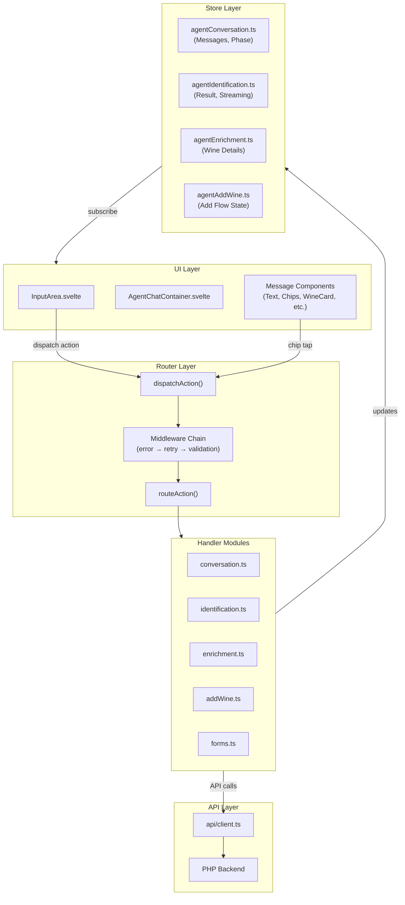

---

## Request Flow

All user interactions flow through the same pipeline:

```
User Action (tap chip / submit text)
         │
         ▼
┌─────────────────────────────────────────────────────────────────┐
│  dispatchAction({ type: 'submit_text', payload: 'Margaux' })   │
└─────────────────────────────────────────────────────────────────┘
         │
         ▼
┌─────────────────────────────────────────────────────────────────┐
│  1. withErrorHandling                                           │
│     - Wraps entire chain in try/catch                           │
│     - On error: extracts info, shows message, sets error phase  │
└─────────────────────────────────────────────────────────────────┘
         │
         ▼
┌─────────────────────────────────────────────────────────────────┐
│  2. withRetryTracking                                           │
│     - Stores action in lastAction store (if retryable)          │
│     - Enables 'Try Again' chip functionality                    │
└─────────────────────────────────────────────────────────────────┘
         │
         ▼
┌─────────────────────────────────────────────────────────────────┐
│  3. withValidation                                              │
│     - Checks action prerequisites (phase, identification, etc.) │
│     - Skips action if prerequisites not met                     │
└─────────────────────────────────────────────────────────────────┘
         │
         ▼
┌─────────────────────────────────────────────────────────────────┐
│  4. routeAction                                                 │
│     - Checks action type against handler type guards            │
│     - Routes to appropriate handler module                      │
│     - Delegates to legacy handler if no match                   │
└─────────────────────────────────────────────────────────────────┘
         │
         ▼
┌─────────────────────────────────────────────────────────────────┐
│  5. Handler (e.g., identification.handleSubmitText)             │
│     - Updates stores (messages, phase, result)                  │
│     - Makes API calls if needed                                 │
│     - Generates response chips                                  │
└─────────────────────────────────────────────────────────────────┘
```

---

## Directory Structure

```
qve/src/lib/agent/
├── router.ts                 # Entry point - dispatchAction()
├── types.ts                  # AgentAction, AgentPhase, etc.
├── stateMachine.ts           # Phase transition validation
├── messages.ts               # getMessage() - message lookups
├── messageKeys.ts            # MessageKey enum
├── personalities.ts          # Personality types for messages
│
├── handlers/
│   ├── index.ts              # Barrel exports + type guards
│   ├── conversation.ts       # start_over, go_back, cancel, retry
│   ├── identification.ts     # submit_text, submit_image, correct, not_correct
│   ├── enrichment.ts         # learn, remember, cache handling
│   ├── addWine.ts            # add_to_cellar, entity matching
│   └── forms.ts              # bottle form, manual entry
│
├── middleware/
│   ├── index.ts              # Barrel exports
│   ├── types.ts              # ActionHandler, Middleware types
│   ├── compose.ts            # compose() utility
│   ├── errorHandler.ts       # withErrorHandling
│   ├── retryTracker.ts       # withRetryTracking
│   └── validator.ts          # withValidation
│
├── services/
│   ├── index.ts              # Barrel exports
│   ├── chipGenerator.ts      # generateXxxChips() functions
│   └── chipRegistry.ts       # ChipKey enum, getChip()
│
├── messages/
│   ├── index.ts              # Registry loader
│   └── sommelier.ts          # Sommelier personality messages
│
└── __tests__/
    ├── handlers.test.ts      # Handler unit tests
    ├── middleware.test.ts    # Middleware unit tests
    ├── router.test.ts        # Router unit tests
    ├── errorScenarios.test.ts
    ├── streaming.test.ts
    └── integration/
        └── addWineFlow.test.ts
```

---

## Middleware System

### Middleware Chain

Middleware wraps the route function to add cross-cutting concerns:

```typescript
// Composition order (outermost to innermost)
const middlewareChain = compose(
  withErrorHandling,    // 1. Catches all errors
  withRetryTracking,    // 2. Records retryable actions
  withValidation        // 3. Checks prerequisites
);

const wrappedRouter = middlewareChain(routeAction);
```

### withErrorHandling

Catches errors from any handler and displays user-friendly messages:

```typescript
export const withErrorHandling: Middleware = (handler) => async (action) => {
  try {
    await handler(action);
  } catch (error) {
    const errorInfo = extractErrorInfo(error);
    showErrorInConversation(errorInfo);
    conversation.setPhase('error');
  }
};
```

### withRetryTracking

Stores the last action in a Svelte store for retry functionality:

```typescript
const retryableActions = new Set([
  'submit_text', 'submit_image', 'enrich_now', 'add_to_cellar', 'submit_bottle'
]);

export const withRetryTracking: Middleware = (handler) => async (action) => {
  if (retryableActions.has(action.type)) {
    lastActionStore.set({ action, timestamp: Date.now() });
  }
  await handler(action);
};
```

### withValidation

Checks prerequisites before executing an action:

```typescript
const prerequisites = {
  'correct': { requiresIdentification: true, requiresPhase: ['confirming'] },
  'add_to_cellar': { requiresIdentification: true },
  'submit_bottle': { requiresAddWineFlow: true },
};

export const withValidation: Middleware = (handler) => async (action) => {
  const prereqs = prerequisites[action.type];
  if (prereqs && !validatePrerequisites(prereqs)) {
    console.warn(`Action ${action.type} prerequisites not met`);
    return; // Skip action
  }
  await handler(action);
};
```

### Creating Custom Middleware

```typescript
import type { Middleware } from '$lib/agent/middleware';

const withLogging: Middleware = (handler) => async (action) => {
  console.log(`[Action] Start: ${action.type}`);
  const start = performance.now();

  await handler(action);

  console.log(`[Action] Done: ${action.type} (${performance.now() - start}ms)`);
};

// Use in a custom router
const customRouter = createRouter(
  withErrorHandling,
  withLogging,  // Add custom middleware
  withValidation
);
```

---

## Handler Modules

Each handler module follows the same pattern:

### conversation.ts

Navigation and session control.

| Action | Description |
|--------|-------------|
| `start_over` | Reset all stores, new greeting |
| `go_back` | Return to previous phase |
| `cancel` | Close agent panel |
| `retry` / `try_again` | Re-dispatch last tracked action |

### identification.ts

Wine identification flow.

| Action | Description |
|--------|-------------|
| `submit_text` | Text-based identification |
| `submit_image` | Image-based identification |
| `try_opus` | Escalate to premium model |
| `reidentify` | Re-run identification |
| `correct` | User confirms result is correct |
| `not_correct` | User says result is wrong |
| `confirm_brief_search` | Confirm single-word search |
| `search_anyway` | Proceed with brief input |
| `use_producer_name` | Use producer as wine name |
| `use_grape_as_name` | Use grape variety as wine name |
| `nv_vintage` | Set vintage to NV (non-vintage) |

### enrichment.ts

Wine information lookup.

| Action | Description |
|--------|-------------|
| `learn` / `enrich_now` | Fetch wine details |
| `remember` | Save for later (no-op) |
| `recommend` | Get food pairings |
| `confirm_cache_match` | Use cached enrichment |
| `force_refresh` | Bypass cache |

### addWine.ts

Add wine to cellar flow.

| Action | Description |
|--------|-------------|
| `add_to_cellar` | Start add wine flow |
| `add_bottle_existing` | Add bottle to existing wine |
| `create_new_wine` | Create new wine entry |
| `select_match` | Select entity from matches |
| `add_new` | Create new entity |
| `clarify` | Provide more matching details |
| `enrich_now` | Enrich before adding |
| `add_quickly` | Skip enrichment |

### forms.ts

Form submission handlers.

| Action | Description |
|--------|-------------|
| `submit_bottle` | Submit bottle form |
| `bottle_next` | Move to next form step |
| `manual_entry_submit` | Submit manual wine entry |
| `retry_add` | Retry failed submission |

---

## Phase State Machine

The agent operates in distinct phases that control what inputs are accepted and what UI is shown.

### Phase Definitions

| Phase | Description | Input Enabled | Expected Actions |
|-------|-------------|---------------|------------------|
| `greeting` | Initial state, shows welcome message | Yes | Text/Image input |
| `awaiting_input` | Ready for user input, may have partial result | Yes | Text/Image input, field clarification |
| `identifying` | Processing identification | No | None (loading) |
| `confirming` | Showing result, awaiting confirmation or action | Yes | Correct/Not Correct, action chips, re-identify |
| `adding_wine` | In add-to-cellar flow | Conditional | Entity selection, form submission |
| `enriching` | Fetching wine details | No | None (loading) |
| `error` | Error occurred | Yes | Retry, Start Over |
| `complete` | Action completed | Yes | Start Over |

### Phase Transitions

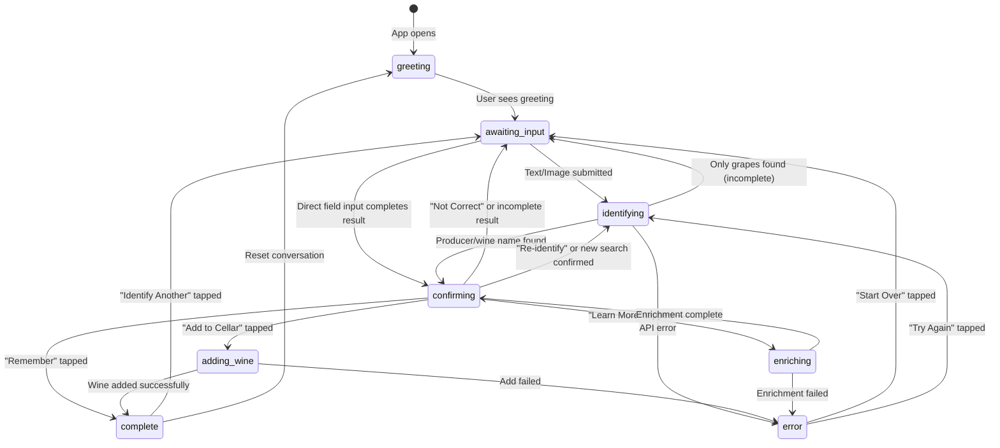

### Confirming Phase - Detail

The `confirming` phase has multiple sub-states based on result completeness:

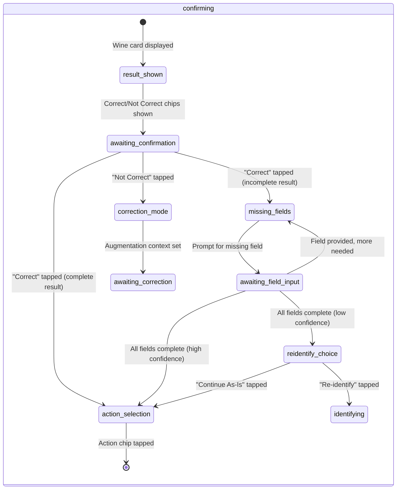

### Add Wine Sub-Steps

When `phase === 'adding_wine'`, the `addWineStep` provides granular state:

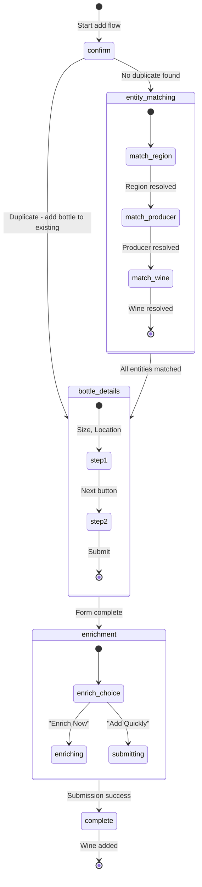

---

## Store Architecture

The agent state is split across four specialized stores, coordinated by a persistence layer.

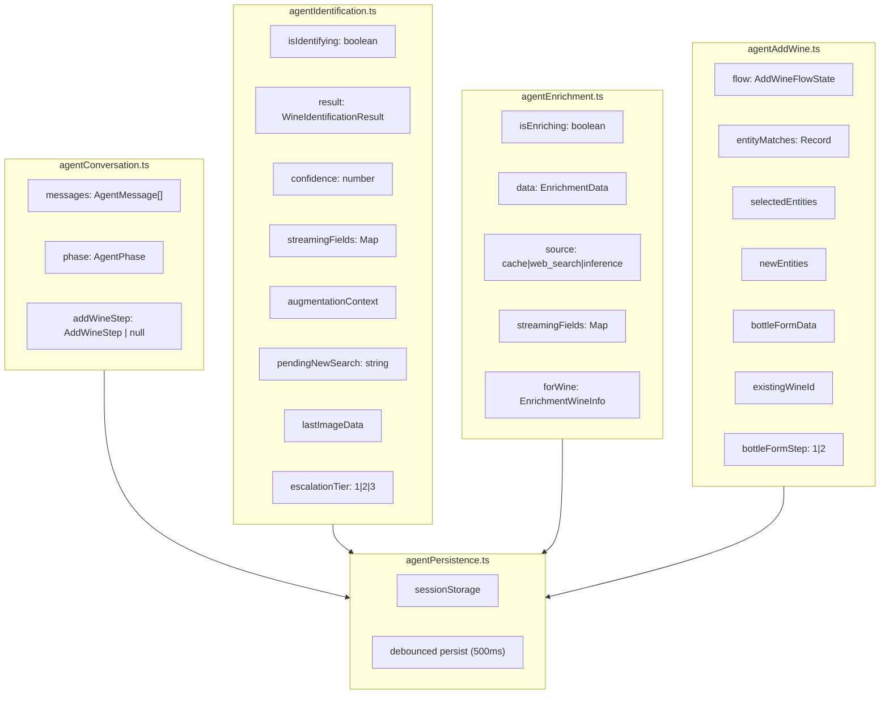

---

## Message System

### Message Categories

Messages are typed by category, each with specific data shapes:

| Category | Role | Description | Component |
|----------|------|-------------|-----------|
| `text` | both | Plain text messages | `TextMessage.svelte` |
| `chips` | agent | Action buttons | `ChipsMessage.svelte` |
| `wine_result` | agent | Identified wine card | `WineCard.svelte` |
| `enrichment` | agent | Wine details card | `EnrichmentCard.svelte` |
| `form` | agent | Interactive forms | `FormMessage.svelte` |
| `error` | agent | Error with retry options | `ErrorMessage.svelte` |
| `image` | user | User-submitted photo | `ImageMessage.svelte` |

### Text Message Variants

```typescript
interface TextMessageData {
  category: 'text';
  content: string;
  variant?: 'greeting' | 'info' | 'warning' | 'success' | 'divider';
}
```

| Variant | Usage |
|---------|-------|
| `greeting` | Initial welcome messages |
| `info` | Standard informational messages |
| `warning` | Caution messages |
| `success` | Completion messages |
| `divider` | Visual separator (used on "Start Over") |

### Form Message Types

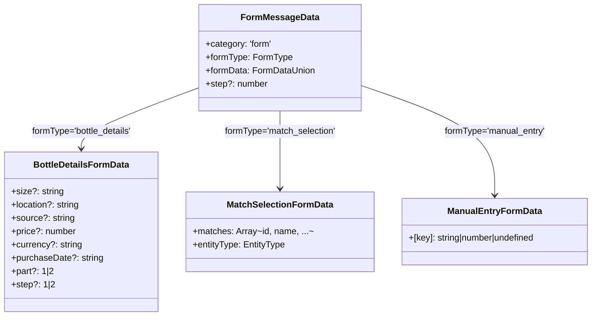

---

## Action System

### Action Type Hierarchy

All user interactions are converted to typed actions and routed through `handleAgentAction()`:

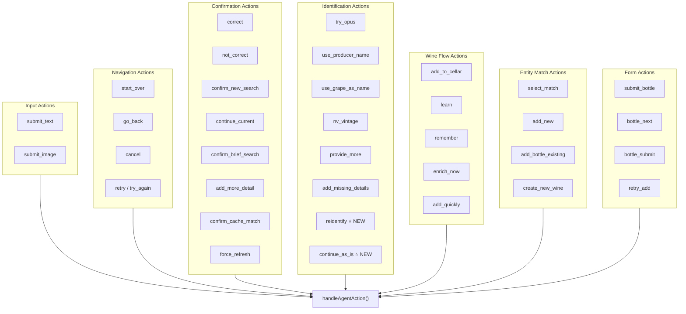

### New Actions (Recent Changes)

| Action | Trigger | Effect |
|--------|---------|--------|
| `reidentify` | "Re-identify" chip after manual field entry | Builds query from current result and re-runs identification |
| `continue_as_is` | "Continue As-Is" chip after manual field entry | Accepts manually-entered data and shows action chips |

---

## Text Input Processing

Text input goes through multiple detection stages before identification:

```mermaid
flowchart TB
    Start([User submits text]) --> CommandCheck{1. Command<br/>Detection}

    CommandCheck -->|"start over, cancel, etc."| ExecuteCommand[Execute command]
    ExecuteCommand --> End([Done])

    CommandCheck -->|Not a command| FieldClarification{2. Explicit Field<br/>Clarification?}

    FieldClarification -->|"region is X, producer is Y"| UpdateField[Update result field]
    UpdateField --> CheckComplete1{Result complete?}
    CheckComplete1 -->|Yes, high conf| ShowActionChips[Show action chips]
    CheckComplete1 -->|Yes, low conf| ShowReidentifyChoice[Show Re-identify choice]
    CheckComplete1 -->|No| PromptNextField[Prompt for next field]

    FieldClarification -->|No pattern match| DirectFieldInput{3. Direct Field Input?<br/>(no augmentation)}

    DirectFieldInput -->|Year entered, missing vintage| UpdateVintage[Update vintage]
    DirectFieldInput -->|Text entered, missing producer| UpdateProducer[Update producer]
    DirectFieldInput -->|Text entered, missing wine name| UpdateWineName[Update wine name]
    UpdateVintage --> CheckComplete2{Result complete?}
    UpdateProducer --> CheckComplete2
    UpdateWineName --> CheckComplete2
    CheckComplete2 --> ShowActionChips
    CheckComplete2 --> ShowReidentifyChoice
    CheckComplete2 --> PromptNextField

    DirectFieldInput -->|No match| ChipResponseCheck{4. Chip Response?<br/>(confirming phase)}

    ChipResponseCheck -->|"yes, correct, ok"| HandleCorrect[Handle Correct]
    ChipResponseCheck -->|"no, wrong"| HandleNotCorrect[Handle Not Correct]
    ChipResponseCheck -->|Not a chip response| NewSearchCheck{5. New Search?<br/>(has result)}

    NewSearchCheck -->|In confirming phase| ShowNewSearchConfirm[Show confirmation]
    NewSearchCheck -->|Not confirming| BriefInputCheck{6. Brief Input?<br/>(single word)}

    BriefInputCheck -->|Single word| ShowBriefConfirm[Show "Search Anyway?" prompt]
    BriefInputCheck -->|Multi-word| AugmentationCheck{7. Has Augmentation<br/>Context?}

    AugmentationCheck -->|Image context| ReidentifyWithImage[Re-identify with image + text]
    AugmentationCheck -->|Text context| ReidentifyWithContext[Re-identify with accumulated context]
    AugmentationCheck -->|No context| FreshIdentification[Fresh text identification]
```

### Detection Priority Order

1. **Command Detection** - "start over", "cancel", "help", etc.
2. **Explicit Field Clarification** - "region is X", "producer is Y"
3. **Direct Field Input** - Year/text when awaiting specific field
4. **Chip Response Detection** - "yes", "no", "correct", "wrong"
5. **New Search Confirmation** - Typing in confirming phase with result
6. **Brief Input Check** - Single word → confirmation prompt
7. **Identification** - Full API call

---

## Identification Flow

### Result Quality Analysis

```mermaid
flowchart TB
    Result([Wine Result]) --> CheckFields

    CheckFields --> HasProducer{Has producer?}
    CheckFields --> HasWineName{Has wine name?}
    CheckFields --> HasVintage{Has vintage?}
    CheckFields --> CheckConf{Confidence >= 70%?}

    HasProducer & HasWineName & HasVintage & CheckConf -->|All Yes| Complete[Result COMPLETE]
    Complete --> ActionChips["Chips: Add to Cellar, Learn More, Remember"]

    HasProducer -->|No| MissingProducer
    HasWineName -->|No| MissingWineName
    HasVintage -->|No| MissingVintage
    CheckConf -->|No| LowConfidence

    MissingProducer --> IncompleteChips1["Chips: Specify Producer, Search Again"]
    MissingVintage --> IncompleteChips2["Chips: Specify Vintage, Non-Vintage"]
    MissingWineName --> CheckAlternatives{Has producer<br/>or grapes?}

    CheckAlternatives -->|Has producer| IncompleteChips3["Chips: Use Producer Name, Add Details, Search Again"]
    CheckAlternatives -->|Has grapes| IncompleteChips4["Chips: Use Grape Name, Add Details, Search Again"]
    CheckAlternatives -->|Neither| IncompleteChips5["Chips: Add Details, Search Again"]

    LowConfidence --> AddTryHarder[Add "Try Harder" chip to set]
```

### After Manual Field Entry (Low Confidence)

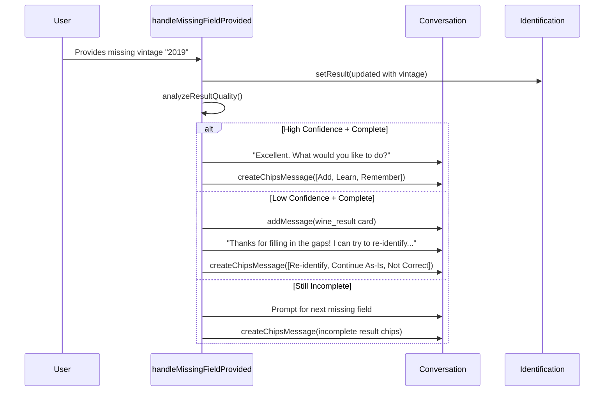

### Re-identify Flow

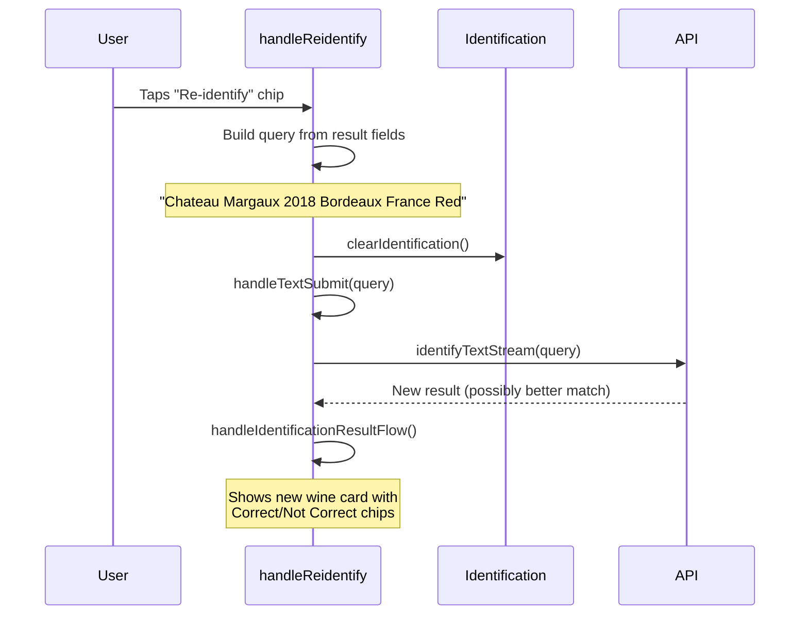

---

## Add Wine Flow

### Duplicate Detection

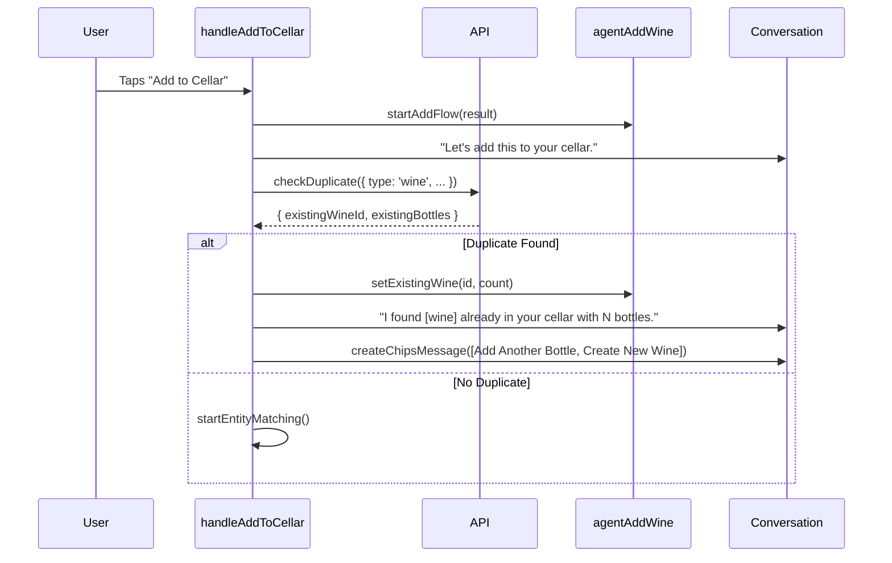

### Entity Matching Flow


---

## Enrichment Flow

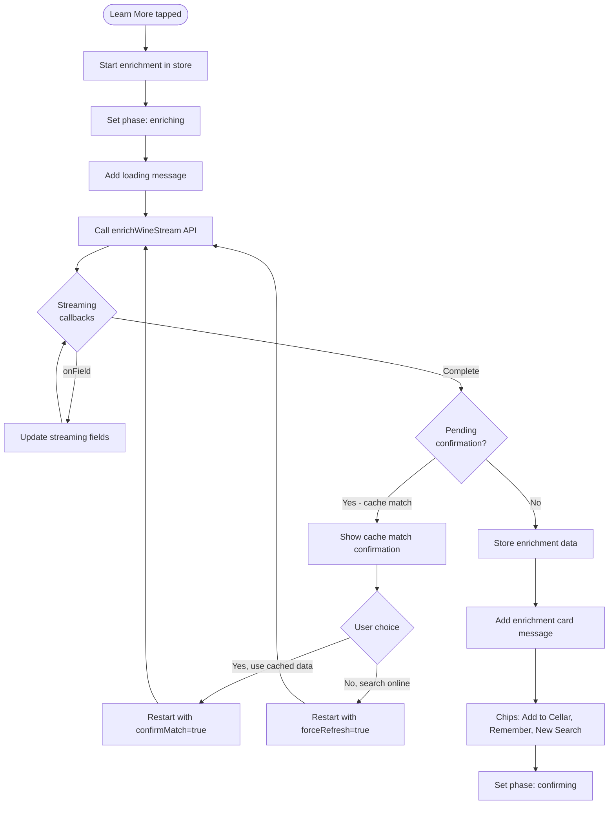

---

## Chip Configurations

Complete reference of all chip sets shown in different scenarios:

### Identification Phase

| Scenario | Chips |
|----------|-------|
| **Result found** (producer or wine name) | `Correct`, `Not Correct` |
| **Only grapes found** | `Use Grape Name`, `Add Details`, `Search Again`, `[Try Harder]` |
| **Nothing found** | `Try Again`, `Start Over` |

### Incomplete Results

| Missing Field | Chips |
|---------------|-------|
| **Only missing producer** | `Specify Producer`, `Search Again` |
| **Only missing vintage** | `Specify Vintage`, `Non-Vintage` |
| **Missing wine name** (has producer) | `Use Producer Name`, `Add Details`, `Search Again` |
| **Missing wine name** (has grapes) | `Use Grape Name`, `Add Details`, `Search Again` |
| **Multiple missing / generic** | `Add Details`, `Search Again` |
| **Low confidence** (any) | Above chips + `Try Harder` |

### After Manual Field Entry

| Scenario | Chips |
|----------|-------|
| **Complete + high confidence** | `Add to Cellar` (primary), `Learn More`, `Remember` |
| **Complete + low confidence** | `Re-identify` (primary), `Continue As-Is`, `Not Correct` |

### Confirmation Phase

| Scenario | Chips |
|----------|-------|
| **User confirms "Correct"** (complete) | `Add to Cellar` (primary), `Learn More`, `Remember` |
| **User confirms "Not Correct"** | `Add Details`, `Try Harder`, `Start Over` |
| **New search confirmation** | `Search New`, `Keep Current` |
| **Brief input confirmation** | `Search Anyway`, `I'll Add More` |

### Add Wine Flow

| Scenario | Chips |
|----------|-------|
| **Duplicate found** | `Add Another Bottle` (primary), `Create New Wine` |
| **Enrichment choice** | `Yes, Enrich Now` (primary), `No, Add Quickly` |
| **Wine added successfully** | `Identify Another` |
| **Add failed** | `Try Again`, `Cancel` |

### Enrichment Flow

| Scenario | Chips |
|----------|-------|
| **Cache match confirmation** | `Yes, use cached data`, `No, search online` |
| **Enrichment complete** | `Add to Cellar` (primary), `Remember`, `New Search` |

### Error State

| Scenario | Chips |
|----------|-------|
| **Retryable error** | `Try Again`, `Start Over` |
| **Non-retryable error** | `Start Over` |

---

## Command Detection

Client-side command detection intercepts user input before API calls:

### Commands

| Command | Triggers | Action |
|---------|----------|--------|
| `start_over` | "start", "start over", "restart", "reset", "new wine", "fresh start" | Reset conversation |
| `cancel` | "stop", "cancel", "never mind", "quit", "exit" | Close panel |
| `go_back` | "back", "go back", "undo", "previous" | Return to awaiting_input |
| `try_again` | "try again", "retry", "one more time" | Re-execute last action |
| `help` | "help", "what can you do", "how does this work" | Show help message |

### Chip Responses (Confirming Phase Only)

| Response | Triggers | Chip Action |
|----------|----------|-------------|
| **Positive** | "yes", "yeah", "ok", "correct", "right", "good", "perfect", typos | `correct` |
| **Negative** | "no", "nope", "wrong", "incorrect", "not right", typos | `not_correct` |

### Detection Priority

1. **Wine indicators** (highest) - "Château Cancel" → wine query
2. **Word count** - >6 words → wine query
3. **Pattern matching** - exact/substring matches

### Wine Indicators (False Positive Prevention)

French: château, domaine, cru, cave
Spanish: bodega, viña, rioja, ribera
Italian: cantina, tenuta, azienda
German: weingut, schloss
English: winery, vineyard, estate, reserve, vintage
Regions: champagne, burgundy, bordeaux, napa
Appellations: doc, docg, aoc, ava

---

## Error Handling

### Error Types

| Type | HTTP | Retryable | User Message |
|------|------|-----------|--------------|
| `timeout` | 408 | Yes | "Our sommelier is taking longer than expected..." |
| `rate_limit` | 429 | Yes | "Our sommelier is quite busy at the moment..." |
| `limit_exceeded` | 429 | No | "We've reached our tasting limit for today..." |
| `server_error` | 500 | Yes | "Something went wrong. Please try again." |
| `overloaded` | 503 | Yes | "Our sommelier is quite busy..." |
| `quality_check_failed` | 422 | No | "That image is a bit unclear..." |
| `identification_error` | 400 | No | "I couldn't identify that wine." |
| `enrichment_error` | 400 | No | "I couldn't find details for this wine." |

### Error Flow

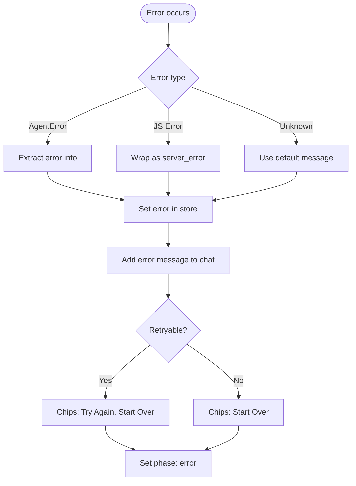

---

## Persistence

### What Gets Persisted

| Data | Storage | Timing | Purpose |
|------|---------|--------|---------|
| Messages (max 30) | sessionStorage | Debounced 500ms | Restore chat on tab switch |
| Phase, AddWineStep | sessionStorage | Debounced 500ms | Restore flow state |
| Identification result | sessionStorage | Immediate | Critical state |
| Augmentation context | sessionStorage | Immediate | For retry/mobile |
| Pending new search | sessionStorage | Immediate | For mobile tab switch |
| Image data (base64) | sessionStorage | Immediate | For retry |
| Enrichment data | sessionStorage | Immediate | Critical state |

### Loading State Protection

Loading states (`isIdentifying`, `isEnriching`, `isSubmitting`) are **NOT** persisted to prevent orphan loading spinners on restore.

---

## Key Files Reference

### Router Layer

| File | Purpose |
|------|---------|
| `lib/agent/router.ts` | Entry point - `dispatchAction()`, middleware composition |
| `lib/agent/stateMachine.ts` | Phase transition validation |

### Handlers

| File | Purpose |
|------|---------|
| `lib/agent/handlers/index.ts` | Barrel exports, type guards (`isConversationAction`, etc.) |
| `lib/agent/handlers/conversation.ts` | Navigation: start_over, go_back, cancel, retry |
| `lib/agent/handlers/identification.ts` | Text/image identification, confirmation, field completion |
| `lib/agent/handlers/enrichment.ts` | Wine info lookup, cache handling |
| `lib/agent/handlers/addWine.ts` | Add to cellar, entity matching flow |
| `lib/agent/handlers/forms.ts` | Bottle form, manual entry |

### Middleware

| File | Purpose |
|------|---------|
| `lib/agent/middleware/index.ts` | Barrel exports |
| `lib/agent/middleware/types.ts` | `ActionHandler`, `Middleware` types |
| `lib/agent/middleware/compose.ts` | `compose()` utility |
| `lib/agent/middleware/errorHandler.ts` | `withErrorHandling` middleware |
| `lib/agent/middleware/retryTracker.ts` | `withRetryTracking` middleware, `lastAction` store |
| `lib/agent/middleware/validator.ts` | `withValidation` middleware |

### Services

| File | Purpose |
|------|---------|
| `lib/agent/services/chipGenerator.ts` | `generateXxxChips()` functions |
| `lib/agent/services/chipRegistry.ts` | `ChipKey` enum, `getChip()` |

### Messages

| File | Purpose |
|------|---------|
| `lib/agent/messages.ts` | `getMessage()`, legacy message templates |
| `lib/agent/messageKeys.ts` | `MessageKey` enum |
| `lib/agent/personalities.ts` | Personality types |
| `lib/agent/messages/sommelier.ts` | Sommelier personality messages |

### Stores

| File | Purpose |
|------|---------|
| `lib/stores/agentConversation.ts` | Messages, phase, addWineStep |
| `lib/stores/agentIdentification.ts` | Identification result, streaming, error |
| `lib/stores/agentEnrichment.ts` | Enrichment data, streaming |
| `lib/stores/agentAddWine.ts` | Add-to-cellar flow state |
| `lib/stores/agentSettings.ts` | Personality preference (localStorage) |
| `lib/stores/agentPersistence.ts` | sessionStorage coordination |

### Other

| File | Purpose |
|------|---------|
| `lib/agent/types.ts` | All TypeScript types for agent system |
| `lib/agent/handleAgentAction.ts` | Legacy monolithic handler (being replaced) |
| `lib/utils/commandDetector.ts` | Command/chip response detection |

---

## Design Principles

1. **Router + Middleware + Handlers** - Clean separation of routing, cross-cutting concerns, and business logic
2. **Store Separation** - Single-responsibility stores for each domain
3. **Phase-Driven UI** - Phase determines what's shown and what inputs are accepted
4. **State Machine** - Explicit phase transitions with validation
5. **Streaming Support** - Real-time field updates during API calls
6. **Mobile Resilience** - sessionStorage persistence survives tab switches
7. **Error Recovery** - Typed errors with retry support and support references
8. **Graceful Degradation** - Incomplete results still usable with field-specific prompts
9. **Type Safety** - MessageKey and ChipKey enums eliminate string literals

---

## Handler Contribution Guide

This guide explains how to add a new handler module to the agent system.

### 1. Create the Handler File

Create a new file in `qve/src/lib/agent/handlers/`:

```typescript
// handlers/myFeature.ts

/**
 * My Feature Handlers
 *
 * Handles [description of what this module does]:
 * - action_one: [description]
 * - action_two: [description]
 */

import type { AgentAction } from '../types';
import * as conversation from '$lib/stores/agentConversation';
import * as identification from '$lib/stores/agentIdentification';
// Import other stores as needed

// ===========================================
// Action Types
// ===========================================

type MyFeatureActionType =
  | 'action_one'
  | 'action_two'
  | 'action_three';

// ===========================================
// Handlers
// ===========================================

/**
 * Handle action_one.
 * [Detailed description]
 */
export async function handleActionOne(action: AgentAction): Promise<void> {
  console.log('[MyFeature] action_one');

  // 1. Update stores
  conversation.setPhase('some_phase');

  // 2. Add messages
  conversation.addMessage(
    conversation.createTextMessage('Processing your request...')
  );

  // 3. Make API calls if needed
  // const result = await api.someEndpoint();

  // 4. Update with results
  conversation.addMessage(
    conversation.createChipsMessage([
      { id: 'next', label: 'Continue', action: 'continue' },
      { id: 'cancel', label: 'Cancel', action: 'cancel' },
    ])
  );
}

// Additional handlers...

// ===========================================
// Type Guard and Router
// ===========================================

/**
 * Check if an action type belongs to this module.
 */
export function isMyFeatureAction(type: string): type is MyFeatureActionType {
  return ['action_one', 'action_two', 'action_three'].includes(type);
}

/**
 * Route to the appropriate handler.
 */
export async function handleMyFeatureAction(action: AgentAction): Promise<void> {
  switch (action.type) {
    case 'action_one':
      await handleActionOne(action);
      break;
    case 'action_two':
      await handleActionTwo(action);
      break;
    case 'action_three':
      await handleActionThree(action);
      break;
    default:
      console.warn(`[MyFeature] Unknown action: ${action.type}`);
  }
}
```

### 2. Export from handlers/index.ts

```typescript
// handlers/index.ts

// ... existing exports ...

// My Feature handlers
export {
  isMyFeatureAction,
  handleMyFeatureAction,
} from './myFeature';
```

### 3. Register in router.ts

Add the type guard check and handler call:

```typescript
// router.ts

import {
  // ... existing imports ...
  isMyFeatureAction,
  handleMyFeatureAction,
} from './handlers';

async function routeAction(action: AgentAction): Promise<void> {
  // ... existing handler checks ...

  // Check for my feature actions
  if (isMyFeatureAction(action.type)) {
    console.log('[Router] Handling my feature action:', action.type);
    await handleMyFeatureAction(action);
    return;
  }

  // Fallback to legacy handler
  await legacyHandler(action);
}
```

### 4. Add Validation Prerequisites (if needed)

If your actions have prerequisites, add them to `middleware/validator.ts`:

```typescript
// middleware/validator.ts

const prerequisites: Record<string, ActionPrerequisites> = {
  // ... existing prerequisites ...

  // My Feature actions
  'action_one': { requiresIdentification: true },
  'action_two': { requiresPhase: ['confirming'] },
};
```

### 5. Add State Machine Transitions (if needed)

If your handler introduces new phases or transitions, update `stateMachine.ts`:

```typescript
// stateMachine.ts

export const PHASE_TRANSITIONS: Record<AgentPhase, AgentPhase[]> = {
  // ... existing transitions ...

  my_new_phase: [
    'confirming',  // Can go back to confirming
    'complete',    // Can complete from here
    'error',       // Can error
  ],
};
```

### 6. Write Tests

Create a test file in `__tests__/`:

```typescript
// __tests__/myFeature.test.ts

import { describe, it, expect, beforeEach, vi } from 'vitest';
import { get } from 'svelte/store';
import { handleActionOne, isMyFeatureAction } from '../handlers/myFeature';
import * as conversation from '$lib/stores/agentConversation';

describe('MyFeature Handlers', () => {
  beforeEach(() => {
    // Reset stores
    conversation.resetConversation();
  });

  describe('isMyFeatureAction', () => {
    it('should return true for my feature actions', () => {
      expect(isMyFeatureAction('action_one')).toBe(true);
      expect(isMyFeatureAction('action_two')).toBe(true);
    });

    it('should return false for other actions', () => {
      expect(isMyFeatureAction('start_over')).toBe(false);
      expect(isMyFeatureAction('submit_text')).toBe(false);
    });
  });

  describe('handleActionOne', () => {
    it('should add message and update phase', async () => {
      await handleActionOne({ type: 'action_one' });

      const messages = get(conversation.messages);
      expect(messages.length).toBeGreaterThan(0);
    });
  });
});
```

### Handler Checklist

- [ ] Create handler file with JSDoc comments
- [ ] Define action type union
- [ ] Implement individual handler functions
- [ ] Create type guard function (`isXxxAction`)
- [ ] Create routing function (`handleXxxAction`)
- [ ] Export from `handlers/index.ts`
- [ ] Register in `router.ts`
- [ ] Add validation prerequisites if needed
- [ ] Update state machine if new phases
- [ ] Write unit tests
- [ ] Run `npm run check` and `npm test`

---

## Migration Notes

### Migrating from Legacy handleAgentAction.ts

The legacy monolithic `handleAgentAction.ts` (~2,700 lines) is being replaced by the modular router/handler system.

### Current Migration Status

| Category | Status | Handler File |
|----------|--------|--------------|
| Conversation (start_over, go_back, cancel, retry) | ✅ Complete | `conversation.ts` |
| Identification (submit_text, submit_image, correct, etc.) | ✅ Complete | `identification.ts` |
| Enrichment (learn, remember, cache) | ✅ Complete | `enrichment.ts` |
| Add Wine (add_to_cellar, entity matching) | ✅ Complete | `addWine.ts` |
| Forms (bottle form, manual entry) | ✅ Complete | `forms.ts` |
| Legacy fallback | Active | `handleAgentAction.ts` |

### How Migration Works

1. **Gradual Migration**: The router checks new handlers first, then falls back to the legacy handler for any unhandled actions.

2. **Type Guard Priority**: The router checks handlers in order:
   ```typescript
   if (isConversationAction(type)) { /* new handler */ }
   else if (isIdentificationAction(type)) { /* new handler */ }
   // ... other handlers ...
   else { /* legacy fallback */ }
   ```

3. **Backwards Compatible**: The legacy handler continues to work for any actions not yet migrated.

### Extracting Code from Legacy Handler

When migrating a case from the legacy handler:

1. **Find the case** in `handleAgentAction.ts`

2. **Copy the logic** to a new handler function:
   ```typescript
   // Before (in handleAgentAction.ts)
   case 'my_action': {
     // 50 lines of code
     break;
   }

   // After (in handlers/myHandler.ts)
   export async function handleMyAction(action: AgentAction): Promise<void> {
     // Same 50 lines, cleaned up
   }
   ```

3. **Replace module-level state** with store access:
   ```typescript
   // Before
   let lastAction: AgentAction | null = null;

   // After
   import { getLastAction, setLastAction } from '../middleware/retryTracker';
   ```

4. **Remove from legacy handler** once tests pass:
   ```typescript
   // Remove the case from handleAgentAction.ts
   ```

### Differences from Legacy System

| Aspect | Legacy | New System |
|--------|--------|------------|
| Error handling | Try/catch in each case | `withErrorHandling` middleware |
| Retry tracking | Module-level variable | `withRetryTracking` middleware + store |
| Validation | Inline checks | `withValidation` middleware |
| Phase transitions | Implicit | `stateMachine.ts` validates |
| Messages | String paths | `MessageKey` enum |
| Chips | Inline objects | `ChipKey` enum + registry |

### Testing During Migration

Run tests frequently to catch regressions:

```bash
cd qve
npm test                           # Run all tests
npm test -- handlers               # Run handler tests
npm test -- router                 # Run router tests
npm test -- integration            # Run integration tests
```

### Final Migration Steps

Once all actions are migrated:

1. Remove the legacy `handleAgentAction.ts`
2. Remove the fallback in `router.ts`
3. Update imports throughout the codebase
4. Delete any orphaned helper functions

### Known Tech Debt

See [PHASE_2_REARCHITECTURE.md](./PHASE_2_REARCHITECTURE.md#8-deferred-items--tech-debt) for:
- Legacy `getMessage()` calls needing migration to `getMessageByKey()`
- Legacy `agentMessages` object to remove
- Circular dependency in forms.ts/addWine.ts
