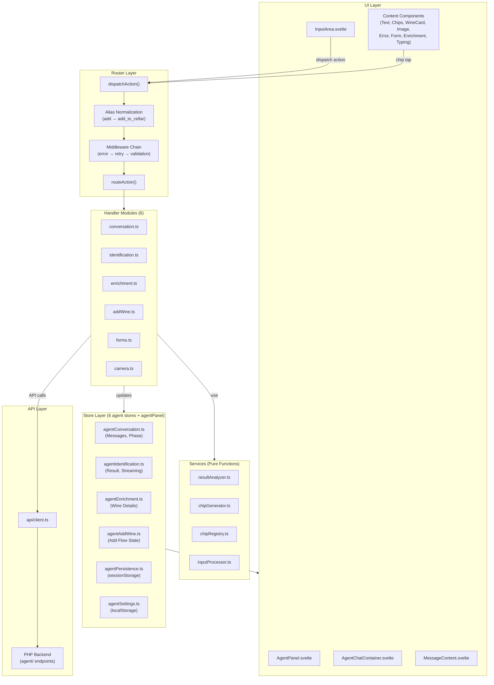
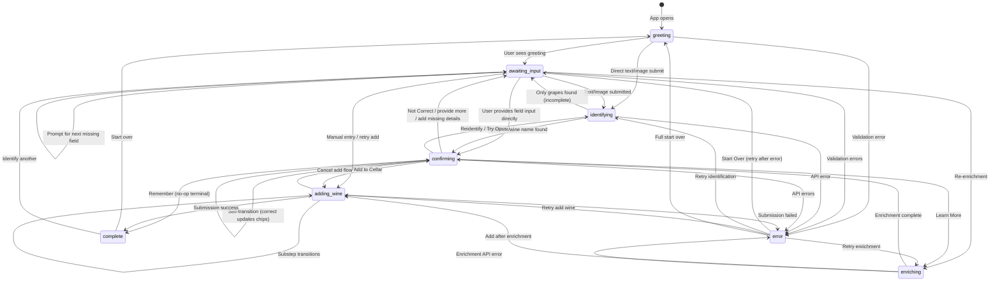
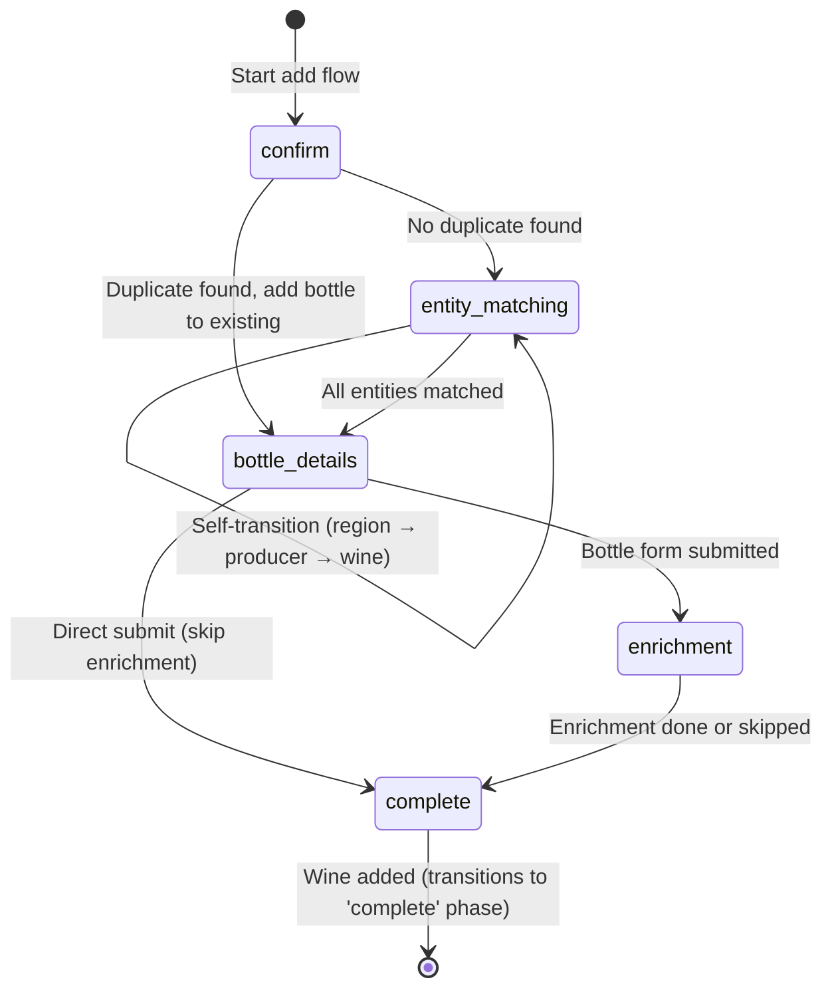
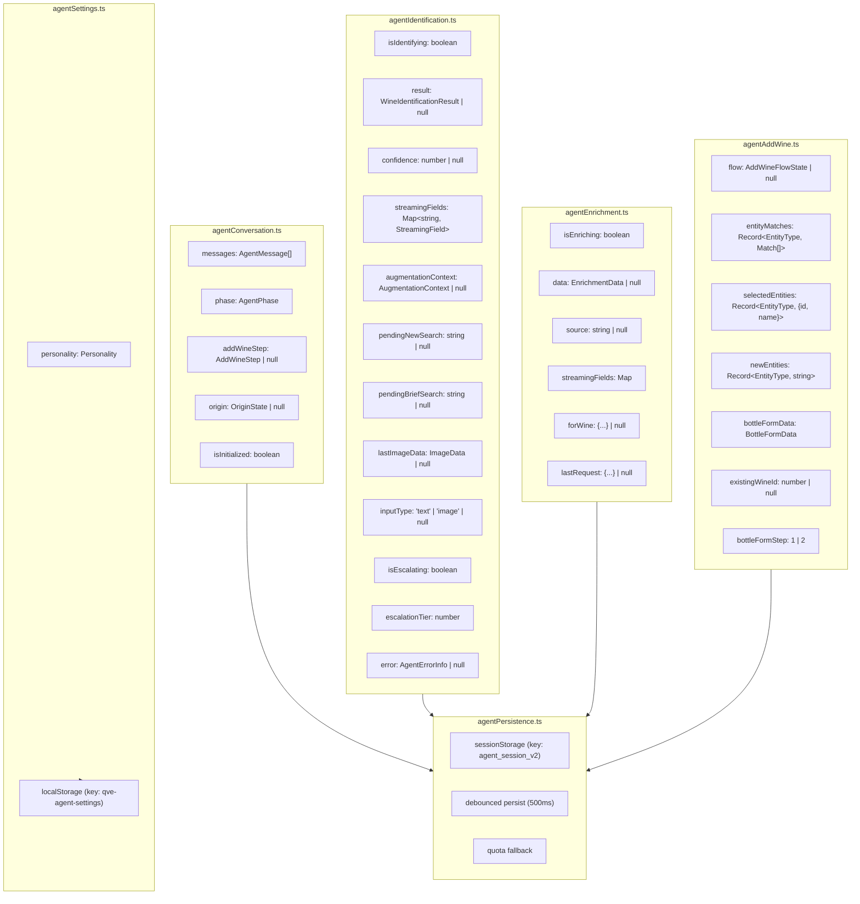
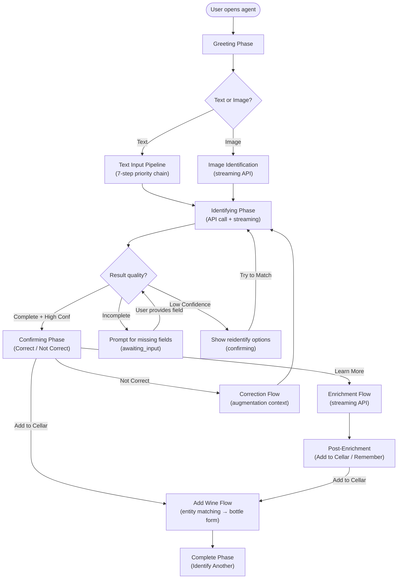

# Agent Architecture Documentation

The wine sommelier agent is a conversational AI assistant that identifies wines from text or images, enriches them with critic scores and tasting notes, and adds them to the user's cellar. It uses a **Router + Middleware + Handlers** pattern with split stores for separation of concerns.

**Last Updated**: 2026-02-14
**Phase**: 2 (Rearchitecture) + Phase 6 (Enrichment Streaming Optimization)

---

## Table of Contents

1. [High-Level Architecture](#1-high-level-architecture)
2. [Request Flow](#2-request-flow)
3. [Directory Structure](#3-directory-structure)
4. [Phase State Machine](#4-phase-state-machine)
5. [Handler Modules](#5-handler-modules)
6. [Middleware System](#6-middleware-system)
7. [Store Architecture](#7-store-architecture)
8. [Message System](#8-message-system)
9. [Action System](#9-action-system)
10. [Agent Flow Overview](#10-agent-flow-overview)
11. [Command Detection](#11-command-detection)
12. [Error Handling](#12-error-handling)
13. [Session Persistence](#13-session-persistence)
14. [Component Hierarchy](#14-component-hierarchy)
15. [Backend Agent Endpoints](#15-backend-agent-endpoints)
16. [Handler Contribution Guide](#16-handler-contribution-guide)

> **Tuning the agent?** See [AGENT_TUNING_GUIDE.md](AGENT_TUNING_GUIDE.md) for a practical guide to configuring identification tiers, enrichment models, confidence scoring, caching, validation, and prompts.

---

## 1. High-Level Architecture



---

## 2. Request Flow

All user interactions flow through the same pipeline:

```
User Action (tap chip / submit text / submit image)
         │
         ▼
┌─────────────────────────────────────────────────────────────────┐
│  dispatchAction({ type: 'submit_text', payload: 'Margaux' })    │
└─────────────────────────────────────────────────────────────────┘
         │
         ▼
┌─────────────────────────────────────────────────────────────────┐
│  Alias Normalization                                            │
│  - 'add' → 'add_to_cellar'                                     │
│  - 'remember_wine' → 'remember'                                │
└─────────────────────────────────────────────────────────────────┘
         │
         ▼
┌─────────────────────────────────────────────────────────────────┐
│  1. withErrorHandling                                           │
│     - Wraps entire chain in try/catch                           │
│     - On error: extracts info, shows message, sets error phase  │
└─────────────────────────────────────────────────────────────────┘
         │
         ▼
┌─────────────────────────────────────────────────────────────────┐
│  2. withRetryTracking                                           │
│     - Stores action in lastAction store (if retryable)          │
│     - Marks as succeeded after handler completes                │
│     - Enables 'Try Again' chip functionality                    │
│     - Actions expire after 5 minutes                            │
└─────────────────────────────────────────────────────────────────┘
         │
         ▼
┌─────────────────────────────────────────────────────────────────┐
│  3. withValidation                                              │
│     - Checks action prerequisites (phase, identification, etc.) │
│     - Skips action with console warning if prerequisites unmet  │
└─────────────────────────────────────────────────────────────────┘
         │
         ▼
┌─────────────────────────────────────────────────────────────────┐
│  4. routeAction                                                 │
│     - Unwraps generic chip_tap actions                          │
│     - Checks handler type guards in priority order              │
│     - Routes to appropriate handler module                      │
│     - DEV mode throws on unknown actions; prod logs error       │
└─────────────────────────────────────────────────────────────────┘
         │
         ▼
┌─────────────────────────────────────────────────────────────────┐
│  5. Handler (e.g., identification.handleTextSubmit)              │
│     - Updates stores (messages, phase, result)                  │
│     - Makes API calls if needed                                 │
│     - Generates response chips via services                     │
└─────────────────────────────────────────────────────────────────┘
```

**Router handler check order**: conversation → identification → enrichment → addWine → forms → camera

---

## 3. Directory Structure

```
qve/src/lib/agent/
├── router.ts                 # Entry point — dispatchAction(), alias normalization, middleware
├── types.ts                  # AgentAction, AgentPhase, MessageCategory, all type definitions
├── stateMachine.ts           # Phase transition validation (PHASE_TRANSITIONS, ADD_WINE_STEP_TRANSITIONS)
├── messages.ts               # getMessageByKey(), getMessageArrayByKey(), personality resolution chain
├── messageKeys.ts            # MessageKey enum (132 keys across 11 categories)
├── personalities.ts          # Personality enum, MessageContext, PersonalityMessages types
├── requestLifecycle.ts       # AbortController, scroll lock, request ID for cancellation
├── actions.ts                # Action creator helpers
├── loadingStates.ts          # Loading state utilities
├── index.ts                  # Barrel exports
│
├── handlers/
│   ├── index.ts              # Barrel exports, type guards, HANDLER_CATEGORIES map
│   ├── conversation.ts       # start_over, go_back, cancel, cancel_request, retry, new_input, start_fresh
│   ├── identification.ts     # submit_text, submit_image, correct, not_correct, verify, correct_field, field completion
│   ├── enrichment.ts         # learn, remember, recommend, cache handling
│   ├── addWine.ts            # add_to_cellar, entity matching, submission
│   ├── forms.ts              # bottle form, manual entry, retry_add
│   └── camera.ts             # take_photo, choose_photo (delegates to UI)
│
├── middleware/
│   ├── index.ts              # Barrel exports
│   ├── types.ts              # ActionHandler, Middleware type definitions
│   ├── compose.ts            # compose() utility for middleware chaining
│   ├── errorHandler.ts       # withErrorHandling middleware
│   ├── retryTracker.ts       # withRetryTracking middleware, lastAction store
│   └── validator.ts          # withValidation middleware, ActionPrerequisites
│
├── services/
│   ├── index.ts              # Barrel exports for all services
│   ├── chipGenerator.ts      # generateXxxChips() functions (20 generators)
│   ├── chipRegistry.ts       # ChipKey enum (37 keys), getChip(), getChips()
│   ├── inputProcessor.ts     # Field detection, direct value detection, brief input check
│   └── resultAnalyzer.ts     # analyzeResultQuality(), ResultQuality, thresholds
│
├── messages/
│   ├── index.ts              # Registry loader, getPersonalityMessages()
│   ├── sommelier.ts          # Quentin Verre-Épais personality messages
│   └── neutral.ts            # Neutral fallback messages (universal baseline)
│
└── __tests__/
    ├── handlers.test.ts
    ├── middleware.test.ts
    ├── router.test.ts
    ├── stateMachine.test.ts
    ├── messages.test.ts
    ├── handleAgentAction.test.ts  # Legacy tests
    ├── errorScenarios.test.ts
    ├── cancellation.test.ts
    ├── streaming.test.ts
    └── integration/
        └── addWineFlow.test.ts
```

---

## 4. Phase State Machine

The agent operates in **8 distinct phases** that control what inputs are accepted and what UI is shown.

### Phase Definitions

| Phase | Description | Input Enabled | Expected Actions |
|-------|-------------|---------------|------------------|
| `greeting` | Initial state, shows welcome message | Yes | Text/Image input |
| `awaiting_input` | Ready for user input, may have partial result | Yes | Text/Image input, field clarification |
| `identifying` | Processing identification API call | No | None (typing indicator shown) |
| `confirming` | Showing result, awaiting confirmation or action | Yes | Correct/Not Correct, action chips, re-identify |
| `adding_wine` | In add-to-cellar flow (has sub-steps) | Conditional | Entity selection, form submission |
| `enriching` | Fetching wine details from API | No | None (typing indicator shown) |
| `error` | Error occurred | Yes | Retry, Start Over |
| `complete` | Action completed successfully | Yes | Start Over, Identify Another |

### Phase Transitions



### Add Wine Sub-Steps

When `phase === 'adding_wine'`, the `addWineStep` provides granular state:



**State machine behavior:**
- **DEV mode**: Throws on invalid transitions (catch bugs early)
- **Production**: Logs error and allows transition (fail-safe, no crashes)

---

## 5. Handler Modules

### conversation.ts

Navigation and session control.

| Action | Description |
|--------|-------------|
| `start_over` | Abort HTTP + `abortMessageQueue()` (generation counter discards pending messages, `clearAllNewFlags` completes typewriter, `isIntroScrollSuppressed` blocks old message scroll for 400ms), reset stores, add divider + greeting, set phase to `awaiting_input` |
| `go_back` | Return to previous phase based on current phase |
| `cancel` | Close agent panel via `closePanel()` (imported from `agentPanel` store) |
| `cancel_request` | Abort in-flight LLM request: sends server-side cancel via `api.cancelAgentRequest(requestId)`, aborts fetch, clears loading states |
| `retry` / `try_again` | Re-dispatch last tracked action (returns action to router for re-dispatch) |
| `new_input` | Clear identification, set `awaiting_input` |
| `start_fresh` | Alias for `start_over` |
| `start_over_error` | Error recovery variant of `start_over` |

### identification.ts

Wine identification flow. The largest handler module.

| Action | Description |
|--------|-------------|
| `submit_text` | Text-based identification (full pipeline: command detection → field input → chip response → brief check → API call) |
| `submit_image` | Image-based identification (clears old image data, stores new, calls API) |
| `try_opus` | Escalate to premium Opus model (tier 3) |
| `reidentify` | Build query from current result fields, clear identification, re-run text identification |
| `correct` | User confirms result — check completeness, show action or reidentify chips |
| `not_correct` | User says wrong — set augmentation context, show correction chips |
| `confirm_brief_search` | Proceed with single-word search after confirmation |
| `add_more_detail` | Dismiss brief input prompt, set `awaiting_input` |
| `confirm_new_search` | Start fresh search with pending text |
| `continue_current` | Keep current result, dismiss new search prompt |
| `use_producer_name` | Set wine name = producer name |
| `use_grape_as_name` | Set wine name = primary grape variety |
| `nv_vintage` | Set vintage to 'NV' (non-vintage) |
| `add_missing_details` | Prompt for specific missing field |
| `provide_more` | Set augmentation context, prompt for details |
| `continue_as_is` | Accept low-confidence result, show action chips, set phase to `confirming` |
| `see_result` | Show wine card with confirmation chips |
| `identify` | Set phase to `awaiting_input` |
| `verify` | Trigger grounded web search verification (Tier 1.5+) via `api.verifyImage()` |
| `correct_field` | User taps a field to correct it — shows field correction UI |
| `confirm_corrections` | Apply locked field corrections and reidentify |

### enrichment.ts

Wine information lookup with cache support and true LLM streaming.

| Action | Description |
|--------|-------------|
| `learn` | Start enrichment flow — call streaming API, show enrichment card |
| `remember` | Save for later (placeholder — shows "coming soon" message, sets phase to `complete`) |
| `recommend` | Get recommendations (placeholder — shows "coming soon") |
| `confirm_cache_match` | Use cached enrichment data (re-call API with `confirmMatch=true`) |
| `force_refresh` | Bypass cache (re-call API with `forceRefresh=true`) |

**Note**: `enrich_now` and `add_quickly` are handled by `addWine.ts`, not `enrichment.ts`.

**Streaming architecture** (Phase 6): Unlike identification (dual-path: streaming card → message card), enrichment uses a **single message card updated in-place**:
1. Handler creates one enrichment message card in skeleton state
2. A 7-second delay keeps the typing/thinking message visible before the card appears (LLM responses only; cache hits show immediately)
3. As SSE `field` events arrive, `conversation.updateMessage()` updates the card's data reactively
4. Text fields (`overview`, `tastingNotes`, `pairingNotes`) stream token-by-token via `text_delta` SSE events with a blinking cursor, throttled at 100ms
5. On `result` event, final enrichment data is set and the card transitions to static state

**Backend flow**: `agentEnrichStream.php` → `EnrichmentService.checkCache()` (fast path) or `WebSearchEnricher.enrichStreaming()` (LLM path with `response_schema` + `googleSearch` grounding on `gemini-3-flash-preview`) → `EnrichmentService.processEnrichmentResult()` (validate, cache, merge)

### addWine.ts

Add wine to cellar flow with duplicate detection and entity matching.

| Action | Description |
|--------|-------------|
| `add_to_cellar` | Start add flow — check duplicates, then start entity matching |
| `add_bottle_existing` | Skip entity matching, go to bottle form (duplicate flow) |
| `create_new_wine` | Clear existing wine ID, start entity matching |
| `select_match` | User selected entity from match list |
| `add_new` | User chose to create new entity |
| `clarify` | Request LLM clarification for entity selection ("Help Me Decide") |
| `enrich_now` | Set enrich flag and submit wine |
| `add_quickly` | Skip enrichment and submit directly |

### forms.ts

Form submission handlers.

| Action | Description |
|--------|-------------|
| `submit_bottle` | Store bottle data, show enrichment choice |
| `bottle_next` | Move from part 1 to part 2 of bottle form |
| `bottle_submit` | Final bottle submission using stored form data |
| `manual_entry_submit` | Merge manual entry data, restart entity matching (simplified) |
| `manual_entry_complete` | Variant of manual_entry_submit with messageId for chip disabling |
| `retry_add` | Retry failed submission via `add_quickly` re-dispatch |

**Known tech debt**: forms.ts uses dynamic imports from addWine.ts to avoid circular dependencies. Manual entry flow skips proper entity matching and goes directly to bottle form.

### camera.ts

Camera-related actions that delegate to the UI layer.

| Action | Description |
|--------|-------------|
| `take_photo` | Disables chip message; camera opening handled by `AgentPanel.svelte` |
| `choose_photo` | Disables chip message; photo picker handled by `AgentPanel.svelte` |

---

## 6. Middleware System

### Middleware Chain

```typescript
const middlewareChain = compose(
  withErrorHandling,    // 1. Catches all errors
  withRetryTracking,    // 2. Records retryable actions
  withValidation        // 3. Checks prerequisites
);
const wrappedRouter: ActionHandler = middlewareChain(routeAction);
```

### withErrorHandling

Catches errors from any handler and displays user-friendly messages. Sets phase to `error`.

### withRetryTracking

Stores the last action for retry functionality. Actions expire after 5 minutes.

**Retryable actions:**
```
submit_text, submit_image, try_opus, reidentify,
learn, enrich_now, confirm_cache_match, force_refresh, remember, recommend,
add_to_cellar, submit_bottle, add_bottle_existing,
manual_entry_submit
```

### withValidation

Checks prerequisites before executing an action. Validation failures are logged and the action is skipped (not thrown).

**Key prerequisites:**

| Action | Requires |
|--------|----------|
| `correct`, `not_correct` | Identification result + phase `confirming` |
| `add_to_cellar` | Identification result + phase `confirming` |
| `add_bottle_existing`, `create_new_wine` | Identification + add wine flow |
| `submit_bottle` | Add wine flow + phase `adding_wine` |
| `select_match`, `add_new` | Add wine flow |
| `try_opus` | Identification + phase `confirming` or `awaiting_input` |
| `verify` | Identification + phase `confirming` |
| `correct_field`, `confirm_corrections` | Identification + phase `confirming` or `awaiting_input` |
| `enrich_now`, `remember`, `recommend` | Identification |

---

## 7. Store Architecture

The agent state is split across **6 specialized stores** plus the `agentPanel` module (`stores/agentPanel.ts`, used for panel open/close state via `closePanel()`).



---

## 8. Message System

### Message Categories

Messages are typed by category, each rendered by a specific component:

| Category | Role | Description | Component |
|----------|------|-------------|-----------|
| `text` | both | Plain text messages | `TextMessage.svelte` |
| `chips` | agent | Action buttons | `ChipsMessage.svelte` |
| `wine_result` | agent | Identified wine card | `WineCardMessage.svelte` |
| `enrichment` | agent | Wine details card | `EnrichmentMessage.svelte` |
| `form` | agent | Interactive forms | `FormMessage.svelte` |
| `error` | agent | Error with retry options | `ErrorMessage.svelte` |
| `image` | user | User-submitted photo | `ImageMessage.svelte` |
| `typing` | agent | Typing/loading indicator | `TypingIndicatorMessage.svelte` |

### Text Message Variants

| Variant | Usage |
|---------|-------|
| `greeting` | Initial welcome messages |
| `info` | Standard informational messages |
| `warning` | Caution messages |
| `success` | Completion messages |
| `divider` | Visual separator (used on "Start Over") |

### Form Message Types

| FormType | Data Shape | Usage |
|----------|------------|-------|
| `bottle_details` | `BottleDetailsFormData` (step 1/2) | Bottle size, location, price form |
| `match_selection` | `MatchSelectionFormData` | Entity selection list |
| `manual_entry` | `ManualEntryFormData` | Free-form wine entry |

### Message Resolution Chain

Messages use a personality-based resolution chain:

1. Look up `MessageKey` in current personality messages (e.g., `sommelier.ts`)
2. Fall back to `neutral.ts` messages
3. DEV: throw error / PROD: log and return placeholder

Message variants can be:
- **Static string**: Used directly
- **String array**: Random selection for variation (via `getMessageByKey`) or sequential cycling (via `getMessageArrayByKey`)
- **Template function**: `(context: MessageContext) => string` for dynamic content

Two access patterns:
- `getMessageByKey(key, context?)` — Returns a single resolved string (picks random from arrays)
- `getMessageArrayByKey(key)` — Returns the full array for sequential cycling (e.g., loading state messages)

---

## 9. Action System

### Action Aliases

The router normalizes these aliases before routing:

| Alias | Canonical Action |
|-------|-----------------|
| `add` | `add_to_cellar` |
| `remember_wine` | `remember` |

### Complete Action Catalog

Actions are organized by handler category:

| Category | Actions |
|----------|---------|
| **conversation** | `start_over`, `go_back`, `cancel`, `cancel_request`, `retry`, `try_again`, `new_input`, `start_fresh`, `start_over_error` |
| **identification** | `submit_text`, `submit_image`, `try_opus`, `reidentify`, `correct`, `not_correct`, `verify`, `correct_field`, `confirm_corrections`, `confirm_brief_search`, `add_more_detail`, `confirm_new_search`, `continue_current`, `use_producer_name`, `use_grape_as_name`, `nv_vintage`, `add_missing_details`, `provide_more`, `continue_as_is`, `see_result`, `identify` |
| **enrichment** | `learn`, `remember`, `recommend`, `confirm_cache_match`, `force_refresh` |
| **addWine** | `add_to_cellar`, `add_bottle_existing`, `create_new_wine`, `select_match`, `add_new`, `clarify`, `enrich_now`, `add_quickly` |
| **forms** | `submit_bottle`, `bottle_next`, `bottle_submit`, `manual_entry_submit`, `manual_entry_complete`, `retry_add` |
| **camera** | `take_photo`, `choose_photo` |

### Generic chip_tap Fallback

When a chip emits a `chip_tap` action (legacy), the router unwraps it and re-dispatches through the full middleware chain (not `routeAction` directly) so retry tracking works:

```typescript
if (action.type === 'chip_tap') {
  const unwrapped = { type: payload.action, messageId: payload.messageId, payload: payload.data };
  await dispatchAction(unwrapped); // Full middleware chain, not routeAction
}
```

---

## 10. Agent Flow Overview

This section provides a high-level summary of how user interactions flow through the agent. For detailed flow diagrams, Mermaid charts, chip configurations, debugging symptom tables, and phase/action matrices, see **[AGENT_FLOW.md](./AGENT_FLOW.md)**.

### Master Flow



### Text Input Pipeline

When text is submitted during identification, it passes through a 7-step priority chain before making an API call. Each step can short-circuit the chain:

0. **Field Correction Intercept** -- If field corrections are pending (locked fields from `correct_field` flow), applies them and reidentifies
1. **Command Detection** -- "start over", "cancel", "help" (intercepted before any identification logic)
2. **Field Input** -- "region is Bordeaux", "producer is Lafite" (requires existing result + `awaiting_input` phase)
3. **Direct Value** -- A year like "2019" when vintage is missing (context-aware inference, no augmentation context)
4. **Chip Response** -- "yes"/"no" during `confirming` phase (mapped to `correct`/`not_correct` actions)
5. **New Search Confirmation** -- Any text during `confirming` with existing result (stores as pending, shows "Search New / Keep Current" chips)
6. **Brief Input Check** -- Single-word input triggers "Just 'X'? Adding more detail will improve the match." confirmation

If none of these match, the text proceeds to the streaming identification API call, optionally with augmentation context from prior corrections.

**Key files**: `handlers/identification.ts` (handleTextSubmit), `services/inputProcessor.ts`, `utils/commandDetector.ts`

### Identification and Result Analysis

After the streaming API returns a result, `resultAnalyzer.ts` evaluates quality using two dimensions:

- **Confidence**: Normalized from API percentage (0-100) to decimal (0-1). Thresholds: `LOW_CONFIDENCE_THRESHOLD = 0.7`, `ESCALATION_CONFIDENCE_THRESHOLD = 0.6`
- **Completeness**: producer (+0.4) + wineName (+0.4) + vintage (+0.2). Missing fields trigger specific prompts (e.g., "Use Producer Name", "Non-Vintage")

The combination of confidence and completeness determines which chips are shown and whether the user proceeds to confirmation or is prompted for more details.

**Key files**: `handlers/identification.ts`, `services/resultAnalyzer.ts`, `services/chipGenerator.ts`

### Enrichment Flow

When the user taps "Learn More", the enrichment handler calls the streaming enrichment API. The API may return a cache match requiring user confirmation ("Yes, use cached data" / "No, search online") before delivering full enrichment data (overview, grape composition, style profile, tasting notes, critic scores, drink window, food pairings).

**Key files**: `handlers/enrichment.ts`, `stores/agentEnrichment.ts`

### Add Wine Flow

The add-to-cellar flow has 5 sub-steps managed by `addWineStep`:

1. **confirm** -- Duplicate check via `checkDuplicate` API. If a match is found, the user chooses "Add Another Bottle" or "Create New Wine"
2. **entity_matching** -- Sequential matching for region, then producer, then wine. Each entity can be auto-selected (exact match), user-selected (multiple matches), or created new (no match)
3. **bottle_details** -- Two-step bottle form (size/location/source, then price/currency/date)
4. **enrichment** -- "Enrich Now" (submit with enrichment flag) or "Add Quickly" (skip enrichment)
5. **complete** -- Wine added successfully, show "Identify Another" chip

**Key files**: `handlers/addWine.ts`, `handlers/forms.ts`, `stores/agentAddWine.ts`

### Error and Recovery

Errors are caught by the `withErrorHandling` middleware and classified into typed error categories. Retryable errors show a "Try Again" chip backed by the `retryTracker` middleware. The error types table is in [Section 12](#12-error-handling).

**Key files**: `middleware/errorHandler.ts`, `middleware/retryTracker.ts`

---

## 11. Command Detection

Client-side command detection (`lib/utils/commandDetector.ts`) intercepts user input before API calls.

### Commands

| Command | Triggers |
|---------|----------|
| `start_over` | "start", "start over", "start again", "restart", "begin again", "reset", "new wine", "different wine", "start fresh", "fresh start" |
| `cancel` | "stop", "cancel", "never mind", "nevermind", "forget it", "quit", "exit" |
| `go_back` | "back", "go back", "undo", "previous" |
| `try_again` | "try again", "retry", "one more time" |
| `help` | "help", "help me", "what can you do", "how does this work", "how do i use this", "instructions" |

### Chip Responses (Confirming Phase Only)

| Response | Triggers | Chip Action |
|----------|----------|-------------|
| **Positive** | "yes", "yeah", "yep", "yup", "ok", "correct", "right", "good", "perfect", "sure", "definitely", "absolutely", + typos ("yse", "corectt", etc.) | `correct` |
| **Negative** | "no", "nope", "nah", "wrong", "incorrect", "not right", "not correct", "thats wrong", + typos ("worng", etc.) | `not_correct` |
| **Special** | "k" (exact match only) | `positive` |

### Detection Priority

1. **Wine indicators** (highest) -- "Chateau Cancel" → wine query
2. **Word count** -- >6 words → wine query
3. **Pattern matching** -- exact, spaceless, and substring matches
4. **Fallback** -- treat as wine query

### Wine Indicators (False Positive Prevention)

French: chateau, domaine, cru, cave
Spanish: bodega, vina, rioja, ribera
Italian: cantina, tenuta, azienda, casa
German: weingut, schloss
English: winery, vineyard, estate, cellars, reserve, vintage, wine, bottle, label
Regions: champagne, burgundy, bordeaux, napa, sonoma
Appellations: doc, docg, aoc, ava

---

## 12. Error Handling

### Error Types

| Type | HTTP | Retryable | User Message (Sommelier) |
|------|------|-----------|--------------------------|
| `timeout` | 408 | Yes | "Our sommelier is taking longer than expected..." |
| `rate_limit` | 429 | Yes | "Our sommelier is quite busy at the moment..." |
| `limit_exceeded` | 429 | No | "We've reached our tasting limit for today..." |
| `server_error` | 500 | Yes | "Something went wrong. Please try again." |
| `overloaded` | 503 | Yes | "Our sommelier is quite busy..." |
| `quality_check_failed` | 422 | No | "That image is a bit unclear..." |
| `identification_error` | 400 | No | "I couldn't identify that wine." |
| `enrichment_error` | 400 | No | "I couldn't find details for this wine." |

### Error Handling Architecture

Errors flow through three layers:

1. **Middleware** (`withErrorHandling`): Catches all handler errors, extracts error info (AgentError / JS Error / unknown), sets error phase, adds error message + retry chips
2. **Handler-level**: Enrichment and identification handlers have local try/catch for more specific error messages and retry behavior
3. **Backend**: `agentExceptionError($e, 'endpoint')` wraps PHP exceptions with support references; `agentStructuredError($type, $msg)` returns typed service errors

Both backend functions return: `{ success: false, message, error: { type, userMessage, retryable, supportRef } }`

### Support Reference

Exception errors include a support reference: `ERR-XXXXXXXX`
- Generated server-side from: `MD5(timestamp + errorType + endpoint)`
- Logged server-side with full stack trace
- Displayed to user for support tickets
- Debug: `grep "ERR-XXX" /var/log/php_errors.log`

For the full error flow diagram and error chip configurations, see **[AGENT_FLOW.md](./AGENT_FLOW.md)**.

---

## 13. Session Persistence

### What Gets Persisted

| Data | Storage | Timing | Purpose |
|------|---------|--------|---------|
| Messages (max 30) | sessionStorage | Debounced 500ms | Restore chat on tab switch |
| Phase, AddWineStep | sessionStorage | Debounced 500ms | Restore flow state |
| Identification result | sessionStorage | With messages | Critical state |
| Augmentation context | sessionStorage | With messages | For retry/mobile |
| Pending new search | sessionStorage | With messages | For mobile tab switch |
| Pending brief search | sessionStorage | With messages | For mobile tab switch |
| Image data (base64) | sessionStorage | With messages | For retry |
| Enrichment data | sessionStorage | With messages | Critical state |
| Personality setting | localStorage | Immediate | Survives all sessions |
| Panel open/close | localStorage | Immediate | Survives all sessions |

### Storage Keys

| Key | Storage | Format |
|-----|---------|--------|
| `agent_session_v2` | sessionStorage | JSON (PersistedState with version) |
| `qve-agent-settings` | localStorage | JSON |
| `agentPanelOpen` | localStorage | Boolean string |

### Loading State Protection

Loading states (`isIdentifying`, `isEnriching`, `isSubmitting`) are **NOT** persisted to prevent orphan loading spinners on restore.

### Quota Handling

When sessionStorage quota is exceeded:
1. First: Drop image data (largest item)
2. Still exceeded: Keep only last 10 messages
3. Always preserve: augmentation context, pending searches

### Mobile Tab Switch Resilience

- Images stored as base64 data URLs (not ObjectURLs that would be invalidated)
- `pendingNewSearch` and `pendingBriefSearch` survive camera app detour
- Augmentation context preserved for retry after interruption
- On restore: all `isNew` flags set to false (prevent animation replay)

---

## 14. Component Hierarchy

```
AgentPanel.svelte                      # Root panel — open/close, camera integration
├── AgentChatContainer.svelte          # Scroll container, auto-scroll logic
│   └── MessageList.svelte             # Renders message array
│       └── MessageWrapper.svelte      # Animation wrapper (isPrecedingReady sequencing)
│           └── MessageContent.svelte  # Category router → specific component
│               ├── TextMessage.svelte
│               ├── ChipsMessage.svelte
│               ├── WineCardMessage.svelte
│               │   └── cards/WineCard.svelte
│               │       ├── wine/WineNameSection.svelte
│               │       ├── wine/WineProducerSection.svelte
│               │       ├── wine/WineDetailsSection.svelte
│               │       ├── wine/WineMetadataSection.svelte
│               │       └── wine/WineConfidenceSection.svelte
│               ├── EnrichmentMessage.svelte
│               │   └── cards/EnrichmentCard.svelte
│               │       ├── enrichment/OverviewSection.svelte
│               │       ├── enrichment/GrapeCompositionSection.svelte
│               │       ├── enrichment/StyleProfileSection.svelte
│               │       ├── enrichment/TastingNotesSection.svelte
│               │       ├── enrichment/CriticScoresSection.svelte
│               │       ├── enrichment/DrinkWindowSection.svelte
│               │       └── enrichment/FoodPairingsSection.svelte
│               ├── FormMessage.svelte
│               │   ├── forms/BottleDetailsForm.svelte
│               │   ├── forms/ManualEntryForm.svelte
│               │   └── forms/MatchSelectionList.svelte
│               ├── ErrorMessage.svelte
│               ├── ImageMessage.svelte
│               └── TypingIndicatorMessage.svelte
└── InputArea.svelte                   # Text input + image capture
```

**Other agent components** (used within the above or standalone):
- `AgentBubble.svelte` — FAB button to open panel
- `AgentLoadingState.svelte` — Loading state display
- `ConfidenceIndicator.svelte` — Visual confidence bar
- `FieldTypewriter.svelte` — Streaming field animation
- `TypewriterText.svelte` — Text typewriter effect
- `TypingIndicator.svelte` — Animated dots
- `DisambiguationList.svelte` — Multiple candidate display
- `CandidateMiniCards.svelte` — Compact candidate cards
- `cards/DataCard.svelte` — Generic data card wrapper

---

## 15. Backend Agent Endpoints

### Endpoints

| File | Purpose | Model | Streaming |
|------|---------|-------|-----------|
| `identifyText.php` | Text-based identification | Gemini | No |
| `identifyTextStream.php` | Text identification with streaming | Gemini | Yes (SSE) |
| `identifyImage.php` | Image-based identification | Gemini Vision | No |
| `identifyImageStream.php` | Image identification with streaming | Gemini Vision | Yes (SSE) |
| `identifyWithOpus.php` | Premium Opus model escalation | Claude Opus | No |
| `verifyImage.php` | Grounded image verification (Tier 1.5+) | Gemini + googleSearch | No |
| `agentEnrich.php` | Wine enrichment (non-streaming fallback) | Gemini | No |
| `agentEnrichStream.php` | Streaming enrichment with web search grounding | Gemini 3 Flash + googleSearch | Yes (SSE) |
| `clarifyMatch.php` | Match clarification/disambiguation | Gemini | No |
| `cancelRequest.php` | Abort in-flight LLM request (server-side cancellation) | N/A | No |

### Service Classes

```
resources/php/agent/
├── _bootstrap.php              # agentResponse(), agentExceptionError(), agentStructuredError()
├── config/
│   └── agent.config.php        # Model config, API keys, timeouts
├── prompts/
│   └── prompts.php             # Consolidated LLM prompts (Prompts class)
├── Identification/
│   ├── IdentificationService.php
│   ├── TextProcessor.php
│   ├── VisionProcessor.php
│   ├── ImageQualityAssessor.php
│   ├── IntentDetector.php
│   ├── InputClassifier.php
│   ├── ConfidenceScorer.php
│   ├── InputMatchScorer.php    # Anchor-based input↔output confidence scoring
│   ├── InferenceEngine.php
│   ├── DisambiguationHandler.php
│   └── SupplementaryContextParser.php
├── Enrichment/
│   ├── EnrichmentService.php
│   ├── EnrichmentCache.php
│   ├── EnrichmentData.php
│   ├── EnrichmentResult.php
│   ├── EnrichmentFallback.php
│   ├── EnrichmentMerger.php
│   ├── ValidationService.php
│   ├── WebSearchEnricher.php
│   ├── CacheKeyGenerator.php
│   ├── CanonicalNameResolver.php
│   ├── CriticScore.php
│   ├── DrinkWindow.php
│   └── GrapeVariety.php
└── LLM/
    ├── LLMClient.php
    ├── LLMResponse.php
    ├── LLMStreamingResponse.php
    ├── CostTracker.php
    ├── CircuitBreaker.php
    ├── SSLConfig.php
    ├── Interfaces/
    │   └── LLMProviderInterface.php
    ├── Adapters/
    │   ├── ClaudeAdapter.php
    │   └── GeminiAdapter.php
    └── Streaming/
        ├── SSEParser.php
        └── StreamingFieldDetector.php
```

---

## 16. Handler Contribution Guide

### Adding a New Handler Module

1. **Create handler file** in `qve/src/lib/agent/handlers/`:

```typescript
// handlers/myFeature.ts
import type { AgentAction } from '../types';
import * as conversation from '$lib/stores/agentConversation';

type MyFeatureActionType = 'action_one' | 'action_two';

export function isMyFeatureAction(type: string): type is MyFeatureActionType {
  return ['action_one', 'action_two'].includes(type);
}

export async function handleMyFeatureAction(action: AgentAction): Promise<void> {
  switch (action.type) {
    case 'action_one':
      // Handler logic
      break;
  }
}
```

2. **Export from** `handlers/index.ts`
3. **Register in** `router.ts` — add type guard check and handler call
4. **Add validation prerequisites** in `middleware/validator.ts` if needed
5. **Update state machine** in `stateMachine.ts` if new phases are introduced
6. **Write tests** in `__tests__/`

### Handler Checklist

- [ ] Create handler file with JSDoc header
- [ ] Define action type union
- [ ] Implement handler functions
- [ ] Create type guard (`isXxxAction`)
- [ ] Create routing function (`handleXxxAction`)
- [ ] Export from `handlers/index.ts`
- [ ] Register in `router.ts`
- [ ] Add validation prerequisites if needed
- [ ] Update state machine if new phases
- [ ] Write unit tests
- [ ] Run `npm run check` and `npm test`

---

## Design Principles

1. **Router + Middleware + Handlers** — Clean separation of routing, cross-cutting concerns, and business logic
2. **Store Separation** — Single-responsibility stores for each domain
3. **Phase-Driven UI** — Phase determines what's shown and what inputs are accepted
4. **State Machine Validation** — Explicit phase transitions with dev-time enforcement
5. **Streaming Support** — Real-time field updates during API calls via SSE
6. **Mobile Resilience** — sessionStorage persistence survives tab switches
7. **Error Recovery** — Typed errors with retry support and support references
8. **Graceful Degradation** — Incomplete results still usable with field-specific prompts
9. **Type Safety** — MessageKey and ChipKey enums eliminate string literals
10. **Personality System** — Pluggable message personalities with neutral fallback chain
