# Agent Architecture Documentation

This document describes the rearchitected wine sommelier agent system, including state machines, message flows, and component relationships.

**Last Updated**: 2026-02-05

---

## Table of Contents

1. [High-Level Architecture](#high-level-architecture)
2. [Phase State Machine](#phase-state-machine)
3. [Store Architecture](#store-architecture)
4. [Message System](#message-system)
5. [Action System](#action-system)
6. [Text Input Processing](#text-input-processing)
7. [Identification Flow](#identification-flow)
8. [Add Wine Flow](#add-wine-flow)
9. [Enrichment Flow](#enrichment-flow)
10. [Chip Configurations](#chip-configurations)
11. [Command Detection](#command-detection)
12. [Error Handling](#error-handling)

---

## High-Level Architecture

The agent is built on a **Command Pattern** with centralized action routing and split stores for separation of concerns.

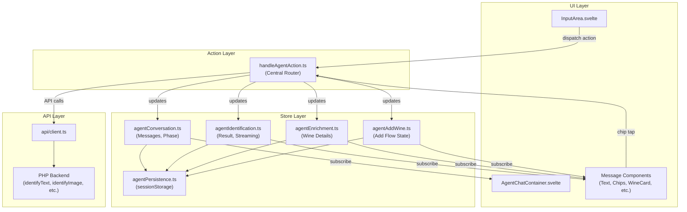

---

## Phase State Machine

The agent operates in distinct phases that control what inputs are accepted and what UI is shown.

### Phase Definitions

| Phase | Description | Input Enabled | Expected Actions |
|-------|-------------|---------------|------------------|
| `greeting` | Initial state, shows welcome message | Yes | Text/Image input |
| `awaiting_input` | Ready for user input, may have partial result | Yes | Text/Image input, field clarification |
| `identifying` | Processing identification | No | None (loading) |
| `confirming` | Showing result, awaiting confirmation or action | Yes | Correct/Not Correct, action chips, re-identify |
| `adding_wine` | In add-to-cellar flow | Conditional | Entity selection, form submission |
| `enriching` | Fetching wine details | No | None (loading) |
| `error` | Error occurred | Yes | Retry, Start Over |
| `complete` | Action completed | Yes | Start Over |

### Phase Transitions

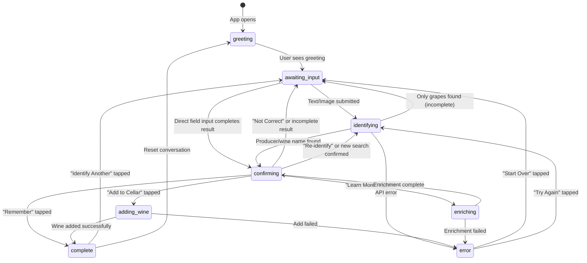

### Confirming Phase - Detail

The `confirming` phase has multiple sub-states based on result completeness:

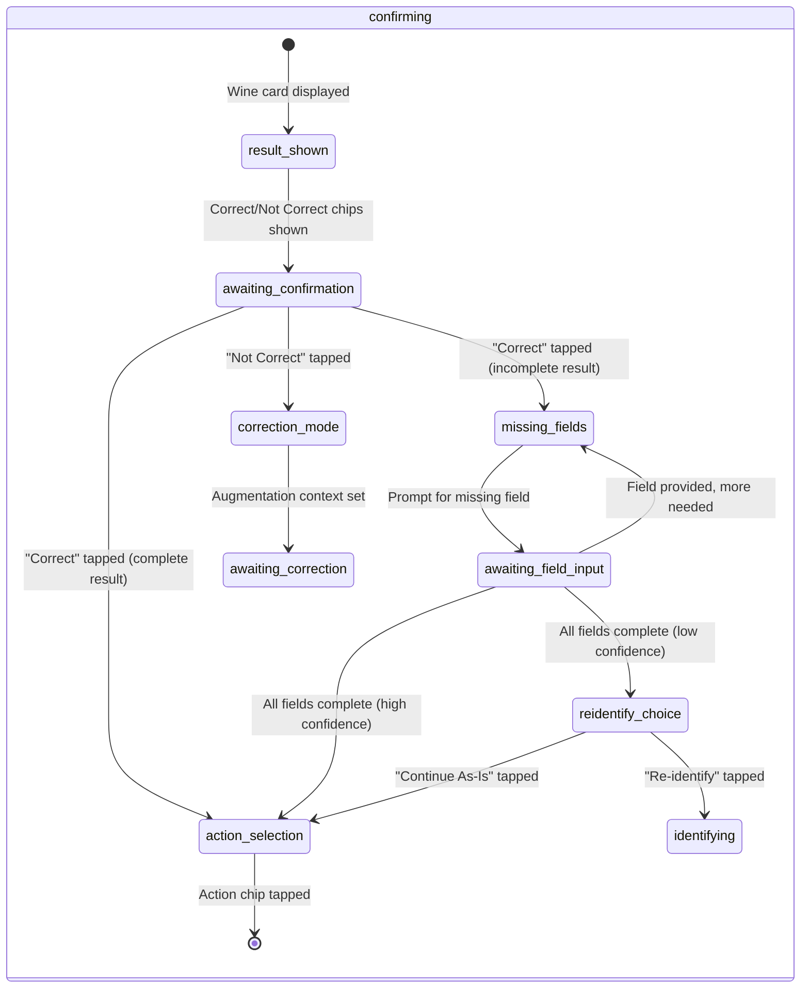

### Add Wine Sub-Steps

When `phase === 'adding_wine'`, the `addWineStep` provides granular state:

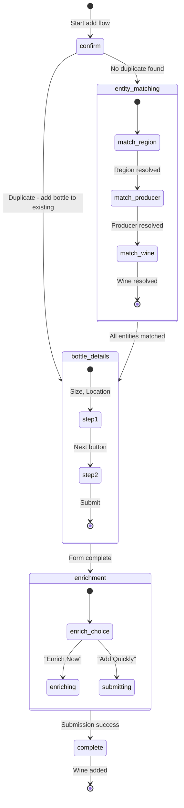

---

## Store Architecture

The agent state is split across four specialized stores, coordinated by a persistence layer.

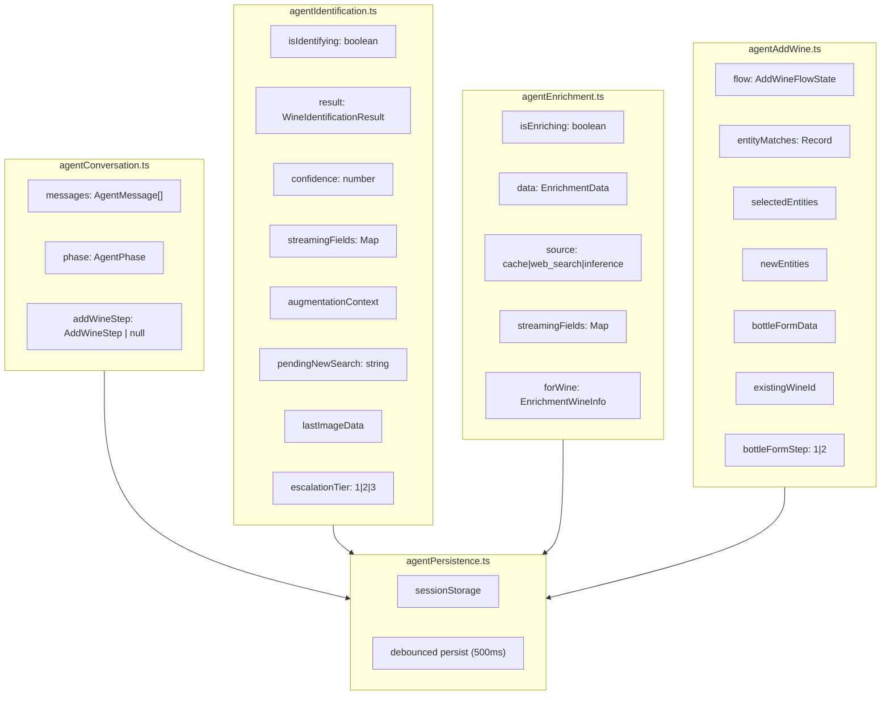

---

## Message System

### Message Categories

Messages are typed by category, each with specific data shapes:

| Category | Role | Description | Component |
|----------|------|-------------|-----------|
| `text` | both | Plain text messages | `TextMessage.svelte` |
| `chips` | agent | Action buttons | `ChipsMessage.svelte` |
| `wine_result` | agent | Identified wine card | `WineCard.svelte` |
| `enrichment` | agent | Wine details card | `EnrichmentCard.svelte` |
| `form` | agent | Interactive forms | `FormMessage.svelte` |
| `error` | agent | Error with retry options | `ErrorMessage.svelte` |
| `image` | user | User-submitted photo | `ImageMessage.svelte` |

### Text Message Variants

```typescript
interface TextMessageData {
  category: 'text';
  content: string;
  variant?: 'greeting' | 'info' | 'warning' | 'success' | 'divider';
}
```

| Variant | Usage |
|---------|-------|
| `greeting` | Initial welcome messages |
| `info` | Standard informational messages |
| `warning` | Caution messages |
| `success` | Completion messages |
| `divider` | Visual separator (used on "Start Over") |

### Form Message Types

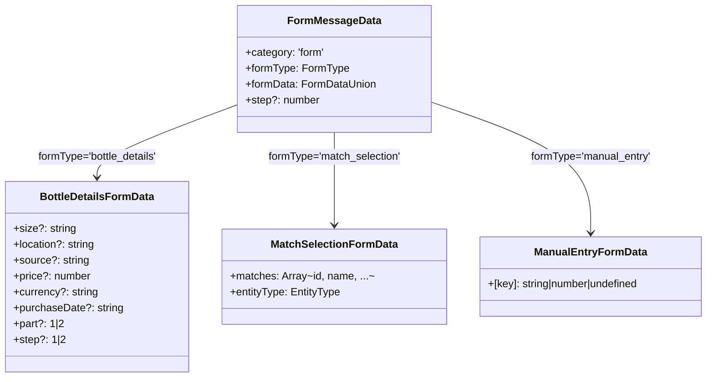

---

## Action System

### Action Type Hierarchy

All user interactions are converted to typed actions and routed through `handleAgentAction()`:

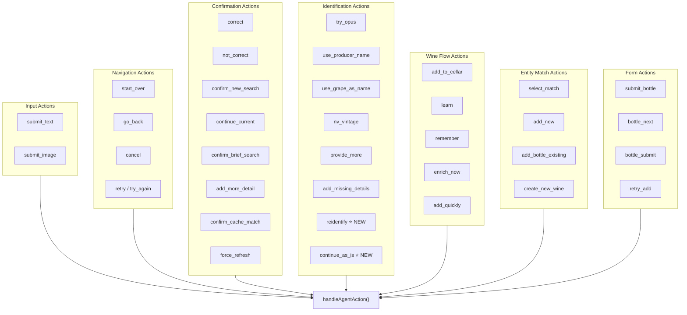

### New Actions (Recent Changes)

| Action | Trigger | Effect |
|--------|---------|--------|
| `reidentify` | "Re-identify" chip after manual field entry | Builds query from current result and re-runs identification |
| `continue_as_is` | "Continue As-Is" chip after manual field entry | Accepts manually-entered data and shows action chips |

---

## Text Input Processing

Text input goes through multiple detection stages before identification:

```mermaid
flowchart TB
    Start([User submits text]) --> CommandCheck{1. Command<br/>Detection}

    CommandCheck -->|"start over, cancel, etc."| ExecuteCommand[Execute command]
    ExecuteCommand --> End([Done])

    CommandCheck -->|Not a command| FieldClarification{2. Explicit Field<br/>Clarification?}

    FieldClarification -->|"region is X, producer is Y"| UpdateField[Update result field]
    UpdateField --> CheckComplete1{Result complete?}
    CheckComplete1 -->|Yes, high conf| ShowActionChips[Show action chips]
    CheckComplete1 -->|Yes, low conf| ShowReidentifyChoice[Show Re-identify choice]
    CheckComplete1 -->|No| PromptNextField[Prompt for next field]

    FieldClarification -->|No pattern match| DirectFieldInput{3. Direct Field Input?<br/>(no augmentation)}

    DirectFieldInput -->|Year entered, missing vintage| UpdateVintage[Update vintage]
    DirectFieldInput -->|Text entered, missing producer| UpdateProducer[Update producer]
    DirectFieldInput -->|Text entered, missing wine name| UpdateWineName[Update wine name]
    UpdateVintage --> CheckComplete2{Result complete?}
    UpdateProducer --> CheckComplete2
    UpdateWineName --> CheckComplete2
    CheckComplete2 --> ShowActionChips
    CheckComplete2 --> ShowReidentifyChoice
    CheckComplete2 --> PromptNextField

    DirectFieldInput -->|No match| ChipResponseCheck{4. Chip Response?<br/>(confirming phase)}

    ChipResponseCheck -->|"yes, correct, ok"| HandleCorrect[Handle Correct]
    ChipResponseCheck -->|"no, wrong"| HandleNotCorrect[Handle Not Correct]
    ChipResponseCheck -->|Not a chip response| NewSearchCheck{5. New Search?<br/>(has result)}

    NewSearchCheck -->|In confirming phase| ShowNewSearchConfirm[Show confirmation]
    NewSearchCheck -->|Not confirming| BriefInputCheck{6. Brief Input?<br/>(single word)}

    BriefInputCheck -->|Single word| ShowBriefConfirm[Show "Search Anyway?" prompt]
    BriefInputCheck -->|Multi-word| AugmentationCheck{7. Has Augmentation<br/>Context?}

    AugmentationCheck -->|Image context| ReidentifyWithImage[Re-identify with image + text]
    AugmentationCheck -->|Text context| ReidentifyWithContext[Re-identify with accumulated context]
    AugmentationCheck -->|No context| FreshIdentification[Fresh text identification]
```

### Detection Priority Order

1. **Command Detection** - "start over", "cancel", "help", etc.
2. **Explicit Field Clarification** - "region is X", "producer is Y"
3. **Direct Field Input** - Year/text when awaiting specific field
4. **Chip Response Detection** - "yes", "no", "correct", "wrong"
5. **New Search Confirmation** - Typing in confirming phase with result
6. **Brief Input Check** - Single word → confirmation prompt
7. **Identification** - Full API call

---

## Identification Flow

### Result Quality Analysis

```mermaid
flowchart TB
    Result([Wine Result]) --> CheckFields

    CheckFields --> HasProducer{Has producer?}
    CheckFields --> HasWineName{Has wine name?}
    CheckFields --> HasVintage{Has vintage?}
    CheckFields --> CheckConf{Confidence >= 70%?}

    HasProducer & HasWineName & HasVintage & CheckConf -->|All Yes| Complete[Result COMPLETE]
    Complete --> ActionChips["Chips: Add to Cellar, Learn More, Remember"]

    HasProducer -->|No| MissingProducer
    HasWineName -->|No| MissingWineName
    HasVintage -->|No| MissingVintage
    CheckConf -->|No| LowConfidence

    MissingProducer --> IncompleteChips1["Chips: Specify Producer, Search Again"]
    MissingVintage --> IncompleteChips2["Chips: Specify Vintage, Non-Vintage"]
    MissingWineName --> CheckAlternatives{Has producer<br/>or grapes?}

    CheckAlternatives -->|Has producer| IncompleteChips3["Chips: Use Producer Name, Add Details, Search Again"]
    CheckAlternatives -->|Has grapes| IncompleteChips4["Chips: Use Grape Name, Add Details, Search Again"]
    CheckAlternatives -->|Neither| IncompleteChips5["Chips: Add Details, Search Again"]

    LowConfidence --> AddTryHarder[Add "Try Harder" chip to set]
```

### After Manual Field Entry (Low Confidence)

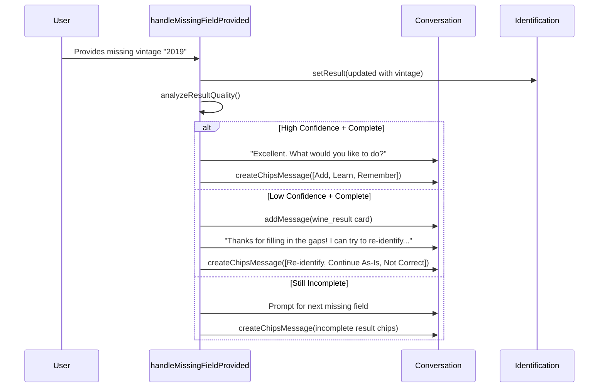

### Re-identify Flow

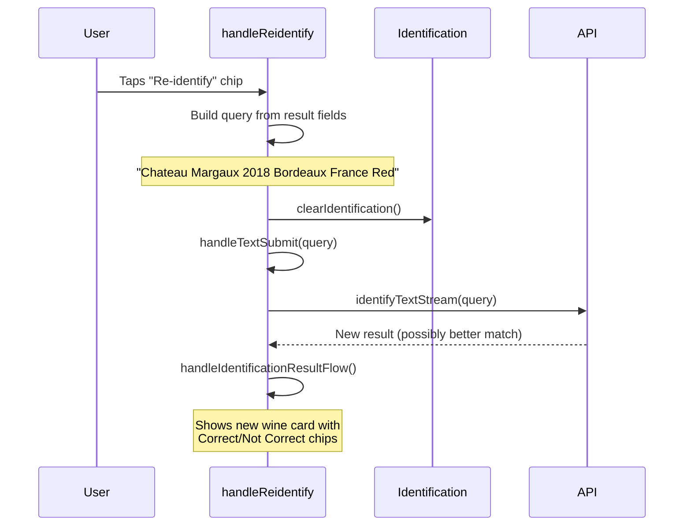

---

## Add Wine Flow

### Duplicate Detection

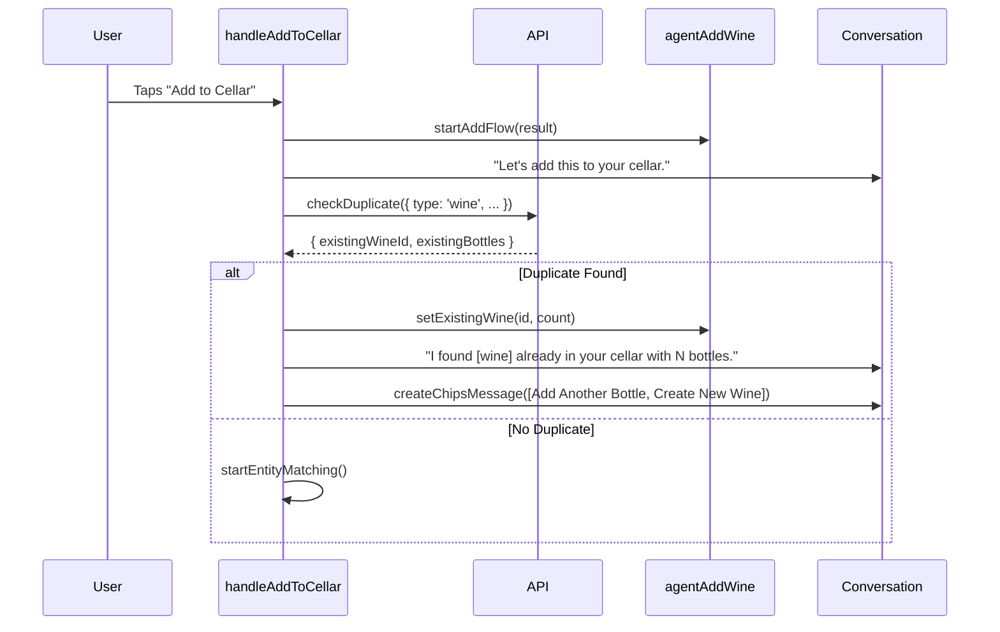

### Entity Matching Flow

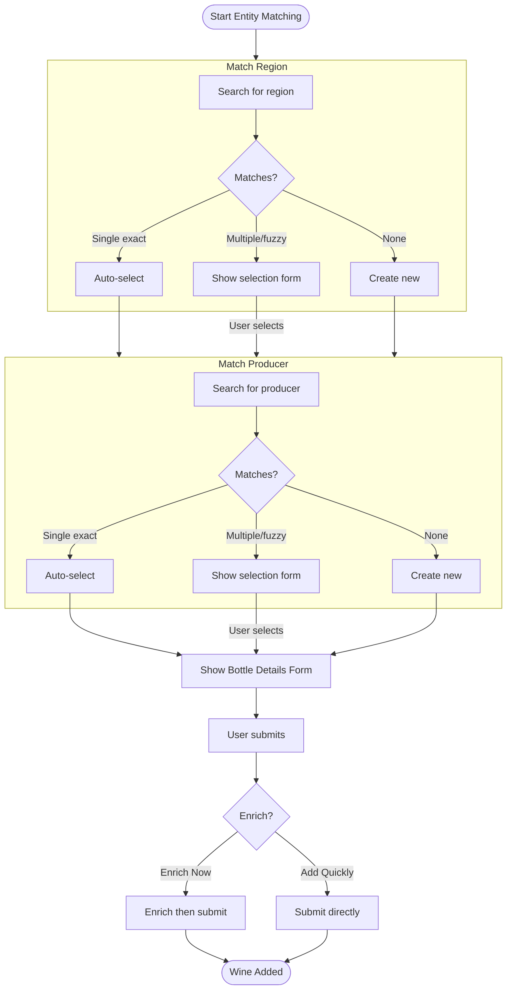

---

## Enrichment Flow


---

## Chip Configurations

Complete reference of all chip sets shown in different scenarios:

### Identification Phase

| Scenario | Chips |
|----------|-------|
| **Result found** (producer or wine name) | `Correct`, `Not Correct` |
| **Only grapes found** | `Use Grape Name`, `Add Details`, `Search Again`, `[Try Harder]` |
| **Nothing found** | `Try Again`, `Start Over` |

### Incomplete Results

| Missing Field | Chips |
|---------------|-------|
| **Only missing producer** | `Specify Producer`, `Search Again` |
| **Only missing vintage** | `Specify Vintage`, `Non-Vintage` |
| **Missing wine name** (has producer) | `Use Producer Name`, `Add Details`, `Search Again` |
| **Missing wine name** (has grapes) | `Use Grape Name`, `Add Details`, `Search Again` |
| **Multiple missing / generic** | `Add Details`, `Search Again` |
| **Low confidence** (any) | Above chips + `Try Harder` |

### After Manual Field Entry

| Scenario | Chips |
|----------|-------|
| **Complete + high confidence** | `Add to Cellar` (primary), `Learn More`, `Remember` |
| **Complete + low confidence** | `Re-identify` (primary), `Continue As-Is`, `Not Correct` |

### Confirmation Phase

| Scenario | Chips |
|----------|-------|
| **User confirms "Correct"** (complete) | `Add to Cellar` (primary), `Learn More`, `Remember` |
| **User confirms "Not Correct"** | `Add Details`, `Try Harder`, `Start Over` |
| **New search confirmation** | `Search New`, `Keep Current` |
| **Brief input confirmation** | `Search Anyway`, `I'll Add More` |

### Add Wine Flow

| Scenario | Chips |
|----------|-------|
| **Duplicate found** | `Add Another Bottle` (primary), `Create New Wine` |
| **Enrichment choice** | `Yes, Enrich Now` (primary), `No, Add Quickly` |
| **Wine added successfully** | `Identify Another` |
| **Add failed** | `Try Again`, `Cancel` |

### Enrichment Flow

| Scenario | Chips |
|----------|-------|
| **Cache match confirmation** | `Yes, use cached data`, `No, search online` |
| **Enrichment complete** | `Add to Cellar` (primary), `Remember`, `New Search` |

### Error State

| Scenario | Chips |
|----------|-------|
| **Retryable error** | `Try Again`, `Start Over` |
| **Non-retryable error** | `Start Over` |

---

## Command Detection

Client-side command detection intercepts user input before API calls:

### Commands

| Command | Triggers | Action |
|---------|----------|--------|
| `start_over` | "start", "start over", "restart", "reset", "new wine", "fresh start" | Reset conversation |
| `cancel` | "stop", "cancel", "never mind", "quit", "exit" | Close panel |
| `go_back` | "back", "go back", "undo", "previous" | Return to awaiting_input |
| `try_again` | "try again", "retry", "one more time" | Re-execute last action |
| `help` | "help", "what can you do", "how does this work" | Show help message |

### Chip Responses (Confirming Phase Only)

| Response | Triggers | Chip Action |
|----------|----------|-------------|
| **Positive** | "yes", "yeah", "ok", "correct", "right", "good", "perfect", typos | `correct` |
| **Negative** | "no", "nope", "wrong", "incorrect", "not right", typos | `not_correct` |

### Detection Priority

1. **Wine indicators** (highest) - "Château Cancel" → wine query
2. **Word count** - >6 words → wine query
3. **Pattern matching** - exact/substring matches

### Wine Indicators (False Positive Prevention)

French: château, domaine, cru, cave
Spanish: bodega, viña, rioja, ribera
Italian: cantina, tenuta, azienda
German: weingut, schloss
English: winery, vineyard, estate, reserve, vintage
Regions: champagne, burgundy, bordeaux, napa
Appellations: doc, docg, aoc, ava

---

## Error Handling

### Error Types

| Type | HTTP | Retryable | User Message |
|------|------|-----------|--------------|
| `timeout` | 408 | Yes | "Our sommelier is taking longer than expected..." |
| `rate_limit` | 429 | Yes | "Our sommelier is quite busy at the moment..." |
| `limit_exceeded` | 429 | No | "We've reached our tasting limit for today..." |
| `server_error` | 500 | Yes | "Something went wrong. Please try again." |
| `overloaded` | 503 | Yes | "Our sommelier is quite busy..." |
| `quality_check_failed` | 422 | No | "That image is a bit unclear..." |
| `identification_error` | 400 | No | "I couldn't identify that wine." |
| `enrichment_error` | 400 | No | "I couldn't find details for this wine." |

### Error Flow


---

## Persistence

### What Gets Persisted

| Data | Storage | Timing | Purpose |
|------|---------|--------|---------|
| Messages (max 30) | sessionStorage | Debounced 500ms | Restore chat on tab switch |
| Phase, AddWineStep | sessionStorage | Debounced 500ms | Restore flow state |
| Identification result | sessionStorage | Immediate | Critical state |
| Augmentation context | sessionStorage | Immediate | For retry/mobile |
| Pending new search | sessionStorage | Immediate | For mobile tab switch |
| Image data (base64) | sessionStorage | Immediate | For retry |
| Enrichment data | sessionStorage | Immediate | Critical state |

### Loading State Protection

Loading states (`isIdentifying`, `isEnriching`, `isSubmitting`) are **NOT** persisted to prevent orphan loading spinners on restore.

---

## Key Files Reference

| File | Purpose |
|------|---------|
| `lib/agent/types.ts` | All TypeScript types for agent system |
| `lib/agent/messages.ts` | Message templates, i18n support, chip labels |
| `lib/agent/handleAgentAction.ts` | Central action router (~2700 lines) |
| `lib/stores/agentConversation.ts` | Messages, phase state |
| `lib/stores/agentIdentification.ts` | Identification state, streaming, augmentation |
| `lib/stores/agentEnrichment.ts` | Enrichment data, streaming |
| `lib/stores/agentAddWine.ts` | Add-to-cellar flow state |
| `lib/stores/agentPersistence.ts` | sessionStorage coordination |
| `lib/utils/commandDetector.ts` | Command/chip response detection |

---

## Design Principles

1. **Command Pattern** - All interactions become typed actions routed through a single handler
2. **Store Separation** - Single-responsibility stores for each domain
3. **Phase-Driven UI** - Phase determines what's shown and what inputs are accepted
4. **Streaming Support** - Real-time field updates during API calls
5. **Mobile Resilience** - sessionStorage persistence survives tab switches
6. **Error Recovery** - Typed errors with retry support and support references
7. **Graceful Degradation** - Incomplete results still usable with field-specific prompts
8. **Re-identification Option** - User can retry identification with accumulated context
