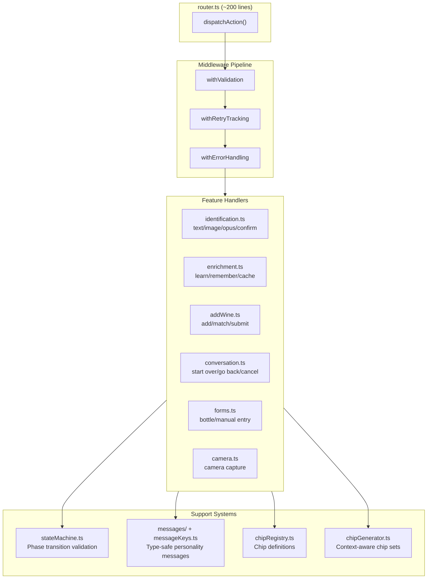

# Phase 2: Agent Rearchitecture Summary

> **Executive Summary**: Phase 2 decomposed the monolithic agent handler (2,831-line `handleAgentAction.ts`) into a modular architecture with feature-based handlers, composable middleware, a state machine for phase transitions, and type-safe message/chip registries. The work was completed across 5 sprints, growing the test suite from 422 to 534 tests.

**Status**: Complete (5 sprints)
**Completed**: 2026-02-05
**Predecessor**: Phase 1 (store split into 7 agent stores, 422 tests passing)

---

## What Changed

### Before (Phase 1)

A single monolithic file (`handleAgentAction.ts`) contained all agent logic: 40+ action cases in one function, 5-7 levels of nesting, module-level mutable state, and duplicated error handling.

### After (Phase 2)

### Key Architectural Changes

| Aspect | Before | After |
|--------|--------|-------|
| Handler structure | 1 file, 2,831 lines | 6 handler modules (168-700 lines each) |
| Error handling | Duplicated try/catch in every case | Centralized `withErrorHandling` middleware |
| Retry tracking | Module-level `lastAction` variable | `retryTracker` Svelte store with TTL |
| Phase transitions | Implicit `setPhase()` calls, no validation | State machine validates all transitions |
| Action prerequisites | Inline checks scattered through handler | `withValidation` middleware with prerequisite map |
| Messages | String literals and a single `agentMessages` object | `MessageKey` enum with personality-based `getMessage()` |
| Chips | Inline chip arrays in every handler | `ChipKey` enum, `chipRegistry`, and `chipGenerator` functions |
| State | Module-level mutable variables | All state in Svelte stores (reactive, testable, persistable) |

---

## Sprint Summary

| Sprint | Focus | Files Created | Tests Added |
|--------|-------|---------------|-------------|
| 1 | Middleware system + conversation handlers + router | 7 | 62 |
| 2 | Identification + enrichment handlers + services layer | 4 | -- |
| 3 | Add wine + form handlers | 2 | 1 |
| 4 | Message registry, chip registry, state machine | 7 | -- |
| 5 | Integration, error scenario, and streaming tests | 3 | 37 |
| **Total** | | **23 new files** | **422 -> 534 tests** |

---

## Files Created

### Handlers (`qve/src/lib/agent/handlers/`)
- `identification.ts` -- Text/image identification, confirmation, field completion (~520 lines)
- `enrichment.ts` -- Learn more, remember, cache handling (~494 lines)
- `addWine.ts` -- Add to cellar, entity matching, submission (~700 lines)
- `conversation.ts` -- Start over, go back, cancel, retry (~168 lines)
- `forms.ts` -- Bottle form, manual entry (~320 lines)
- `camera.ts` -- Camera capture handler
- `index.ts` -- Barrel exports with type guards

### Middleware (`qve/src/lib/agent/middleware/`)
- `types.ts` -- ActionHandler, Middleware types
- `compose.ts` -- Compose utility, createPipeline
- `errorHandler.ts` -- Unified error handling
- `retryTracker.ts` -- Retry tracking with Svelte store
- `validator.ts` -- Pre-action validation
- `index.ts` -- Barrel exports

### Services (`qve/src/lib/agent/services/`)
- `chipGenerator.ts` -- Context-aware chip generation
- `chipRegistry.ts` -- ChipKey enum and definitions
- `resultAnalyzer.ts` -- Result quality analysis (deferred, inline)
- `inputProcessor.ts` -- Input detection (deferred, uses commandDetector)
- `index.ts` -- Barrel exports

### Core (`qve/src/lib/agent/`)
- `router.ts` -- Action dispatch with middleware chain
- `stateMachine.ts` -- Phase transition map and validation
- `messageKeys.ts` -- MessageKey enum (~40 keys)
- `personalities.ts` -- Personality types and helpers
- `messages/sommelier.ts` -- Sommelier personality messages
- `messages/index.ts` -- Registry loader
- `messages/neutral.ts` -- Neutral personality fallback

### Stores
- `stores/agentSettings.ts` -- Personality preference store (localStorage)

---

## Known Tech Debt

| Priority | Item | Impact |
|----------|------|--------|
| High | Migrate 88+ `getMessage()` calls to `getMessageByKey()` | Enables full type safety, removes duplicate messages |
| High | Final router migration (remove legacy `handleAgentAction.ts`) | Reduces to <200 lines |
| Medium | Extract shared logic from `forms.ts`/`addWine.ts` | Removes circular dependency workaround |
| Medium | Manual entry should run entity matching | Currently skips duplicate detection |
| Low | Populate CASUAL, CONCISE, ENTHUSIAST personality messages | Only SOMMELIER has messages |
| Low | Build personality settings UI | Users cannot change personality without it |

---

## Detailed Documentation

For full internal architecture details (router patterns, middleware interfaces, handler contracts, state machine transitions, message system API), see `docs/AGENT_ARCHITECTURE.md`.
