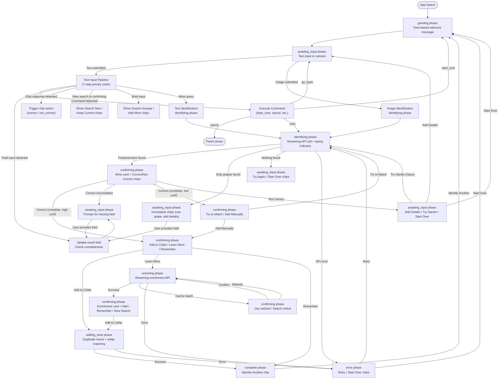
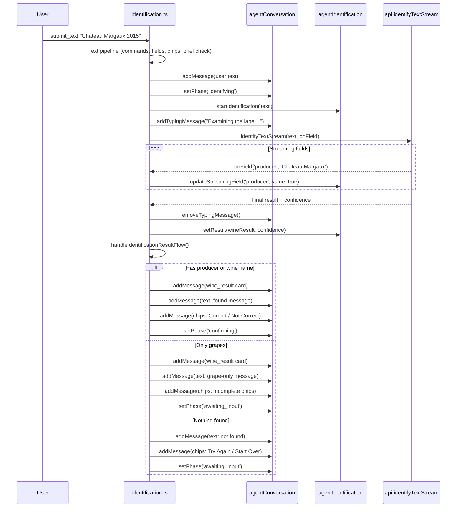
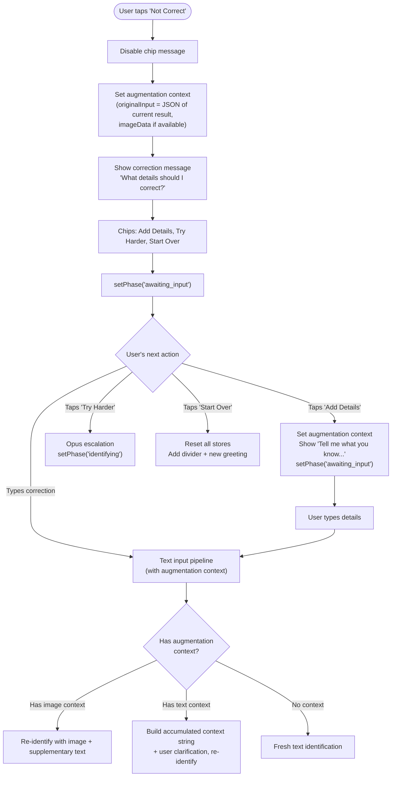
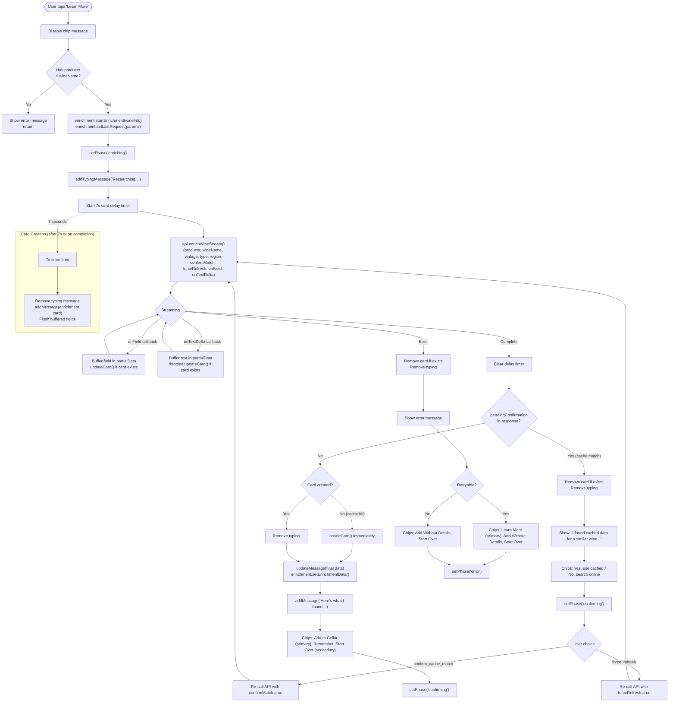
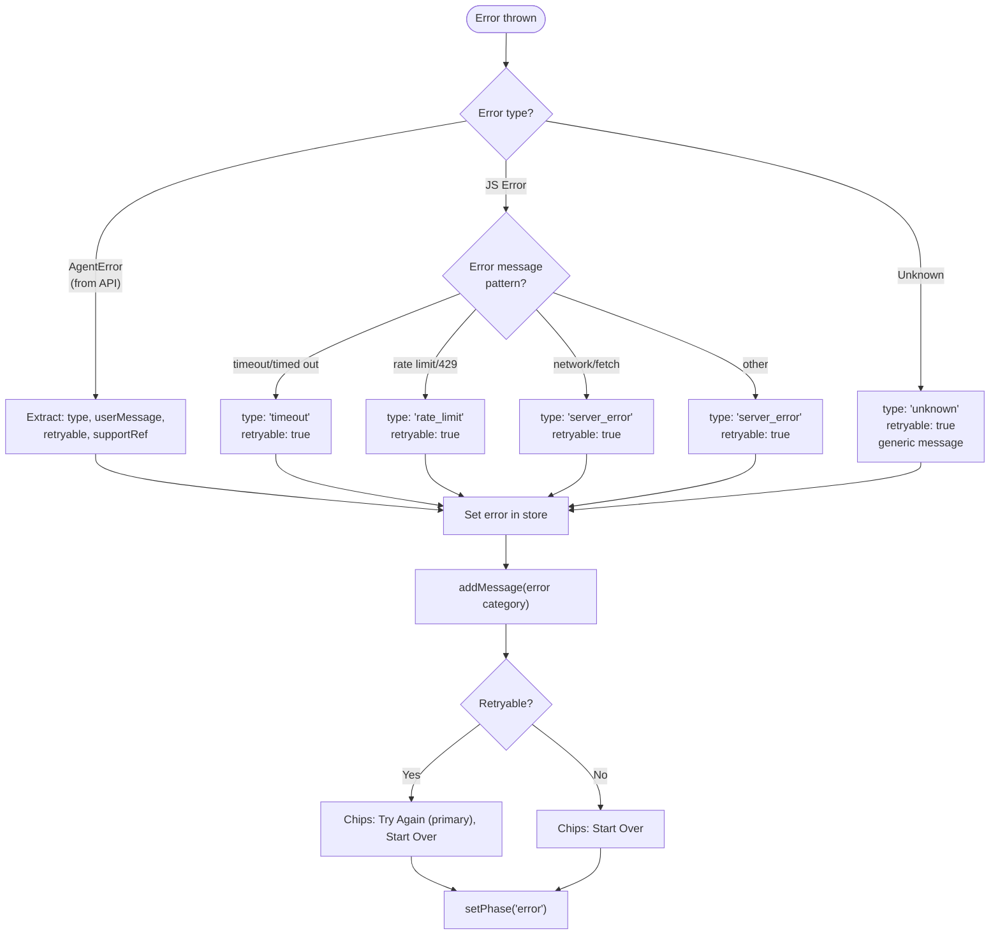
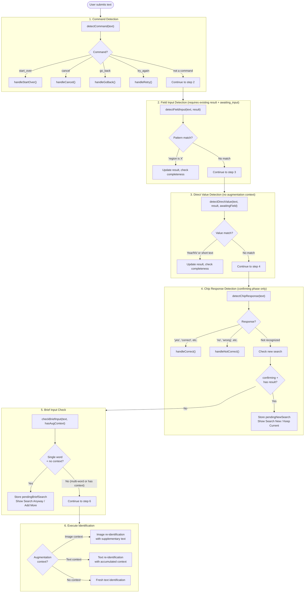

# Agent Flow Reference

A debugging-oriented flow guide for the wine sommelier agent. Use this document to trace issues, understand user journeys, and diagnose unexpected behavior.

**Last Updated**: 2026-02-14
**Companion doc**: [AGENT_ARCHITECTURE.md](./AGENT_ARCHITECTURE.md) (how it's built)
**This doc**: How it works, what happens when, how to debug it

---

## Table of Contents

1. [Executive Summary](#1-executive-summary)
2. [Master Flow Diagram](#2-master-flow-diagram)
3. [Detailed Flow Breakouts](#3-detailed-flow-breakouts)
   - 3.1 [Identification Flow](#31-identification-flow)
   - 3.2 [Clarification & Correction Flow](#32-clarification--correction-flow)
   - 3.3 [Enrichment Flow](#33-enrichment-flow)
   - 3.4 [Add to Cellar Flow](#34-add-to-cellar-flow)
   - 3.5 [Error & Recovery Flow](#35-error--recovery-flow)
   - 3.6 [Text Input Decision Tree](#36-text-input-decision-tree)
4. [Chip Configurations](#4-chip-configurations)
5. [Debugging Quick Reference](#5-debugging-quick-reference)
6. [Phase x Action Matrix](#6-phase--action-matrix)

---

## 1. Executive Summary

This document maps every path a user can take through the wine agent, from initial greeting to completion. It is organized around **flows** (what happens) rather than **architecture** (how it's built).

**When to use this doc:**
- Tracing why a user got stuck at a particular step
- Understanding which chips appear in which scenarios
- Debugging phase transition errors
- Understanding the priority chain for text input processing
- Diagnosing persistence issues after mobile tab switches

**Key files referenced:**
- `qve/src/lib/agent/router.ts` -- dispatch pipeline
- `qve/src/lib/agent/stateMachine.ts` -- phase transitions
- `qve/src/lib/agent/handlers/*.ts` -- all handler logic
- `qve/src/lib/agent/services/*.ts` -- result analysis, chip generation, input processing
- `qve/src/lib/stores/agent*.ts` -- all agent stores
- `qve/src/lib/utils/commandDetector.ts` -- command and chip response detection

---

## 2. Master Flow Diagram

This single diagram shows the complete user journey from greeting through all possible paths to completion.



---

## 3. Detailed Flow Breakouts

### 3.1 Identification Flow

The identification flow handles both text and image inputs, streaming field updates, result quality analysis, and escalation tiers.

#### Entry Points

| Input Type | Handler | API Method | Typing Message |
|------------|---------|------------|----------------|
| Text | `handleTextSubmit()` | `api.identifyTextStream()` | "Examining the label..." |
| Image | `handleImageSubmit()` | `api.identifyImageStream()` | "Analyzing your photo..." |
| Opus escalation | `handleTryOpus()` | `api.identifyWithOpus()` | "Calling in the expert..." |
| Re-identify | `handleReidentify()` | `handleTextSubmit()` (recursive) | "Taking another look..." |

#### Text Identification Sequence



#### Image Identification Details

Before calling the API, `handleImageSubmit()` performs memory management:

1. Iterates existing messages and clears `src` from any previous `image` category messages (prevents memory accumulation on mobile)
2. Stores image data in `agentIdentification` store via `setLastImageData()`
3. Records action for retry via `setLastAction()`
4. Adds user image message to conversation
5. Calls `executeImageIdentification()` -- same result handling as text

#### Result Quality Analysis

`analyzeResultQuality()` in `services/resultAnalyzer.ts` normalizes confidence and determines completeness:

```
API confidence (0-100) --> normalize to decimal (0-1)

Thresholds:
  LOW_CONFIDENCE_THRESHOLD = 0.7 (70%)
  ESCALATION_CONFIDENCE_THRESHOLD = 0.6 (60%)

Completeness score:
  producer present  = +0.4
  wine name present = +0.4
  vintage present   = +0.2

hasAllFields = producer AND wineName AND vintage
isComplete = hasAllFields AND confidence >= 0.7
canEscalate = confidence < 0.6
```

**Gotcha**: Always use `identification.getConfidence()` as the authoritative confidence source. The `result.confidence` property can be lost through serialization during field accumulation flows.

#### Escalation Tiers

| Tier | Model | Trigger | Handler |
|------|-------|---------|---------|
| 1 | Gemini | Default for text/image | `executeTextIdentification()` / `executeImageIdentification()` |
| 3 | Claude Opus | "Try Harder" chip | `handleTryOpus()` |

The Opus handler (`handleTryOpus`) reconstructs the prior result and sends it along with the original input (image or text) to `api.identifyWithOpus()`. It checks for input sources in priority order: image data, last text action, augmentation context.

---

### 3.2 Clarification & Correction Flow

This flow handles everything that happens when the user says "Not Correct", needs to provide additional details, or triggers a re-identification.

#### "Not Correct" Path



#### Augmentation Context

When the user says "Not Correct", the current result and image data are saved as augmentation context in the identification store:

```typescript
// From identification.ts handleNotCorrect()
identification.setAugmentationContext({
  originalInput: result ? JSON.stringify(result) : undefined,
  imageData: imageData?.data,
  imageMimeType: imageData?.mimeType,
});
```

When the user next submits text, the handler checks for augmentation context. If image data is present, it re-runs image identification with the text as supplementary context. If only text context is present, it parses the accumulated result and builds a context string combining all known fields with the user's clarification.

#### Field-by-Field Correction

When the user is in `awaiting_input` phase with an existing result, the text pipeline checks for field input patterns:

**Explicit field patterns** (via `detectFieldInput()`):
```
"region is Western Cape"
"producer: Domaine Leflaive"
"vintage = 2018"
"grape: Chardonnay"
```

**Direct value detection** (via `detectDirectValue()`):
- If awaiting vintage: any 4-digit year or "NV" is interpreted as vintage
- If only missing producer: short text (5 words or fewer) is interpreted as producer name
- If only missing wine name: short text is interpreted as wine name, with embedded vintage extraction ("Pinot Noir 2023" splits into name + vintage)

After any field update, `handleMissingFieldProvided()` runs `analyzeResultQuality()` on the updated result:

| Outcome | Phase | Chips |
|---------|-------|-------|
| All fields present, high confidence | `confirming` | Add to Cellar, Learn More, Remember |
| All fields present, low confidence | `confirming` | Try to Match (primary), Add Manually |
| Still missing fields | `awaiting_input` | Context-dependent incomplete chips |

#### New Search Confirmation

When a user types text during the `confirming` phase (after a result is shown), the system protects against accidental progress loss:

1. Store the typed text in `pendingNewSearch`
2. Show message: "I notice you've typed something new..."
3. Show chips: "Search New" / "Keep Current"
4. If "Search New": consume `pendingNewSearch`, clear identification, run `handleTextSubmit()`
5. If "Keep Current": clear `pendingNewSearch`, stay in `confirming`

`pendingNewSearch` is persisted to sessionStorage immediately for mobile tab-switch survival.

#### Brief Input Handling

Single-word inputs without augmentation context trigger a confirmation prompt:

1. Store text in `pendingBriefSearch`
2. Show user's text as user message
3. Show: "Just 'Margaux'? Adding more detail will improve the match."
4. Show chips: "Search Anyway" / "I'll Add More"
5. If "Search Anyway": consume `pendingBriefSearch`, run identification
6. If "I'll Add More": clear state, set `awaiting_input`

Single-word inputs WITH augmentation context bypass this check (the user is adding details to an existing identification, not starting a new search).

---

### 3.3 Enrichment Flow

The enrichment flow fetches wine details (grape composition, critic scores, tasting notes, drink window, food pairings) via streaming API. The enrichment card is created as a message in the conversation and updated in-place as fields arrive. A 7-second delay keeps the thinking message visible before the card appears for LLM responses; cache hits show the card immediately.



#### Enrichment Data Sections

The enrichment card displays up to 7 sections, each conditionally rendered:

| Section | Data Field | Component |
|---------|-----------|-----------|
| Overview | `overview` | `OverviewSection.svelte` |
| Grape Composition | `grapeComposition[]` | `GrapeCompositionSection.svelte` |
| Style Profile | `styleProfile` (body, tannin, acidity, sweetness) | `StyleProfileSection.svelte` |
| Tasting Notes | `tastingNotes` (nose, palate, finish) | `TastingNotesSection.svelte` |
| Critic Scores | `criticScores[]` (critic, score, vintage) | `CriticScoresSection.svelte` |
| Drink Window | `drinkWindow` (start, end, peak) | `DrinkWindowSection.svelte` |
| Food Pairings | `foodPairings[]` | `FoodPairingsSection.svelte` |

#### Retry Support

The last enrichment request parameters are stored via `enrichment.setLastRequest()`. If a cache confirmation or force refresh is needed, the handler retrieves these params. If unavailable, it falls back to re-reading the identification result.

---

### 3.4 Add to Cellar Flow

The add-to-cellar flow is the most complex multi-step flow in the agent, spanning duplicate detection, entity matching (region, producer, wine), a 2-step bottle form, and final submission.

#### Full Add Wine Sequence

```mermaid
flowchart TB
    AddToCellar(["User taps 'Add to Cellar'"]) --> DisableChip[Disable chip message]
    DisableChip --> CheckIdent{Has identification<br/>result?}
    CheckIdent -->|No| ShowError["Show error, return"]
    CheckIdent -->|Yes| StartFlow["addWine.startAddFlow(result)<br/>setPhase('adding_wine', 'confirm')"]
    StartFlow --> ShowMsg["'Let's add this to your cellar.'"]

    ShowMsg --> DuplicateCheck["api.checkDuplicate()<br/>(wine name, producer, vintage)"]

    DuplicateCheck -->|"Duplicate found"| ShowDuplicate["'I found [wine] in your cellar<br/>with N bottle(s).'"]
    ShowDuplicate --> DupChips["Chips: Add Another Bottle (primary),<br/>Create New Wine"]
    DupChips --> DupChoice{User choice}

    DupChoice -->|"add_bottle_existing"| SkipToBottle["Skip entity matching<br/>Go to bottle form"]
    DupChoice -->|"create_new_wine"| ClearExisting["clearExistingWine()<br/>Start entity matching"]

    DuplicateCheck -->|"No duplicate"| StartMatching["startEntityMatching()"]
    DuplicateCheck -->|"Check failed"| StartMatching

    ClearExisting --> StartMatching

    StartMatching --> SetEntityPhase["setPhase('adding_wine', 'entity_matching')"]
    SetEntityPhase --> MatchRegion

    subgraph EntityMatching["Entity Matching (region -> producer -> wine)"]
        MatchRegion["Match Region"] --> RegionResult{Region matches?}
        RegionResult -->|"Single exact match"| AutoSelectRegion["Auto-select, show confirmation"]
        RegionResult -->|"Multiple/fuzzy matches"| ShowRegionForm["Show match_selection form"]
        RegionResult -->|"No matches"| CreateRegion["Auto-create new region"]
        RegionResult -->|"No search term"| CreateRegionBlank["Auto-create 'Unknown Region'"]

        AutoSelectRegion --> MatchProducer["Match Producer<br/>(includes regionId context)"]
        ShowRegionForm -->|"User selects/creates"| MatchProducer
        CreateRegion --> MatchProducer
        CreateRegionBlank --> MatchProducer

        MatchProducer --> ProducerResult{Same pattern as region}
        ProducerResult --> ResolveProducer[Resolve producer]

        ResolveProducer --> MatchWine["Match Wine<br/>(skips search, goes to bottle form)"]
    end

    MatchWine --> BottleForm
    SkipToBottle --> BottleForm

    subgraph BottleFormFlow["Bottle Details Form"]
        BottleForm["setPhase('adding_wine', 'bottle_details')<br/>Show bottle form step 1"]
        BottleForm --> Step1["Step 1: Size, Location, Source"]
        Step1 -->|"bottle_next"| Step2["Step 2: Price, Currency, Date"]
        Step2 -->|"submit_bottle"| StoreBottle["Store bottle data"]
    end

    StoreBottle --> EnrichChoice["setPhase('adding_wine', 'enrichment')<br/>'Would you like me to add wine details?'"]
    EnrichChoice --> EnrichChips["Chips: Yes, Enrich Now (primary),<br/>No, Add Quickly"]

    EnrichChips -->|"enrich_now"| SubmitWithEnrich["Set enrichNow=true, submit"]
    EnrichChips -->|"add_quickly"| SubmitDirect["Set enrichNow=false, submit"]

    SubmitWithEnrich --> CheckExisting2{existingWineId set?}
    SubmitDirect --> CheckExisting2

    CheckExisting2 -->|"Yes"| AddBottleAPI["api.addBottle()"]
    CheckExisting2 -->|"No"| AddWineAPI["api.addWine()<br/>(4-table transaction)"]

    AddBottleAPI --> SubmitResult{Success?}
    AddWineAPI --> SubmitResult

    SubmitResult -->|"Yes"| Complete["addWine.completeSubmission(wineId)<br/>setPhase('complete')<br/>Chips: Identify Another"]
    SubmitResult -->|"No"| SubmitError["Show error message<br/>Chips: Try Again, Start Over"]
```



#### Entity Matching Details

Entity matching follows a consistent pattern for each entity type (region, then producer, then wine):

1. Extract search term from identification result
2. If no search term: auto-create new entity, advance to next
3. Call `api.checkDuplicate({ type, name, ... })` -- producer matching includes `regionId` from the previously matched region
4. **Single exact match**: auto-select, show confirmation message, advance
5. **Multiple/fuzzy matches**: show `match_selection` form with options + "Add new" button
6. **No matches**: auto-create new entity, advance
7. **API error**: auto-create new entity (fail-safe), advance

Wine entity matching is special: it always skips the search and goes straight to the bottle form.

#### Payload Building

`buildAddWinePayload()` constructs the `AddWinePayload` using a mutual exclusivity pattern:

- **Region**: Either `findRegion` (existing ID lookup) or `regionName` (create new) -- never both
- **Producer**: Either `findProducer` or `producerName`
- **Wine**: Either `findWine` or `wineName`

Vintage handling: "NV" or "nv" sets `isNonVintage=true` with empty `wineYear`.

---

### 3.5 Error & Recovery Flow

Errors can occur during identification, enrichment, or add wine submission. The system provides consistent error handling across all flows.

#### Error Types

| Type | HTTP | Retryable | Typical Cause |
|------|------|-----------|---------------|
| `timeout` | 408 | Yes | API call took too long |
| `rate_limit` | 429 | Yes | Too many requests |
| `limit_exceeded` | 429 | No | Daily limit reached |
| `server_error` | 500 | Yes | Backend error |
| `overloaded` | 503 | Yes | Service overloaded |
| `quality_check_failed` | 422 | No | Image too unclear |
| `identification_error` | 400 | No | Cannot identify wine |
| `enrichment_error` | 400 | No | Cannot find wine details |

#### Error Processing Pipeline



#### Retry Mechanism

The retry system uses the `retryTracker` middleware:

1. Before handler execution: if action type is retryable, store it in `lastActionStore` with timestamp
2. After successful execution: mark as succeeded
3. On retry: retrieve last action (if not expired -- 5 minute TTL)
4. Router re-dispatches the stored action through the full pipeline

**Retryable action types**: `submit_text`, `submit_image`, `try_opus`, `reidentify`, `enrich_now`, `remember`, `recommend`, `add_to_cellar`, `submit_bottle`, `add_bottle_existing`, `manual_entry_submit`

#### Middleware Error Handling

The outermost middleware (`withErrorHandling`) catches any uncaught errors from the entire handler chain. This acts as a safety net -- individual handlers also have their own try/catch blocks for more specific error messages.

The middleware chain execution order:
```
withErrorHandling -> withRetryTracking -> withValidation -> routeAction -> handler
```

If a handler catches and handles its own error (setting phase to `error`, showing error message), the outer middleware does not trigger because no exception propagates.

#### Support References

Exception errors include a support reference (`ERR-XXXXXXXX`) generated server-side. Debug with: `grep "ERR-XXX" /var/log/php_errors.log`

---

### 3.6 Text Input Decision Tree

When the user submits text, it passes through a 7-step priority chain in `handleTextSubmit()`. The first match wins -- later checks are skipped. Step 0 (field correction intercept) handles pending locked-field corrections before any other check.



#### Detection Priority Rules

| Priority | Check | Condition | Result |
|----------|-------|-----------|--------|
| 1 | Command detection | Wine indicators take priority over commands (e.g., "Chateau Cancel" is a wine query, not a cancel command). Inputs longer than 6 words are always wine queries. | Dispatches to conversation handler |
| 2 | Field input | Requires existing result AND `awaiting_input` phase. Matches explicit patterns like "region is X" | Updates result field directly |
| 3 | Direct value | Requires existing result, `awaiting_input` phase, NO augmentation context. Infers field type from context (awaiting vintage? short text for missing producer?) | Updates result field |
| 4 | Chip response | Only in `confirming` phase. Negative patterns checked before positive (so "not right" matches negative before "right" matches positive). If unrecognized in confirming with result, triggers new search confirmation. | Triggers correct/not_correct handler |
| 5 | Brief input | Single word without augmentation context triggers confirmation | Shows confirmation chips |
| 6 | Identification | Fallback. Uses augmentation context if available (image or text), otherwise fresh identification | API call |

---

## 4. Chip Configurations

### Identification Phase

| Scenario | Chips | Generator Function |
|----------|-------|--------------------|
| Result found (producer or wine name) | `Correct` (primary), `Not Correct` | `generateConfirmationChips()` |
| Only grapes found | Varies by missing fields (see Incomplete Results) | `generateIncompleteChips(quality)` |
| Nothing found | `Try Again`, `Start Over` | Inline |

### Incomplete Results

| Missing Field | Chips |
|---------------|-------|
| Only missing producer | `Specify Producer`, `Search Again` |
| Only missing vintage | `Specify Vintage`, `Non-Vintage` |
| Missing wine name (has producer) | `Use Producer Name`, `Add Details`, `Search Again` |
| Missing wine name (has grapes) | `Use Grape Name`, `Add Details`, `Search Again` |
| Multiple missing / generic | `Add Details`, `Search Again` [+ `Try Harder` if canEscalate] |

### After Manual Field Entry

| Scenario | Chips |
|----------|-------|
| Complete + high confidence | `Add to Cellar` (primary), `Learn More`, `Remember` |
| Complete + low confidence | `Try to Match` (primary), `Add Manually` |

### Confirmation Phase

| Scenario | Chips |
|----------|-------|
| User confirms "Correct" (complete, high conf) | `Add to Cellar` (primary), `Learn More`, `Remember` |
| User confirms "Correct" (complete, low conf) | `Try to Match` (primary), `Add Manually` |
| User confirms "Not Correct" | `Add Details`, `Try Harder`, `Start Over` |
| New search confirmation | `Search New` (primary), `Keep Current` |
| Brief input confirmation | `Search Anyway` (primary), `I'll Add More` |

### Add Wine Flow

| Scenario | Chips |
|----------|-------|
| Duplicate found | `Add Another Bottle` (primary), `Create New Wine` |
| Enrichment choice | `Yes, Enrich Now` (primary), `No, Add Quickly` |
| Wine added successfully | `Identify Another` |
| Add failed | `Try Again`, `Start Over` |

### Enrichment Flow

| Scenario | Chips |
|----------|-------|
| Cache match confirmation | `Yes, use cached data` (primary), `No, search online` |
| Enrichment complete | `Add to Cellar` (primary), `Remember`, `Start Over` (secondary) |
| Enrichment error (retryable) | `Learn More` (primary), `Add Without Details`, `Start Over` |
| Enrichment error (non-retryable) | `Add Without Details`, `Start Over` |

### Error State

| Scenario | Chips |
|----------|-------|
| Retryable error | `Try Again` (primary), `Start Over` |
| Non-retryable error | `Start Over` |

---

## 5. Debugging Quick Reference

### Symptom-to-Cause Table

| Symptom | Likely Cause | Files to Check |
|---------|-------------|----------------|
| User stuck on typing indicator | `isIdentifying` or `isEnriching` store not reset to false after API call completes or errors | `agentIdentification.ts`, `agentEnrichment.ts` -- check that `removeTypingMessage()` is called in both success and catch paths |
| Chips not showing | Phase mismatch (chip was generated for wrong phase), or all chips disabled by `addMessage()` auto-disable | `agentConversation.ts` `addMessage()` -- disables all prior chips/errors. Check phase matches expected. |
| Chips showing but not responding | Message marked as `disabled: true`, or action type not registered in any handler's type guard | `handlers/index.ts` HANDLER_CATEGORIES, `middleware/validator.ts` prerequisites |
| Result lost after tab switch | sessionStorage quota exceeded, or persistence not triggered | `agentPersistence.ts` -- check quota fallback chain. Image data is dropped first. |
| Phase transition error in console | Invalid transition attempted (DEV throws, PROD logs) | `stateMachine.ts` PHASE_TRANSITIONS -- verify from/to combination is listed |
| "No handler found for action" error | Action type not matched by any `isXxxAction()` type guard | `router.ts` routeAction() -- check handler check order. Verify action type spelling. |
| Validation failed warning | Action prerequisites not met (wrong phase, missing identification, etc.) | `middleware/validator.ts` defaultPrerequisites |
| Streaming fields not updating | Store subscription issue, or streaming callback not wired | `agentIdentification.ts` updateStreamingField, component subscription to `streamingFields` derived store |
| Augmentation context lost | `clearAugmentationContext()` called prematurely, or not persisted before tab switch | `agentIdentification.ts` -- augmentation persists immediately. Check if handler clears it before re-identification completes. |
| User sees stale chips from previous interaction | `disableAllChips()` or `addMessage()` auto-disable not working | `agentConversation.ts` -- new messages auto-disable prior chips/errors. Check `disabled` flag on chip messages. |
| Brief input prompt shows for field completion | User is providing a single-word field value (e.g., vintage "2019") but augmentation context is null | Field detection (step 2/3) should catch this before brief check (step 5). If field detection fails, brief check triggers. Ensure existing result is present. |
| "Not Correct" leads to fresh identification ignoring corrections | Augmentation context not set, or cleared before text submission | `identification.ts` handleNotCorrect() sets context. Check `handleTextSubmit()` step 6 branches. |
| Entity matching auto-creates everything | `checkDuplicate` API returning errors (caught and handled as auto-create) | Check PHP endpoint `checkDuplicate.php`, network tab for errors |
| Wine added but enrichment data missing | `enrich_now` action calls `submitWine()` directly. Enrichment runs after wine is added, not before. | `addWine.ts` handleEnrichNow() -- note the comment "For now, submit and enrich in background" |
| Retry does nothing | Last action expired (5 min TTL) or was not retryable | `middleware/retryTracker.ts` DEFAULT_RETRYABLE_ACTIONS, DEFAULT_EXPIRATION_MS |
| Animation replays on tab return | `isNew` flags not cleared on restore from persistence | `agentConversation.ts` restoreFromCallbacks() sets `isNew: false`. Check persistence restore path. |

### Console Log Prefixes

| Prefix | Source |
|--------|--------|
| `[Router]` | `router.ts` -- action routing decisions |
| `[Conversation]` | `handlers/conversation.ts` -- navigation actions |
| `[Camera]` | `handlers/camera.ts` -- camera delegation |
| `[StateMachine]` | `stateMachine.ts` -- invalid transition warnings |
| `[AgentAction]` | Middleware layer -- validation failures, error handling |
| `[AgentConversation]` | `agentConversation.ts` store -- phase/message debug (DEV only) |
| `[AgentIdentification]` | `agentIdentification.ts` store -- state debug (DEV only) |
| `[AgentEnrichment]` | `agentEnrichment.ts` store -- state debug (DEV only) |
| `[AgentAddWine]` | `agentAddWine.ts` store -- flow state debug (DEV only) |

---

## 6. Phase x Action Matrix

This table shows which actions are valid in which phases. An action not listed for a phase will be skipped by the validation middleware (with a console warning).

| Action | greeting | awaiting_input | identifying | confirming | adding_wine | enriching | error | complete |
|--------|----------|---------------|-------------|------------|-------------|-----------|-------|----------|
| `submit_text` | * | * | | * | | | | |
| `submit_image` | * | * | | | | | | |
| `start_over` | * | * | * | * | * | * | * | * |
| `go_back` | | * | | * | * | * | * | |
| `cancel` | * | * | * | * | * | * | * | * |
| `retry` / `try_again` | | | | | | | * | |
| `correct` | | | | **R** | | | | |
| `not_correct` | | | | **R** | | | | |
| `add_to_cellar` | | | | **R** | | | | |
| `try_opus` | | **R** | | **R** | | | | |
| `verify` | | | | **R** | | | | |
| `correct_field` | | **R** | | **R** | | | | |
| `confirm_corrections` | | **R** | | **R** | | | | |
| `cancel_request` | * | * | * | * | * | * | * | * |
| `learn` | | | | **R** | | | | |
| `remember` | | | | **R** | | | | |
| `reidentify` | | | | * | | | | |
| `provide_more` | | | | * | | | | |
| `continue_as_is` | | | | * | | | | |
| `confirm_new_search` | | | | * | | | | |
| `continue_current` | | | | * | | | | |
| `confirm_brief_search` | | * | | | | | | |
| `add_more_detail` | | * | | | | | | |
| `use_producer_name` | | * | | | | | | |
| `use_grape_as_name` | | * | | | | | | |
| `nv_vintage` | | * | | | | | | |
| `add_missing_details` | | * | | | | | | |
| `add_bottle_existing` | | | | | **R+F** | | | |
| `create_new_wine` | | | | | **R+F** | | | |
| `select_match` | | | | | **F** | | | |
| `add_new` | | | | | **F** | | | |
| `clarify` | | | | | **F** | | | |
| `submit_bottle` | | | | | **F** | | | |
| `bottle_next` | | | | | **F** | | | |
| `bottle_submit` | | | | | * | | | |
| `enrich_now` | | | | | **R** | | | |
| `add_quickly` | | | | | * | | | |
| `retry_add` | | | | | * | | | |
| `confirm_cache_match` | | | | * | | | | |
| `force_refresh` | | | | * | | | | |
| `take_photo` | * | * | | * | | | | |
| `choose_photo` | * | * | | * | | | | |
| `new_input` | | * | | * | | | | |
| `start_fresh` | * | * | | * | * | | * | * |
| `start_over_error` | | | | | | | * | |

**Legend:**
- `*` = Valid (no special prerequisites beyond phase)
- **R** = Requires identification result
- **F** = Requires active add wine flow
- **R+F** = Requires both identification result and add wine flow
- Empty = Not valid in this phase (validation middleware will skip with warning)

**Note**: `submit_text` and `submit_image` are not phase-restricted by the validator -- they handle phase-specific behavior internally through the text input pipeline. `start_over`, `cancel`, and `cancel_request` are conversation actions that bypass validation entirely.
