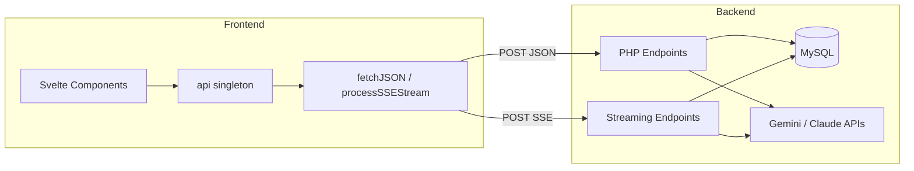
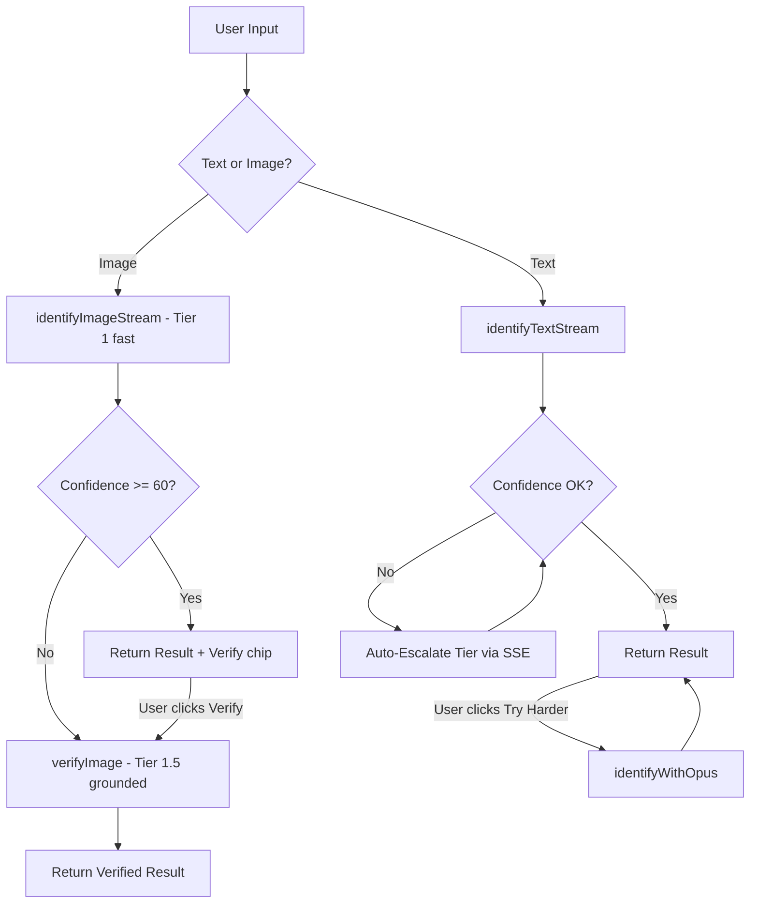

# API Reference

> Complete reference for the Qvé Wine App API layer: TypeScript client methods, PHP backend endpoints, streaming SSE protocol, and agent AI endpoints. All frontend-to-backend communication flows through the singleton `api` client in `qve/src/lib/api/client.ts`.

**Last Updated**: 2026-02-14

---

## Architecture Overview

The API layer follows a simple pattern: a TypeScript singleton client (`WineApiClient`) sends JSON POST requests to PHP endpoints via the Vite dev proxy (`/resources/php/`). Agent endpoints use a separate bootstrap with autoloading, structured error handling, and optional SSE streaming.



### Request/Response Pattern

All endpoints (except `upload.php`) accept and return JSON:

```
Request:  POST /resources/php/<endpoint>.php
Headers:  Content-Type: application/json
Body:     { ...params }

Response: { success: boolean, message: string, data: T }
```

Streaming endpoints (`*Stream.php`) use Server-Sent Events instead:

```
Response: Content-Type: text/event-stream
Events:   field → result → done  (or error at any point)
```

### Import

```typescript
import { api } from '$lib/api';
// or
import { api } from '$lib/api/client';
```

---

## Core Wine Endpoints

### getWines

Fetch wines with optional cascading filters. Defaults to cellar view (wines with bottles).

```typescript
const wines = await api.getWines({
  typesDropdown?: string,      // Wine type name (e.g., 'Red')
  countryDropdown?: string,    // Country name
  regionDropdown?: string,     // Region name
  producerDropdown?: string,   // Producer name
  yearDropdown?: string,       // Vintage year ('No Year' for NV wines)
  bottleCount?: '0' | '1',    // '1' = cellar only (default), '0' = all wines
  wineID?: string | number,    // Single wine by ID
  searchQuery?: string         // Free-text search (min 3 chars, prefix matching across name/producer/region/country/appellation/year)
});
```

**Returns**: `Wine[]`
**PHP**: `getWines.php` — Uses 6 MySQL 8 CTEs (`rating_stats`, `bottle_price_ranked`, `bottle_prices`, `type_price_ranked`, `type_prices`, `bottle_sources`) instead of correlated subqueries. Supports free-text search via `searchQuery` (prefix matching with MySQL REGEXP, minimum 3 characters).

### getWine

Fetch a single wine by ID (convenience wrapper around `getWines`).

```typescript
const wine = await api.getWine(wineID: number);
```

**Returns**: `Wine | null`
**PHP**: Uses `getWines.php` with `wineID` filter and `bottleCount: '0'`.

### addWine

Add a new wine with region, producer, and first bottle in a single transaction (up to 4 table inserts).

```typescript
const result = await api.addWine({
  // Region — existing or new
  findRegion: string,           // Existing region name to search
  regionName: string,           // New region name (if not found)
  regionCountry: string,        // Country name for new region
  regionDescription?: string,
  regionClimate?: string,
  regionSoil?: string,
  regionMap?: string,

  // Producer — existing or new
  findProducer: string,         // Existing producer name to search
  producerName: string,         // New producer name (if not found)
  producerTown?: string,
  producerFounded?: string,
  producerOwnership?: string,
  producerDescription?: string,

  // Wine — existing or new
  findWine: string,             // Existing wine name to search
  wineName: string,             // New wine name (if not found)
  wineYear: string,             // Vintage year or 'NV'
  isNonVintage?: boolean,       // WIN-176: True for NV wines
  wineType: string,             // Type name (e.g., 'Red')
  appellation?: string,         // WIN-148: Specific appellation
  wineDescription?: string,
  wineTasting?: string,
  winePairing?: string,
  winePicture?: string,

  // Bottle details
  bottleType: string,           // Size code (e.g., 'Standard')
  storageLocation: string,
  bottleSource: string,
  bottlePrice?: string,
  bottleCurrency?: string,
  bottlePurchaseDate?: string,

  // WIN-144: Enrichment data (optional, from agent flow)
  drinkWindowStart?: number,    // Year (e.g., 2025)
  drinkWindowEnd?: number,      // Year (e.g., 2035)
  grapes?: Array<{ grape: string, percentage?: number }>,  // Max 20 entries
  criticScores?: Array<{ critic: string, score: number, scoreYear?: number }>  // Max 10 entries
});
```

**Returns**: `{ wineID: number, bottleID: number }`
**PHP**: `addWine.php` — Transactional insert across `region`, `producers`, `wine`, `bottles` tables (plus `grapes`/`grapemix` and `critic_scores` if enrichment data provided). Uses search-first pattern to reuse existing entities. Sets `enrichment_status` based on data presence.

### updateWine

Update wine details.

```typescript
await api.updateWine({
  wineID: number,
  wineName: string,
  wineType: string,           // Type name, not ID (resolved server-side)
  wineYear?: string,
  isNonVintage?: boolean,     // WIN-176
  wineDescription: string,
  wineTasting: string,        // PHP field name: 'wineTasting'
  winePairing: string,        // PHP field name: 'winePairing'
  winePicture: string
});
```

**Returns**: `void` (throws on failure)
**PHP**: `updateWine.php` — Transactional update with audit logging.

---

## Bottle Endpoints

### addBottle

Add a bottle to an existing wine.

```typescript
const result = await api.addBottle({
  wineID: number,
  bottleSize: string,          // Mapped to PHP 'bottleType'
  bottleLocation?: string,     // Mapped to PHP 'storageLocation'
  bottleSource?: string,
  bottlePrice?: number,
  bottleCurrency?: string,
  purchaseDate?: string,
  quantity?: number            // WIN-222: Batch insert (1-24, default 1)
});
```

**Returns**: `{ bottleID: number }` (single) or `{ bottleIDs: number[] }` (batch)
**PHP**: `addBottle.php` — Atomic batch insert within a transaction. Maps TypeScript field names to PHP-expected names (`bottleSize` -> `bottleType`, `bottleLocation` -> `storageLocation`). Quantity clamped to 1-24.

### updateBottle

Update bottle details.

```typescript
await api.updateBottle({
  bottleID: number,
  bottleSize: string,
  location: string,            // PHP expects 'location', not 'bottleLocation'
  bottleSource: string,
  bottlePrice?: number,
  bottleCurrency?: string,
  purchaseDate?: string
});
```

**Returns**: `void` (throws on failure)
**PHP**: `updateBottle.php`

### getBottles

Get non-drunk bottles for a wine. Maps PHP field names to TypeScript interface.

```typescript
const bottles = await api.getBottles(wineID: number);
```

**Returns**: `Bottle[]` — Each bottle has `bottleLocation`, `bottleSource`, `bottlePrice`, `bottleCurrency` (mapped from PHP `location`, `source`, `price`, `currency`).
**PHP**: `getBottles.php`

---

## Rating & History Endpoints

### drinkBottle

Mark a bottle as drunk and record a rating. Multi-step transaction.

```typescript
await api.drinkBottle({
  wineID: number,
  bottleID: number,
  overallRating: number,           // 1-10
  valueRating: number,             // 1-10
  drinkDate: string,               // DD/MM/YYYY (converted server-side to YYYY-MM-DD)
  buyAgain?: 0 | 1,
  notes?: string,
  complexityRating?: number,       // 0-5
  drinkabilityRating?: number,     // 0-5
  surpriseRating?: number,         // 0-5
  foodPairingRating?: number       // 0-5
});
```

**Returns**: `void` (throws on failure)
**PHP**: `drinkBottle.php` — Updates bottle `bottleDrunk` flag and inserts into `ratings` table within a transaction.

### updateRating

Update an existing rating.

```typescript
await api.updateRating({
  ratingID: number,
  wineID: number,
  bottleID: number,
  overallRating: number,           // 1-10 (validated server-side)
  valueRating: number,             // 1-10 (validated server-side)
  drinkDate: string,
  buyAgain?: 0 | 1,
  notes?: string,
  complexityRating?: number,       // 0-5
  drinkabilityRating?: number,     // 0-5
  surpriseRating?: number,         // 0-5
  foodPairingRating?: number       // 0-5
});
```

**Returns**: `void` (throws on failure)
**PHP**: `updateRating.php` — Transactional update with audit logging. Validates rating ranges 1-10.

### getDrunkWines

Get drink history with ratings. Supports server-side pagination, sorting, and cascading filters.

```typescript
const response = await api.getDrunkWines({
  page?: number,               // Page number (default 1)
  limit?: number,              // Items per page (1-200, default 50)
  sortKey?: string,            // Sort column (see sort map below)
  sortDir?: 'asc' | 'desc',   // Sort direction (default 'desc')
  countryDropdown?: string,    // Filter by country
  typesDropdown?: string,      // Filter by wine type
  regionDropdown?: string,     // Filter by region
  producerDropdown?: string,   // Filter by producer
  yearDropdown?: string        // Filter by vintage
});
```

**Sort keys**: `drinkDate` (default), `rating`, `overallRating`, `valueRating`, `wineName`, `wineType`, `country`, `producer`, `region`, `year`, `price`, `buyAgain`

**Returns**: `GetDrunkWinesResponse`:
```typescript
{
  wineList: DrunkWine[],
  pagination: { page, limit, total, totalPages },
  unfilteredTotal: number,
  filterOptions: {
    countries: Array<{ value, count }>,
    types: Array<{ value, count }>,
    regions: Array<{ value, count }>,
    producers: Array<{ value, count }>,
    years: Array<{ value, count }>
  }
}
```

**PHP**: `getDrunkWines.php` — Server-side pagination (LIMIT/OFFSET), whitelisted sort columns (prevents SQL injection), cascading filter options where each dimension excludes itself from the WHERE clause.

---

## Filter / Dropdown Endpoints

All filter endpoints support context-aware cascading: each accepts optional filter parameters from other dimensions so that counts reflect only wines matching all active filters.

### getCountries

```typescript
const countries = await api.getCountries({
  withBottleCount?: boolean,       // Only wines with bottles
  typeName?: string,
  regionName?: string,
  producerName?: string,
  year?: string
});
```

**Returns**: `Country[]` — `{ countryName, code, bottleCount? }`
**PHP**: `getCountries.php`

### getRegions

```typescript
const regions = await api.getRegions({
  withBottleCount?: boolean,
  countryName?: string,
  typeName?: string,
  producerName?: string,
  year?: string
});
```

**Returns**: `Region[]` — `{ regionID, regionName, countryID, countryName?, bottleCount? }`
**PHP**: `getRegions.php`

### getProducers

```typescript
const producers = await api.getProducers({
  withBottleCount?: boolean,
  countryName?: string,
  regionName?: string,
  typeName?: string,
  year?: string
});
```

**Returns**: `Producer[]` — `{ producerID, producerName, regionID, regionName?, bottleCount? }`
**PHP**: `getProducers.php`

### getTypes

```typescript
const types = await api.getTypes({
  withBottleCount?: boolean,
  countryName?: string,
  regionName?: string,
  producerName?: string,
  year?: string
});
```

**Returns**: `WineType[]` — `{ wineTypeName, bottleCount? }` (mapped from PHP `wineType` field)
**PHP**: `getTypes.php`

### getYears

```typescript
const years = await api.getYears({
  withBottleCount?: boolean,       // Default: true (unlike other filters)
  countryName?: string,
  regionName?: string,
  producerName?: string,
  typeName?: string
});
```

**Returns**: `Year[]` — `{ wineYear, bottleCount? }`
**PHP**: `getYears.php`

---

## Settings & Reference Data

### getCurrencies

Get currencies and bottle sizes (reference data for dropdowns and conversion).

```typescript
const data = await api.getCurrencies();
```

**Returns**: `CurrencyDataResponse` — `{ currencies: Currency[], bottleSizes: BottleSize[] }`
**PHP**: `getCurrencies.php` — Cached for 24 hours via `Cache-Control` header.

### getUserSettings

Get user settings (collection name, etc.).

```typescript
const settings = await api.getUserSettings();
```

**Returns**: `UserSettings` — `{ collectionName: string }` (defaults to 'Our Wines')
**PHP**: `getUserSettings.php` — Key-value store from `user_settings` table.

### updateUserSettings

Update user settings.

```typescript
const updated = await api.updateUserSettings({
  collectionName?: string          // Max 50 chars, defaults to 'Our Wines' if empty
});
```

**Returns**: `UserSettings`
**PHP**: `updateUserSettings.php` — Uses `INSERT ... ON DUPLICATE KEY UPDATE` (upsert pattern).

### getCellarValue

Get cellar value statistics. All values returned in EUR.

```typescript
const value = await api.getCellarValue();
```

**Returns**: `CellarValue` — `{ totalValueEUR, bottleCount, bottlesWithPrice, bottlesWithoutPrice, hasIncompleteData }`
**PHP**: `getCellarValue.php` — Aggregates non-drunk bottle prices with currency conversion.

### getCellarValueHistory

Get daily historical cellar value for charting. Reconstructs from bottle add/drink/delete events.

```typescript
const history = await api.getCellarValueHistory();
```

**Returns**: `CellarValueHistoryPoint[]` — `{ date: string, totalValueEUR: number, bottleCount: number }`
**PHP**: `getCellarValueHistory.php` — Uses CTEs to union add/drink/delete events, then computes running totals. All values in EUR.

---

## Soft Delete (WIN-80)

### getDeleteImpact

Preview what will be affected by deleting an entity. Used by delete confirmation modals.

```typescript
const impact = await api.getDeleteImpact(
  type: 'wine' | 'bottle' | 'producer' | 'region',
  id: number
);
```

**Returns**: `DeleteImpactResponse`:
```typescript
{
  entity: { type, id, name },
  impact: {
    producers?: { count, names: string[] },  // Max 5 names
    wines?: { count, names?: string[] },
    bottles?: { count, names?: string[] },
    ratings?: { count }
  }
}
```
**PHP**: `getDeleteImpact.php` — Read-only preview; counts cascading children per entity type.

### deleteItem

Soft-delete an entity with downward cascade. Sets `deleted=1`, `deletedAt=NOW()`, `deletedBy=userId`.

```typescript
const result = await api.deleteItem(
  type: 'wine' | 'bottle' | 'producer' | 'region',
  id: number
);
```

**Cascade direction**: Region → Producers → Wines → Bottles (parents are never affected).

**Returns**: `DeleteItemResponse`:
```typescript
{
  deleted: {
    type: string,
    id: number,
    name: string,
    cascaded: Record<string, number>  // Non-zero cascade counts
  }
}
```
**PHP**: `deleteItem.php` — Transactional with audit logging per entity.

---

## Duplicate Checking

### checkDuplicate

Check for duplicate/similar entries when adding new items. Uses Levenshtein distance for fuzzy matching.

```typescript
const result = await api.checkDuplicate({
  type: 'region' | 'producer' | 'wine',
  name: string,
  producerId?: number,         // For wine type
  producerName?: string,       // Alternative to producerId
  regionId?: number,           // For producer type
  regionName?: string,         // Alternative to regionId
  year?: string                // For wine type (WIN-176: year-aware matching)
});
```

**Returns**: `DuplicateCheckResult`:
```typescript
{
  exactMatch: { id, name, meta?, bottleCount? } | null,
  similarMatches: DuplicateMatch[],  // Max 5 results
  existingBottles: number,           // Wine type only (bottle count for exact match)
  existingWineId: number | null      // If exact wine+producer+year match exists
}
```

**PHP**: `checkDuplicate.php` — Loads all records for the entity type and performs accent-insensitive, case-insensitive matching with Levenshtein distance thresholds (1 for short names, 2 for medium, 3 for long).

---

## AI Enrichment (Wizard)

These endpoints power the 4-step add wine wizard's AI-generated content.

### getAIRegionData

```typescript
const data = await api.getAIRegionData(regionName: string, countryName: string);
```

**Returns**: `AIRegionData` — `{ description?, climate?, soil?, map? }`
**PHP**: `geminiAPI.php` with `type: 'region'`

### getAIProducerData

```typescript
const data = await api.getAIProducerData(producerName: string, regionName: string);
```

**Returns**: `AIProducerData` — `{ description?, founded?, town?, ownership? }`
**PHP**: `geminiAPI.php` with `type: 'producer'`

### getAIWineData

```typescript
const data = await api.getAIWineData(wineName: string, producerName: string, year: string);
```

**Returns**: `AIWineData` — `{ description?, tasting?, pairing?, drinkwindow?: { start?, end? } }`
**PHP**: `geminiAPI.php` with `type: 'wine'`

---

## File Upload

### uploadImage

Upload a wine image. Backend resizes to 800x800px with edge-sampled background fill.

```typescript
const filename = await api.uploadImage(file: File);
```

**Returns**: `string` — Filename (e.g., `a1b2c3d4e5f6.jpg`)
**PHP**: `upload.php` — Uses `FormData` (not JSON). Validates file type and size with `getimagesize()`. Returns plain text `Filename: xyz.jpg` (not JSON).

### compressImageForIdentification

Client-side utility to compress and convert images before sending to agent identification endpoints.

```typescript
const { imageData, mimeType } = await api.compressImageForIdentification(file: File);
```

**Returns**: `{ imageData: string, mimeType: string }` — Base64-encoded JPEG at max 1200x1200, 85% quality.
**Throws**: Error for HEIC/HEIF or unsupported formats.
**Note**: This is a client-side only method (no backend call).

---

## Agent Identification Endpoints

The agent AI system identifies wines from text or images using a multi-tier LLM escalation strategy.



### identifyText

Identify wine from text description (non-streaming).

```typescript
const result = await api.identifyText(text: string);
```

**Returns**: `AgentIdentificationResult`
**PHP**: `agent/identifyText.php`

### identifyImage

Identify wine from a label photo (non-streaming).

```typescript
const result = await api.identifyImage(
  imageBase64: string,
  mimeType: string,
  supplementaryText?: string       // User-provided context for re-identification
);
```

**Returns**: `AgentIdentificationResultWithMeta` — Includes `inputType` and optional `quality` assessment.
**PHP**: `agent/identifyImage.php`

### identifyWithOpus

User-triggered escalation to Claude Opus for maximum accuracy. Supports both text and image inputs.

```typescript
const result = await api.identifyWithOpus(
  input: string,                   // Text or base64 image data
  inputType: 'text' | 'image',
  priorResult: AgentIdentificationResult,
  mimeType?: string,               // Required for image inputs
  supplementaryText?: string
);
```

**Returns**: `AgentIdentificationResult`
**PHP**: `agent/identifyWithOpus.php`

### identifyTextStream

Streaming text identification. Fields arrive progressively via SSE.

```typescript
const result = await api.identifyTextStream(
  text: string,
  onField?: (field: string, value: unknown) => void,
  onEvent?: (event: StreamEvent) => void
);
```

**Returns**: `AgentIdentificationResultWithMeta` (after stream completes)
**PHP**: `agent/identifyTextStream.php`

### identifyImageStream

Streaming image identification. Fields arrive progressively via SSE. Tier 1 only (fast, ungrounded). If confidence < 60, the frontend auto-verifies via `verifyImage`.

```typescript
const result = await api.identifyImageStream(
  imageBase64: string,
  mimeType: string,
  supplementaryText?: string,
  onField?: (field: string, value: unknown) => void,
  onEvent?: (event: StreamEvent) => void,
  signal?: AbortSignal,
  requestId?: string,
  lockedFields?: Record<string, string | number>
);
```

**Returns**: `AgentIdentificationResultWithMeta` (after stream completes)
**PHP**: `agent/identifyImageStream.php`

### verifyImage

User-triggered or auto-triggered grounded verification for image identifications. Runs Tier 1.5 (grounded Gemini + detailed prompt) → optionally Tier 2 (Claude Sonnet fallback).

```typescript
const result = await api.verifyImage(
  imageBase64: string,
  mimeType: string,
  priorResult: AgentIdentificationResult,
  lockedFields?: Record<string, string | number>
);
```

**Returns**: `AgentIdentificationResult`
**PHP**: `agent/verifyImage.php`

---

## Agent Enrichment Endpoints

Enrichment adds grape varieties, critic scores, drink windows, and style profiles to identified wines.

### enrichWine

Non-streaming enrichment with web search data.

```typescript
const result = await api.enrichWine(
  producer: string,
  wineName: string,
  vintage?: string | null,
  wineType?: string | null,
  region?: string | null,
  confirmMatch?: boolean,          // WIN-162: Confirm non-exact cache match
  forceRefresh?: boolean           // WIN-162: Skip cache, do fresh web search
);
```

**Returns**: `AgentEnrichmentResult` — May include `pendingConfirmation: true` if a non-exact cache match needs user confirmation.
**PHP**: `agent/agentEnrich.php`

### enrichWineStream

Streaming enrichment with progressive field delivery.

```typescript
const result = await api.enrichWineStream(
  producer: string,
  wineName: string,
  vintage?: string | null,
  wineType?: string | null,
  region?: string | null,
  confirmMatch?: boolean,
  forceRefresh?: boolean,
  onField?: (field: string, value: unknown) => void,
  onEvent?: (event: StreamEvent) => void
);
```

**Returns**: `AgentEnrichmentResult` (after stream completes)
**PHP**: `agent/agentEnrichStream.php`
**SSE Events**:
- `field` — Structured field complete: `{ field: "grapeVarieties", value: [...] }`. Emitted for style fields (body, tannin, etc.), structured data (grapeVarieties, criticScores, drinkWindow), and narrative fields.
- `text_delta` — Token-level text streaming: `{ field: "overview", delta: "Château " }`. Emitted for narrative fields (overview, tastingNotes, pairingNotes) as the LLM generates them, enabling typewriter-style display.
- `result` — Complete enrichment result after all fields emitted.
- `confirmation_required` — Non-exact cache match needs user confirmation (includes `matchType`, `searchedFor`, `matchedTo`, `confidence`).
- `error` — Enrichment failed (includes `type`, `message`, `retryable`).
- `done` — Stream complete.

**Streaming behavior**: Cache hits emit `field` events with 50ms delays (no LLM call). Cache misses stream from Gemini using `response_schema` + `googleSearch` grounding. Text fields arrive token-by-token via `text_delta`; structured fields arrive complete via `field`.

---

## Agent Clarification

### clarifyMatch

Get LLM clarification to help users decide between duplicate/similar matches.

```typescript
const result = await api.clarifyMatch({
  type: 'region' | 'producer' | 'wine',
  identified: AgentParsedWine,
  options: DuplicateMatch[],
  userId?: number
});
```

**Returns**: `AgentClarificationResult` — `{ explanation: string }`
**PHP**: `agent/clarifyMatch.php`

---

## Agent Cancellation

### cancelAgentRequest

Cancel an in-flight agent request server-side. Creates a cancel token file that streaming endpoints check via `isRequestCancelled()`.

```typescript
await api.cancelAgentRequest(requestId: string);
```

**Returns**: `void` (best-effort — client-side abort still works if this fails)
**PHP**: `agent/cancelRequest.php` — Creates a token file via `touch()`. Streaming endpoints poll for this file at checkpoints.

---

## Authentication Endpoints

Auth endpoints live under `resources/php/auth/` and use their own `authCorsHeaders.php` (cannot include the main `securityHeaders.php` because it calls `authenticate()`, creating a circular dependency before session exists).

### login

Authenticate with password. Starts a server-side session on success.

```typescript
const response = await fetch('/resources/php/auth/login.php', {
  method: 'POST',
  headers: { 'Content-Type': 'application/json', 'X-Requested-With': 'XMLHttpRequest' },
  body: JSON.stringify({ password: string })
});
```

**Returns**: `{ success: boolean, message?: string }`
**PHP**: `auth/login.php` — bcrypt password verification via `password_verify()` against `APP_PASSWORD_HASH` in config. Brute force protection: 5 attempts per IP, 15-minute lockout (file-based tracking in temp dir). Session cookie: `QVE_SESSION`, `HttpOnly`, `SameSite=Strict`, 7-day expiry.

### checkAuth

Check if the current session is authenticated. No CSRF check (GET, no state mutation).

```typescript
const response = await fetch('/resources/php/auth/checkAuth.php');
```

**Returns**: `{ success: true, data: { authenticated: boolean } }`
**PHP**: `auth/checkAuth.php` — Reads `QVE_SESSION` cookie, validates session age (7-day window).

### logout

Destroy session and delete cookie. Idempotent.

```typescript
await fetch('/resources/php/auth/logout.php', {
  method: 'POST',
  headers: { 'X-Requested-With': 'XMLHttpRequest' }
});
```

**Returns**: `{ success: true }`
**PHP**: `auth/logout.php` — Destroys session, deletes `QVE_SESSION` cookie.

---

## Health Check

### healthcheck

System health status. **No authentication required.**

```
GET /resources/php/healthcheck.php
```

**Returns**:
```json
{
  "status": "ok" | "degraded",
  "timestamp": "2026-02-14T12:00:00Z",
  "checks": {
    "database": { "status": "ok" | "error", "message?": string },
    "php": { "status": "ok", "version": "8.3.x" }
  }
}
```
**HTTP Status**: 200 (ok) or 503 (degraded)
**PHP**: `healthcheck.php` — Tests DB connectivity via `SELECT 1`.

### logError

Logs frontend errors to the PHP error log. Fire-and-forget — always returns success.

```
POST /resources/php/logError.php
```

**Body**:
```json
{
  "message": "TypeError: Cannot read properties of null",
  "stack": "at fetchJSON (client.ts:161)\n...",
  "url": "/qve/history",
  "context": "api:getWines",
  "supportRef": "ERR-A1B2C3D4"
}
```

All fields optional except `message`. Empty message is silently ignored.

**Returns**: `{ success: true, message: "Error logged", data: null }`
**HTTP Status**: Always 200
**PHP**: `logError.php` — Truncates fields (message: 1000, stack: 5000, url: 500, context: 200, supportRef: 20), strips null bytes, logs via `error_log()` with `[Frontend Error]` prefix.

**Client-side**: Called via `reportError()` from `errorReporter.ts` with dedup (60s window, message+url fingerprint), rate limiting (10/min), AbortError filtering, and `keepalive: true` for navigation survival. Not called directly — integrated into `hooks.client.ts`, `client.ts`, and `errorHandler.ts`.

---

## SSE Streaming Protocol

Streaming endpoints use Server-Sent Events with the following event types:

| Event | Data Shape | Description |
|-------|-----------|-------------|
| `field` | `{ field: string, value: unknown }` | Individual parsed field from LLM response |
| `text_delta` | `{ field: string, text: string }` | Token-level text streaming for narrative fields (overview, tastingNotes, pairingNotes) |
| `result` | `AgentIdentificationResultWithMeta` or `AgentEnrichmentResult` | Complete result object |
| `escalating` | `{ message: string }` | Info: auto-escalating to higher tier |
| `refining` | `{ message: string }` | Background verification/escalation started (card stays visible) |
| `refined` | `AgentIdentificationResultWithMeta` | Escalated result (replaces Tier 1 if improved) |
| `confirmation_required` | `{ matchType, searchedFor, matchedTo, confidence }` | Enrichment cache needs user confirmation |
| `error` | `{ type, message, retryable, supportRef? }` | Structured error |
| `done` | `{}` | Stream complete |

The client's `processSSEStream` method parses `event:` and `data:` lines, handling buffered/chunked delivery. Stream processing is implemented in `client.ts:102-167`.

---

## Error Handling

### Standard Endpoints

PHP endpoints return `{ success: false, message: string }` on error. The client throws an `Error` with the message.

```typescript
try {
  await api.addWine(data);
  toast.success('Wine added!');
} catch (error) {
  toast.error(error.message);
}
```

### Agent Endpoints

Agent endpoints return structured errors with classification:

```json
{
  "success": false,
  "message": "User-friendly message",
  "error": {
    "type": "timeout",
    "userMessage": "Our sommelier is taking longer than expected...",
    "retryable": true,
    "supportRef": "ERR-A1B2C3D4"
  }
}
```

The client wraps these in `AgentError` instances:

```typescript
try {
  await api.identifyText(text);
} catch (error) {
  if (AgentError.isAgentError(error)) {
    console.log(error.type);       // 'timeout'
    console.log(error.retryable);  // true
    console.log(error.supportRef); // 'ERR-A1B2C3D4'
  }
}
```

**Error Types**: `timeout` (408), `rate_limit` (429), `limit_exceeded` (429), `server_error` (500), `overloaded` (503), `database_error` (500), `quality_check_failed` (422), `identification_error` (400), `enrichment_error` (400), `clarification_error` (400)

**Support Reference**: `ERR-XXXXXXXX` format, generated for exceptions only. Debug via `grep "ERR-XXX" /var/log/php_errors.log`.

---

## Type Reference

### Entity Types

```typescript
interface Wine {
  wineID: number;
  wineName: string;
  year: string | null;
  isNonVintage: boolean;
  pictureURL: string | null;
  description: string | null;
  tastingNotes: string | null;
  pairing: string | null;
  producerName: string;
  regionName: string;
  countryName: string;
  code: string;                    // Country code (e.g., 'FR')
  wineType: string;
  bottleCount: number;
  avgRating: number | null;
  avgOverallRating?: number | null;
  avgValueRating?: number | null;
  rating: number | null;
  // Price fields (EUR, from subqueries)
  avgPricePerLiterEUR?: string;
  avgBottlePriceEUR?: string;
  typeAvgPricePerLiterEUR?: string;
  standardPrice?: string | null;
  magnumPrice?: string | null;
  demiPrice?: string | null;
  smallPrice?: string | null;
  currency?: string;
  standardBottles?: string;
  smallBottles?: string;
  largeBottles?: string;
  // Additional details
  bottleSources?: string | null;
  buyAgainPercent?: number | null;
  ratingCount?: number;
  enrichment_status?: 'pending' | 'complete' | 'failed' | null;
}

interface Bottle {
  bottleID: number;
  wineID: number;
  bottleSize: string;
  bottleLocation: string;
  bottleSource: string;
  bottlePrice: number | null;
  bottleCurrency: string | null;
  purchaseDate: string | null;
  isDrunk: boolean;
  drinkDate: string | null;
  overallRating: number | null;
  valueRating: number | null;
  notes: string | null;
}

interface DrunkWine extends Wine {
  ratingID: number;
  bottleID: number;
  bottleSize: string;
  bottleDrunk: number;
  bottlePrice: string | number | null;
  bottleCurrency: string | null;
  drinkDate: string | null;
  overallRating: number | null;
  valueRating: number | null;
  buyAgain: number | null;           // 0/1 (not boolean)
  notes: string | null;
  complexityRating: number | null;
  drinkabilityRating: number | null;
  surpriseRating: number | null;
  foodPairingRating: number | null;
}
```

### Agent Types

```typescript
interface AgentParsedWine {
  producer: string | null;
  wineName: string | null;
  vintage: string | null;
  region: string | null;
  appellation: string | null;
  country: string | null;
  wineType: AgentWineType | null;    // 'Red' | 'White' | 'Rosé' | 'Sparkling' | 'Dessert' | 'Fortified'
  grapes: string[] | null;
  confidence: number;                // 0-100 from API, normalized to 0-1 in frontend
}

interface AgentIdentificationResult {
  intent: 'add' | 'advice' | 'pair';
  parsed: AgentParsedWine;
  confidence: number;
  action: 'auto_populate' | 'suggest' | 'user_choice' | 'disambiguate';
  candidates: AgentCandidate[];
  escalation?: AgentEscalationMeta;
  inferences_applied?: string[];
  usage?: { tokens: { input, output }, cost, latencyMs };
}

interface AgentEnrichmentData {
  grapeVarieties: GrapeVariety[] | null;
  appellation: string | null;
  alcoholContent: number | null;
  drinkWindow: DrinkWindow | null;
  productionMethod: string | null;
  criticScores: CriticScore[] | null;
  averagePrice: number | null;
  priceSource: string | null;
  body: string | null;
  tannin: string | null;
  acidity: string | null;
  sweetness: string | null;
  overview: string | null;
  tastingNotes: string | null;
  pairingNotes: string | null;
  confidence: number;
  sources: string[];
}

interface AgentEnrichmentResult {
  success: boolean;
  data: AgentEnrichmentData | null;
  source: 'cache' | 'web_search' | 'inference';
  warnings: string[];
  fieldSources: Record<string, string> | null;
  usage: AgentUsage | null;
  // WIN-162: Canonical resolution
  pendingConfirmation?: boolean;
  matchType?: 'exact' | 'abbreviation' | 'alias' | 'fuzzy';
  searchedFor?: WineIdentificationSummary;
  matchedTo?: WineIdentificationSummary;
  confidence?: number;
}
```

---

## PHP Backend Files

### Core Endpoints

| File | Client Method | Purpose |
|------|---------------|---------|
| `getWines.php` | `api.getWines()` | Wine list with 6 CTEs, filters, free-text search |
| `addWine.php` | `api.addWine()` | Multi-table transactional insert (region, producer, wine, bottle, grapes, critic_scores) |
| `updateWine.php` | `api.updateWine()` | Update wine with audit logging |
| `addBottle.php` | `api.addBottle()` | Add bottle(s) to existing wine (batch insert, max 24) |
| `updateBottle.php` | `api.updateBottle()` | Update bottle details |
| `getBottles.php` | `api.getBottles()` | Non-drunk bottles for a wine |
| `drinkBottle.php` | `api.drinkBottle()` | Mark drunk + insert rating (transaction) |
| `updateRating.php` | `api.updateRating()` | Update existing rating with audit log |
| `getDrunkWines.php` | `api.getDrunkWines()` | History with server-side pagination, sort, cascading filters |
| `deleteItem.php` | `api.deleteItem()` | Soft delete with downward cascade (WIN-80) |
| `getDeleteImpact.php` | `api.getDeleteImpact()` | Delete impact preview (WIN-80) |
| `getCountries.php` | `api.getCountries()` | Countries with cascading filters |
| `getTypes.php` | `api.getTypes()` | Types with cascading filters |
| `getRegions.php` | `api.getRegions()` | Regions with cascading filters |
| `getProducers.php` | `api.getProducers()` | Producers with cascading filters |
| `getYears.php` | `api.getYears()` | Vintages with cascading filters |
| `getCurrencies.php` | `api.getCurrencies()` | Currencies + bottle sizes (24h cache) |
| `getCellarValue.php` | `api.getCellarValue()` | Cellar value aggregation in EUR |
| `getCellarValueHistory.php` | `api.getCellarValueHistory()` | Historical cellar value graph data (WIN-127 Phase 2) |
| `getUserSettings.php` | `api.getUserSettings()` | Key-value user settings |
| `updateUserSettings.php` | `api.updateUserSettings()` | Upsert user settings |
| `checkDuplicate.php` | `api.checkDuplicate()` | Fuzzy duplicate detection (token-based via FuzzyMatcher) |
| `upload.php` | `api.uploadImage()` | Image upload/resize (800x800) |
| `geminiAPI.php` | `api.getAI*Data()` | Gemini AI enrichment (region/producer/wine) |
| `normalize.php` | N/A (agent internal) | Country/wineType normalization (uses InferenceEngine) |
| `logError.php` | `reportError()` | Frontend error logging (fire-and-forget, dedup client-side) |
| `healthcheck.php` | N/A | System health check (no auth required) |

### Auth Endpoints (`auth/`)

| File | Purpose |
|------|---------|
| `auth/login.php` | Password login with bcrypt + brute force protection (5 attempts / 15-min lockout) |
| `auth/checkAuth.php` | Session validity check (GET, no CSRF) |
| `auth/logout.php` | Session destroy + cookie deletion (idempotent) |
| `auth/authCorsHeaders.php` | Shared CORS/security headers for auth endpoints (avoids circular dependency with `securityHeaders.php`) |

### Utility Files (not directly called by frontend)

| File | Purpose |
|------|---------|
| `databaseConnection.php` | PDO connection factory (`getDBConnection()`) with static caching |
| `securityHeaders.php` | CORS, auth, CSRF, security headers — included by all non-auth endpoints |
| `authMiddleware.php` | `authenticate()` — API key OR session cookie validation |
| `errorHandler.php` | `safeErrorMessage()` — sanitizes exceptions, generates support refs |
| `audit_log.php` | Change tracking (`logChange`, `logInsert`, `logUpdate`, `logDelete`) |
| `validators.php` | Shared validation (`validateWineYear`, `validateStringField`, `validatePriceCurrency`, `validatePurchaseDate`, `validateRating`) |
| `FuzzyMatcher.php` | Token-based fuzzy matching with multilingual article removal (WIN-188) |

### Agent Endpoints

| File | Client Method | Purpose |
|------|---------------|---------|
| `agent/_bootstrap.php` | N/A | Autoloader, factory functions, SSE helpers, `getAgentUserId()` |
| `agent/identifyText.php` | `api.identifyText()` | Text-based wine identification |
| `agent/identifyImage.php` | `api.identifyImage()` | Image-based wine identification |
| `agent/identifyWithOpus.php` | `api.identifyWithOpus()` | Premium Opus model escalation |
| `agent/verifyImage.php` | `api.verifyImage()` | Grounded image verification (Tier 1.5+) |
| `agent/identifyTextStream.php` | `api.identifyTextStream()` | Streaming text identification (SSE) |
| `agent/identifyImageStream.php` | `api.identifyImageStream()` | Streaming image identification (SSE, Tier 1 only) |
| `agent/agentEnrich.php` | `api.enrichWine()` | Wine enrichment (grapes, critics, drink window) |
| `agent/agentEnrichStream.php` | `api.enrichWineStream()` | Streaming enrichment (SSE) |
| `agent/clarifyMatch.php` | `api.clarifyMatch()` | Match clarification/disambiguation |
| `agent/cancelRequest.php` | `api.cancelAgentRequest()` | Server-side request cancellation via token file (WIN-227) |

### Agent Service Classes

| Directory | Key Classes | Purpose |
|-----------|-------------|---------|
| `agent/Identification/` | `IdentificationService`, `ImageQualityAssessor`, `IntentDetector`, `InputClassifier`, `InferenceEngine`, `InputMatchScorer`, `ConfidenceScorer`, `TextProcessor`, `VisionProcessor`, `DisambiguationHandler`, `SupplementaryContextParser` | Wine identification pipeline |
| `agent/Enrichment/` | `EnrichmentService`, `EnrichmentCache`, `CacheKeyGenerator`, `CanonicalNameResolver`, `WebSearchEnricher`, `ValidationService`, `EnrichmentMerger`, `EnrichmentFallback`, `EnrichmentData`, `EnrichmentResult`, `GrapeVariety`, `CriticScore`, `DrinkWindow` | Wine enrichment pipeline |
| `agent/prompts/` | `Prompts` | Central prompt registry — single source of truth for all LLM prompts |
| `agent/LLM/` | `LLMClient`, `CostTracker`, `CircuitBreaker`, `LLMResponse`, `LLMStreamingResponse` | LLM client abstraction |
| `agent/LLM/Adapters/` | `ClaudeAdapter`, `GeminiAdapter` | Provider-specific adapters |
| `agent/LLM/Interfaces/` | `LLMProviderInterface` | Adapter interface |
| `agent/LLM/Streaming/` | `SSEParser`, `StreamingFieldDetector` | SSE parsing utilities |
| `agent/config/` | `agent.config.php` | Agent configuration (models, thresholds, streaming) |

---

## Design Notes

- **All requests use POST**: Even read operations use POST with JSON bodies, preventing browser/CDN caching but simplifying the backend. The Vite proxy forwards `/resources/php/` to the PHP dev server. Exception: `healthcheck.php` accepts GET (no auth required).
- **Dual authentication**: Endpoints accept API key (`X-API-Key` header) OR session cookie (`QVE_SESSION`). API key is checked first (no session overhead). Auth endpoints (`auth/`) use their own `authCorsHeaders.php` to avoid circular dependency.
- **401 redirect**: The frontend client handles 401 responses by redirecting to `/qve/login` (with a static flag to prevent multiple concurrent redirects).
- **Field name mapping**: Several mismatches exist between TypeScript and PHP field names. The client handles mapping in specific methods (`addBottle`, `getBottles`, `getTypes`).
- **Date format**: Frontend sends dates as `DD/MM/YYYY`, PHP converts to `YYYY-MM-DD` for storage. The `validators.php` `validatePurchaseDate()` accepts both `Y-m-d` and `d/m/Y` formats.
- **Null byte sanitization**: The client's `sanitizeNullBytes()` strips `\u0000` from all string values in API responses. Gemini structured output intermittently produces null bytes in place of Unicode characters.
- **Confidence normalization**: PHP returns confidence as percentage (0-100); the frontend's `analyzeResultQuality()` normalizes to decimal (0-1) for threshold comparisons.
- **Agent bootstrap**: Agent endpoints use `_bootstrap.php` which sets `set_time_limit(120)`, `ignore_user_abort(false)` (stops execution when browser disconnects), registers an autoloader for the `Agent\` namespace, and provides factory functions for services.
- **Request cancellation**: Streaming endpoints support `X-Request-Id` header for server-side cancellation via `cancelRequest.php` token files, plus client-side `AbortSignal` for immediate stream termination.
