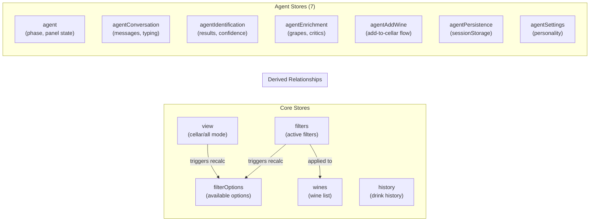
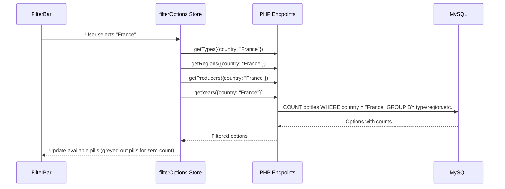
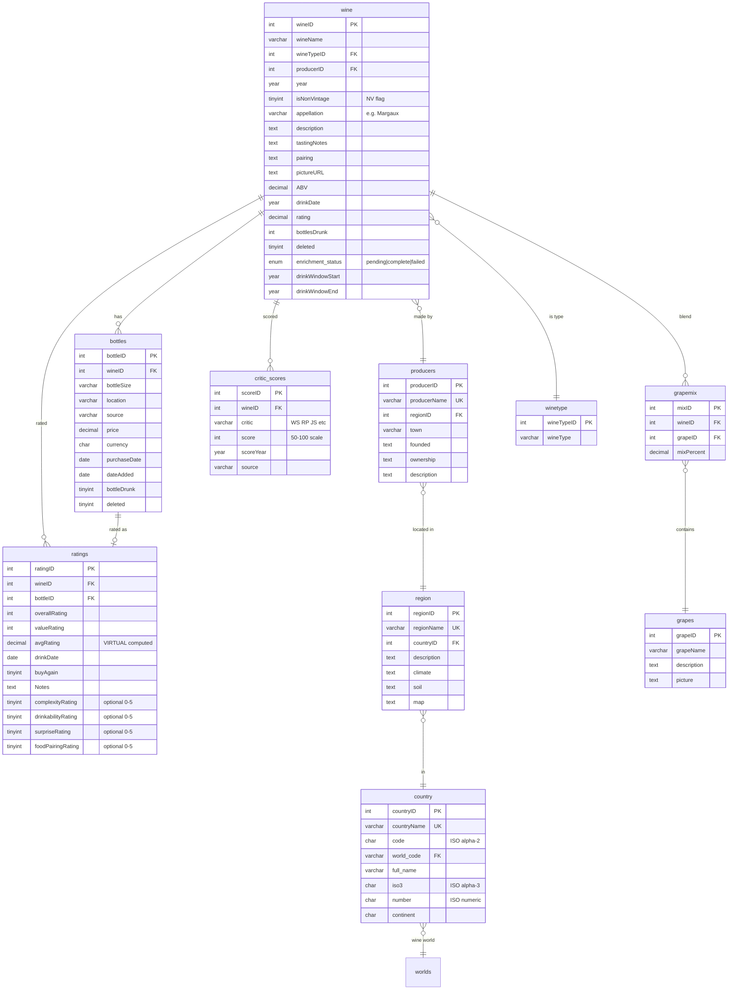
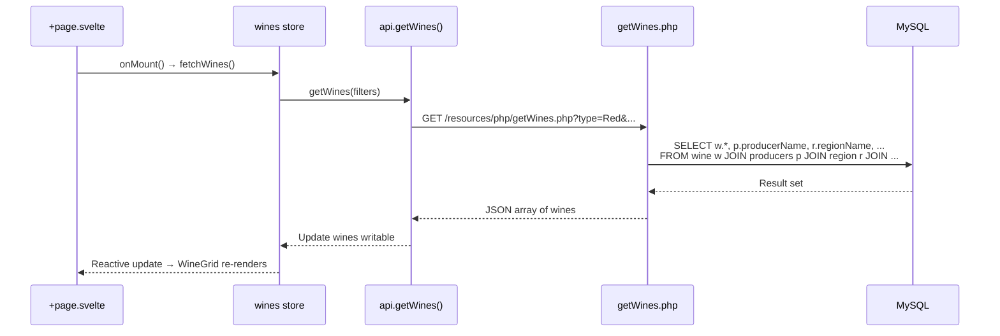
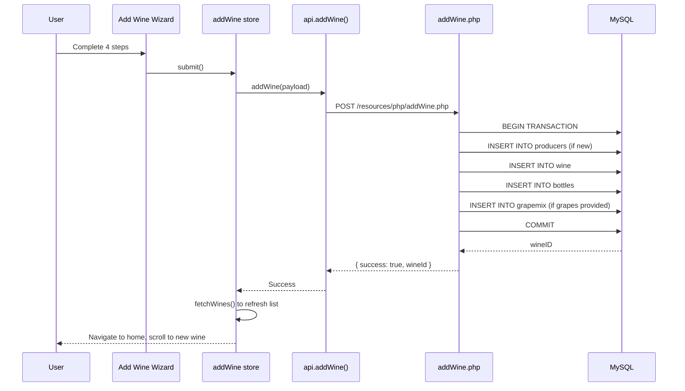
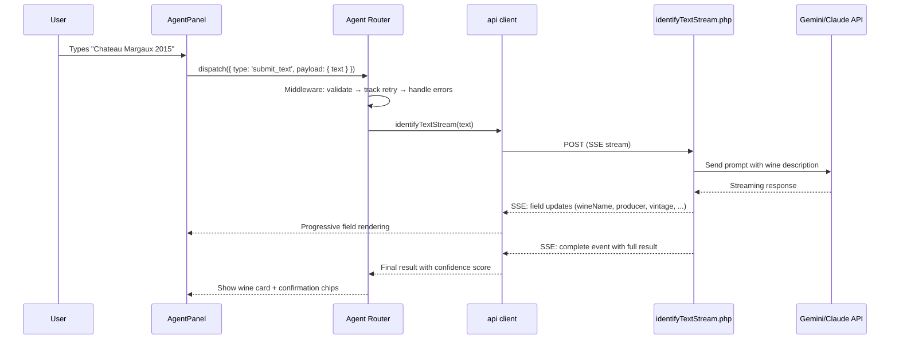
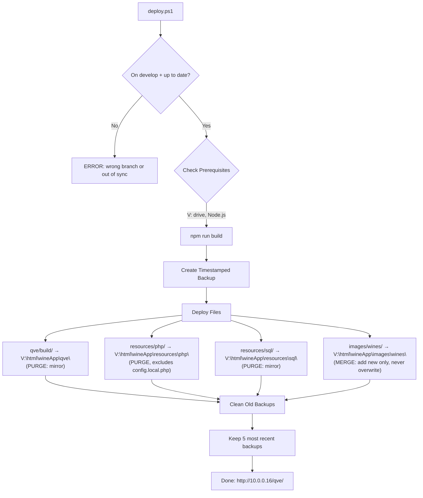

# System Architecture

> **Executive Summary**: Qvé is a personal wine collection manager built as a client-side SPA (SvelteKit 2 with static adapter) backed by a PHP REST API and MySQL database. The frontend runs entirely in the browser as a PWA, communicating with PHP endpoints via Vite dev-server proxy (development) or directly (production). An AI-powered "Agent" subsystem handles wine identification and enrichment through external LLM services. The app deploys to a self-hosted server via a PowerShell script with backup/rollback support.

---

## 1. High-Level Architecture

The system is composed of three tiers: a browser-based SPA, a PHP API layer, and a MySQL database. An external LLM service (Gemini/Claude) is consumed by the PHP backend for AI features.

```mermaid
graph TB
    subgraph Browser["Browser (PWA)"]
        SvelteKit["SvelteKit 2 SPA<br/>(Static Adapter, CSR only)"]
        SW["Service Worker<br/>(Workbox)"]
    end

    subgraph DevProxy["Vite Dev Server :5173"]
        Proxy["/resources/php → :8000<br/>/images → :8000"]
    end

    subgraph Backend["PHP Backend :8000"]
        CRUD["CRUD Endpoints<br/>(getWines, addWine, etc.)"]
        Agent["Agent Endpoints<br/>(identify, enrich, clarify)"]
        Upload["Image Upload<br/>(upload.php)"]
    end

    subgraph External["External Services"]
        LLM["LLM APIs<br/>(Gemini, Claude)"]
    end

    subgraph Data["MySQL 8 (10.0.0.16)"]
        DB["winelist database<br/>28 tables + 3 views"]
    end

    SvelteKit -->|fetch()| Proxy
    Proxy -->|proxy| CRUD
    Proxy -->|proxy| Agent
    Proxy -->|proxy| Upload
    CRUD --> DB
    Agent --> DB
    Agent --> LLM
    Upload -->|saves to| ImgDir["images/wines/"]
    SW -.->|cache| SvelteKit
```

**In production**, the Vite proxy is absent. The SvelteKit build output and PHP files are served from the same host (`V:\html\wineApp`), so the browser fetches `/resources/php/*` directly.

---

## 2. Frontend Architecture

### 2.1 Technology Stack

| Layer | Technology | Version |
|-------|-----------|---------|
| Framework | SvelteKit | 2.x |
| UI Library | Svelte | 5.x |
| Build Tool | Vite | 5.x |
| Adapter | `@sveltejs/adapter-static` | 3.x |
| PWA | `@vite-pwa/sveltekit` (Workbox) | 0.6.x |
| Testing | Vitest + Testing Library | 4.x |
| UI Components | bits-ui | 1.x |
| Language | TypeScript | 5.x |

### 2.2 SvelteKit Configuration

The app runs as a **pure client-side SPA** with no server-side rendering:

- **`ssr = false`** and **`prerender = true`** in `+layout.ts` -- all rendering happens in the browser
- **Static adapter** outputs to `qve/build/` with `fallback: 'index.html'` for SPA routing
- **Base path**: `/qve` -- all routes are prefixed (e.g., `/qve/`, `/qve/history`)
- **Path aliases**: `$api`, `$stores`, `$styles`, `$components`, `$utils` for clean imports

### 2.3 Directory Structure

```
qve/src/
├── app.html                    # HTML shell
├── app.d.ts                    # Global type declarations
├── test-setup.ts               # Vitest setup
├── lib/
│   ├── api/                    # API client layer
│   │   ├── client.ts           #   WineApiClient class (all backend calls)
│   │   ├── types.ts            #   Request/response TypeScript types
│   │   └── index.ts            #   Barrel export
│   ├── agent/                  # Agent subsystem (see Section 5)
│   │   ├── handlers/           #   Action handlers (identification, enrichment, addWine, etc.)
│   │   ├── messages/           #   Personality message templates
│   │   ├── middleware/         #   Error handling, retry tracking, validation
│   │   ├── services/           #   Chip generation, result analysis
│   │   ├── router.ts           #   Action dispatch with middleware pipeline
│   │   ├── stateMachine.ts     #   Phase transition validation
│   │   ├── types.ts            #   Agent action and state types
│   │   └── ...                 #   messageKeys, personalities, messages, etc.
│   ├── components/             # ~86 Svelte components organized by domain
│   │   ├── ui/                 #   10 generic UI (Icon, Toast, ThemeToggle, CurrencySelector, etc.)
│   │   ├── wine/               #   5 wine display (WineCard, WineGrid, HistoryCard, etc.)
│   │   ├── layout/             #   10 layout (Header, FilterBar, SideMenu, CollectionRow, etc.)
│   │   ├── forms/              #   8 form primitives (FormInput, RatingDots, ToggleSwitch, etc.)
│   │   ├── wizard/             #   8 add-wine wizard (WizardStepIndicator, SearchDropdown, etc.)
│   │   ├── modals/             #   8 modals (DrinkRateModal, SettingsModal, ConfirmModal, etc.)
│   │   ├── edit/               #   3 edit page (WineForm, BottleForm, BottleSelector)
│   │   ├── agent/              #   ~34 agent panel components (see Section 5)
│   │   └── index.ts            #   Barrel exports
│   ├── stores/                 # 24 Svelte stores (17 core + 7 agent)
│   │   ├── wines.ts            #   Wine list, loading, fetchWines()
│   │   ├── filters.ts          #   Active filter values
│   │   ├── filterOptions.ts    #   Available filter options (cascading)
│   │   ├── cellarSort.ts       #   Cellar sort configuration
│   │   ├── history.ts          #   Drink history
│   │   ├── view.ts             #   Cellar vs All Wines mode
│   │   ├── agent*.ts           #   7 agent stores (see Section 5)
│   │   ├── settings.ts         #   User settings (collection name, etc.)
│   │   └── ...                 #   theme, currency, toast, modal, menu, scroll, etc.
│   ├── utils/                  # Utility functions
│   │   └── commandDetector.ts  #   Agent command/chip detection
│   └── styles/                 # Global CSS
│       ├── tokens.css          #   Design tokens (colors, spacing, typography)
│       ├── base.css            #   Reset, utilities, iOS Safari fixes
│       ├── animations.css      #   Shared animations
│       └── index.css            #   Import aggregator
└── routes/                     # SvelteKit file-based routing
    ├── +layout.svelte          #   Root layout (theme, menu, toast, modal, agent)
    ├── +layout.ts              #   SPA mode config (ssr=false, prerender=true)
    ├── +page.svelte            #   Home / Cellar view
    ├── add/+page.svelte        #   4-step Add Wine wizard
    ├── history/+page.svelte    #   Drink history view
    ├── edit/[id]/+page.svelte  #   Edit wine/bottle (two-tab)
    └── drink/[id]/+page.svelte #   Drink/Rate flow
```

### 2.4 Routes

| Route | Description |
|-------|-------------|
| `/qve/` | Home view -- WineGrid with filters, cellar/all toggle |
| `/qve/add` | 4-step Add Wine wizard |
| `/qve/history` | Drink history with filtering and sorting |
| `/qve/edit/[id]` | Two-tab edit page (Wine details / Bottle details) |
| `/qve/drink/[id]` | Drink and rate a bottle |

### 2.5 State Management

All application state lives in Svelte stores (writable/derived). Stores follow a factory pattern, exporting both the store and action functions. No props drilling for cross-cutting state.



**Persistence**: Core stores are ephemeral (refetched on load). Agent stores persist to `sessionStorage` (messages, results, phase) and `localStorage` (panel open/close, personality setting).

### 2.6 PWA Configuration

The app is a Progressive Web App using Workbox via `@vite-pwa/sveltekit`:

- **Strategy**: `generateSW` with `autoUpdate` registration
- **Manifest**: `name: "Qvé Wine Collection"`, standalone display, scoped to `/qve/`
- **Precaching**: All static assets (`*.{js,css,html,ico,png,svg,woff2}`)
- **Runtime caching**:
  - Google Fonts: CacheFirst (365-day expiry)
  - API calls (`/resources/php/*`): NetworkFirst (5-minute cache, 50 entries max)
- **Icons**: 192px, 512px, and 512px-maskable variants

---

## 3. Backend Architecture

### 3.1 PHP API Layer

The backend is a set of standalone PHP scripts (no framework). Each file is a single endpoint accepting GET or POST requests and returning JSON. All endpoints share a database connection utility (`databaseConnection.php`) and input validation (`validators.php`).

```
resources/php/
├── databaseConnection.php      # PDO connection to MySQL
├── normalize.php               # String normalization utilities
├── validators.php              # Input validation utilities
│
├── getWines.php                # GET: Wine list with JOINs and filters
├── addWine.php                 # POST: 4-table transactional insert
├── updateWine.php              # POST: Update wine details
├── drinkBottle.php             # POST: Mark bottle drunk + add rating
├── addBottle.php               # POST: Add bottle to existing wine
├── updateBottle.php            # POST: Update bottle details
├── getBottles.php              # GET: Bottles for a wine
├── getDrunkWines.php           # GET: Drink history with ratings
├── upload.php                  # POST: Image upload (resized to 800x800)
├── checkDuplicate.php          # POST: Fuzzy duplicate detection
├── updateRating.php            # POST: Update existing rating
├── getCellarValue.php          # GET: Total cellar value calculation
├── audit_log.php               # Audit trail utilities
│
├── getCountries.php            # GET: Countries with bottle counts (cascading)
├── getTypes.php                # GET: Wine types with counts (cascading)
├── getRegions.php              # GET: Regions with counts (cascading)
├── getProducers.php            # GET: Producers with counts (cascading)
├── getYears.php                # GET: Vintages with counts (cascading)
├── getCurrencies.php           # GET: Currencies and bottle sizes
├── getUserSettings.php         # GET: User settings
├── updateUserSettings.php      # POST: Update user settings
├── geminiAPI.php               # POST: Legacy Gemini AI enrichment
│
└── agent/                      # Agent subsystem endpoints (see Section 5)
    ├── _bootstrap.php          #   Shared: agentResponse(), agentExceptionError()
    ├── identifyText.php        #   POST: Text-based wine identification
    ├── identifyImage.php       #   POST: Image-based wine identification
    ├── identifyTextStream.php  #   POST: Streaming text identification
    ├── identifyImageStream.php #   POST: Streaming image identification
    ├── identifyWithOpus.php    #   POST: Premium model escalation
    ├── agentEnrich.php         #   POST: Wine enrichment
    ├── agentEnrichStream.php   #   POST: Streaming enrichment
    ├── clarifyMatch.php        #   POST: Match disambiguation
    ├── config/                 #   Agent configuration
    ├── Identification/         #   10 service classes
    ├── Enrichment/             #   13 service classes
    ├── LLM/                    #   LLM client, adapters, circuit breaker
    └── prompts/                #   Central prompt registry (prompts.php)
```

### 3.2 Cascading Filters

The filter endpoints (`getCountries`, `getTypes`, `getRegions`, `getProducers`, `getYears`) accept the current filter state and return only options that have matching bottles. This creates a cascading filter experience where selecting "France" removes wine types with no French bottles from the Type filter.



### 3.3 Configuration

- **Database credentials**: `../wineapp-config/config.local.php` (outside repo, not committed)
- **Agent config**: `resources/php/agent/config/agent.config.php`
- **JIRA credentials**: `../wineapp-config/jira.config.json` (outside repo)

---

## 4. Database Schema

The database is MySQL 8 on host `10.0.0.16`, database name `winelist`. The schema has 28 tables and 3 analytics views organized into four groups: core wine collection, agent/AI, enrichment cache, and reference data.

### 4.1 Core Wine Collection (12 tables)



**Supporting core tables** (no FK relationships in diagram):

| Table | Purpose |
|-------|---------|
| `worlds` | Wine world classification (`Old World`, `New World`, `Other World`) |
| `currencies` | 11 ISO 4217 currencies with EUR conversion rates |
| `bottle_sizes` | 12 standard sizes (Piccolo 187.5ml to Nebuchadnezzar 15L) |
| `user_settings` | Key-value store for user preferences |
| `audit_log` | Tracks INSERT/UPDATE/DELETE with old/new values |

### 4.2 Agent & AI Tables (7 tables)

Track AI agent sessions, usage, costs, and identification analytics.

| Table | Purpose | Key Columns |
|-------|---------|-------------|
| `agentUsers` | User accounts (future multi-user) | `id`, `displayName`, `email`, `preferences` (JSON) |
| `agentSessions` | Active agent sessions | `sessionToken`, `state` (idle/identifying/enriching/...), `contextData` (JSON) |
| `agentUsageLog` | Per-LLM-call tracking | `provider`, `model`, `taskType`, `inputTokens`, `outputTokens`, `costUSD`, `latencyMs` |
| `agentUsageDaily` | Aggregated daily usage | `date`, `provider`, `requestCount`, `totalCostUSD` |
| `agentIdentificationResults` | Per-identification analytics | `inputType`, `finalConfidence` (0-100), `finalTier`, tier-level confidence/model, `totalCostUSD` |
| `agentUserTasteProfile` | User taste preferences | `preferredTypes` (JSON), `preferredCountries` (JSON), `priceRange` |
| `agentWineEmbeddings` | Wine vector embeddings | `wineId` FK, `embedding` (JSON 1536-dim), `embeddingModel` |

**FK relationships**: `agentSessions.userId` → `agentUsers.id`, `agentUserTasteProfile.userId` → `agentUsers.id`

### 4.3 Enrichment Cache Tables (3 tables)

Cache AI enrichment results with TTL-based staleness tracking.

| Table | Purpose | Key Columns |
|-------|---------|-------------|
| `cacheWineEnrichment` | Cached enrichment data per wine | `lookupKey` (producer\|name\|vintage), grapes/critics/drink window/style profile (JSON), TTL timestamps |
| `cacheProducers` | Cached producer metadata | `normalizedName`, `country`, `region`, `winemaker`, `certifications` (JSON), TTL timestamps |
| `cacheCanonicalAliases` | Maps name variants to canonical cache keys | `aliasKey` → `canonicalKey`, `aliasType` (abbreviation/variant/fuzzy), `hitCount` |

### 4.4 Reference Data Tables (6 tables)

Static/semi-static lookup tables for the AI agent's wine knowledge base.

| Table | Purpose | Key Columns |
|-------|---------|-------------|
| `refAbbreviations` | Wine abbreviation expansions (23 entries) | `abbreviation` → `expansion`, `context` (producer/wine/both), `priority` |
| `refAppellations` | Wine appellations with hierarchy | `appellationName`, `country`, `region`, `classificationLevel`, `parentAppellation` (self-FK) |
| `refGrapeCharacteristics` | Grape variety profiles (~50 entries) | `grapeName`, `color`, `body`, `tannin`, `acidity`, `primaryFlavors` (JSON) |
| `refWineStyles` | Wine style definitions | `styleName`, `wineType`, `characteristics` (JSON), `typicalGrapes` (JSON) |
| `refPairingRules` | Food-wine pairing rules | `foodCategory`/`foodItem`, `wineTypes` (JSON), `grapeVarieties` (JSON), `specificity` (1-5) |
| `refIntensityProfiles` | Intensity profiles for pairing algorithm | `entityType` (food/wine/grape/style), `weight`, `richness`, `acidityNeed` |

### 4.5 Analytics Views (3 views)

| View | Purpose |
|------|---------|
| `vw_model_confidence_stats` | Confidence stats grouped by tier and input type |
| `vw_tier_escalation_analysis` | Daily tier escalation trends and costs |
| `vw_model_comparison` | Model performance comparison across tiers |

See `resources/sql/ANALYTICS_QUERIES.md` for ad-hoc query reference.

### 4.6 SQL Files

```
resources/sql/
├── Full_DB_Structure.sql     # Canonical schema (all 28 tables, 3 views, indexes, FKs)
├── ANALYTICS_QUERIES.md      # Ad-hoc analytics query reference
├── seed/
│   └── agent_seed_data.sql   # Reference data: grape characteristics, pairing rules, etc.
└── archive/                  # Historical schemas and applied migrations (reference only)
```

---

## 5. Agent Subsystem (Black Box Overview)

The Agent is an AI-powered wine identification and enrichment assistant that operates as a conversational panel overlaying the main app. This section documents its external interfaces only; for internal architecture, see `docs/AGENT_ARCHITECTURE.md`.

### 5.1 What the Agent Does

1. **Wine Identification** -- User provides text description or photo; agent identifies the wine via LLM
2. **Wine Enrichment** -- Fetches additional data (grape composition, critic scores, drink window, tasting notes)
3. **Add to Cellar** -- Guides user through entity matching (region/producer/wine) and bottle details to add wine to database

### 5.2 External Interfaces

**Frontend entry points**:
- `AgentBubble.svelte` -- Floating button to open/close the agent panel
- `AgentPanel.svelte` -- Full conversational panel with message list and input area
- Both mounted in root `+layout.svelte`, available on every page

**API endpoints consumed** (all under `/resources/php/agent/`):

| Endpoint | Method | Input | Output |
|----------|--------|-------|--------|
| `identifyText.php` | POST | `{ text }` | `{ success, result: AgentIdentificationResult }` |
| `identifyImage.php` | POST | `{ image (base64) }` | `{ success, result: AgentIdentificationResult }` |
| `identifyTextStream.php` | POST | `{ text }` | SSE stream of field updates |
| `identifyImageStream.php` | POST | `{ image }` | SSE stream of field updates |
| `identifyWithOpus.php` | POST | `{ text/image, context }` | Premium model identification |
| `agentEnrich.php` | POST | `{ producer, wineName }` | `{ success, enrichment: AgentEnrichmentResult }` |
| `agentEnrichStream.php` | POST | `{ producer, wineName }` | SSE stream of enrichment data |
| `clarifyMatch.php` | POST | `{ query, candidates }` | Disambiguation result |

**Stores** (7 agent-specific stores manage all agent state):
- `agent.ts`, `agentConversation.ts`, `agentIdentification.ts`, `agentEnrichment.ts`, `agentAddWine.ts`, `agentPersistence.ts`, `agentSettings.ts`

**Frontend components** (~34 Svelte files under `components/agent/`):
- `conversation/` -- Chat container, message list, input area, message routing
- `content/` -- Message type renderers (text, chips, image, error, form, enrichment, wine card)
- `cards/` -- Data display cards (wine, enrichment, data)
- `enrichment/` -- Enrichment detail sections (critics, grapes, drink window, style, tasting)
- `forms/` -- Agent-specific forms (bottle details, manual entry, match selection)
- `wine/` -- Wine detail sections (name, producer, confidence, details, metadata)

### 5.3 Agent Architecture (Internal)

The agent subsystem was rearchitected in Phase 2 from a monolithic handler into a modular system:

- **Router** (`router.ts`) -- Dispatches actions through a middleware pipeline
- **Handlers** (`handlers/`) -- Feature-based modules (identification, enrichment, addWine, conversation, forms, camera)
- **Middleware** (`middleware/`) -- Cross-cutting concerns (error handling, retry tracking, validation)
- **State Machine** (`stateMachine.ts`) -- Validates phase transitions
- **Message System** (`messages/`, `messageKeys.ts`, `personalities.ts`) -- Type-safe messages with personality variants

For full details, see `docs/AGENT_ARCHITECTURE.md`.

---

## 6. Data Flow Diagrams

### 6.1 Read Flow (Loading Wines)



### 6.2 Write Flow (Adding Wine via Wizard)



### 6.3 Agent Identification Flow



---

## 7. Vite Proxy Configuration

During development, the Vite dev server (port 5173) proxies two paths to the PHP backend (port 8000):

```typescript
// qve/vite.config.ts
server: {
  proxy: {
    '/resources/php': {
      target: 'http://localhost:8000',
      changeOrigin: true
    },
    '/images': {
      target: 'http://localhost:8000',
      changeOrigin: true
    }
  }
}
```

- `/resources/php/*` -- All API calls proxied to PHP's built-in server
- `/images/*` -- Wine images proxied to PHP server's image directory

In production, both paths are served from the same host, so no proxy is needed.

---

## 8. Deployment Pipeline

### Staging (deploy.ps1)

`deploy.ps1` deploys the `develop` branch to the staging server at `V:\html\wineApp`. It requires the `develop` branch to be checked out and up to date with `origin/develop` (use `-Force` to override).

Production deploys (main → prod) are handled by GitHub Actions.



**Key behaviors**:
- **Branch guard**: Must be on `develop`, synced with `origin/develop` (fetches before comparing)
- **Target**: `V:\html\wineApp` (network drive mapped to `\\10.0.0.10\www`)
- **Backup**: Timestamped copy before each deploy, stored at `V:\html\wineApp-backups/`
- **Retention**: Keeps 5 most recent backups, auto-cleans older ones
- **Image merge**: Wine images are additive only (never overwrites existing images)
- **Config protection**: `config.local.php` is never deployed (production has its own)
- **Rollback**: `deploy.ps1 -Rollback "2026-01-22_143022"` restores from any backup
- **Dry run**: `deploy.ps1 -DryRun` previews all changes without executing

**Staging environment**:
- Server: self-hosted at `10.0.0.16`
- Web server: serves static files and PHP
- Database: MySQL 8 on same host
- PHP version: 8.3.6
- URL: `http://10.0.0.16/qve/`

---

## 9. API Client Architecture

All backend communication flows through a single `WineApiClient` class (`qve/src/lib/api/client.ts`). This provides:

- Centralized error handling and response parsing
- Type-safe request/response interfaces (defined in `api/types.ts`)
- Consistent URL construction (base URL: `/resources/php/`)
- Support for both standard JSON responses and SSE streaming (for agent endpoints)

The client is instantiated as a singleton and exported as `api`:

```typescript
import { api } from '$lib/api';

// CRUD operations
const wines = await api.getWines({ type: 'Red', cellarOnly: true });
const result = await api.addWine(wineData);
await api.drinkBottle(bottleId, { rating: 8, notes: '...' });

// Agent operations (streaming)
await api.identifyTextStream(text, { onField, onComplete });
await api.enrichStream(producer, wineName, { onSection, onComplete });
```

---

## 10. Key Design Decisions

| Decision | Rationale |
|----------|-----------|
| **Static adapter (CSR-only SPA)** | Single-user app; no SEO requirements; simplifies hosting on existing PHP server |
| **PHP backend (no framework)** | Leverages existing server infrastructure; simple CRUD operations don't need framework overhead |
| **Svelte stores over props drilling** | Global state for cross-cutting concerns (filters, theme, agent); reduces component coupling |
| **Single API client class** | One place for all backend calls; consistent error handling; easy to mock in tests |
| **CSS custom properties for theming** | Light/dark theme toggle via `data-theme` attribute on `<html>`; design tokens in `tokens.css` |
| **File-based routing** | SvelteKit convention; 5 routes is manageable without custom routing |
| **Agent as overlay panel** | Available on every page without navigation; persists state across page changes |
| **sessionStorage for agent state** | Survives iOS Safari tab switches (e.g., switching to Camera app); cleared on tab close |
| **PowerShell deploy script** | Windows development environment; robocopy for efficient file sync; backup/rollback built in |
| **Cascading filters with counts** | Each filter shows only relevant options with bottle counts; prevents dead-end filter combinations |

---

## 11. Image Handling

Wine images follow a specific pipeline:

1. **Upload**: User selects image in Add Wine wizard or Agent panel
2. **Processing**: `upload.php` resizes to 800x800px maximum
3. **Storage**: Saved to `images/wines/` directory on server
4. **URL**: Stored as `pictureURL` in `wine` table (relative path)
5. **Serving**: Served directly by web server (proxied via `/images` in development)
6. **Deployment**: Images are merged (additive only) -- production images are never overwritten

---

## 12. Related Documentation

| Document | Content |
|----------|---------|
| `docs/AGENT_ARCHITECTURE.md` | Agent internals: router, middleware, handlers, state machine, message system |
| `docs/COMPONENTS.md` | Full component API reference with props and usage |
| `docs/STORES.md` | All store APIs with state shapes and actions |
| `docs/API.md` | Full API client method reference |
| `docs/DEVELOPMENT.md` | Extended development guide, testing, debugging |
| `docs/SOMMELIER_PERSONALITIES.md` | Agent personality configuration |
| `CLAUDE.md` | Session context for AI-assisted development |
