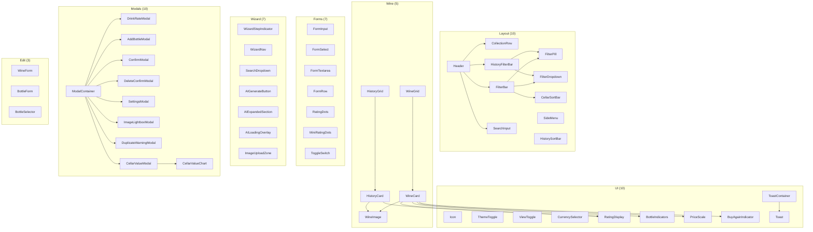

# Component Reference

> **96 Svelte components** organized into 8 categories, implementing a mobile-first wine collection UI with an AI-powered agent panel. All non-agent components are barrel-exported from `$lib/components`. Agent components are exported from `$lib/components/agent`.

---

## Component Hierarchy



---

## Import Patterns

Components follow two import patterns:

```typescript
// 1. Barrel import (most components)
import { Icon, WineCard, FormInput, ModalContainer } from '$lib/components';

// 2. Direct import (agent components or when avoiding circular deps)
import AgentPanel from '$lib/components/agent/AgentPanel.svelte';
import { AgentChatContainer, InputArea } from '$lib/components/agent/conversation';
```

---

## UI Components (`ui/`)

Atomic UI primitives used throughout the app. No business logic.

### Icon

SVG icon component. All icons are inline SVG paths within a single component.

```svelte
<Icon name="wine-bottle" size={24} />
<Icon name="sparkle" />
```

| Prop | Type | Default | Description |
|------|------|---------|-------------|
| `name` | `IconName` | required | Icon identifier |
| `size` | `number` | `18` | Pixel width/height |

**Available icons** (33): `sun`, `moon`, `grid`, `list`, `search`, `menu`, `chevron-down`, `chevron-left`, `chevron-right`, `plus`, `minus`, `edit`, `drink`, `wine-bottle`, `check`, `x`, `info`, `warning`, `close`, `calendar`, `arrow-up`, `arrow-down`, `history`, `settings`, `sparkle`, `bookmark`, `refresh`, `camera`, `gallery`, `trash`, `log-out`

Note: The `grid` icon uses `fill` instead of `stroke`.

### ThemeToggle

Toggle between light/dark themes. Uses the `theme` store internally.

```svelte
<ThemeToggle />
```

No props. Self-contained.

### ViewToggle

Toggle between compact and medium card density. Uses the `viewDensity` store internally.

```svelte
<ViewToggle />
```

No props. Self-contained.

### CurrencySelector

Currency dropdown bound to `displayCurrency` store. Fetches available currencies from the store.

```svelte
<CurrencySelector />
```

No props. Self-contained.

### RatingDisplay

Shows a colored dot + numeric rating, or "Unrated" placeholder. Optionally shows overall/value breakdown.

```svelte
<RatingDisplay rating={8.5} />
<RatingDisplay rating={7} showBreakdown overallRating={8} valueRating={6} />
<RatingDisplay rating={9} compact />
```

| Prop | Type | Default | Description |
|------|------|---------|-------------|
| `rating` | `number \| string \| null` | `null` | Rating value (0-10) |
| `compact` | `boolean` | `false` | Smaller font, hide breakdown |
| `showBreakdown` | `boolean` | `false` | Show overall/value split |
| `overallRating` | `number \| null` | `null` | Overall sub-rating |
| `valueRating` | `number \| null` | `null` | Value sub-rating |

### BottleIndicators

SVG bottle silhouettes grouped by size (small/standard/large). Uses pre-aggregated size counts from `getWines.php`. Falls back to text count in compact mode.

```svelte
<BottleIndicators
  count={wine.bottleCount}
  standardCount={Number(wine.standardBottles || 0)}
  smallCount={Number(wine.smallBottles || 0)}
  largeCount={Number(wine.largeBottles || 0)}
  compact={compact && !expanded}
/>
```

| Prop | Type | Default | Description |
|------|------|---------|-------------|
| `standardCount` | `number` | `0` | Standard (750ml) bottle count |
| `smallCount` | `number` | `0` | Small (Piccolo/Quarter/Demi) bottle count |
| `largeCount` | `number` | `0` | Large (Magnum+) bottle count |
| `count` | `number` | `0` | Fallback total if no size breakdown |
| `compact` | `boolean` | `false` | Show text count instead of SVGs |

### PriceScale

Shows $$$$$ indicator based on wine price relative to type average.

```svelte
<PriceScale
  avgPricePerLiterEUR={wine.avgPricePerLiterEUR}
  typeAvgPricePerLiterEUR={wine.typeAvgPricePerLiterEUR}
/>
```

| Prop | Type | Default | Description |
|------|------|---------|-------------|
| `avgPricePerLiterEUR` | `string \| null` | `null` | Wine's avg price per liter in EUR |
| `typeAvgPricePerLiterEUR` | `string \| null` | `null` | Type average for comparison |
| `compact` | `boolean` | `false` | Smaller display |

**Scale**: $=Budget (<0.5x), $$=Value (<0.8x), $$$=Average (<1.2x), $$$$=Premium (<1.8x), $$$$$=Luxury (>=1.8x)

### BuyAgainIndicator

Shows rebuy percentage with positive/negative color coding.

```svelte
<BuyAgainIndicator percent={75} ratingCount={4} />
```

| Prop | Type | Default | Description |
|------|------|---------|-------------|
| `percent` | `number \| null` | `null` | Buy-again percentage |
| `ratingCount` | `number` | `0` | Number of ratings (hides if 0) |
| `compact` | `boolean` | `false` | Hide "rebuy" label |

### Toast / ToastContainer

Toast notification system. `ToastContainer` renders all active toasts; individual `Toast` components handle display and auto-dismiss.

```svelte
<!-- In root layout -->
<ToastContainer />

<!-- Trigger from anywhere -->
import { toasts } from '$lib/stores';
toasts.success('Wine added!');
toasts.error('Failed to save');
toasts.undo('Bottle removed', undoCallback);
```

**Toast** accepts a single `toast: Toast` prop. Types: `success`, `error`, `info`, `warning`, `undo`.

---

## Wine Components (`wine/`)

Wine display cards with expand/collapse, rating, and action capabilities.

### WineCard

Primary wine display card. Expandable with hover/tap actions. Shows image, name, producer, region, ratings, bottle indicators, and price scale.

```svelte
<WineCard
  {wine}
  expanded={false}
  compact={false}
  targetHighlight={false}
  on:expand={handleExpand}
  on:collapse={handleCollapse}
  on:drink={handleDrink}
  on:add={handleAddBottle}
  on:edit={handleEdit}
/>
```

| Prop | Type | Default | Description |
|------|------|---------|-------------|
| `wine` | `Wine` | required | Wine data object |
| `expanded` | `boolean` | `false` | Whether card is expanded |
| `compact` | `boolean` | `false` | Compact view mode |
| `targetHighlight` | `boolean` | `false` | Highlight animation (scroll target) |

| Event | Detail | Description |
|-------|--------|-------------|
| `expand` | `{ wineID }` | User tapped/clicked to expand |
| `collapse` | `{ wineID }` | User tapped/clicked to collapse |
| `drink` | `{ wine }` | Drink button clicked |
| `add` | `{ wine }` | Add bottle button clicked |
| `edit` | `{ wine }` | Edit button clicked |

### WineGrid

Responsive grid container that manages WineCard layout and expansion state. Uses `viewDensity` store for column count and `expandedWineIDs` for multi-card expansion.

```svelte
<WineGrid {wines} on:drink on:add on:edit />
```

| Prop | Type | Default | Description |
|------|------|---------|-------------|
| `wines` | `Wine[]` | `[]` | Array of wines to display |

Events: Forwards `drink`, `add`, `edit` from WineCard.

**Responsive columns** (compact mode): 2 (default) -> 3 (560px) -> 4 (768px) -> 5 (992px) -> 6 (1200px)

### WineImage

Wine bottle image with graceful SVG placeholder fallback. Optionally clickable for lightbox.

```svelte
<WineImage src={wine.pictureURL} alt="Wine name" clickable />
```

| Prop | Type | Default | Description |
|------|------|---------|-------------|
| `src` | `string \| null` | `null` | Image URL |
| `alt` | `string` | `'Wine bottle'` | Alt text |
| `compact` | `boolean` | `false` | Smaller display |
| `clickable` | `boolean` | `false` | Enable click-to-lightbox |

### HistoryCard

Drink history card showing ratings, date, and wine details. Expandable with Add Bottle and Edit Rating actions.

```svelte
<HistoryCard
  {wine}
  expanded={false}
  compact={false}
  on:expand={handleExpand}
  on:collapse={handleCollapse}
  on:addBottle={handleAddBottle}
  on:editRating={handleEditRating}
/>
```

| Prop | Type | Default | Description |
|------|------|---------|-------------|
| `wine` | `DrunkWine` | required | Drunk wine record |
| `expanded` | `boolean` | `false` | Whether expanded |
| `compact` | `boolean` | `false` | Compact display |

### HistoryGrid

Responsive grid for HistoryCards. Manages single-card expansion via `expandedHistoryKey` store.

```svelte
<HistoryGrid {wines} on:addBottle on:editRating />
```

| Prop | Type | Default | Description |
|------|------|---------|-------------|
| `wines` | `DrunkWine[]` | `[]` | Array of drunk wines |

---

## Layout Components (`layout/`)

Header, navigation, and filter/sort infrastructure.

### Header

Fixed-position app header. Supports variants for different pages.

```svelte
<Header variant="cellar" showFilters filterType="cellar" />
<Header variant="add" showFilters={false} filterType="none" />
```

| Prop | Type | Default | Description |
|------|------|---------|-------------|
| `variant` | `'cellar' \| 'add' \| 'edit'` | `'cellar'` | Page variant |
| `showFilters` | `boolean` | `true` | Show filter bar |
| `filterType` | `'cellar' \| 'history' \| 'none'` | `'cellar'` | Which filter bar to render |

**Header structure:**
```
Header
  +-- header-top: Menu + Logo + Density Toggle + Search
  +-- CollectionRow: Title + View Toggle + Stats
  +-- FilterBar or HistoryFilterBar (based on filterType)
```

### CollectionRow

Displays page title, Cellar/All toggle, and stats (wine count, bottle count, cellar value).

```svelte
<CollectionRow
  title="Our Wines"
  showViewToggle
  wineCount={42}
  totalValue="~$12k"
/>
```

| Prop | Type | Default | Description |
|------|------|---------|-------------|
| `title` | `string` | `'Our Wines'` | Page title |
| `showViewToggle` | `boolean` | `true` | Show Cellar/All toggle |
| `wineCount` | `number` | `0` | Number of wines |
| `bottleCount` | `number \| undefined` | `undefined` | Bottle count (history pages) |
| `totalValue` | `string \| null` | `undefined` | Formatted cellar value |
| `unpricedCount` | `number` | `0` | Wines without prices |
| `isLoading` | `boolean` | `false` | Show loading state |

### SearchInput

Expandable inline search input with 300ms debounce. Renders as a search icon button that expands to a text input.

```svelte
<SearchInput bind:value={query} bind:expanded={isExpanded} on:search={handleSearch} on:clear={handleClear} />
```

| Prop | Type | Default | Description |
|------|------|---------|-------------|
| `value` | `string` | `''` | Search term (bound) |
| `expanded` | `boolean` | `false` | Whether input is expanded |

| Event | Detail | Description |
|-------|--------|-------------|
| `search` | `string` | Debounced search value |
| `expand` | `void` | Input expanded |
| `collapse` | `void` | Input collapsed |
| `clear` | `void` | Search cleared |

### FilterBar

Horizontal scrollable filter pills with sort controls on the right. Manages 5 filter dropdowns (Country, Type, Region, Producer, Vintage) and cellar sort options.

```svelte
<FilterBar />
```

No props. Reads filter state from `filters`, `filterOptions`, `cellarSortKey`, `cellarSortDir` stores.

### HistoryFilterBar

Filter controls for the history page with sort controls. Uses client-side filtering via `historyFilters` store.

```svelte
<HistoryFilterBar />
```

No props. Reads from `historyFilters`, `historySortKey`, `historySortDir`, `drunkWines` stores.

### FilterPill

Individual filter button with active/expanded state styling. Implements touch-vs-scroll detection for iOS.

```svelte
<FilterPill label="Red" active on:click={toggle} />
```

| Prop | Type | Default | Description |
|------|------|---------|-------------|
| `label` | `string` | required | Display text |
| `active` | `boolean` | `false` | Active/selected state |
| `hasDropdown` | `boolean` | `false` | Show dropdown chevron |
| `disabled` | `boolean` | `false` | Disable interaction |
| `expanded` | `boolean` | `false` | Dropdown is open |

### FilterDropdown

Dropdown menu for filter options. Uses portal pattern (mounts to `document.body`) to escape header stacking context on iOS. Auto-adjusts position to stay within viewport.

```svelte
<FilterDropdown
  items={typeOptions}
  selectedValue="Red"
  label="Type"
  position={{ top: 100, left: 50 }}
  on:select={handleSelect}
  on:clear={handleClear}
  on:close={handleClose}
/>
```

| Prop | Type | Default | Description |
|------|------|---------|-------------|
| `items` | `FilterOption[]` | `[]` | Dropdown options |
| `loading` | `boolean` | `false` | Show loading state |
| `selectedValue` | `string \| undefined` | `undefined` | Currently selected value |
| `label` | `string` | `'Filter'` | Filter name |
| `position` | `{ top, left }` | `{ top: 0, left: 0 }` | Anchor position |

### CellarSortBar

Sort controls for the cellar/home page with a dropdown for sort key and direction toggle.

```svelte
<CellarSortBar />
```

No props. Uses `cellarSortKey`, `cellarSortDir` stores.

**Sort keys** (12): producer, wineName, country, region, year, type, rating, ratingOverall, ratingValue, bottles, price, priceBottle

### HistorySortBar

Sort controls for the history page.

```svelte
<HistorySortBar />
```

No props. Uses `historySortKey`, `historySortDir` stores.

**Sort keys** (12): drinkDate, rating, overallRating, valueRating, wineName, wineType, country, producer, region, year, price, buyAgain

### SideMenu

Slide-out navigation drawer with backdrop overlay. Items: Cellar, All Wines, Add Wine, History, Settings, Log Out.

```svelte
<SideMenu open={$menuOpen} on:close={closeMenu} />
```

| Prop | Type | Default | Description |
|------|------|---------|-------------|
| `open` | `boolean` | `false` | Whether menu is visible |

**Two-phase close (WIN-276)**: Same pattern as ModalContainer — opacity fade (250ms) then DOM removal to prevent iOS repaint flash.

---

## Form Components (`forms/`)

Reusable form inputs following the design system. All support `bind:value` for two-way binding.

### FormInput

Text input with label, validation error display, and multiple type support.

```svelte
<FormInput bind:value={name} label="Wine Name" required error={errors.name} />
<FormInput bind:value={year} label="Year" type="number" />
```

| Prop | Type | Default | Description |
|------|------|---------|-------------|
| `label` | `string` | `''` | Field label |
| `name` | `string` | `''` | Input name attribute |
| `value` | `string` | `''` | Bound value |
| `placeholder` | `string` | `''` | Placeholder text |
| `type` | `'text' \| 'number' \| 'date' \| 'email' \| 'tel'` | `'text'` | Input type |
| `required` | `boolean` | `false` | Show required indicator |
| `disabled` | `boolean` | `false` | Disable input |
| `error` | `string` | `''` | Validation error message |
| `id` | `string` | auto-generated | HTML id |

Events: `input`, `change`, `blur`

### FormSelect

Dropdown select with options array.

```svelte
<FormSelect bind:value={type} options={typeOptions} label="Wine Type" />
```

| Prop | Type | Default | Description |
|------|------|---------|-------------|
| `label` | `string` | `''` | Field label |
| `name` | `string` | `''` | Select name |
| `value` | `string` | `''` | Bound value |
| `required` | `boolean` | `false` | Required indicator |
| `disabled` | `boolean` | `false` | Disable select |
| `error` | `string` | `''` | Validation error |
| `options` | `{ value, label }[]` | `[]` | Available options |
| `placeholder` | `string` | `'Select...'` | Default placeholder |
| `id` | `string` | auto-generated | HTML id |

Events: `change`, `blur`

### FormTextarea

Multi-line text input with auto-grow support.

```svelte
<FormTextarea bind:value={notes} label="Tasting Notes" rows={4} />
```

| Prop | Type | Default | Description |
|------|------|---------|-------------|
| `label` | `string` | `''` | Field label |
| `name` | `string` | `''` | Textarea name |
| `value` | `string` | `''` | Bound value |
| `placeholder` | `string` | `''` | Placeholder text |
| `required` | `boolean` | `false` | Required indicator |
| `disabled` | `boolean` | `false` | Disable input |
| `error` | `string` | `''` | Validation error |
| `rows` | `number` | `4` | Initial row count |
| `autoGrow` | `boolean` | `true` | Auto-expand with content |
| `id` | `string` | auto-generated | HTML id |

### FormRow

Horizontal flex layout for placing form fields side-by-side.

```svelte
<FormRow>
  <FormInput bind:value={price} label="Price" />
  <FormSelect bind:value={currency} options={currencies} label="Currency" />
</FormRow>
```

No props. Slot-based layout.

### RatingDots

10-dot interactive rating input for main ratings (Overall/Value).

```svelte
<RatingDots label="Overall" icon="wine-emoji" value={8} variant="wine" on:change={handleChange} />
```

| Prop | Type | Default | Description |
|------|------|---------|-------------|
| `label` | `string` | `'Rating'` | Rating label |
| `icon` | `string` | `'wine-emoji'` | Label icon |
| `value` | `number` | `0` | Current value (0-10) |
| `variant` | `'wine' \| 'value'` | `'wine'` | Color variant |

Event: `change` (detail: number)

### MiniRatingDots

5-dot rating input for optional ratings (smaller, muted styling).

```svelte
<MiniRatingDots label="Complexity" icon="theater-emoji" value={3} on:change={handleChange} />
```

| Prop | Type | Default | Description |
|------|------|---------|-------------|
| `label` | `string` | `'Rating'` | Rating label |
| `icon` | `string` | `'theater-emoji'` | Label icon |
| `value` | `number` | `0` | Current value (0-5) |
| `maxDots` | `number` | `5` | Number of dots |
| `disabled` | `boolean` | `false` | Disable interaction |

Event: `change` (detail: number)

### ToggleSwitch

Pill-shaped boolean toggle switch.

```svelte
<ToggleSwitch checked={buyAgain} label="Would buy again" on:change={handleChange} />
```

| Prop | Type | Default | Description |
|------|------|---------|-------------|
| `checked` | `boolean` | `false` | Current state |
| `label` | `string` | `''` | Display label |
| `disabled` | `boolean` | `false` | Disable toggle |
| `id` | `string` | auto-generated | HTML id |

Event: `change` (detail: boolean)

---

## Wizard Components (`wizard/`)

Multi-step form wizard infrastructure used by the Add Wine flow.

### WizardStepIndicator

Step progress dots showing current position in the 4-step wizard.

```svelte
<WizardStepIndicator steps={4} currentStep={2} />
```

### WizardNav

Previous/Next navigation buttons with step validation.

```svelte
<WizardNav {currentStep} {totalSteps} canProceed={isValid} on:prev on:next />
```

### SearchDropdown

Searchable dropdown for entity selection (region, producer, wine). Supports create-new option.

```svelte
<SearchDropdown
  placeholder="Search regions..."
  bind:value={searchTerm}
  items={regionOptions}
  loading={false}
  selectedItem={null}
  createNewLabel="+ Add new..."
  on:search={handleSearch}
  on:select={handleSelect}
  on:createNew={handleCreateNew}
  on:clear={handleClear}
/>
```

| Prop | Type | Default | Description |
|------|------|---------|-------------|
| `placeholder` | `string` | `'Search...'` | Input placeholder |
| `value` | `string` | `''` | Search term (bound) |
| `items` | `T[]` | `[]` | Search results (generic, must have `id`, `name`) |
| `loading` | `boolean` | `false` | Loading indicator |
| `disabled` | `boolean` | `false` | Disable input |
| `selectedItem` | `T \| null` | `null` | Currently selected item |
| `createNewLabel` | `string` | `'+ Add new...'` | Create-new button text |

### AIGenerateButton

Button to trigger AI data generation (enrichment).

```svelte
<AIGenerateButton on:click={generateWithAI} loading={isGenerating} />
```

### AIExpandedSection

Expandable section for AI-generated content with slot.

```svelte
<AIExpandedSection expanded={showAI}>
  <!-- AI content -->
</AIExpandedSection>
```

### AILoadingOverlay

Wine-themed loading animation overlay.

```svelte
<AILoadingOverlay />
```

### ImageUploadZone

Drag-and-drop image upload with preview and validation.

```svelte
<ImageUploadZone
  imagePreview={previewUrl}
  fileName="wine.jpg"
  accept="image/jpeg,image/png,image/gif,image/webp"
  maxSizeMB={10}
  label="Wine Image"
  on:select={handleFileSelect}
  on:clear={handleClear}
  on:error={handleError}
/>
```

| Prop | Type | Default | Description |
|------|------|---------|-------------|
| `imagePreview` | `string \| null` | `null` | Preview image URL |
| `fileName` | `string \| null` | `null` | Selected file name |
| `disabled` | `boolean` | `false` | Disable upload |
| `accept` | `string` | `'image/jpeg,...'` | Accepted MIME types |
| `maxSizeMB` | `number` | `10` | Max file size in MB |
| `label` | `string` | `'Wine Image'` | Label text |
| `required` | `boolean` | `false` | Required indicator |
| `error` | `string` | `''` | Error message |

---

## Modal Components (`modals/`)

Global modal system managed by the `modal` store. All modals render inside `ModalContainer`.

### ModalContainer

Global modal renderer. Add once to `+layout.svelte`. Routes to the correct modal based on `$modal.type`.

```svelte
<ModalContainer />
```

Renders: DrinkRateModal, AddBottleModal, ConfirmModal, SettingsModal, ImageLightboxModal, plus stacked ConfirmOverlay for dirty checks.

**Two-phase close (WIN-276)**: Wrapper div fades to `opacity: 0` via CSS transition (250ms), THEN Svelte destroys the DOM. Prevents iOS mobile GPU repaint flash when fixed-position elements are removed. Wrapper uses `position: fixed; inset: 0; z-index: 1100; pointer-events: none` (children get `pointer-events: auto` when not closing).

### DrinkRateModal

Rate a wine bottle (or edit an existing rating).

```svelte
<!-- Opened via store -->
modal.openDrink(wine);          // New rating
modal.openEditRating(drunkWine); // Edit existing
```

| Prop | Type | Default | Description |
|------|------|---------|-------------|
| `wine` | `Wine \| undefined` | `undefined` | Wine to rate (new) |
| `drunkWine` | `DrunkWine \| undefined` | `undefined` | Rating to edit |
| `isEdit` | `boolean` | `false` | Edit mode flag |

Registers a `beforeCloseHook` for dirty checking (stacked confirmation overlay).

### AddBottleModal

Add bottles to an existing wine.

```svelte
<!-- Opened via store -->
modal.openAddBottle(wineID, wineName, pictureURL, year, regionName, countryName);
```

| Prop | Type | Default | Description |
|------|------|---------|-------------|
| `wineID` | `number` | required | Wine to add to |
| `wineName` | `string` | required | Wine name for display |
| `pictureURL` | `string \| null` | `null` | Wine image |
| `year` | `string \| null` | `null` | Vintage |
| `regionName` | `string \| undefined` | `undefined` | Region for display |
| `countryName` | `string \| undefined` | `undefined` | Country for display |

### ConfirmModal

Confirmation dialog with customizable labels and danger variant.

```svelte
<!-- Opened via store -->
modal.confirm({
  title: 'Discard changes?',
  message: 'You have unsaved changes.',
  confirmLabel: 'Discard',
  cancelLabel: 'Keep editing',
  variant: 'danger',
  onConfirm: () => { ... },
  onCancel: () => { ... }
});
```

| Prop | Type | Default | Description |
|------|------|---------|-------------|
| `title` | `string` | `'Are you sure?'` | Dialog title |
| `message` | `string` | `''` | Dialog body |
| `confirmLabel` | `string` | `'Confirm'` | Confirm button text |
| `cancelLabel` | `string` | `'Cancel'` | Cancel button text |
| `variant` | `'default' \| 'danger'` | `'default'` | Visual variant |

### SettingsModal

App settings: theme toggle, view density, currency selector, collection name input (debounced save).

```svelte
<!-- Opened via store -->
modal.openSettings();
```

### DuplicateWarningModal

Shows warning during Add Wine wizard when similar wines/regions/producers exist. Offers "Use Existing", "Create New", or "Add Another Bottle" options.

```svelte
<DuplicateWarningModal
  warning={duplicateWarning}
  on:useExisting={handleUseExisting}
  on:createNew={handleCreateNew}
  on:addBottle={handleAddBottle}
  on:cancel={handleCancel}
/>
```

| Prop | Type | Default | Description |
|------|------|---------|-------------|
| `warning` | `DuplicateWarning` | required | Duplicate check result |

### DeleteConfirmModal

Confirmation dialog for soft delete with cascade impact preview. Fetches impact data on mount to show what will be affected (bottles, ratings, etc.).

```svelte
<!-- Opened via store -->
modal.open('deleteConfirm', { entityType: 'wine', entityId: 123, entityName: 'Château Margaux 2015' });
```

| Prop | Type | Default | Description |
|------|------|---------|-------------|
| `entityType` | `DeleteEntityType` | required | `'wine' \| 'bottle' \| 'producer' \| 'region'` |
| `entityId` | `number` | required | ID of entity to delete |
| `entityName` | `string` | required | Display name for confirmation |

| Event | Detail | Description |
|-------|--------|-------------|
| `confirm` | `{ type, id, name }` | User confirmed deletion |
| `cancel` | `void` | User cancelled |

### ImageLightboxModal

Fullscreen image viewer with dark backdrop. Closes on backdrop click or Escape.

```svelte
<!-- Opened via store -->
modal.openImageLightbox('/path/to/image.jpg', 'Wine name 2019');
```

| Prop | Type | Default | Description |
|------|------|---------|-------------|
| `src` | `string` | required | Image URL |
| `alt` | `string` | `'Wine image'` | Alt text |

### CellarValueModal

Self-fetching modal showing cellar value over time. Bottom-sheet on mobile, centered card on desktop. Fetches cellar value history from API on mount.

```svelte
<!-- Opened via store -->
modal.open('cellarValue');
```

No props. Self-fetching. Renders `CellarValueChart` internally with time range controls (All, 1Y, 6M, 3M).

### CellarValueChart

Pure SVG chart component: Catmull-Rom spline line, gradient fill, axes, tooltip, and line-draw animation. Purely presentational.

```svelte
<CellarValueChart {data} {currencySymbol} {formatValue} />
```

| Prop | Type | Default | Description |
|------|------|---------|-------------|
| `data` | `{ date, displayValue, bottleCount }[]` | required | Chart data points |
| `currencySymbol` | `string` | required | Currency symbol for axis labels |
| `formatValue` | `(v: number) => string` | required | Value formatter |

---

## Edit Components (`edit/`)

Form components for the Edit Wine page (two-tab: Wine details / Bottle details).

### WineForm

Wine details editing form (name, year, type, description, tasting notes, pairing, image).

```svelte
<WineForm />
```

Reads/writes via `editWine` store.

### BottleForm

Bottle details editing form (size, location, source, price, currency, purchase date).

```svelte
<BottleForm />
```

Reads/writes via `editWine` store.

### BottleSelector

Pill-based bottle selection for choosing which bottle to edit.

```svelte
<BottleSelector />
```

Reads bottles from `editWine` store.

---

## Agent Components (`agent/`)

AI Wine Assistant components organized into 6 subdirectories. These implement the conversational wine identification, enrichment, and add-to-cellar flow.

> For detailed agent architecture, see `docs/AGENT_ARCHITECTURE.md`.

### Top-Level Agent Components

| Component | Description |
|-----------|-------------|
| `AgentPanel` | Main panel container; manages open/close state, session lifecycle |
| `AgentBubble` | Floating action button to open the agent panel |
| `ConfidenceIndicator` | Visual confidence bar/badge for identification results |
| `DisambiguationList` | List for choosing between multiple wine matches |
| `AgentLoadingState` | Loading skeleton for agent initialization |
| `TypingIndicator` | Animated typing dots |
| `CandidateMiniCards` | Mini wine cards for disambiguation |
| `FieldTypewriter` | Typewriter animation for streaming field values |
| `TypewriterText` | Text with typewriter reveal animation |

### Conversation Components (`agent/conversation/`)

| Component | Description |
|-----------|-------------|
| `AgentChatContainer` | Scroll container with auto-scroll management |
| `MessageList` | Renders messages array with stagger animations |
| `MessageWrapper` | Individual message wrapper (alignment, avatar, animations) |
| `MessageContent` | Routes messages to category-specific content components |
| `InputArea` | Unified text/image input with phase-aware placeholders |

### Content Components (`agent/content/`)

| Component | Description |
|-----------|-------------|
| `TextMessage` | Plain text message rendering |
| `ChipsMessage` | Interactive chip/button options |
| `WineCardMessage` | Wine identification result card |
| `EnrichmentMessage` | Wine enrichment data display |
| `FormMessage` | Embedded forms (bottle details, manual entry, match selection) |
| `ErrorMessage` | Error display with retry/start-over chips |
| `ImageMessage` | User-uploaded wine image display |
| `TypingIndicatorMessage` | Animated typing indicator (wine glass animation) |

### Card Components (`agent/cards/`)

| Component | Description |
|-----------|-------------|
| `WineCard` | Wine identification result card with streaming support |
| `DataCard` | Generic data display card |
| `EnrichmentCard` | Enrichment card supporting skeleton and static states, updated in-place during streaming |

### Enrichment Components (`agent/enrichment/`)
| `OverviewSection` | Wine overview text |
| `GrapeComposition` / `GrapeCompositionSection` | Grape variety breakdown |
| `TastingNotesSection` | Tasting notes display |
| `CriticScores` / `CriticScoresSection` | Critic score badges |
| `DrinkWindow` / `DrinkWindowSection` | Optimal drinking window display |
| `FoodPairingsSection` | Food pairing suggestions |
| `StyleProfileDisplay` / `StyleProfileSection` | Wine style profile radar/display |

### Form Components (`agent/forms/`)

| Component | Description |
|-----------|-------------|
| `BottleDetailsForm` | Bottle details form for add-to-cellar flow |
| `ManualEntryForm` | Manual wine data entry form |
| `MatchSelectionList` | Entity match selection (region/producer/wine) |

### Wine Detail Components (`agent/wine/`)

| Component | Description |
|-----------|-------------|
| `WineNameSection` | Wine name display with streaming |
| `WineProducerSection` | Producer name and details |
| `WineDetailsSection` | Type, region, vintage display |
| `WineConfidenceSection` | Confidence indicator within wine card |
| `WineMetadataSection` | Additional wine metadata |

---

## Component Count Summary

| Category | Count | Exported from index |
|----------|-------|---------------------|
| UI | 10 | Yes |
| Wine | 5 | Yes |
| Layout | 10 | Yes |
| Forms | 7 | Yes (via forms/index.ts) |
| Wizard | 7 | Yes (via wizard/index.ts) |
| Modals | 10 | Yes (via modals/index.ts) |
| Edit | 3 | Yes |
| Agent | 44 | Via agent subdirectories |
| **Total** | **96** | |

Agent component breakdown: 9 top-level + 3 cards + 8 content + 5 conversation + 11 enrichment + 3 forms + 5 wine = 44
