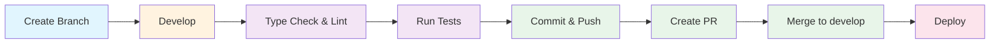
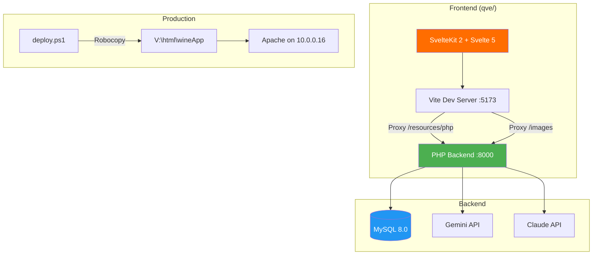
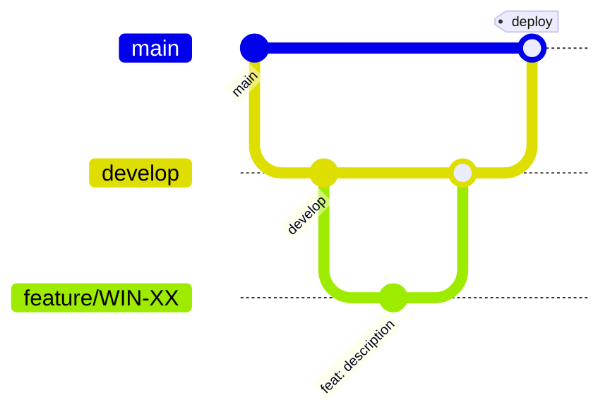
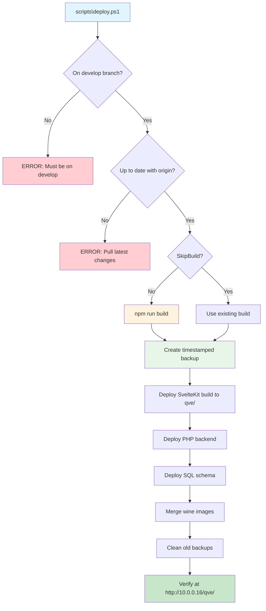

# Development Guide

> **Executive Summary**: This guide covers everything needed to develop, test, and deploy the Qvé Wine App. The frontend is a SvelteKit 2 static SPA (Svelte 5) built with Vite, proxying API calls to a PHP 8.3 backend backed by MySQL 8.0. Development requires two terminals (Vite dev server + PHP built-in server). Deployment uses a PowerShell script that builds, backs up, and syncs files to a production server via Robocopy. The project uses JIRA for issue tracking with a custom PowerShell CLI.

---

## Table of Contents

1. [Prerequisites](#prerequisites)
2. [Environment Setup](#environment-setup)
3. [Development Workflow](#development-workflow)
4. [Project Structure](#project-structure)
5. [Build & Quality Commands](#build--quality-commands)
6. [Testing](#testing)
7. [Tooling Configuration](#tooling-configuration)
8. [Vite Dev Server & Proxy](#vite-dev-server--proxy)
9. [Path Aliases](#path-aliases)
10. [Database](#database)
11. [Common Development Tasks](#common-development-tasks)
12. [Git Workflow](#git-workflow)
13. [JIRA CLI](#jira-cli)
14. [Deployment](#deployment)
15. [Debugging](#debugging)
16. [Troubleshooting](#troubleshooting)

---

## Prerequisites

| Dependency | Version | Notes |
|------------|---------|-------|
| Node.js | 18+ | Required for Vite and SvelteKit |
| PHP | 8.3+ | With PDO, GD, and cURL extensions |
| MySQL | 8.0+ | Server version 8.0.44 tested |
| PowerShell | 5.1+ | For deployment and JIRA CLI scripts |

---

## Environment Setup

### 1. Clone and Install

```bash
git clone https://github.com/philhumber/wineApp.git
cd wineapp
cd qve && npm install
```

### 2. Configure Database and API Keys

Database credentials and API keys are stored **outside the repo** at `../wineapp-config/config.local.php`. A template exists at `resources/php/config.local.php.example`.

```php
<?php
// File: ../wineapp-config/config.local.php

// Environment: 'test' or 'prod'
define('APP_ENV', 'test');

// Database credentials
define('DB_HOST', '10.0.0.16');
define('DB_USER', 'your-username');
define('DB_PASS', 'your-password');

// Database name based on environment
if (APP_ENV === 'test') {
    define('DB_NAME', 'winelist_test');
} else {
    define('DB_NAME', 'winelist');
}

// API Keys
define('GEMINI_API_KEY', 'your-gemini-api-key');
// Optional: define('ANTHROPIC_API_KEY', 'your-anthropic-key');
```

JIRA credentials are in a separate file at `../wineapp-config/jira.config.json`:

```json
{
  "email": "your-email@example.com",
  "token": "your-atlassian-api-token",
  "baseUrl": "https://your-domain.atlassian.net"
}
```

### 3. Start Development Servers

You need **two terminals**:

```bash
# Terminal 1: PHP backend (from project root)
php -S localhost:8000

# Terminal 2: Vite dev server (from qve folder)
cd qve && npm run dev
```

For mobile testing on the local network:

```bash
cd qve && npm run dev -- --host
# Then access via the Network URL shown (e.g., http://10.0.1.13:5173/qve/)
```

### 4. Open App

Navigate to: **http://localhost:5173/qve/**

---

## Development Workflow



**Branch from `develop`** (never commit directly to `main`):

```bash
git checkout develop
git pull origin develop
git checkout -b feature/WIN-XX-description
```

---

## Project Structure



```
wineapp/
├── qve/                          # SvelteKit frontend
│   ├── src/
│   │   ├── lib/
│   │   │   ├── api/              # API client (client.ts, types.ts)
│   │   │   ├── agent/            # Agent architecture (router, state machine, handlers)
│   │   │   │   ├── handlers/     # Action handlers
│   │   │   │   ├── messages/     # Message factory functions
│   │   │   │   ├── middleware/   # Error handling, retry, validation
│   │   │   │   ├── services/     # API service layer
│   │   │   │   └── __tests__/    # Agent unit tests
│   │   │   ├── components/       # 90+ Svelte components (barrel-exported)
│   │   │   │   ├── ui/           # Icon, ThemeToggle, Toast, RatingDisplay, etc.
│   │   │   │   ├── wine/         # WineCard, WineGrid, HistoryCard, etc.
│   │   │   │   ├── layout/       # Header, FilterBar, CollectionRow, SideMenu
│   │   │   │   ├── forms/        # FormInput, RatingDots, MiniRatingDots
│   │   │   │   ├── wizard/       # WizardStepIndicator, SearchDropdown, etc.
│   │   │   │   ├── modals/       # DrinkRateModal, ConfirmModal, etc.
│   │   │   │   ├── edit/         # WineForm, BottleForm, BottleSelector
│   │   │   │   └── agent/        # Agent UI (AgentPanel, chat, enrichment, etc.)
│   │   │   ├── stores/           # 24 Svelte stores (16 core + 8 agent)
│   │   │   ├── utils/            # commandDetector.ts, etc.
│   │   │   └── styles/           # tokens.css, base.css, animations.css
│   │   └── routes/               # SvelteKit file-based routing
│   │       ├── +page.svelte      # Home / Cellar view
│   │       ├── add/              # Add Wine wizard
│   │       ├── history/          # Drink history
│   │       ├── edit/[id]/        # Edit Wine/Bottle
│   │       └── drink/[id]/       # Drink/Rate flow
│   ├── eslint.config.js          # ESLint flat config
│   ├── .prettierrc               # Prettier config
│   ├── vitest.config.ts          # Vitest test config
│   ├── svelte.config.js          # SvelteKit config (adapter-static)
│   ├── vite.config.ts            # Vite config (proxy, PWA)
│   └── tsconfig.json             # TypeScript strict mode
├── resources/
│   ├── php/                      # PHP backend endpoints
│   │   ├── agent/                # Agent endpoints (identify, enrich, clarify)
│   │   ├── config.local.php.example  # Config template
│   │   ├── databaseConnection.php
│   │   └── *.php                 # CRUD endpoints
│   └── sql/                      # Database schema
│       ├── Full_DB_Structure.sql # Canonical schema (28 tables + 3 views)
│       ├── ANALYTICS_QUERIES.md  # Ad-hoc analytics query reference
│       ├── seed/                 # Reference/seed data
│       └── archive/              # Historical schemas and applied migrations
├── scripts/
│   └── jira.ps1                  # JIRA CLI
│   └── deploy.ps1                # Deployment script
├── docs/                         # Documentation
└── archive/                      # V1 app (preserved)
```

---

## Build & Quality Commands

All commands run from the `qve/` directory:

```bash
# Development
npm run dev              # Start dev server with HMR (port 5173)
npm run dev -- --host    # Expose to local network for mobile testing

# Type checking
npm run check            # One-shot TypeScript + Svelte check
npm run check:watch      # Continuous type checking (watch mode)

# Code quality
npm run lint             # ESLint (flat config, TS + Svelte)
npm run format           # Prettier (auto-format all files)

# Build
npm run build            # Production build (output: qve/build/)
npm run preview          # Preview production build locally
```

---

## Testing

The project uses **Vitest** with **jsdom** environment and **@testing-library/svelte** for component tests.

### Test Commands

```bash
npm run test             # Run tests in watch mode (interactive)
npm run test:run         # Run all tests once (CI-friendly)
npm run test:watch       # Explicit watch mode
npm run test:ui          # Open Vitest UI in browser
npm run test:coverage    # Run with V8 coverage report
```

### Test Structure

Tests live in `__tests__/` directories alongside source code:

```
qve/src/lib/
├── agent/__tests__/              # Agent logic tests
│   ├── handlers.test.ts
│   ├── router.test.ts
│   ├── stateMachine.test.ts
│   ├── middleware.test.ts
│   ├── messages.test.ts
│   ├── streaming.test.ts
│   ├── errorScenarios.test.ts
│   ├── handleAgentAction.test.ts
│   └── integration/
│       └── addWineFlow.test.ts
├── components/agent/__tests__/   # Agent component tests
│   ├── AgentPanel.test.ts
│   └── conversation/__tests__/   # Chat UI tests
└── stores/__tests__/             # Store tests
    ├── agentAddWine.test.ts
    ├── agentConversation.test.ts
    ├── agentEnrichment.test.ts
    ├── agentIdentification.test.ts
    └── agentPersistence.test.ts
```

### Vitest Configuration

The test config at `qve/vitest.config.ts` sets up:
- **Environment**: jsdom (browser-like DOM)
- **Globals**: `true` (no need to import `describe`, `it`, `expect`)
- **Setup file**: `src/test-setup.ts`
- **Path aliases**: All `$lib`, `$api`, `$stores`, `$components`, `$utils` aliases work in tests
- **SvelteKit app mocks**: `$app` aliased to `src/app-mocks/` for mocking SvelteKit modules

---

## Tooling Configuration

### TypeScript (`tsconfig.json`)

Strict mode enabled with bundler module resolution:

```json
{
  "extends": "./.svelte-kit/tsconfig.json",
  "compilerOptions": {
    "strict": true,
    "moduleResolution": "bundler",
    "allowJs": true,
    "checkJs": true,
    "sourceMap": true
  }
}
```

### ESLint (`eslint.config.js`)

Uses the flat config format (ESLint 9+) with TypeScript and Svelte plugins:

- `@eslint/js` recommended rules
- `typescript-eslint` recommended rules
- `eslint-plugin-svelte` flat/recommended for `.svelte` files
- Ignores: `build/`, `.svelte-kit/`, `dist/`

### Prettier (`.prettierrc`)

```json
{
  "useTabs": false,
  "tabWidth": 2,
  "singleQuote": true,
  "trailingComma": "none",
  "printWidth": 100,
  "plugins": ["prettier-plugin-svelte"]
}
```

### SvelteKit (`svelte.config.js`)

- **Adapter**: `adapter-static` (SPA mode with `fallback: 'index.html'`)
- **Base path**: `/qve`
- **Preprocessor**: `vitePreprocess()` (enables TypeScript in `.svelte` files)

---

## Vite Dev Server & Proxy

The Vite config (`qve/vite.config.ts`) proxies two paths to the PHP backend:

```typescript
server: {
  proxy: {
    '/resources/php': {          // API calls
      target: 'http://localhost:8000',
      changeOrigin: true
    },
    '/images': {                 // Wine image requests
      target: 'http://localhost:8000',
      changeOrigin: true
    }
  }
}
```

### PWA Support

The app includes PWA configuration via `@vite-pwa/sveltekit`:

- **Strategy**: `generateSW` (auto-generated service worker)
- **Register type**: `autoUpdate` (updates silently)
- **Manifest**: `Qvé Wine Collection`, standalone display, start URL `/qve/`
- **Runtime caching**: Google Fonts (CacheFirst, 1 year), API calls (NetworkFirst, 5 min)
- **Dev mode**: PWA enabled in dev with `navigateFallback: '/qve/'`

---

## Path Aliases

Defined in `svelte.config.js` (and mirrored in `vitest.config.ts` for tests):

| Alias | Resolves to | Usage |
|-------|-------------|-------|
| `$lib` | `src/lib` | Built-in SvelteKit alias |
| `$api` | `src/lib/api` | `import { api } from '$api'` |
| `$stores` | `src/lib/stores` | `import { wines } from '$stores'` |
| `$styles` | `src/lib/styles` | `import '$styles/tokens.css'` |
| `$components` | `src/lib/components` | `import { WineCard } from '$components'` |
| `$utils` | `src/lib/utils` | `import { detectCommand } from '$utils'` |

The standard `$lib` import via barrel exports is the primary pattern:

```typescript
import { WineCard, FilterBar } from '$lib/components';
import { wines, filters } from '$lib/stores';
import { api } from '$lib/api';
```

---

## Database

**Host**: `10.0.0.16` | **Database**: `winelist` (prod) / `winelist_test` (dev)
**Schema file**: `resources/sql/Full_DB_Structure.sql` (28 tables + 3 views)

For full ER diagrams and column details, see `docs/ARCHITECTURE.md` Section 4.

### Table Groups

| Group | Tables | Purpose |
|-------|--------|---------|
| **Core** (12) | `wine`, `bottles`, `ratings`, `producers`, `region`, `country`, `winetype`, `grapes`, `grapemix`, `worlds`, `currencies`, `bottle_sizes`, `user_settings`, `audit_log`, `critic_scores` | Wine collection CRUD |
| **Agent** (7) | `agentUsers`, `agentSessions`, `agentUsageLog`, `agentUsageDaily`, `agentIdentificationResults`, `agentUserTasteProfile`, `agentWineEmbeddings` | AI agent sessions, usage, analytics |
| **Cache** (3) | `cacheWineEnrichment`, `cacheProducers`, `cacheCanonicalAliases` | AI enrichment caching with TTLs |
| **Reference** (6) | `refAbbreviations`, `refAppellations`, `refGrapeCharacteristics`, `refWineStyles`, `refPairingRules`, `refIntensityProfiles` | Static wine knowledge base |
| **Views** (3) | `vw_model_confidence_stats`, `vw_tier_escalation_analysis`, `vw_model_comparison` | Identification analytics |

### SQL Files

| Path | Purpose |
|------|---------|
| `resources/sql/Full_DB_Structure.sql` | Canonical schema (all tables, indexes, FKs, seed data for lookups) |
| `resources/sql/ANALYTICS_QUERIES.md` | Ad-hoc analytics query reference |
| `resources/sql/seed/agent_seed_data.sql` | Reference data: grape characteristics, pairing rules, etc. |
| `resources/sql/archive/` | Historical partial schemas and applied migrations (reference only) |

### Connecting to Database

```bash
mysql -h 10.0.0.16 -u username -p winelist
```

---

## Common Development Tasks

### Adding a New Component

1. Create in the appropriate category folder:
   ```bash
   qve/src/lib/components/ui/MyComponent.svelte
   ```

2. Export from the barrel index:
   ```typescript
   // qve/src/lib/components/index.ts
   export { default as MyComponent } from './ui/MyComponent.svelte';
   ```

3. Import in routes or other components:
   ```svelte
   <script>
     import { MyComponent } from '$lib/components';
   </script>
   ```

### Adding a New Store

1. Create the store file with the factory pattern:
   ```typescript
   // qve/src/lib/stores/myStore.ts
   import { writable } from 'svelte/store';

   function createMyStore() {
     const { subscribe, set, update } = writable(initialValue);
     return {
       subscribe,
       doSomething: () => update(state => /* ... */)
     };
   }

   export const myStore = createMyStore();
   ```

2. Export from the barrel index:
   ```typescript
   // qve/src/lib/stores/index.ts
   export { myStore } from './myStore';
   ```

### Adding a New API Method

1. Add types (if needed):
   ```typescript
   // qve/src/lib/api/types.ts
   export interface MyParams { /* ... */ }
   export interface MyResponse { /* ... */ }
   ```

2. Add method to the client class:
   ```typescript
   // qve/src/lib/api/client.ts
   async myNewMethod(params: MyParams): Promise<MyResponse> {
     return this.fetchJSON<MyResponse>('myEndpoint.php', {
       method: 'POST',
       body: JSON.stringify(params)
     });
   }
   ```

3. The `fetchJSON` helper handles structured error responses and agent errors automatically.

### Adding a New PHP Endpoint

1. Create file in `resources/php/`:
   ```php
   <?php
   header('Content-Type: application/json');
   require_once 'databaseConnection.php';

   try {
       $pdo = getDBConnection();
       // ... query logic
       echo json_encode(['success' => true, 'data' => $result]);
   } catch (Exception $e) {
       http_response_code(500);
       echo json_encode(['success' => false, 'message' => $e->getMessage()]);
   }
   ```

2. For agent endpoints, use the bootstrap:
   ```php
   <?php
   require_once __DIR__ . '/_bootstrap.php';
   // Use agentResponse(), agentExceptionError(), agentStructuredError()
   ```

3. The endpoint is automatically available at `/resources/php/yourEndpoint.php` via the Vite proxy.

### Adding a New Route

1. Create route folder and page:
   ```
   qve/src/routes/my-route/+page.svelte
   ```

2. Add a load function if needed:
   ```typescript
   // qve/src/routes/my-route/+page.ts
   export const load = async () => {
     return { /* data */ };
   };
   ```

3. The route is accessible at `/qve/my-route` (base path is `/qve`).

---

## Git Workflow



### Branch Naming

```bash
git checkout develop
git pull origin develop
git checkout -b feature/WIN-XX-description    # Features
git checkout -b fix/WIN-XX-description        # Bug fixes
```

### Commit Convention

```bash
git add .
git commit -m "feat: description

Refs: WIN-XX"
```

Prefixes: `feat:`, `fix:`, `refactor:`, `docs:`, `test:`, `chore:`

### Pull Requests

- PRs target `develop` (not `main`)
- `main` is only updated via merges from `develop` before deployment

---

## JIRA CLI

The project includes a PowerShell JIRA CLI at `scripts/jira.ps1` using REST API v3 + Agile API. Credentials are stored at `../wineapp-config/jira.config.json`.

Get an API token from: https://id.atlassian.com/manage-profile/security/api-tokens

### Issue Commands

```powershell
.\scripts\jira.ps1 list                        # List open issues (paginated)
.\scripts\jira.ps1 list done                   # List completed issues
.\scripts\jira.ps1 list all                    # List all issues
.\scripts\jira.ps1 get WIN-123                 # Get issue details with description
.\scripts\jira.ps1 create "Fix bug" Bug        # Create issue (Task, Bug, Story)
.\scripts\jira.ps1 update WIN-123 "New title"  # Update issue summary
.\scripts\jira.ps1 status WIN-123 "Done"       # Transition status
.\scripts\jira.ps1 status WIN-123 "In Progress"
.\scripts\jira.ps1 cancel WIN-123              # Transition to Cancelled
.\scripts\jira.ps1 comment WIN-123 "Note"      # Add comment to issue
.\scripts\jira.ps1 backlog                     # Open issues not in any sprint
```

### Sprint Commands

```powershell
.\scripts\jira.ps1 sprint                      # Show active sprint issues
.\scripts\jira.ps1 sprint-list                 # List all sprints (active + future) with counts
.\scripts\jira.ps1 sprint-issues 257           # Show issues in a specific sprint
.\scripts\jira.ps1 sprint-create "S15: Name"   # Create sprint (max 30 characters)
.\scripts\jira.ps1 sprint-add 257 WIN-1,WIN-2  # Add issues to sprint (comma-separated)
.\scripts\jira.ps1 sprint-start 257            # Start sprint (2-week duration)
.\scripts\jira.ps1 sprint-close 257            # Complete/close an active sprint
.\scripts\jira.ps1 sprint-delete 257           # Delete a future sprint
```

### Notes

- **Sprint names**: Max 30 characters (JIRA API limit)
- **Done vs Cancelled**: `status WIN-123 "Done"` transitions to Done; `cancel WIN-123` transitions to Cancelled
- **Pagination**: `list` fetches all issues automatically (no 50-item cap)
- **Sprint IDs**: Use `sprint-list` to find IDs, then reference them in other commands

---

## Deployment

### Staging (deploy.ps1)

`deploy.ps1` deploys the `develop` branch to the staging server. Production deploys (main → prod) are handled by GitHub Actions.



### Deployment Commands

```powershell
.\scripts\deploy.ps1                   # Build and deploy from develop with auto-backup
.\scripts\deploy.ps1 -DryRun           # Preview changes without deploying
.\scripts\deploy.ps1 -SkipBuild        # Deploy using existing build (skip npm build)
.\scripts\deploy.ps1 -Force            # Override branch/sync checks
.\scripts\deploy.ps1 -ListBackups      # List available backups for rollback
.\scripts\deploy.ps1 -Rollback "2026-01-22_143022"   # Restore from backup
```

### What Gets Deployed

| Source | Target | Method |
|--------|--------|--------|
| `qve/build/` | `V:\html\wineApp\qve\` | Sync (PURGE) |
| `resources/php/` | `V:\html\wineApp\resources\php\` | Sync (PURGE), excludes `config.local.php` |
| `resources/sql/` | `V:\html\wineApp\resources\sql\` | Sync (PURGE) |
| `images/wines/` | `V:\html\wineApp\images\wines\` | Merge (add new only, never overwrite) |

### Key Behaviors

- **Backup**: Automatic timestamped backup before every deploy, stored at `V:\html\wineApp-backups\`
- **Retention**: Keeps last 5 backups, auto-cleans older ones
- **Config safety**: `config.local.php` is never deployed (production config stays untouched)
- **Image safety**: Wine images are merged, not replaced (new images added, existing preserved)
- **V: drive**: Must be mapped to `\\10.0.0.10\www` (`net use V: \\10.0.0.10\www`)
- **Pre-rollback backup**: Rolling back automatically creates a backup of current state first

### Production URL

After deployment, verify at: **http://10.0.0.16/qve/**

---

## Debugging

### Browser DevTools

- **Svelte DevTools**: Install the browser extension to inspect component hierarchy
- **Network tab**: Monitor API calls to `/resources/php/`
- **Console**: Access store values with `$storeName` in Svelte DevTools

### PHP Debugging

```bash
# Watch PHP error log
tail -f /var/log/php_errors.log

# Look up agent error support references
grep "ERR-XXXXXXXX" /var/log/php_errors.log
```

### Agent Error Support References

Agent errors include a `supportRef` in format `ERR-XXXXXXXX`. These appear in error responses and can be cross-referenced in the PHP error log to find the original exception.

---

## Troubleshooting

| Issue | Cause | Solution |
|-------|-------|----------|
| API returns 404 | PHP server not running | Start PHP: `php -S localhost:8000` |
| CORS errors | Vite proxy misconfigured | Check `vite.config.ts` proxy settings |
| TypeScript errors | Type mismatch or missing types | Run `npm run check` for details |
| Store not reactive | Using `store` instead of `$store` | Use `$store` syntax in Svelte templates |
| Images not loading | Missing `/images` proxy | Ensure PHP server is running at :8000 |
| Build fails with path errors | Missing SvelteKit aliases | Run `svelte-kit sync` first |
| Tests fail with module errors | Path aliases not resolving | Check `vitest.config.ts` alias config |
| `V:` drive not accessible | Network drive not mapped | Run: `net use V: \\10.0.0.10\www` |
| JIRA CLI errors | Missing/expired API token | Update token at `../wineapp-config/jira.config.json` |
| `config.local.php` not found | Config not created | Copy `resources/php/config.local.php.example` to `../wineapp-config/config.local.php` |
