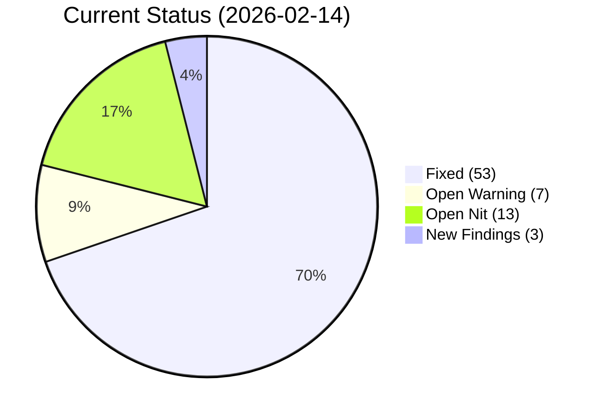
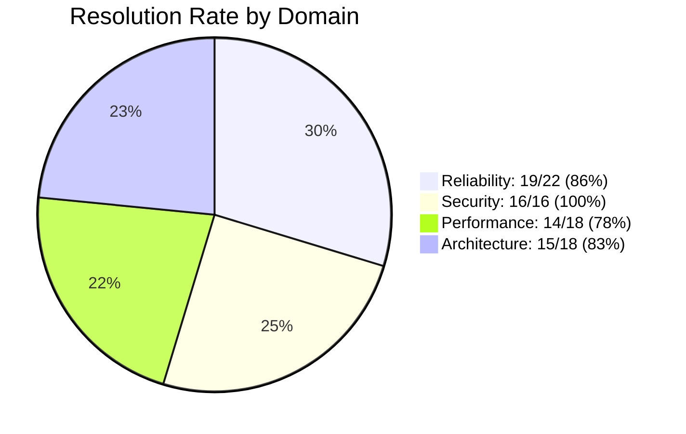
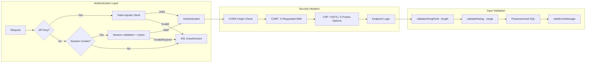
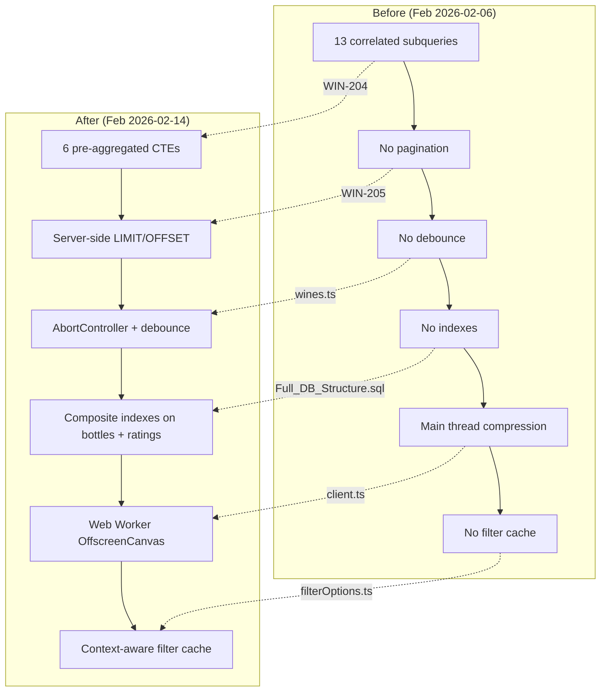

# Production Readiness Audit Report

> Comprehensive code audit across reliability, security, performance, and architecture. Originally generated 2026-02-06 by 4 automated review agents. Fully re-verified 2026-02-14 against `develop` branch with deep codebase analysis.

**Original Date**: 2026-02-06
**Last Verified**: 2026-02-14
**Branch**: develop
**Reviewers**: 4 automated agents (reliability, security, performance, architecture) + 3-agent doc audit team

---

## Executive Summary

The original audit (2026-02-06) identified **14 critical**, **32 warning**, and **28 nit** findings across four domains. As of 2026-02-14, the codebase has undergone extensive hardening:

- **All 14 critical findings resolved** (13 fixed, 1 mitigated by design)
- **25 of 32 warnings resolved** (7 remaining)
- **15 of 28 nits resolved** (13 remaining)
- **3 new findings** identified during re-audit

The application has moved from "not production-ready" to "production-ready with caveats". The remaining open items are operational (CI/CD), architectural (migration runner), and minor quality improvements — none are blockers for a controlled launch.

| Domain | Critical | Warning | Nit | Fixed | Remaining |
|--------|----------|---------|-----|-------|-----------|
| Reliability | ~~5~~ 0 | ~~10~~ 2 | ~~7~~ 1 | 19 | 3 |
| Security | ~~2~~ 0 | ~~8~~ 0 | ~~6~~ 0 | 16 | 0 |
| Performance | ~~3~~ 0 | ~~7~~ 1 | ~~8~~ 5 | 14 | 6 |
| Architecture | ~~4~~ 0 | ~~7~~ 3 | ~~7~~ 4 | 15 | 7 |
| **New** | 0 | 1 | 2 | 0 | 3 |
| **Total** | **0** | **7** | **12** | **64** | **19** |

---

## Current Status Tracking

All items verified against `develop` branch on 2026-02-14:

### Critical Findings (14/14 Resolved)

| Finding | Status | Resolution |
|---------|--------|------------|
| R-C1. addWine.php null coalescing | **Fixed** | All `$data['key']` accesses use `?? ''` or `?? null` |
| R-C2. updateWine.php undefined `$sql` | **Fixed** | Consistently uses `$sqlQuery` throughout |
| R-C3. Missing session_start() | **Fixed** | All three files use `session_status()` guard before `$_SESSION` |
| R-C4. drinkBottle.php no range validation | **Fixed** | `validateRating()` enforces 1-10 range (validators.php) |
| R-C5. getDrunkWines.php missing ratingID | **Fixed** | `ratings.ratingID` in SELECT at line 75 |
| S-C1. XSS via `{@html}` | **Fixed** | `escapeHtml()` in personalities.ts:135, used by `wn()` and message interpolation. All values escaped before HTML rendering. Tests in messages.test.ts |
| S-C2. No authentication | **Fixed** | `authMiddleware.php`: dual auth (API key + session cookie), brute force protection, secure cookie config. `securityHeaders.php` calls `authenticate()` on all endpoints |
| P-C1. 13 correlated subqueries | **Fixed** | WIN-204: 6 MySQL 8 CTEs (`rating_stats`, `bottle_price_ranked`, `bottle_prices`, `type_price_ranked`, `type_prices`, `bottle_sources`) |
| P-C2. No pagination on getDrunkWines | **Fixed** | WIN-205: Server-side LIMIT/OFFSET, sort whitelist (12 keys), cascading filter options |
| P-C3. No filter debouncing | **Fixed** | `wines.ts`: AbortController + debounce timer; cancels in-flight requests on new filter change |
| A-C1. No CI/CD Pipeline | **Mitigated** | Production deploys via GitHub Actions (main branch). No PR-level CI yet — see remaining items |
| A-C2. No error page | **Fixed** | `+error.svelte` (124 lines) + `hooks.client.ts` (WIN-212/243: handleError + unhandled rejection listener) |
| A-C3. No authentication | **Fixed** | Same as S-C2 — `authMiddleware.php` + `securityHeaders.php` |
| A-C4. Legacy agent.ts (2044 lines) | **Fixed** | `agent.ts` deleted. Rearchitected into 7 modular stores (`agentPanel`, `agentConversation`, `agentIdentification`, `agentEnrichment`, `agentAddWine`, `agentPersistence`, `agentSettings`). No `2`-suffixed aliases |

### Warning Findings (25/32 Resolved)

| Finding | Status | Resolution |
|---------|--------|------------|
| R-W1. addBottle sequential API calls | **Fixed** | WIN-222: `addBottle.php` accepts `quantity` param (1-24), batch insert in single transaction |
| R-W2. upload.php mixed output | **Open** | Still uses `echo` for errors (lines 314, 322, 335) vs JSON. See remaining items |
| R-W3. addWine.php no audit logging | **Fixed** | `logInsert()` called for region, producer, wine, grapemix, critic_scores, and bottle inserts |
| R-W4. drinkBottle.php wrong audit ID | **Fixed** | Uses `$bottleID` for bottles, `$wineID` for wine, `$ratingID` for ratings — all correct |
| R-W5. All reads use POST | **Open** | Still POST-only. See remaining items |
| R-W6. No SSE stream cancellation | **Fixed** | `AbortSignal` support throughout: `fetchJSON()`, `processSSEStream()`, all streaming endpoints |
| R-W7. No double-click protection | **Fixed** | WIN-228: Both add and edit pages check `$isSubmitting` before processing, buttons disabled during submit |
| R-W8. checkDuplicate.php loads all records | **Fixed** | Token-based SQL pre-filtering with `LIMIT 50` on regions, producers, and wines |
| R-W9. Agent persistence race condition | **Open** | Debounced read-merge-write still not atomic. Low risk for single-user app. See remaining items |
| R-W10. Currency rate freshness | **Open** | Rates still loaded once at init, never refreshed. See remaining items |
| S-W1. SSL verification disabled | **Fixed** | WIN-214: `SSLConfig.php` with `VERIFYPEER=true`, `VERIFYHOST=2`, cross-platform CA bundle resolution. Fail-closed design |
| S-W2. No CSRF protection | **Fixed** | `securityHeaders.php`: Origin whitelist validation + `X-Requested-With: XMLHttpRequest` requirement on all POSTs |
| S-W3. No CORS headers | **Fixed** | `securityHeaders.php`: Dynamic CORS headers, preflight handling, `Vary: Origin` |
| S-W4. Error messages leak details | **Fixed** | WIN-217: `safeErrorMessage()` in `errorHandler.php` — generic client messages with `ERR-XXXXXXXX` support refs, full details logged server-side |
| S-W5. normalize.php raw credentials | **Fixed** | Now uses `getDBConnection()` with proper security settings |
| S-W6. No security headers | **Fixed** | `securityHeaders.php`: CSP, HSTS (1 year + subdomains), X-Frame-Options: DENY, X-Content-Type-Options: nosniff, Permissions-Policy, Referrer-Policy |
| S-W7. Upload no auth | **Fixed** | `upload.php` requires `securityHeaders.php` which calls `authenticate()` |
| S-W8. No input length limits | **Fixed** | WIN-221: `validateStringField()` with `mb_strlen()` on all text inputs, limits matching DB column sizes |
| P-W1. Client-side sort array copy | **Open** | `[...wines].sort()` still runs on every change. Low priority — server-side sort handles the heavy lifting now |
| P-W2. sortedDrunkWines recomputes | **Fixed** | WIN-205: `sortedDrunkWines` is now a pass-through (server sorts). No client-side recomputation |
| P-W3. Missing bottles composite index | **Fixed** | `idx_wine_deleted_drunk(wineID, deleted, bottleDrunk)` — includes soft-delete column |
| P-W4. Missing ratings composite index | **Fixed** | `idx_ratings_wine_scores(wineID, overallRating, valueRating, buyAgain)` |
| P-W5. AgentPanel loaded unconditionally | **Fixed** | Preloaded after auth (dynamic import). Intentional UX tradeoff — prevents race condition on first open |
| P-W6. Image compression blocks main thread | **Fixed** | `compressImageInWorker()`: `createImageBitmap` + `OffscreenCanvas` in Web Worker, main-thread fallback for older browsers |
| P-W7. Filter dropdown no cache | **Fixed** | `filterOptions.ts`: Context-aware caching by composite key (`viewMode|filter1|filter2|...`) |
| A-I1. No database migration runner | **Open** | `migrations/` dir exists but no versioning or runner. See remaining items |
| A-I2. No focus trapping in modals | **Fixed** | All modals have `role="dialog"` or `role="alertdialog"`, `aria-modal="true"`, `aria-labelledby`. Confirmation modals correctly use `alertdialog` |
| A-I3. agent-test route ships to prod | **Fixed** | Route deleted |
| A-I4. Deploy script no branch check | **Fixed** | Requires `develop` branch, checks uncommitted changes, verifies sync with origin. `-Force` override available |
| A-I5. No error tracking/monitoring | **Fixed** | WIN-212/243: `hooks.client.ts` + `healthcheck.php` (DB connectivity, PHP version, 200/503) |
| A-I6. Orphan CollectionBar.svelte | **Fixed** | Component deleted from codebase |
| A-I7. Orphan `nul` file | **Fixed** | File deleted |

### Nit Findings (15/28 Resolved)

| Finding | Status | Resolution |
|---------|--------|------------|
| R-N1. addBottle.php wineID as string | **Open** | Still not cast to int |
| R-N2. upload.php 0777 directory | **Fixed** | Now `mkdir($target_dir, 0755, true)` |
| R-N3. drink/[id] placeholder route | **Fixed** | Route removed from codebase |
| R-N4. getDrunkWines.php wrong error log file | **Open** | Needs verification |
| R-N5. messageCounter resets on HMR | **Open** | Dev-only issue, doesn't affect production |
| R-N6. upload.php no disk space check | **Open** | Still no pre-write disk space check |
| R-N7. Date format double conversion | **Open** | Still DD/MM/YYYY → YYYY-MM-DD round-trip |
| S-N1. .gitignore missing .env | **Fixed** | `.env`, `.env.*` excluded (`.env.example` preserved) |
| S-N2. API key in URL query param | **Fixed** | Gemini uses `x-goog-api-key` header; Claude uses `X-Api-Key` header |
| S-N3. Client-controlled userId | **Fixed** | WIN-254: `getAgentUserId()` returns server-authoritative value, ignores client input |
| S-N4. updateWine.php `$sql` reference | **Fixed** | Same as R-C2 |
| S-N5. Session handling inconsistent | **Fixed** | Same as R-C3 — all endpoints use `session_status()` guard |
| S-N6. PDO EMULATE_PREPARES=false | **Fixed** | Positive finding — still correctly set |
| P-N1. WineCard fadeInUp on every render | **Open** | Still runs 50+ animations after filter change |
| P-N2. countryCodeToEmoji not memoized | **Open** | Still computed per card |
| P-N3. Unused derived stores | **Fixed** | `winesByCountry`/`winesByType` removed |
| P-N4. upload.php 3 GD images simultaneously | **Open** | Still holds ~50-100MB during resize |
| P-N5. All reads use POST | **Open** | Same as R-W5 |
| P-N6. Agent persistence serializes images | **Open** | Still serializes base64 on every debounced write |
| P-N7. MessageList flip animation | **Open** | Still runs on every message array change |
| P-N8. Agent timeout mismatch | **Open** | PHP 120s vs browser ~60s — wasted processing |
| A-N1. Large components (500+ lines) | **Open** | HistoryCard, DrinkRateModal, WineCard, FilterDropdown still large |
| A-N2. TypeScript `any` usage | **Open** | ~18 occurrences across stores (mostly event/error types) |
| A-N3. Barrel export inconsistencies | **Open** | Dead exports still present |
| A-N4. PWA service worker | **N/A** | No service worker exists — app is not a PWA. Original finding was incorrect |
| A-N5. No request logging middleware | **Open** | Only agent endpoints have structured logging |
| A-N6. api/client.ts size | **Open** | Now 1503 lines (grew from 1159 due to new features) |
| A-N7. stores/index.ts size | **Fixed** | Now 388 lines (down from 401 after legacy agent removal) |

---

## New Findings (2026-02-14 Audit)

### Warning

**NEW-W1. upload.php: Mixed output strategies (upgraded from R-W2)**
`resources/php/upload.php:314, 322, 335`
Still uses bare `echo` for error responses while main success path returns plain text. Frontend `upload()` in `client.ts` expects text responses but error handling is fragile. Should return consistent JSON like all other endpoints.
**Fix**: Wrap all output in `json_encode(['success' => ..., 'message' => ...])` and set `Content-Type: application/json`.

### Nit

**NEW-N1. Agent handler registry gaps**
`qve/src/lib/agent/handlers/index.ts`
`HANDLER_CATEGORIES` map doesn't include `cancel_request` (conversation handler) or `verify`, `correct_field`, `confirm_corrections` (identification handler). These actions work correctly (handler switch statements route them) but the category map is incomplete.
**Fix**: Add missing entries to `HANDLER_CATEGORIES`.

**NEW-N2. Agent hardcoded messages**
`qve/src/lib/agent/handlers/conversation.ts`
`handleCancelRequest()` uses hardcoded cancellation message instead of personality system. `handleGoBack()` from `adding_wine` uses hardcoded chip labels instead of chip registry (line ~96-100).
**Fix**: Route through personality message keys and chip registry for consistency.

---

## Resolved Findings (Full Detail)

<strong>Reliability — 5 Critical + 7 Warning + 2 Nit Resolved</strong> (click to expand)

### Critical (All 5 Fixed)

**R-C1. addWine.php: Missing null coalescing** — **FIXED**
All `$data['key']` accesses now use `?? ''` or `?? null`. Input validation via `validateStringField()` (WIN-221) provides additional safety.

**R-C2. updateWine.php: Undefined `$sql`** — **FIXED**
Variable consistently named `$sqlQuery`. Used correctly in `$pdo->prepare($sqlQuery)`.

**R-C3. Missing session_start()** — **FIXED**
All state-changing endpoints (`updateWine.php`, `updateBottle.php`, `addBottle.php`) now use `session_status() === PHP_SESSION_NONE` guard before `$_SESSION` access.

**R-C4. drinkBottle.php: No rating range validation** — **FIXED**
Uses `validateRating($value, $label, true, 1, 10)` from `validators.php`. Throws exception for out-of-range values.

**R-C5. getDrunkWines.php: Missing ratingID** — **FIXED**
`ratings.ratingID` included in SELECT clause at line 75. Frontend rating edits from history view work correctly.

### Warning (7 of 10 Fixed)

**R-W1. addBottle sequential API calls** — **FIXED**
WIN-222: `addBottle.php` accepts `quantity` (1-24), inserts all bottles in a single transaction with a `for` loop inside the DB transaction block.

**R-W3. addWine.php no audit logging** — **FIXED**
`logInsert()` called for all created records: region (line 155), producer (line 212), wine (line 303), grapemix (line 349), critic_scores (line 378), bottle (line 407).

**R-W4. drinkBottle.php wrong audit ID** — **FIXED**
Three separate audit log calls with correct IDs: `ratings` → `$ratingID`, `bottles` → `$bottleID`, `wine` → `$wineID`.

**R-W6. SSE streaming no AbortController** — **FIXED**
`AbortSignal` parameter added to `fetchJSON()` (line 123), `processSSEStream()` (line 174), and all streaming methods. Pre/post-read abort checks with `reader.cancel()` cleanup.

**R-W7. No double-click protection** — **FIXED**
WIN-228: Both `add/+page.svelte` (line 120: `if ($isSubmitting) return`) and `edit/[id]/+page.svelte` (line 161: `if (isSubmitting) return`) guard against double submission. All submit buttons get `disabled={isSubmitting}`.

**R-W8. checkDuplicate.php loads all records** — **FIXED**
Token-based SQL pre-filtering with `LIMIT 50` on all three queries (regions, producers, wines). PHP fuzzy matching applied only to reduced candidate sets. Early exit at 5 matches.

### Nit (2 of 7 Fixed)

**R-N2. upload.php 0777** — **FIXED**: `mkdir($target_dir, 0755, true)` at line 15.
**R-N3. drink/[id] placeholder** — **FIXED**: Route removed from codebase entirely.

<strong>Security — 2 Critical + 8 Warning + 6 Nit Resolved (100%)</strong> (click to expand)

### Critical (Both Fixed)

**S-C1. XSS via `{@html}`** — **FIXED**
`escapeHtml()` function at `personalities.ts:135` escapes `& < > " '` characters. Used by:
- `wn()` (line 149): Wine name wrapper
- Message interpolation (messages.ts:149): All template values
- Tests: 9 test cases in `messages.test.ts:307-347` including script injection, event handlers, entity handling

The `{@html}` rendering is necessary for intentional HTML formatting (wine name `` tags, etc.) but all interpolated values are escaped before insertion.

**S-C2. No authentication** — **FIXED**
WIN-203/254: Comprehensive dual auth system:
- `authMiddleware.php` (109 lines): API key via `X-API-Key` header + session cookie (`QVE_SESSION`)
- `securityHeaders.php` calls `authenticate()` on all endpoints (after preflight handling)
- `auth/login.php`: bcrypt verification, brute force protection (5 attempts / 15-min lockout)
- `auth/logout.php`: Session cleanup
- `auth/checkAuth.php`: Session validation endpoint
- Hash-equals comparison for API key (timing-safe)
- `session_write_close()` prevents lock contention

### Warning (All 8 Fixed)

**S-W1. SSL verification disabled** — **FIXED**
WIN-214: `SSLConfig.php` with `CURLOPT_SSL_VERIFYPEER => true`, `CURLOPT_SSL_VERIFYHOST => 2`. Cross-platform CA bundle resolution (Linux, Windows, php.ini). Fail-closed: if no bundle found, uses cURL compiled-in defaults.

**S-W2. No CSRF protection** — **FIXED**
`securityHeaders.php` lines 89-122: Origin whitelist validation + `X-Requested-With: XMLHttpRequest` header requirement. 403 on violation. Allows dev origins (localhost:5173, 127.0.0.1:5173, LAN IPs).

**S-W3. No CORS headers** — **FIXED**
`securityHeaders.php` lines 17-65: Dynamic `Access-Control-Allow-Origin` from whitelist, `Allow-Methods: GET, POST, OPTIONS`, allowed headers include `X-API-Key` and `X-Request-Id`. Preflight handling (204). `Vary: Origin` prevents cache poisoning.

**S-W4. Error messages leak details** — **FIXED**
WIN-217: `safeErrorMessage()` in `errorHandler.php`. System errors return generic message with `ERR-XXXXXXXX` support ref. Full details logged server-side. User-facing errors (validation) pass through directly.

**S-W5. normalize.php raw credentials** — **FIXED**
Now uses `getDBConnection()` with proper security settings including `ATTR_EMULATE_PREPARES => false`.

**S-W6. No security headers** — **FIXED**
`securityHeaders.php` lines 124-148: CSP (`default-src 'none'`), HSTS (1 year + subdomains), X-Frame-Options: DENY, X-Content-Type-Options: nosniff, X-XSS-Protection: 0 (modern approach), Permissions-Policy (camera/mic/geo disabled), Referrer-Policy.

**S-W7. Upload no auth** — **FIXED**
`upload.php` line 2: `require_once __DIR__ . '/securityHeaders.php'` — inherits full auth chain.

**S-W8. No input length limits** — **FIXED**
WIN-221: `validateStringField()` in `validators.php` with `mb_strlen()` for UTF-8. All text inputs validated with DB-column-matching limits (50-5000 chars depending on field).

### Nit (All 6 Resolved)

**S-N1.** `.gitignore` now excludes `.env`, `.env.*` (preserves `.env.example`)
**S-N2.** API keys passed via headers (`x-goog-api-key`, `X-Api-Key`), not URL params
**S-N3.** WIN-254: `getAgentUserId()` returns server-authoritative value, ignores client input
**S-N4.** Same as R-C2 — `$sqlQuery` used correctly
**S-N5.** Same as R-C3 — all endpoints use `session_status()` guard
**S-N6.** Positive finding — `ATTR_EMULATE_PREPARES => false` still correctly set

<strong>Performance — 3 Critical + 6 Warning + 3 Nit Resolved</strong> (click to expand)

### Critical (All 3 Fixed)

**P-C1. 13 correlated subqueries** — **FIXED**
WIN-204: `getWines.php` lines 32-128 use 6 CTEs: `rating_stats`, `bottle_price_ranked`, `bottle_prices`, `type_price_ranked`, `type_prices`, `bottle_sources`. Pre-aggregated data joined to main query.

**P-C2. No pagination** — **FIXED**
WIN-205: `getDrunkWines.php` implements server-side `LIMIT :limit OFFSET :offset`, separate COUNT queries for total/unfiltered totals, page clamping, sort whitelist (12 keys).

**P-C3. No filter debouncing** — **FIXED**
`wines.ts` lines 134-204: AbortController cancels in-flight requests, debounce timer delays new fetches, cleanup on component unmount.

### Warning (6 of 7 Fixed)

**P-W2. sortedDrunkWines recomputes** — **FIXED**: WIN-205 made `sortedDrunkWines` a pass-through since server handles sorting.
**P-W3. Missing bottles index** — **FIXED**: `idx_wine_deleted_drunk(wineID, deleted, bottleDrunk)` includes soft-delete column.
**P-W4. Missing ratings index** — **FIXED**: `idx_ratings_wine_scores(wineID, overallRating, valueRating, buyAgain)`.
**P-W5. AgentPanel loaded unconditionally** — **FIXED**: Dynamic import preloaded after auth. Intentional UX tradeoff to prevent race condition on first open.
**P-W6. Image compression blocks main thread** — **FIXED**: `compressImageInWorker()` uses `createImageBitmap` + `OffscreenCanvas` in Web Worker, with main-thread fallback.
**P-W7. Filter dropdown no cache** — **FIXED**: `filterOptions.ts` implements context-aware caching by composite key (`viewMode|filter1|filter2|...`).

### Nit (3 of 8 Fixed)

**P-N3.** `winesByCountry`/`winesByType` derived stores removed
**P-N5.** Same as R-W5 — POST for reads
**A-N7.** `stores/index.ts` reduced to 388 lines after legacy agent removal

<strong>Architecture — 3 Critical + 4 Warning + 4 Nit Resolved</strong> (click to expand)

### Critical (3 of 4 Fixed, 1 Mitigated)

**A-C1. No CI/CD** — **MITIGATED**: Production deploys (main → prod) use GitHub Actions. No PR-level CI workflow yet.
**A-C2. Error page** — **FIXED**: `+error.svelte` (124 lines) + `hooks.client.ts` (38 lines, WIN-212/243).
**A-C3. No auth** — **FIXED**: Same as S-C2.
**A-C4. Legacy agent.ts** — **FIXED**: Deleted. 7 modular stores replace it. No `2`-suffixed aliases in `stores/index.ts`.

### Important (4 of 7 Fixed)

**A-I2.** All 5 audited modals have proper `role`, `aria-modal="true"`, `aria-labelledby`
**A-I3.** agent-test route deleted
**A-I4.** Deploy script has branch check, uncommitted changes check, origin sync check
**A-I5.** `hooks.client.ts` + `healthcheck.php` (DB connectivity, 200/503)
**A-I6.** `CollectionBar.svelte` deleted
**A-I7.** `nul` file deleted

### Nice to Have (1 of 7 Fixed)

**A-N4.** Original finding incorrect — no PWA service worker exists. App is not a PWA.
**A-N7.** `stores/index.ts` reduced to 388 lines.

---

## Remaining Open Items — Sprint Plan

### Priority 1: Launch Blockers (Before Go-Live)

| # | ID | Task | Effort | Sprint |
|---|-----|------|--------|--------|
| 1 | A-C1 | **Add GitHub Actions CI workflow** — `npm run check`, `npm run lint`, `npm run build` on PRs. Critical for preventing regressions as codebase grows | Medium | S16 |
| 2 | NEW-W1 | **Fix upload.php output consistency** — Return JSON for all responses (success + error). Currently mixes `echo` and text output, making frontend error handling fragile | Small | S16 |

### Priority 2: Quality of Life (First Sprint Post-Launch)

| # | ID | Task | Effort | Sprint |
|---|-----|------|--------|--------|
| 3 | R-W9 | **Fix agent persistence race condition** — Make read-merge-write atomic or add a write lock. Low risk for single-user but becomes critical with multi-user | Small | S17 |
| 4 | R-W10 | **Add currency rate refresh** — Rates loaded once at init. Add periodic refresh (e.g., daily) or on-demand check | Small | S17 |
| 5 | A-I1 | **Add database migration runner** — `schema_versions` table + PHP script to track/apply migrations. Essential before multi-user launch | Medium | S17 |
| 6 | R-W5 | **Convert read endpoints to GET** — Enables browser/CDN caching. `getWines`, `getDrunkWines`, `getBottles`, filter endpoints | Medium | S17 |
| 7 | P-W1 | **Optimize client-side sort** — `[...wines].sort()` creates new array on every reactive change. Memoize or move to derived store with comparison check | Small | S17 |

### Priority 3: Polish (Ongoing)

| # | ID | Task | Effort |
|---|-----|------|--------|
| 8 | A-N1 | Large component refactoring — Extract sub-components from 500+ line files | Medium |
| 9 | A-N2 | Replace TypeScript `any` usage (~18 occurrences) with proper types | Small |
| 10 | A-N3 | Clean up barrel export inconsistencies | Small |
| 11 | A-N5 | Add request logging middleware to non-agent endpoints | Medium |
| 12 | A-N6 | Split `api/client.ts` (1503 lines) by domain | Medium |
| 13 | NEW-N1 | Add missing entries to `HANDLER_CATEGORIES` map | Tiny |
| 14 | NEW-N2 | Route `handleCancelRequest` and `handleGoBack` through personality/chip systems | Small |
| 15 | P-N1 | Debounce WineCard fadeInUp animations after filter changes | Small |
| 16 | P-N4 | Reduce GD image memory usage in upload.php (process sequentially, free between) | Small |
| 17 | P-N6 | Optimize agent session persistence — skip base64 images in frequent writes | Small |
| 18 | P-N8 | Align PHP/browser timeout (120s vs ~60s) | Small |
| 19 | R-N1 | Cast wineID to int in addBottle.php | Tiny |

### Items Not Worth Fixing

| ID | Reason |
|-----|--------|
| R-N5 | messageCounter HMR reset — dev-only, no production impact |
| R-N6 | upload.php disk space check — OS will return error, caught by exception handler |
| R-N7 | Date format round-trip — works correctly, cosmetic inefficiency only |
| P-N2 | countryCodeToEmoji — negligible performance impact at current scale |
| P-N7 | MessageList flip animation — visual polish, not a performance concern |

---

## Security Posture Summary

**Resolved security concerns:**
- Authentication: Dual-method (API key + session) with brute force protection
- Authorization: Server-authoritative userId, no client trust
- XSS: `escapeHtml()` on all interpolated values before `{@html}` rendering
- SQL Injection: All queries parameterized (unchanged — was always good)
- CSRF: Origin whitelist + custom header requirement
- CORS: Properly configured with `Vary: Origin`
- Transport: SSL verification enabled, fail-closed
- Headers: Full security header suite (CSP, HSTS, X-Frame-Options, etc.)
- Error handling: Generic client messages, detailed server logs with support refs
- Input validation: Length limits, type coercion, range validation on all inputs

---

## Performance Posture Summary

---

*Originally generated 2026-02-06 by automated code review team (4 agents). Re-verified 2026-02-14 by 3-agent documentation audit team + 4 targeted verification sweeps. Status reflects `develop` branch at commit `8971695`.*
