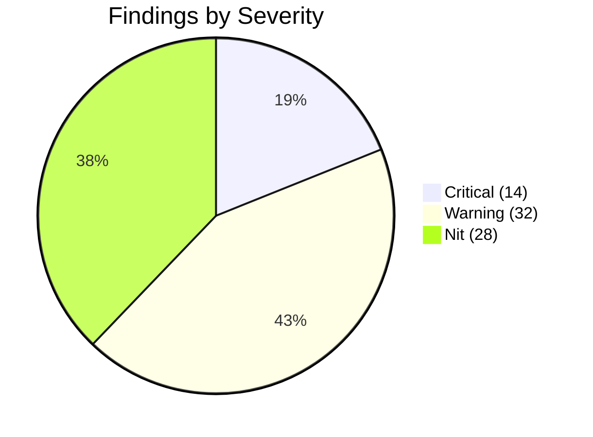
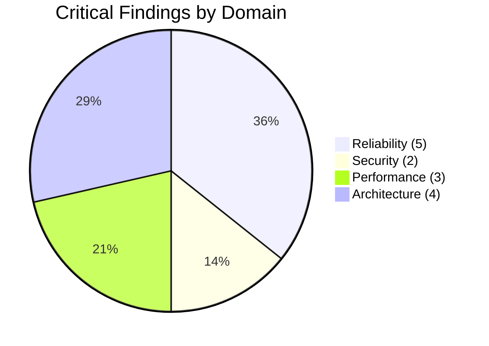

# Production Readiness Audit Report

> Comprehensive code audit across reliability, security, performance, and architecture. Originally generated 2026-02-06 by 4 automated review agents. Updated 2026-02-07 with current status verification against `develop` branch.

**Original Date**: 2026-02-06
**Last Verified**: 2026-02-07
**Branch**: develop
**Reviewers**: 4 automated agents (reliability, security, performance, architecture)

---

## Executive Summary

The audit identified **14 critical**, **32 warning**, and **28 nit** findings across four domains. The top priorities are: unauthenticated endpoints (security), query performance (13 correlated subqueries per wine row), XSS via unsanitized `{@html}` rendering, missing `ratingID` in history queries, and no CI/CD pipeline.

As of 2026-02-07, **1 finding has been partially addressed** (A-I7: `nul` file deleted). All other findings remain open.

| Domain | Critical | Warning | Nit | Fixed | Status |
|--------|----------|---------|-----|-------|--------|
| Reliability | 5 | 10 | 7 | 0 | Open |
| Security | 2 | 8 | 6 | 0 | Open |
| Performance | 3 | 7 | 8 | 0 | Open |
| Architecture | 4 | 7 | 7 | 1 partial | Open |
| **Total** | **14** | **32** | **28** | **1** | |

---

## Current Status Tracking

Items verified against `develop` branch on 2026-02-07:

| Finding | Status | Notes |
|---------|--------|-------|
| R-C1. addWine.php null coalescing | **Open** | Lines 20, 26-27, 32-33 still use bare `$data['key']` without `?? ''` |
| R-C2. updateWine.php undefined `$sql` | **Open** | Line 100 still references `$sql` instead of `$sqlQuery` |
| R-C3. Missing session_start() | **Open** | `addBottle.php:42` accesses `$_SESSION` without `session_start()` |
| R-C4. drinkBottle.php no range validation | **Open** | Lines 26-27 accept any values; no 1-10 range check |
| R-C5. getDrunkWines.php missing ratingID | **Open** | SELECT on lines 16-46 omits `ratings.ratingID` |
| S-C1. XSS via `{@html}` | **Open** | `TextMessage.svelte:49`, `TypewriterText.svelte:137` still render unsanitized; no `escapeHtml` function exists |
| S-C2. No authentication | **Open** | No auth middleware on any endpoint |
| P-C1. 13 correlated subqueries | **Open** | `getWines.php` unchanged |
| A-C1. No CI/CD | **Open** | No `.github/workflows/` directory |
| A-C2. No error page | **Open** | No `+error.svelte` or `hooks.client.ts` |
| A-C4. Legacy agent.ts | **Open** | Still 2044 lines; `agentMessages2`/`agentPhase2` aliases in `stores/index.ts` |
| A-I3. agent-test route | **Open** | `qve/src/routes/agent-test/+page.svelte` still present |
| A-I6. Orphan CollectionBar | **Open** | `components/layout/CollectionBar.svelte` still present |
| A-I7. Orphan `nul` file | **Fixed** | No longer found in project root |
| S-N1. .gitignore missing .env | **Open** | `.gitignore` has no `.env` exclusion rule |

---

## Reliability Review

### Critical

**R-C1. addWine.php: Missing null coalescing on required field access**
`resources/php/addWine.php:20, 26-27, 32-33, 52, 56, 60, 81-85`
Several `trim($data['key'])` calls lack `?? ''`. In PHP 8+, undefined array keys emit E_WARNING which can corrupt JSON output, causing frontend `response.json()` to fail.
**Fix**: Add `?? ''` to all `$data['key']` accesses matching the pattern already used on lines 39-49.

**R-C2. updateWine.php: Reference to undefined variable `$sql`**
`resources/php/updateWine.php:100`
`error_log('SQL: ' . $sql)` -- variable is named `$sqlQuery`. PHP Notice emitted on every wine update, potentially contaminating JSON output.
**Fix**: Change `$sql` to `$sqlQuery`.

**R-C3. Missing session_start() in updateWine, updateBottle, addBottle**
`resources/php/updateWine.php:59`, `updateBottle.php:46`, `addBottle.php:42`
These files access `$_SESSION['userID']` without calling `session_start()`. Audit log entries will never record who made changes.
**Fix**: Add the `session_start()` guard block from `drinkBottle.php`.

**R-C4. drinkBottle.php: No validation on rating ranges**
`resources/php/drinkBottle.php:26-27`
No range validation (1-10) on `overallRating` and `valueRating`. Compare with `updateRating.php:51-56` which correctly validates.
**Fix**: Add the same range validation as `updateRating.php`.

**R-C5. getDrunkWines.php: Missing ratingID in SELECT**
`resources/php/getDrunkWines.php:16-46`
The query doesn't select `ratings.ratingID`, but the frontend `DrunkWine` type expects it for `updateRating` calls. Rating edits from history view will fail silently.
**Fix**: Add `ratings.ratingID` to the SELECT clause.

### Warning

**R-W1. addBottle store: Sequential API calls without atomicity**
`qve/src/lib/stores/addBottle.ts:156-166`
Adding multiple bottles (quantity > 1) sends separate HTTP requests per bottle. Partial failure leaves some bottles committed with no rollback.

**R-W2. upload.php: Mixed output strategies**
`resources/php/upload.php:54-66, 305-309`
`validate_image()` uses `echo`, main script uses `json_encode()` for errors and plain text for success. Malformed responses on validation failure.

**R-W3. addWine.php: No audit logging**
`resources/php/addWine.php`
Despite including `audit_log.php`, never calls `logInsert()` for any of the 4 tables it modifies. No audit trail for new wines.

**R-W4. drinkBottle.php: Audit log uses wrong record ID**
`resources/php/drinkBottle.php:144`
`logUpdate($pdo, 'bottles', $wineID, ...)` -- should be `$bottleID`. Audit entries reference wrong ID.

**R-W5. API client: All requests use POST (even reads)**
`qve/src/lib/api/client.ts:64-71`
Prevents browser/CDN caching of read operations. Every filter change makes a full round-trip.

**R-W6. SSE streaming: No AbortController / cancellation**
`qve/src/lib/api/client.ts:102-167`
No way to cancel in-progress streams. Abandoned streams waste bandwidth and can block subsequent requests on mobile.

**R-W7. No double-click protection on submit buttons**
`qve/src/routes/add/+page.svelte:117-129`, `qve/src/routes/edit/[id]/+page.svelte:156-172`
Fast double-click before `isSubmitting` propagates could trigger duplicate submissions.

**R-W8. checkDuplicate.php: Loads all records into memory**
`resources/php/checkDuplicate.php`
Loads all records for Levenshtein comparison with no LIMIT. Degrades as collection grows.

**R-W9. Agent persistence: Race condition in debounced persistence**
`qve/src/lib/stores/agentPersistence.ts:128-177`
Read-merge-write is not atomic. Concurrent store persists could overwrite each other's changes.

**R-W10. Currency conversion: No rate freshness check**
`qve/src/lib/stores/currency.ts`
Rates loaded once at init, never refreshed. Stale rates affect price displays and cellar value.

### Nit

**R-N1.** `addBottle.php:20` -- wineID stored as string, not cast to int
**R-N2.** `upload.php:13` -- Directory created with 0777 permissions, should be 0755
**R-N3.** `drink/[id]/+page.svelte` -- Placeholder "Coming Soon" page still in codebase
**R-N4.** `getDrunkWines.php:75` -- Error log references wrong file (`getBottles.php`)
**R-N5.** `agentConversation.ts:126` -- messageCounter resets on HMR
**R-N6.** `upload.php:274` -- No disk space check before imagejpeg() write
**R-N7.** Frontend sends dates as DD/MM/YYYY, backend converts back to YYYY-MM-DD -- unnecessary double conversion

---

## Security Review

### Critical

**S-C1. Stored XSS via `{@html}` rendering of unsanitized LLM content**
`qve/src/lib/components/agent/content/TextMessage.svelte:49`, `TypewriterText.svelte:137`
The `wn()` helper (`personalities.ts:131`) wraps LLM-sourced wine names in `` tags without HTML escaping, then rendered via `{@html}`. Malicious LLM output could execute JavaScript.
**Fix**: HTML-escape all values in `wn()` before wrapping in HTML. Use `s.replace(/[&<>"']/g, ...)`.

**S-C2. No authentication or authorization on any endpoint**
All files in `resources/php/`
Zero authentication exists. Every endpoint is publicly accessible. `$_SESSION['userID']` references always resolve to null. Anyone with the URL can read/write all data and burn LLM API credits.
**Fix**: At minimum add API key auth or HTTP Basic Auth. For multi-user, implement proper session-based auth.

### Warning

**S-W1. SSL verification disabled on all outbound API calls**
`geminiAPI.php:79-80`, `GeminiAdapter.php:423,580`, `ClaudeAdapter.php:294-296`
All HTTPS calls to Gemini/Claude disable SSL verification. Enables MITM attacks on API key traffic.
**Fix**: Enable SSL verification. Configure `curl.cainfo` in `php.ini`.

**S-W2. No CSRF protection on state-changing endpoints**
All POST endpoints (addWine, updateWine, drinkBottle, etc.)
No CSRF tokens or Origin/Referer validation.

**S-W3. No CORS headers configured**
All PHP endpoints rely on browser same-origin policy with no explicit CORS configuration.

**S-W4. Error messages leak internal details**
17+ endpoints return `$e->getMessage()` to client -- can expose table names, SQL details, file paths.
**Fix**: Return generic errors to client, log details server-side (matching agent endpoint pattern).

**S-W5. normalize.php uses raw credential variables**
`resources/php/normalize.php:33`
Bypasses `getDBConnection()` and its security settings (`ATTR_EMULATE_PREPARES => false`).

**S-W6. No HTTP security headers**
No CSP, X-Frame-Options, X-Content-Type-Options, HSTS, or Referrer-Policy on any response.

**S-W7. Upload endpoint has no authentication**
`resources/php/upload.php`
Any client can upload images. Disk exhaustion risk. Directory created with 0777.

**S-W8. No input length limits on most endpoints**
Wine names, descriptions, notes have no server-side length limits. Megabytes of data could be sent.

### Nit

**S-N1.** `.gitignore` doesn't exclude `.env` files at root level
**S-N2.** Gemini API key passed in URL query parameter (visible in logs)
**S-N3.** Agent `userId` is client-controlled, defaults to 1 -- can bypass rate limits
**S-N4.** `updateWine.php:100` references undefined `$sql` variable (also reliability issue)
**S-N5.** Session handling inconsistent -- only 2 of 7 state-changing endpoints call `session_start()`
**S-N6.** PDO `ATTR_EMULATE_PREPARES => false` correctly set (positive finding)

### Positive Findings
- All SQL queries use parameterized statements -- **no SQL injection found**
- Database credentials properly externalized to `../wineapp-config/config.local.php`
- No hardcoded API keys or credentials in the codebase
- File upload validates type, size, and image validity with `getimagesize()`
- Upload filenames use cryptographic random (`random_bytes(16)`)
- Agent endpoints have proper error classification and user-friendly messages
- Vite proxy is dev-only and properly scoped

---

## Performance Review

### Critical

**P-C1. getWines.php: 13 correlated subqueries per wine row**
`resources/php/getWines.php:46-97`
SELECT clause contains 13 correlated subqueries (ratings, prices, medians, sources, buy-again). The `typeAvgPricePerLiterEUR` subquery scans ALL bottles of the same wine type for every row. With 100 wines = 1,300+ subquery evaluations per page load.
**Fix**: Refactor to JOINs with pre-aggregated CTEs. Convert type-level stats to a pre-calculated table.

**P-C2. getDrunkWines.php: No pagination**
`resources/php/getDrunkWines.php:16-54`
Returns every drunk bottle ever with no LIMIT. Full dataset held in browser memory and re-sorted on every filter/sort change.
**Fix**: Add server-side pagination with LIMIT/OFFSET. At minimum add a default limit.

**P-C3. Filter changes trigger full wine refetch with no debouncing**
`qve/src/routes/+page.svelte:62-69`
Every filter change fires a complete `fetchWines()` with no debounce. Rapid filter toggling can fire 3-5 API calls/second, each running 13 correlated subqueries.
**Fix**: Add 300-500ms debounce. Add AbortController to cancel in-flight requests.

### Warning

**P-W1. Client-side sort creates new array on every reactive change**
`qve/src/lib/stores/cellarSort.ts:56`
`[...wines].sort()` runs on every wines/sortKey/sortDir change. For 200+ wines causes GC pressure.

**P-W2. sortedDrunkWines recomputes on any of 5 dependency changes**
`qve/src/lib/stores/history.ts:75-169`
Currency conversion runs inside sort comparator -- O(N log N * lookup) per store change.

**P-W3. Missing composite index on bottles(wineID, bottleDrunk)**
`resources/sql/DBStructure.sql:223-226`
Most common query pattern has no covering index.
**Fix**: `CREATE INDEX idx_bottles_wine_drunk ON bottles (wineID, bottleDrunk);`

**P-W4. Missing composite index on ratings(wineID, overallRating, valueRating)**
`resources/sql/DBStructure.sql:260-264`
4 correlated subqueries in getWines.php would benefit from a covering index.
**Fix**: `CREATE INDEX idx_ratings_wine_scores ON ratings (wineID, overallRating, valueRating, buyAgain);`

**P-W5. AgentPanel loaded unconditionally in root layout**
`qve/src/routes/+layout.svelte:149-150`
466-line component + 1834-line store imported on every page even when agent is never opened.
**Fix**: Lazy-load AgentPanel on first bubble click.

**P-W6. Image compression blocks main thread**
`qve/src/lib/api/client.ts:1074-1153`
Full image loaded into memory, canvas operations on main thread. 200-500ms UI freeze on mobile.
**Fix**: Use OffscreenCanvas in Web Worker, or reduce max to 800x800.

**P-W7. Filter dropdown fetches options on every open (no filtered cache)**
`qve/src/lib/components/layout/FilterBar.svelte:99-142`
Cache only works for unfiltered state. Re-opening same dropdown with same filters triggers fresh API call.

### Nit

**P-N1.** WineCard fadeInUp animation runs on every re-render -- 50+ simultaneous animations after filter
**P-N2.** `countryCodeToEmoji` computed per card, not memoized
**P-N3.** `winesByCountry`/`winesByType` derived stores may be unused
**P-N4.** `upload.php:253-275` holds 3 GD images simultaneously -- 50-100MB memory spike
**P-N5.** All API reads use POST -- prevents browser caching
**P-N6.** Agent session persistence serializes 1-4MB base64 images on every debounced write
**P-N7.** MessageList flip animation runs on every message array change
**P-N8.** Agent timeout mismatch -- PHP 120s vs browser ~60s -- wasted processing after client disconnect

---

## Architecture Review

### Critical

**A-C1. No CI/CD Pipeline**
No `.github/workflows/` directory. No automated tests, linting, or build verification on push/PR. Tests exist only for agent code (21 test files). Zero tests for core stores, non-agent components, API client, or PHP backend.
**Fix**: Add GitHub Actions workflow: `npm run check`, `npm run lint`, `vitest run`, `npm run build`. Prioritize tests for `stores/wines.ts`, `stores/filters.ts`, `api/client.ts`.

**A-C2. No SvelteKit Error Page or Global Error Handling**
No `+error.svelte`, `hooks.server.ts`, or `hooks.client.ts`. Unhandled runtime errors show a blank white page.
**Fix**: Add `+error.svelte` with recovery UI. Add `hooks.client.ts` with `handleError`.

**A-C3. No Authentication or Authorization**
(Overlaps with S-C2.) All PHP endpoints accept unauthenticated requests. Only `.htaccess` blocks `config.local.php`.
**Fix**: Add shared auth middleware to all mutation endpoints at minimum.

**A-C4. Legacy agent.ts Store (2044 lines) Coexists with New Architecture**
`stores/agent.ts` is still imported in production (`agent/handlers/conversation.ts:18`). New modular stores exist alongside with `2`-suffixed aliases in `stores/index.ts` (`agentMessages2`, `agentPhase2`, etc.).
**Fix**: Complete migration, remove `agent.ts`, eliminate `2` suffixes.

### Important

**A-I1. No Database Migration Runner**
7 migration files exist in `resources/sql/migrations/` with no versioning, ordering, or tracking.
**Fix**: Add `schema_versions` table + PHP script to run unapplied migrations.

**A-I2. No Focus Trapping in Modals**
All modals (`DrinkRateModal`, `AddBottleModal`, `ConfirmModal`, `SettingsModal`, `ImageLightboxModal`) lack focus trapping. Users can Tab out. Missing `role="dialog"` and `aria-modal="true"` (only `AILoadingOverlay` has them).
**Fix**: Add focus trap utility. Apply `role="dialog"` and `aria-modal="true"` to all modals.

**A-I3. `agent-test` Route Ships to Production**
`qve/src/routes/agent-test/+page.svelte` (580 lines) -- dev testing page included in production builds.
**Fix**: Delete or gate behind dev-only check.

**A-I4. Deploy Script Missing Branch Check**
`deploy.ps1` doesn't verify git branch or check for uncommitted changes before deploying.
**Fix**: Require `main` branch (with override flag), warn on uncommitted changes.

**A-I5. No Frontend Error Tracking or Monitoring**
No APM (Sentry, etc.), no global error handler for unhandled promise rejections. No health check endpoint.
**Fix**: Add `hooks.client.ts` with error tracking. Add health check PHP endpoint.

**A-I6. Orphan Component: `CollectionBar.svelte`**
`qve/src/lib/components/layout/CollectionBar.svelte` -- never imported, superseded by `CollectionRow.svelte`.
**Fix**: Delete.

**A-I7. Orphan File: `nul` in Project Root** -- **FIXED**
~~Windows artifact (98 bytes) from command that redirected stderr to `nul`. Checked into git.~~
Verified 2026-02-07: File no longer exists in project root.

### Nice to Have

**A-N1.** Large components (500+ lines): `HistoryCard`, `DrinkRateModal`, `WineCard`, `AddBottleModal`, `FilterDropdown` -- could benefit from sub-component extraction
**A-N2.** TypeScript `any` usage minimal (~3 in production code) -- replace with proper types
**A-N3.** Barrel export inconsistencies -- dead exports in `modals/index.ts`, forms barrel not re-exported
**A-N4.** PWA service worker caches API POST responses for 5 min -- stale data risk after mutations
**A-N5.** No general request logging middleware -- only agent endpoints have structured logging
**A-N6.** `api/client.ts` is 1159 lines -- could split by domain if maintenance becomes difficult
**A-N7.** `stores/index.ts` is 401 lines -- will shrink after A-C4 legacy store removal

---

## Recommended Implementation Plan

### Phase 1: Stop the Bleeding (Security + Crashes)
*Estimated: 1-2 sprints*

| # | Task | Findings | Effort |
|---|------|----------|--------|
| 1 | Sanitize `{@html}` content -- add `escapeHtml()` to `wn()` | S-C1 | Small |
| 2 | Add basic API key auth to all PHP endpoints | S-C2 | Medium |
| 3 | Enable SSL verification on outbound API calls | S-W1 | Small |
| 4 | Fix `client.ts` fetchJSON to handle non-JSON error responses | R-C1 implied | Small |
| 5 | Add rating range validation to `drinkBottle.php` | R-C4 | Small |
| 6 | Add `ratingID` to getDrunkWines.php SELECT | R-C5 | Small |
| 7 | Fix null coalescing in addWine.php | R-C1 | Small |
| 8 | Fix undefined `$sql` in updateWine.php | R-C2 | Tiny |
| 9 | Add session_start() to updateWine/updateBottle/addBottle | R-C3 | Small |
| 10 | Fix audit log wrong ID in drinkBottle.php | R-W4 | Small |
| 11 | Add security headers to PHP responses | S-W6 | Small |
| 12 | Return generic error messages to clients | S-W4 | Medium |

### Phase 2: Performance Floor (Biggest Bottlenecks)
*Estimated: 1-2 sprints*

| # | Task | Findings | Effort |
|---|------|----------|--------|
| 1 | Rewrite getWines.php -- eliminate correlated subqueries | P-C1 | Large |
| 2 | Add server-side pagination to getDrunkWines.php | P-C2 | Medium |
| 3 | Add debouncing + AbortController to filter changes | P-C3 | Medium |
| 4 | Add composite DB indexes (bottles, ratings) | P-W3, P-W4 | Small |
| 5 | Batch filter options into single API call | P-W7 | Medium |

### Phase 3: Operational Confidence (CI, Errors, Monitoring)
*Estimated: 1-2 sprints*

| # | Task | Findings | Effort |
|---|------|----------|--------|
| 1 | Add GitHub Actions CI (check, lint, test on PRs) | A-C1 | Medium |
| 2 | Add `+error.svelte` and `hooks.client.ts` | A-C2, A-I5 | Small |
| 3 | Add health check endpoint | A-I5 | Small |
| 4 | Complete old-to-new agent store migration, remove `2` suffixes | A-C4 | Medium |
| 5 | Add input length limits to PHP endpoints | S-W8 | Small |
| 6 | Lazy-load AgentPanel | P-W5 | Small |
| 7 | Remove `agent-test` route from production | A-I3 | Tiny |
| 8 | Delete orphan files (`CollectionBar.svelte`) | A-I6 | Tiny |
| 9 | Add deploy script branch check | A-I4 | Small |

### Phase 4: Production Polish
*Estimated: 2+ sprints*

| # | Task | Findings | Effort |
|---|------|----------|--------|
| 1 | Add tests for core stores (wines, filters, currency) | A-C1 | Large |
| 2 | Add tests for API client | A-C1 | Medium |
| 3 | Add database migration runner | A-I1 | Medium |
| 4 | Add accessibility improvements (focus trapping, aria-modal, skip nav) | A-I2 | Medium |
| 5 | Image optimization (srcset, Web Worker compression) | P-W6, P-N6 | Medium |
| 6 | Convert read endpoints to GET for browser caching | R-W5, P-N5 | Medium |
| 7 | Add CSRF protection | S-W2 | Medium |
| 8 | Add stream cancellation (AbortController) | R-W6 | Small |

---

*Generated by automated code review team (2026-02-06). 4 specialized agents reviewed reliability, security, performance, and architecture. Status last verified 2026-02-07.*
