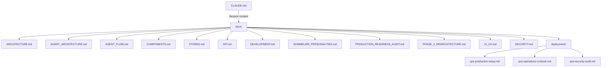

# Documentation Index

> Central index for all Qvé Wine App documentation. Each document covers a specific domain of the codebase with detailed references, diagrams, and code examples.

**Last Updated**: 2026-02-14

---

## Documentation Map

---

## Quick Reference

| Document | Scope | When to Use |
|----------|-------|-------------|
| **[CLAUDE.md](../CLAUDE.md)** | AI session context, quick start, key patterns | Starting any work session; quick lookups |
| **[ARCHITECTURE.md](ARCHITECTURE.md)** | System architecture, data flow, tech stack | Understanding overall system design and data flow |
| **[AGENT_ARCHITECTURE.md](AGENT_ARCHITECTURE.md)** | Agent router, state machine, handlers, middleware, messages, chips | Working on the AI agent (identification, enrichment, add-to-cellar) |
| **[PHASE_2_REARCHITECTURE.md](AGENT_ARCHITECTURE_PHASE_2.md)** | Historical: Phase 2 migration from monolithic to modular agent | Understanding why the agent architecture looks the way it does |
| **[AGENT_FLOW.md](AGENT_FLOW.md)** | End-to-end agent user flows with diagrams | Understanding agent conversation paths and state transitions |
| **[COMPONENTS.md](COMPONENTS.md)** | 90+ Svelte component APIs, props, usage | Building or modifying UI components |
| **[STORES.md](STORES.md)** | 24 Svelte store APIs, state shapes, actions | Working with application state management |
| **[API.md](API.md)** | TypeScript client methods, PHP endpoints, types, SSE streaming | Working with frontend-backend communication |
| **[DEVELOPMENT.md](DEVELOPMENT.md)** | Setup, workflow, testing, deployment, debugging | Setting up the project or running dev tooling |
| **[SOMMELIER_PERSONALITIES.md](SOMMELIER_PERSONALITIES.md)** | Agent personality configuration and message templates | Customizing agent tone and response style |
| **[PRODUCTION_READINESS_AUDIT.md](PRODUCTION_READINESS_AUDIT.md)** | Security, reliability, performance, architecture findings | Prioritizing technical debt and improvements |
| **[UI_UX.md](UI_UX.md)** | Design system, visual language, interaction patterns | Building UI components; understanding design decisions |
| **[SECURITY.md](SECURITY.md)** | Authentication, CORS, CSRF, security headers, input validation | Reviewing or modifying security measures |
| **[deployment/qve-production-setup.md](deployment/qve-production-setup.md)** | Full server setup from blank Ubuntu box | Initial production deployment |
| **[deployment/qve-operations-runbook.md](deployment/qve-operations-runbook.md)** | Maintenance procedures (weekly/monthly/quarterly/annual) | Ongoing server maintenance and incident response |
| **[deployment/qve-security-audit.md](deployment/qve-security-audit.md)** | Security audit checklist with expected results | Quarterly security reviews |

---

## Document Summaries

### [ARCHITECTURE.md](ARCHITECTURE.md)
System-level architecture covering the full stack: SvelteKit frontend, PHP backend, MySQL database, and external AI services (Gemini, Claude). Includes data flow diagrams, the cascading filter system, currency conversion pipeline, and deployment architecture.

### [AGENT_ARCHITECTURE.md](AGENT_ARCHITECTURE.md)
Deep reference for the AI wine agent system. Covers the action router (with alias resolution), finite state machine (8 phases), handler implementations (identification, enrichment, add-to-cellar, conversation), middleware pipeline (error handling, retry tracking, validation), message factory system, chip configuration for each phase, command detection, and error handling patterns.

### [PHASE_2_REARCHITECTURE.md](AGENT_ARCHITECTURE_PHASE_2.md)
Historical document describing the migration from the monolithic `ChatMessage.svelte` (1800+ lines) and `agent.ts` (2044 lines) to the current modular architecture with separate handler files, message factories, and split stores.

### [AGENT_FLOW.md](AGENT_FLOW.md)
User-facing flow documentation showing the complete agent conversation lifecycle with state diagrams. Covers text identification, image identification, enrichment, add-to-cellar, duplicate handling, and error recovery flows.

### [COMPONENTS.md](COMPONENTS.md)
Complete API reference for all 90+ Svelte components organized by category: UI primitives, wine display, layout, forms, wizard, modals, edit pages, and agent. Each entry includes props, events, slots, and usage examples.

### [STORES.md](STORES.md)
Reference for all 24 Svelte stores (16 core + 8 agent/settings). Documents state shapes, exported actions, derived stores, and inter-store dependencies. Includes the cascading filter store interaction pattern.

### [API.md](API.md)
Complete API reference covering all TypeScript client methods (30+), PHP backend endpoints (20 core + 3 auth + 11 agent), type definitions, the SSE streaming protocol, error handling patterns (standard vs. agent structured errors), field name mapping between frontend and backend, and design notes on dual auth, 401 redirect handling, and null byte sanitization.

### [DEVELOPMENT.md](DEVELOPMENT.md)
Developer guide covering environment setup, development workflow, Git branching strategy, testing approach, deployment via `deploy.ps1`, JIRA CLI usage, and common debugging techniques.

### [SOMMELIER_PERSONALITIES.md](SOMMELIER_PERSONALITIES.md)
Configuration reference for the agent's sommelier personality system. Documents how personality traits affect message tone, wine name formatting, and response templates.

### [PRODUCTION_READINESS_AUDIT.md](PRODUCTION_READINESS_AUDIT.md)
Comprehensive audit report from 2026-02-06 covering reliability (5 critical), security (2 critical), performance (3 critical), and architecture (4 critical) findings. Includes a phased implementation plan for remediation. See the "Current Status" section for which issues have been addressed since the audit.

### [UI_UX.md](UI_UX.md)
Complete UI/UX design guide documenting the "quiet luxury" design philosophy, color system (light/dark modes), typography, spacing, elevation, motion, iconography, responsive breakpoints, component patterns, rating interface, AI loading states, toast notifications, empty/error states, iOS Safari specifics, and accessibility guidelines. Consolidates design decisions from the original mockups into implementation guidance.

### [SECURITY.md](SECURITY.md)
Security reference covering dual authentication (API key + session cookie), CORS policy, CSRF protection, HTTP security headers, input validation patterns, and file upload security. Documents the auth flow through `authMiddleware.php` and the session-based login system in `auth/`.

### Deployment Docs (`deployment/`)

#### [qve-production-setup.md](deployment/qve-production-setup.md)
Complete 14-phase walkthrough for setting up a production server from a blank Ubuntu box. Covers system packages, directory structure, MySQL (app + locked migration user), Apache vhost with SPA fallback, PHP hardening, firewall, git deployment, health checks, 3-tier backup system (local DB + images + Backblaze B2 offsite), log rotation, cron jobs, Cloudflare Tunnel, and GitHub Actions automated deployment.

#### [qve-operations-runbook.md](deployment/qve-operations-runbook.md)
Ongoing maintenance procedures organized by frequency: weekly (log review, backup verification), monthly (npm audit, access pattern review, disk/DB growth, cloudflared updates), quarterly (full security audit, system updates, backup restore test, credential rotation), and annual (full disaster recovery dry-run, setup doc drift audit). Includes incident response procedures for compromise, downtime, and disk full scenarios.

#### [qve-security-audit.md](deployment/qve-security-audit.md)
Quarterly security audit checklist with 45+ checks organized by category: attack surface, Apache hardening, PHP hardening, MySQL security, file permissions, authentication & secrets, SSH hardening, Cloudflare tunnel, upload security, application-level security, logging & monitoring, and system-level hardening. Each check has expected results and red flags.

---

## Project-Level Files

| File | Purpose |
|------|---------|
| [CLAUDE.md](../CLAUDE.md) | AI assistant session context with quick start, architecture overview, key patterns |
| [README.md](../README.md) | Project overview for GitHub |
| [scripts/deploy.ps1](../deploy.ps1) | PowerShell deployment script with backup/rollback |
| [scripts/jira.ps1](../scripts/jira.ps1) | JIRA CLI for issue and sprint management |

---

## Archive

V1 app documentation is preserved in `archive/v1-docs/`:
- Sprint documentation
- Module guide (ES6 modules)
- Testing guides
- GitHub setup guides

These are historical references for the pre-SvelteKit version of the app and are not relevant to current development.
