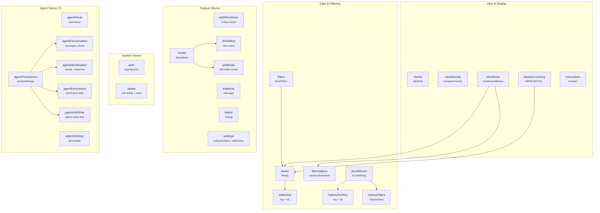

# Stores Reference

> **26 Svelte stores** (19 core + 7 agent) managing all application state. Core stores use plain `writable`/`derived` stores with exported action functions. Agent stores follow the same pattern but are split into domain-specific modules. All stores are barrel-exported from `$lib/stores`.

---

## Store Relationship Diagram



---

## Import Pattern

All stores use individual named exports (not store objects with methods). Import from `$lib/stores`:

```typescript
import {
  wines, winesLoading, winesError,           // Writable stores
  totalBottles, wineCount,                   // Derived stores
  updateWineInList, incrementBottleCount,     // Action functions
  fetchWines, cancelFetchWines               // Fetch actions (WIN-206)
} from '$lib/stores';
```

---

## Core Stores

### wines (`stores/wines.ts`)

Wine collection state. A plain writable array plus helper writables and derived stores.

```typescript
// Writable stores
wines              // writable<Wine[]> - main wine list
winesLoading       // writable<boolean> - fetch in progress
winesError         // writable<string | null> - error message
targetWineID       // writable<number | null> - scroll target after operations
expandedWineIDs    // writable<Set<number>> - multi-card expansion tracking

// Derived stores
totalBottles       // derived - sum of all wine.bottleCount
wineCount          // derived - $wines.length

// Action functions
toggleWineExpanded(id: number): void
collapseWine(id: number): void
collapseAllWines(): void
getWineById(wineList: Wine[], id: number): Wine | undefined
updateWineInList(id: number, updates: Partial<Wine>): void
removeWineFromList(id: number): void
decrementBottleCount(id: number): void
incrementBottleCount(id: number, count?: number): void
scrollToWine(id: number): void  // Sets targetWineID, auto-clears after 2.5s

// WIN-206: Debounced fetch with abort
fetchWines(filterValues?: WineFilters, immediate?: boolean): void
cancelFetchWines(): void
```

`fetchWines()` debounces rapid calls (300ms), aborts in-flight requests, and guards against stale responses via a fetch counter.

**Usage:**
```svelte
<script>
  import { wines, winesLoading, totalBottles } from '$lib/stores';
  $: count = $wines.length;
  $: bottles = $totalBottles;
</script>
```

### filters (`stores/filters.ts`)

Active filter state for the wine list. Uses `WineFilters` type from `api/types`.

```typescript
// Writable store
filters            // writable<WineFilters> - active filter values

// Derived stores
hasActiveFilters   // derived<boolean> - any non-bottleCount filter active
activeFilterCount  // derived<number> - count of active filters
activeFilterList   // derived<{ key, value }[]> - human-readable filter list
hasSearchQuery     // derived<boolean> - search query is non-empty
searchQuery        // derived<string> - current search query text

// Action functions
setFilter(key: keyof WineFilters, value: string | undefined): void
setFilters(newFilters: Partial<WineFilters>): void
clearFilter(key: keyof WineFilters): void
clearAllFilters(): void   // Preserves bottleCount (view mode)
resetFilters(): void      // Clears everything including bottleCount
```

**WineFilters keys**: `countryDropdown`, `typesDropdown`, `regionDropdown`, `producerDropdown`, `yearDropdown`, `bottleCount`

**Usage:**
```typescript
import { setFilter, clearAllFilters, hasActiveFilters } from '$lib/stores';

setFilter('typesDropdown', 'Red');
setFilter('countryDropdown', 'France');
clearAllFilters();
```

### filterOptions (`stores/filterOptions.ts`)

Cached dropdown options for filter controls. Options are cached per view mode (ourWines/allWines) to avoid refetching.

```typescript
// Writable store (custom)
filterOptions     // FilterOptionsState with per-category cached options

// Type
interface FilterOption {
  value: string;
  label: string;
  count?: number;
  meta?: string;   // e.g., country code for flag emoji
}
```

The store has methods for fetching individual filter categories (countries, types, regions, producers, years), with cache invalidation tied to view mode changes.

### view (`stores/view.ts`)

View density (card layout) and view mode (Cellar vs All Wines). Both persist to localStorage.

```typescript
// View Density
viewDensity        // custom store: 'compact' | 'medium'
  .set(value)
  .toggle()

// View Mode
viewMode           // custom store: 'ourWines' | 'allWines'
  .set(value)               // Set without history push
  .setWithHistory(value)    // Set and push history entry (for back button)
  .toggle()
  .restoreFromHistory(mode) // Called on popstate

// Derived
bottleCountParam   // derived: '1' (ourWines) | '0' (allWines) for API calls

// Types
type ViewDensity = 'compact' | 'medium';
type ViewMode = 'ourWines' | 'allWines';
```

**Usage:**
```typescript
import { viewMode, viewDensity, bottleCountParam } from '$lib/stores';

viewMode.setWithHistory('allWines');  // Pushes history for back button
const apiParam = $bottleCountParam;   // '0' for allWines
```

### theme (`stores/theme.ts`)

Light/dark theme with localStorage persistence and system preference detection.

```typescript
// Custom store
theme              // 'light' | 'dark'
  .set(value)
  .toggle()
  .initialize()    // Call in root layout onMount

// Type
type Theme = 'light' | 'dark';
```

Applies `data-theme` attribute to `<html>` and updates PWA `theme-color` meta tag. Listens for system preference changes (only auto-switches if no explicit preference stored).

### cellarSort (`stores/cellarSort.ts`)

Sort configuration for the cellar wine list. Client-side sorting.

```typescript
// Writable stores
cellarSortKey      // writable<CellarSortKey> - default: 'producer'
cellarSortDir      // writable<CellarSortDir> - default: 'asc'

// Action functions
setCellarSort(key: CellarSortKey, dir?: CellarSortDir): void
toggleCellarSortDir(): void
sortWines(wines: Wine[], sortKey: CellarSortKey, sortDir: CellarSortDir): Wine[]

// Types
type CellarSortKey = 'producer' | 'wineName' | 'country' | 'region' | 'year'
  | 'type' | 'rating' | 'ratingOverall' | 'ratingValue'
  | 'bottles' | 'price' | 'priceBottle';
type CellarSortDir = 'asc' | 'desc';
```

`sortWines()` handles null values (unrated wines, missing years/prices) by pushing them to the end regardless of direction.

### currency (`stores/currency.ts`)

Display currency management with API-driven exchange rates and conversion utilities.
Rates auto-refresh on tab visibility change when stale (>24 hours) — see WIN-231.

```typescript
// Writable stores
displayCurrency        // custom store: CurrencyCode (default: 'GBP')
  .set(value)
  .initialize()        // Fetches currencies/bottle sizes from API
availableCurrencies    // writable<Currency[]> - from API (auto-refreshed when stale)
availableBottleSizes   // writable<BottleSize[]> - from API

// Derived stores
currentCurrency        // derived<Currency> - full currency object for display code
bottleSizeSelectOptions // derived<{ value, label }[]> - for form dropdowns
currencySelectOptions   // derived<{ value, label }[]> - for form dropdowns

// Conversion functions
convertFromEUR(priceEUR: number, targetCurrency: Currency): number
convertToEUR(price: number, originalCurrency: Currency): number
convertCurrency(price: number, from: Currency, to: Currency): number

// Formatting functions
formatPrice(price: number | string | null, currency: Currency): string | null
formatPriceFromEUR(priceEUR: number | string | null, target: Currency): string | null
formatPriceConverted(price, origCode, currencies, target): string | null
formatCompactValue(value: number | string | null, currency: Currency): string | null
getCurrencyByCode(code: string, currencies: Currency[]): Currency | null

// Types
type CurrencyCode = 'GBP' | 'EUR' | 'USD' | 'AUD' | 'NZD' | 'CHF' | 'DKK' | 'NOK' | 'SEK' | 'JPY' | 'HKD';
```

**Usage:**
```typescript
import { currentCurrency, formatCompactValue, convertFromEUR } from '$lib/stores';

const localPrice = convertFromEUR(100, $currentCurrency);
const compact = formatCompactValue(45000, $currentCurrency); // "~£45k"
```

### settings (`stores/settings.ts`)

User settings persisted to database with localStorage fallback.

```typescript
// Collection Name (WIN-126)
collectionName         // custom store: string (default: 'Our Wines')
  .initialize()        // Load from DB on app mount
  .update(name)        // Persist to DB (optimistic update + localStorage fallback)
  .isInitialized       // readable<boolean>
  .isSaving            // readable<boolean>

// Cellar Value (WIN-127)
cellarValue            // custom store: CellarValue | null
  .fetch(forceRefresh?) // Fetch from API with 60s cache
  .invalidate()         // Clear cache (call after adding/removing bottles)
  .isLoading            // readable<boolean>
```

---

## Feature Stores

### addWine (`stores/addWine.ts`)

4-step wizard state for adding wines. Manages region -> producer -> wine -> bottle flow with duplicate detection.

```typescript
// Main store
addWineStore       // custom store with methods:
  .setStep(step)
  .setMode(step, mode)
  .setRegionField(key, value)
  .setProducerField(key, value)
  .setWineField(key, value)
  .setBottleField(key, value)
  .selectEntity(step, entity)
  .submit()
  .reset()
  .prefillFromAgent(parsed)
  .checkDuplicate(type, value, extra?)

// Derived stores
currentStep        // derived<WizardStep> (1-4)
isSubmitting       // derived<boolean>
isAILoading        // derived<boolean>
canProceed         // derived<boolean> - current step validation
aiLoadingMessages  // derived<string[]> - rotating loading messages

// Types
type WizardStep = 1 | 2 | 3 | 4;
type SelectionMode = 'search' | 'create';
interface RegionFormData { regionName, country, countryID, drinkType, description, climate, soil }
interface ProducerFormData { producerName, town, founded, ownership, description }
interface WineFormData { wineName, wineYear, isNonVintage, wineType, wineTypeID, description, tastingNotes, pairing, imageFile, imagePreview, uploadedFilename }
interface BottleFormData { bottleSize, storageLocation, source, price, currency, purchaseDate }
```

### drinkWine (`stores/drinkWine.ts`)

Drink/Rate modal state. Supports both new ratings and editing existing ratings.

```typescript
// Main store
drinkWine          // custom store with methods:
  .init(wine)      // New rating: load wine data + fetch bottles
  .initEdit(drunkWine) // Edit: pre-populate from existing rating
  .selectBottle(bottleID)
  .setOverallRating(value)
  .setValueRating(value)
  .setOptionalRating(type, value)
  .toggleMoreRatings()
  .submit()        // Submit new rating via api.drinkBottle()
  .submitEdit()    // Update existing rating via api.updateRating()
  .reset()

// Derived stores
isDirty            // derived<boolean> - has unsaved changes
canSubmit          // derived<boolean> - valid for submission
selectedBottle     // derived<Bottle | undefined> - currently selected bottle

// State shape (DrinkWineState)
// Wine context: wineID, wineName, wineRegion, wineCountry, wineImage, wineYear
// Bottle: bottleID, availableBottles
// Ratings: overallRating (1-10), valueRating (1-10)
// Optional: complexityRating, drinkabilityRating, surpriseRating, foodPairingRating (0-5)
// Other: drinkDate, buyAgain, notes
// UI: isLoading, isSubmitting, errors
// Edit mode: isEditMode, ratingID, originalValues
```

### editWine (`stores/editWine.ts`)

Edit Wine/Bottle page form state with dirty checking.

```typescript
// Main store
editWine           // custom store with methods:
  .init(wineId)    // Load wine data + bottles
  .setTab(tab)     // 'wine' | 'bottle'
  .selectBottle(bottleId)
  .setWineField(key, value)
  .setBottleField(key, value)
  .setWineImage(file, preview)
  .submitWine()
  .submitBottle()
  .reset()

// Derived stores
isWineDirty        // derived<boolean>
isBottleDirty      // derived<boolean>
isEditDirty        // derived<boolean> - either tab dirty
canSubmitWine      // derived<boolean>
canSubmitBottle    // derived<boolean>
hasBottles         // derived<boolean>
wineTypeOptions    // derived<{ value, label }[]>

// Types
interface EditWineFormData { wineName, wineYear, isNonVintage, wineType, wineDescription, wineTasting, winePairing, winePicture, picturePreview, pictureFile }
interface EditBottleFormData { bottleSize, location, source, price, currency, purchaseDate }
interface EditWineState { wineID, activeTab, wine, originalWine, bottles, selectedBottleID, bottle, originalBottle, wineTypes, isLoading, isSubmitting, errors }
```

### addBottle (`stores/addBottle.ts`)

Add Bottle modal state.

```typescript
// Main store
addBottle          // custom store with methods:
  .init(wineID, wineName)
  .setField(key, value)
  .setQuantity(n)
  .submit()
  .reset()

// Derived stores
isDirtyAddBottle   // derived<boolean>
canSubmitAddBottle // derived<boolean>

// Constants
storageOptions     // Array of { value, label } for location dropdown

// State shape (AddBottleState)
// wineID, wineName, bottleSize, storageLocation, source, price, currency, purchaseDate, quantity, isSubmitting, errors
```

### history (`stores/history.ts`)

Drink history state with server-side pagination, filtering, and sorting (WIN-205).

```typescript
// Writable stores
drunkWines             // writable<DrunkWine[]> - current page from server
historyLoading         // writable<boolean>
historyError           // writable<string | null>
historySortKey         // writable<HistorySortKey> - default: 'drinkDate'
historySortDir         // writable<HistorySortDir> - default: 'desc'
historyFilters         // writable<HistoryFilters>
expandedHistoryKey     // writable<string | null> - "wineID-bottleID"

// WIN-205: Server-side pagination
historyPagination      // writable<PaginationMeta> - { page, limit, total, totalPages }
historyFilterOptions   // writable<HistoryFilterOptions> - server-provided cascading options
unfilteredDrunkWineCount // writable<number> - total before filtering (for empty state detection)

// Derived stores
hasHistoryFilters       // derived<boolean>
activeHistoryFilterCount // derived<number>
sortedDrunkWines        // derived<DrunkWine[]> - pass-through (server sorts)
drunkWineCount          // derived<number> - uses unfilteredDrunkWineCount
filteredDrunkWineCount  // derived<number> - count after filtering

// Action functions
setHistorySort(key: HistorySortKey, dir?: HistorySortDir): void
toggleHistorySortDir(): void
setHistoryFilter(key: keyof HistoryFilters, value: string | undefined): void
clearHistoryFilters(): void
getDrunkWineKey(wine: DrunkWine): string  // Returns "wineID-bottleID"

// WIN-205/206: Server-side fetch
fetchHistory(): void           // Debounced, abort-aware server fetch
cancelFetchHistory(): void     // Cancel in-flight request

// Types
type HistorySortKey = 'drinkDate' | 'rating' | 'overallRating' | 'valueRating' | 'wineName' | 'wineType' | 'country' | 'producer' | 'region' | 'year' | 'price' | 'buyAgain';
type HistorySortDir = 'asc' | 'desc';
interface HistoryFilters { countryDropdown?, typesDropdown?, regionDropdown?, producerDropdown?, yearDropdown? }
```

---

## UI Stores

### toasts (`stores/toast.ts`)

Toast notification queue with auto-dismiss and action support.

```typescript
// Main store
toasts             // custom store (subscribable as Toast[]):
  .add({ type, message, duration?, action? }): string  // Returns toast ID
  .remove(id): void
  .clear(): void
  // Convenience methods:
  .success(message, action?): string
  .error(message, action?): string
  .info(message, action?): string
  .warning(message, action?): string
  .undo(message, undoCallback): string

// Derived stores
hasToasts          // derived<boolean>
latestToast        // derived<Toast | null>

// Types
type ToastType = 'success' | 'error' | 'info' | 'warning' | 'undo';
interface Toast { id, type, message, duration, action?, createdAt }
interface ToastAction { label: string; callback: () => void }
```

**Default durations**: success=4s, error=8s, info=5s, warning=6s, undo=5s. Duration 0 = no auto-dismiss.

### modal (`stores/modal.ts`)

Modal container state with dirty-check hook system and browser back button support.

```typescript
// Main store
modal              // custom store (subscribable as ModalState):
  // Core operations
  .open(type, data?): void
  .close(): void
  .closeFromPopstate(): void
  .updateData(data): void
  .requestClose(): Promise<void>  // Runs dirty check hook first

  // Dirty check hooks
  .registerBeforeCloseHook(hook): void
  .clearBeforeCloseHook(): void
  .showConfirmOverlay(options): void
  .hideConfirmOverlay(): void

  // Convenience methods
  .openDrink(wine): void
  .openEditRating(drunkWine): void
  .openAddBottle(wineID, wineName, pictureURL?, year?, regionName?, countryName?): void
  .openEdit(wineID, bottleID?): void
  .confirm(options: ConfirmModalData): void
  .showAILoading(message?): void
  .hideAILoading(): void
  .openSettings(): void
  .openImageLightbox(src, alt?): void

// Derived stores
isModalOpen        // derived<boolean>
isModalType(type)  // factory: derived<boolean>
modalData          // derived<Record<string, unknown> | undefined>
confirmOverlay     // derived<ConfirmModalData | null>

// Types
type ModalType = 'drink' | 'editRating' | 'addBottle' | 'edit' | 'confirm' | 'aiLoading' | 'settings' | 'imageLightbox' | 'deleteConfirm' | 'cellarValue' | null;
interface ModalState { type, data?, pushedHistory?, beforeCloseHook?, confirmOverlay? }
interface ConfirmModalData { title, message, confirmLabel?, cancelLabel?, onConfirm, onCancel?, variant? }
```

**Dirty check pattern**: Modal components register a `beforeCloseHook` that returns `{ dirty, confirmation, onConfirm }`. When `requestClose()` is called and the modal is dirty, a stacked confirmation overlay appears on top of the modal (rather than replacing it).

**History integration**: User-facing modals push a history entry on open; browser back button closes the modal via `closeFromPopstate()`.

### menu (`stores/menu.ts`)

Side menu open/close state.

```typescript
menuOpen           // writable<boolean>
openMenu(): void
closeMenu(): void
toggleMenu(): void
```

### scrollPosition (`stores/scrollPosition.ts`)

Scroll position restoration for back/forward navigation.

```typescript
saveScrollPosition(path: string): void     // Save current window.scrollY
getScrollPosition(path: string): number    // Get saved position (default 0)
clearScrollPositions(): void               // Clear all saved positions
```

Stores positions keyed by pathname in a private writable store.

---

## System Stores

### auth (`stores/auth.ts`)

Authentication state for login/session management (WIN-254). Uses PHP session cookies.

```typescript
// Main store
auth               // custom store with methods:
  .initialize()    // Check auth status on app mount
  .checkAuth()     // Re-check auth (e.g., after tab switch)
  .login(password: string): Promise<boolean>
  .logout(): Promise<void>

// Derived stores
isAuthenticated    // derived<boolean> - is user logged in
isAuthChecking     // derived<boolean> - auth check in progress
isAuthLoggingOut   // derived<boolean> - logout in progress
authError          // derived<string | null> - error message
```

**Race condition protection**: Uses `fetchCounter` + `AbortController` pattern (same as `wines.ts`).

### delete (`stores/delete.ts`)

Soft delete with undo window (WIN-80). Uses requestAnimationFrame-based timers for smooth countdown.

```typescript
// Main store
deleteStore        // object with methods:
  .requestDelete(type, id, name, snapshot): string  // Start delete with undo window
  .undoDelete(pendingId): void                      // Cancel pending delete
  .pauseTimer(pendingId): void                      // Pause undo countdown (on hover)
  .resumeTimer(pendingId): void                     // Resume countdown
  .getElapsedPercent(pendingId): number              // Progress for UI (0-1)

// Derived stores
hasPendingDeletes  // derived<boolean> - any pending deletes
pendingDeleteCount // derived<number> - count of pending deletes
deleteLoading      // derived<boolean> - deletion API call in progress
deleteError        // derived<string | null> - error message

// Constants
UNDO_DURATION_MS   // 5000ms (undo window duration)

// Types
type DeleteEntityType = 'wine' | 'bottle' | 'producer' | 'region';
interface DeleteImpact { producers?, wines?, bottles?, ratings? }
interface PendingDelete { id, entityType, entityId, entityName, snapshot, timerId, isPaused, elapsedMs }
```

**Deletion flow**: `requestDelete()` → optimistic UI removal → RAF timer counts down → `executeDelete()` calls API on expiry. `undoDelete()` restores from snapshot.

---

## Agent Stores

The agent system uses 7 stores managing all agent state. The legacy monolithic `agent.ts` was replaced by `agentPanel.ts` during WIN-213.

> For detailed agent store internals, see `docs/AGENT_ARCHITECTURE.md`.

### agentPanel (`stores/agentPanel.ts`)

Agent panel open/close state with localStorage persistence.

```typescript
// Derived store
agentPanelOpen     // derived<boolean> - panel visibility (read-only)

// Action functions
openPanel(): void
closePanel(): void
togglePanel(): void
```

Hydrates from localStorage on client via `loadPanelState()`.

### agentConversation (`stores/agentConversation.ts`)

Manages the chat message array, phase state machine, and message lifecycle.

| Export | Purpose |
|--------|---------|
| `agentMessages` | writable - Message array (max 30) |
| `agentPhase` | writable - Current conversation phase |
| `addWineStep` | writable - Current add-wine step |
| `agentOrigin` | writable - Where the agent was launched from |
| `hasMessages`, `lastMessage`, `lastAgentMessage` | Derived convenience stores |
| `addMessage()`, `updateMessage()`, `disableMessage()` | Message CRUD |
| `setPhase()` | Phase transitions (validated by state machine) |
| `resetConversation()`, `fullReset()` | Cleanup |
| `abortMessageQueue()` | WIN-305: Abort queued messages (generation counter), complete typewriter animations, suppress intro scroll |
| `isIntroScrollSuppressed()` | WIN-305: Check if old messages' `handleIntroEnd` scroll should be blocked during reset |
| `addMessageWithDelay()` | Queue message with delay for natural pacing (FIFO, generation-checked) |
| `createMessage()`, `createTextMessage()`, `createChipsMessage()` | Message factories |

### agentIdentification (`stores/agentIdentification.ts`)

Manages wine identification results, streaming fields, and escalation state.

| Export | Purpose |
|--------|---------|
| `isIdentifying` | writable - Loading flag |
| `identificationResult` | writable - Last result |
| `identificationConfidence` | derived - Confidence value |
| `streamingFields` | writable - Streaming field states |
| `augmentationContext` | writable - Context for follow-up queries |
| `lastImageData` | writable - Last uploaded image data |
| `isEscalating`, `escalationTier` | Escalation tracking |
| `startIdentification()`, `setResult()`, `clearIdentification()` | Actions |

### agentEnrichment (`stores/agentEnrichment.ts`)

Manages wine enrichment data (grapes, critics, drink window, etc.). Unlike identification, enrichment has no separate streaming fields store — the enrichment handler creates one message card and updates it in-place via `conversation.updateMessage()` as SSE fields arrive.

| Export | Purpose |
|--------|---------|
| `isEnriching` | derived - Loading flag |
| `enrichmentData` | derived - Full enrichment result |
| `enrichmentError` | derived - Error info |
| `enrichmentSource` | derived - Data source (cache/web_search/inference) |
| `enrichmentForWine` | derived - Which wine was enriched |
| `lastEnrichmentRequest` | derived - Last request (for retry support) |
| `hasEnrichmentData`, `hasOverview`, `hasGrapeComposition`, etc. | Derived section flags |
| `startEnrichment()`, `setEnrichmentData()`, `clearEnrichment()` | Actions |
| `setLastRequest()`, `getLastRequest()` | Retry support |
| `clearEnriching()` | Stop loading without clearing data (cancellation) |

### agentAddWine (`stores/agentAddWine.ts`)

Manages the add-to-cellar flow within the agent: entity matching, duplicate detection, bottle form, submission.

| Export | Purpose |
|--------|---------|
| `addWineFlow` | writable - Flow state |
| `isInAddWineFlow`, `isAddingWine` | Derived flags |
| `entityMatches`, `selectedEntities` | Entity matching state |
| `existingWineId`, `hasDuplicate` | Duplicate detection |
| `bottleFormData`, `bottleFormStep` | Bottle form state |
| `startAddFlow()`, `selectMatch()`, `createNewEntity()` | Actions |
| `startSubmission()`, `completeSubmission()`, `cancelAddFlow()` | Lifecycle |

### agentPersistence (`stores/agentPersistence.ts`)

Centralizes session persistence across all agent stores via sessionStorage.

| Export | Purpose |
|--------|---------|
| `persistState(state)` | Save to sessionStorage |
| `loadState()` | Load from sessionStorage |
| `clearState()` | Clear sessionStorage |
| `createEmptyState()` | Default state factory |
| `loadPanelState()`, `persistPanelState()` | Panel open/close via localStorage |
| `createRestoreCallbacks()` | Ordered restoration callbacks |
| `isPersisting` | writable - Persistence in progress |
| `lastPersistError` | writable - Last error |

**Persistence strategy:**
- sessionStorage: Messages (max 30), results, images (as data URLs), phase, augmentation context
- localStorage: Panel open/close state
- Quota fallback: Drops image data first, then reduces to last 10 messages
- Orphan protection: Loading states reset to false on hydration

### agentSettings (`stores/agentSettings.ts`)

Agent personality preferences persisted to localStorage.

```typescript
agentSettings      // custom store
  .setPersonality(personality: Personality): void
  .reset(): void
  .initialize(): void

getPersonality(): Personality  // Synchronous getter

// Types
interface AgentSettings { personality: Personality }
```

---

## Store Patterns

### Reactive Subscriptions

```svelte
<script>
  import { wines, hasActiveFilters, totalBottles } from '$lib/stores';

  // Auto-subscribe with $ prefix
  $: wineCount = $wines.length;
  $: filtered = $hasActiveFilters;
  $: bottles = $totalBottles;
</script>
```

### Cross-Store Coordination

Stores are deliberately independent (no circular imports). Cross-store coordination happens in:
- **Page components** (`+page.svelte`) that react to multiple stores
- **Action handlers** that update multiple stores sequentially
- **Agent router** (`lib/agent/router.ts`) that orchestrates agent store updates

```typescript
// Example: Page component coordinating wine fetch
import { wines, winesLoading, filters, bottleCountParam, cellarSortKey, cellarSortDir, sortWines } from '$lib/stores';
import { api } from '$lib/api';

async function fetchWines() {
  winesLoading.set(true);
  const data = await api.getWines({ ...$filters, bottleCount: $bottleCountParam });
  wines.set(sortWines(data, $cellarSortKey, $cellarSortDir));
  winesLoading.set(false);
}
```

### Initialization Pattern

Several stores require initialization on app mount (fetching from API/localStorage):

```typescript
// In root +layout.svelte onMount
import { theme, displayCurrency, collectionName, cellarValue } from '$lib/stores';

onMount(async () => {
  theme.initialize();
  await displayCurrency.initialize();  // Fetches currencies + bottle sizes
  await collectionName.initialize();   // Fetches from DB
  await cellarValue.fetch();           // Fetches cellar value
});
```

---

## Store File Count

| Category | Files | Stores |
|----------|-------|--------|
| Core data | 5 | wines, filters, filterOptions, cellarSort, history |
| View/UI | 5 | theme, view, currency, toast, modal |
| Features | 5 | addWine, drinkWine, editWine, addBottle, settings |
| Navigation | 2 | menu, scrollPosition |
| System | 2 | auth, delete |
| Agent | 7 | agentPanel, agentConversation, agentIdentification, agentEnrichment, agentAddWine, agentPersistence, agentSettings |
| **Total** | **26** | |
