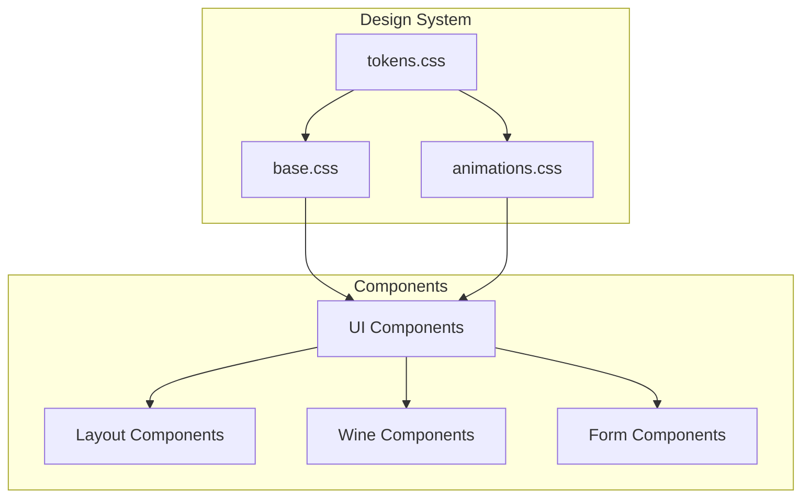

# UI/UX Design Guide

> **Executive Summary**: Qvé ("koo-VAY") is a wine collection manager designed around "quiet luxury" — the aesthetic of artisanal grower champagne producers rather than ostentatious grand châteaux. This document defines the visual language, interaction patterns, and UX principles that govern the application.

---

## 1. Design Philosophy

### 1.1 Core Principles

| Principle | Description |
|-----------|-------------|
| **Understated Excellence** | Quality speaks for itself; no flashy embellishments. Like a sommelier's subtle nod of approval. |
| **Warm Sophistication** | Natural materials: aged paper, cork, linen, candlelight. Warmth without sterility. |
| **Functional Beauty** | Every element serves a purpose. Decoration is earned, not applied. |
| **Respectful of Content** | The wines are the stars; UI stays in the background. Data density over decoration. |

### 1.2 Mood Boards

**Light Mode — "Morning in the Tasting Room"**
- Soft natural light through tall windows
- Linen tablecloths, paper menus
- Cork boards, aged wood
- Quiet, focused, contemplative

**Dark Mode — "Penthouse at Night"**
- 60th floor, floor-to-ceiling windows
- City lights below, champagne and canapés
- Soft jazz, ambient warmth
- Sophisticated, intimate, luxurious

### 1.3 Brand Identity

- **Name**: Qvé (stylized from "cuvée" — the champagne-making term for a blend or batch)
- **Pronunciation**: "koo-VAY"
- **Visual Mark**: The Q replaces C for visual distinction while retaining phonetic identity
- **Personality**: Knowledgeable but not pretentious; helpful but not intrusive

---

## 2. Color System

### 2.1 Light Mode Palette

| Token | Value | Usage |
|-------|-------|-------|
| `--bg` | `#FAF9F7` | Page background |
| `--bg-subtle` | `#F5F3F0` | Subtle backgrounds, input fields |
| `--surface` | `#FFFFFF` | Cards, elevated surfaces |
| `--surface-raised` | `#FFFFFF` | Popovers, modals |
| `--text-primary` | `#2D2926` | Headings, body text |
| `--text-secondary` | `#5C5652` | Supporting text |
| `--text-tertiary` | `#8A847D` | Captions, metadata |
| `--accent` | `#A69B8A` | Interactive elements (muted taupe) |
| `--accent-subtle` | `#C4BAA9` | Hover states |
| `--accent-muted` | `#D9D2C6` | Backgrounds, selections |
| `--divider` | `#E8E4DE` | Borders, separators |
| `--divider-subtle` | `#F0EDE8` | Subtle separators |

### 2.2 Dark Mode Palette

| Token | Value | Usage |
|-------|-------|-------|
| `--bg` | `#0C0B0A` | Page background (warm black) |
| `--bg-subtle` | `#141312` | Subtle backgrounds |
| `--surface` | `#1A1918` | Cards, elevated surfaces |
| `--surface-raised` | `#222120` | Popovers, modals |
| `--text-primary` | `#F0EDE6` | Headings, body text |
| `--text-secondary` | `#A8A29A` | Supporting text |
| `--text-tertiary` | `#6B665F` | Captions, metadata |
| `--accent` | `#B8AFA0` | Interactive elements |
| `--accent-subtle` | `#7A756C` | Hover states |
| `--accent-muted` | `#4A4640` | Backgrounds, selections |
| `--divider` | `#2A2826` | Borders, separators |
| `--divider-subtle` | `#1F1E1C` | Subtle separators |

### 2.3 Semantic Colors

| Purpose | Light Mode | Dark Mode | Usage |
|---------|------------|-----------|-------|
| Success | `#6B8E6B` | `#8BA88B` | Confirmations, positive states |
| Error | `#B87A7A` | `#C99999` | Errors, destructive actions |
| Warning | `#C4A35A` | `#D4B86A` | Cautions, pending states |
| Info | `#7A8B9B` | `#9AABB8` | Informational messages |

### 2.4 Rating Colors

| Rating Type | Color | Association |
|-------------|-------|-------------|
| Overall Rating | `#8B4A5C` (Burgundy) | Wine, quality, depth |
| Value Rating | `#7A8B6B` (Sage Green) | Money, value, balance |

These colors are used in the cumulative dot-fill rating interface and work in both themes without modification.

### 2.5 Enrichment Colors

**Critic Score Tiers**:
| Tier | Color | Background | Range |
|------|-------|------------|-------|
| Exceptional | `--score-exceptional` | `--score-exceptional-bg` | 95+ |
| Outstanding | `--score-outstanding` | `--score-outstanding-bg` | 90-94 |
| Very Good | `--score-very-good` | `--score-very-good-bg` | 85-89 |
| Good | `--score-good` | `--score-good-bg` | <85 |

**Drink Window Status**:
| Status | Color | Background |
|--------|-------|------------|
| Hold (too young) | `--status-hold` | `--status-hold-bg` |
| Ready (in window) | `--status-ready` | `--status-ready-bg` |
| Past (past prime) | `--status-past` | `--status-past-bg` |

---

## 3. Typography

### 3.1 Font Families

```css
--font-serif: 'Cormorant Garamond', 'Didot', 'Bodoni MT', Georgia, serif;
--font-sans: 'Outfit', 'Avenir Next', system-ui, sans-serif;
```

- **Cormorant Garamond**: Wine names, headings, the logo. Elegant, legible, classical.
- **Outfit**: Body text, UI elements, metadata. Clean, modern, functional.

### 3.2 Type Scale

| Element | Font | Size | Weight | Line Height | Letter Spacing |
|---------|------|------|--------|-------------|----------------|
| Logo | Serif | 1.25rem | 500 | 1 | -0.01em |
| Page Title | Serif | 1.75rem | 400 | 1.2 | -0.01em |
| Wine Name | Serif | 1.5rem | 400 | 1.25 | -0.01em |
| Wine Name (compact) | Serif | 0.875rem | 400 | 1.3 | 0 |
| Body | Sans | 0.875rem | 400 | 1.5 | 0 |
| Caption | Sans | 0.8125rem | 400 | 1.4 | 0 |
| Metadata | Sans | 0.75rem | 400 | 1.4 | 0.02em |
| Tiny | Sans | 0.6875rem | 400 | 1.3 | 0 |
| Uppercase Labels | Sans | 0.75rem | 500 | 1.2 | 0.08em |

---

## 4. Spacing & Layout

### 4.1 Spacing Scale

```css
--space-1:  0.25rem   /* 4px */
--space-2:  0.5rem    /* 8px */
--space-3:  0.75rem   /* 12px */
--space-4:  1rem      /* 16px */
--space-5:  1.5rem    /* 24px */
--space-6:  2rem      /* 32px */
--space-8:  3rem      /* 48px */
--space-10: 4rem      /* 64px */
--space-12: 6rem      /* 96px */
```

### 4.2 Usage Guidelines

| Context | Spacing |
|---------|---------|
| Component internal padding | `space-3` to `space-5` |
| Between related items | `space-2` to `space-3` |
| Between sections | `space-6` to `space-8` |
| Page margins (mobile) | `space-5` |
| Page margins (desktop) | `space-6` |
| Card padding | `space-5` |
| Card gap | `space-4` |

### 4.3 Border Radius

| Element | Radius |
|---------|--------|
| Cards | 16px (`--radius-xl`) |
| Modals | 16px (`--radius-xl`) |
| Images | 12px (`--radius-lg`) |
| Inputs | 8px (`--radius-md`) |
| Buttons | 8px (`--radius-md`) |
| Small buttons | 6px |
| Pills/Tags | 100px (`--radius-pill`) |

---

## 5. Elevation & Shadows

### 5.1 Light Mode Shadows

Shadows are barely visible — just enough to suggest depth without demanding attention.

```css
--shadow-sm: 0 1px 2px rgba(45, 41, 38, 0.03);
--shadow-md: 0 2px 8px rgba(45, 41, 38, 0.04), 0 1px 2px rgba(45, 41, 38, 0.03);
--shadow-lg: 0 8px 24px rgba(45, 41, 38, 0.06), 0 2px 4px rgba(45, 41, 38, 0.03);
--shadow-xl: 0 20px 40px rgba(45, 41, 38, 0.12);
```

### 5.2 Dark Mode Shadows

Dark mode uses subtle glows with a hint of light rim.

```css
--shadow-sm: 0 1px 2px rgba(0, 0, 0, 0.2);
--shadow-md: 0 2px 8px rgba(0, 0, 0, 0.3), 0 0 1px rgba(255, 255, 255, 0.03);
--shadow-lg: 0 8px 32px rgba(0, 0, 0, 0.4), 0 0 1px rgba(255, 255, 255, 0.05);
--shadow-xl: 0 20px 48px rgba(0, 0, 0, 0.5);
```

### 5.3 Usage

| Element | Shadow |
|---------|--------|
| Cards at rest | `shadow-sm` |
| Cards on hover | `shadow-md` |
| Dropdowns, popovers | `shadow-lg` |
| Modals | `shadow-xl` |

---

## 6. Motion & Animation

### 6.1 Easing Functions

```css
--ease-out: cubic-bezier(0.33, 1, 0.68, 1);
--ease-in-out: cubic-bezier(0.65, 0, 0.35, 1);
```

### 6.2 Duration Guidelines

| Interaction | Duration |
|-------------|----------|
| Micro (hover, focus) | 0.15s |
| Standard | 0.2s to 0.3s |
| Expand/collapse | 0.4s |
| Theme transition | 0.5s |
| Page transitions | 0.6s |
| Card entrance (stagger) | 0.7s |

### 6.3 Animation Library

| Animation | Keyframe | Use Case |
|-----------|----------|----------|
| Fade In Up | `fadeInUp` | Card entrance, content reveal |
| Expand In | `expandIn` | Accordion content, dropdown open |
| Shimmer | `shimmer` | Skeleton loading states |
| Pulse | `pulse` | AI loading bars, attention indicators |
| Decant | `decant` | AI loading (width breathing) |
| Grow | `grow` | AI loading (vineyard rows) |
| Slide In Right | `slideInRight` | Toast entrance |
| Slide Out Right | `slideOutRight` | Toast dismissal |
| Modal Fade In | `modalFadeIn` | Modal entrance (scale + fade) |
| Spin | `spin` | Loading spinners |

### 6.4 Staggered Entrance

Cards animate in with staggered delays for a wave effect:

```css
.stagger-1 { animation-delay: 0.05s; }
.stagger-2 { animation-delay: 0.12s; }
.stagger-3 { animation-delay: 0.19s; }
.stagger-4 { animation-delay: 0.26s; }
.stagger-5 { animation-delay: 0.33s; }
.stagger-6 { animation-delay: 0.40s; }
```

### 6.5 Reduced Motion

All animations respect `prefers-reduced-motion`:

```css
@media (prefers-reduced-motion: reduce) {
  * {
    animation-duration: 0.01ms !important;
    transition-duration: 0.01ms !important;
  }
}
```

---

## 7. Iconography

### 7.1 Style Guidelines

- **Stroke width**: 1.5px
- **Corner style**: Rounded
- **Size**: 18px (default), 24px (large), 16px (compact)
- **Color**: Inherits from text color (currentColor)

### 7.2 Icon Set

| Icon | Name | Usage |
|------|------|-------|
| Wine bottle | `wine-bottle` | Drink action, bottle indicators |
| Plus | `plus` | Add action |
| Edit/Pencil | `edit` | Edit action |
| Grid (4 squares) | `grid` | Compact view toggle |
| Lines (3 horizontal) | `list` | List view toggle |
| Sun | `sun` | Light mode |
| Moon | `moon` | Dark mode |
| Search | `search` | Search action |
| Menu (3 lines) | `menu` | Navigation |
| Chevron | `chevron-down/left/right` | Expand/collapse, navigation |
| Check | `check` | Success, selected |
| X | `x`, `close` | Close, dismiss, error |
| Sparkle | `sparkle` | AI features |
| Camera | `camera` | Photo capture |
| History | `history` | Drink history |
| Settings | `settings` | Settings |

---

## 8. Responsive Design

### 8.1 Breakpoints

| Breakpoint | Width | Columns (Compact Grid) |
|------------|-------|------------------------|
| XS | <480px | 2 |
| SM | 480-559px | 2 |
| MD | 560-767px | 3 |
| LG | 768-991px | 4 |
| XL | 992-1199px | 5 |
| XXL | ≥1200px | 6 |

### 8.2 Mobile-First Grid

```css
.wine-grid.view-compact {
  grid-template-columns: repeat(2, 1fr);  /* Default: 2 columns */
}
@media (min-width: 560px)  { grid-template-columns: repeat(3, 1fr); }
@media (min-width: 768px)  { grid-template-columns: repeat(4, 1fr); }
@media (min-width: 992px)  { grid-template-columns: repeat(5, 1fr); }
@media (min-width: 1200px) { grid-template-columns: repeat(6, 1fr); }
```

**Important**: Avoid `auto-fill, minmax()` on mobile — it causes overflow when minimum exceeds available space.

### 8.3 Touch Considerations

| Target | Minimum Size |
|--------|--------------|
| Touch targets | 44×44px |
| Buttons | 40px height minimum |
| Filter pills | 32px height, 44px touch area |
| Rating dots | 10px visible, 20px touch area |

---

## 9. View Modes

### 9.1 Compact View (Grid)

- **Purpose**: Quick browsing, high-density collection overview
- **Shows**: Image, name, year, bottle count (numeric), rating
- **Hides**: Producer, region, actions, bottle silhouettes, expanded section
- **Behavior**: Click to expand inline (spans all grid columns)

### 9.2 Medium View (List)

- **Purpose**: Detailed browsing, wine comparison
- **Shows**: All wine details, action buttons on hover
- **Behavior**: Click to expand full details below card

### 9.3 Toggle Persistence

View mode preference is saved to `localStorage` under key `qve-view-mode`.

---

## 10. Component Patterns

### 10.1 Cards

**Wine Card States**:
| State | Behavior |
|-------|----------|
| Default | Collapsed, actions hidden |
| Hover | Subtle shadow lift, actions appear |
| Expanded | Full details visible, max-height animated |
| Target Highlight | 2-second pulse animation after navigation |

**Expansion Pattern**:
- Click anywhere on card to toggle expand/collapse
- Action buttons intercept click (stopPropagation)
- Smooth height transition via `max-height` animation

### 10.2 Modals

**Structure**:
```
Modal Backdrop (semi-transparent)
└── Modal Container
    ├── Modal Header (title + close button)
    ├── Modal Body (content)
    └── Modal Footer (actions)
```

**Sizes**:
| Size | Max Width | Use Case |
|------|-----------|----------|
| Small | 400px | Confirmations |
| Default | 500px | Forms |
| Large | 700px | Complex forms |

**Behavior**:
- Focus trap within modal
- Escape key closes
- Backdrop click closes
- Entry/exit animation (scale + fade)

### 10.3 Forms

**Field Pattern**:
```svelte
<FormInput bind:value={name} label="Wine Name" required error={errors.name} />
```

**Validation**:
- Inline error messages below field
- Error state: red border, error text
- Required indicator: asterisk after label

### 10.4 Filter Pills

**States**:
| State | Appearance |
|-------|------------|
| Default | Transparent background, tertiary text |
| Hover | Subtle background |
| Active | Surface background, primary text, shadow |

**Behavior**:
- Single selection (radio-like)
- Click toggles active state
- Touch-scroll detection prevents accidental taps on iOS

---

## 11. Rating Interface

### 11.1 Main Rating (10-Dot Scale)

**Specifications**:
- 10 dots, 10px each, 1.5px border
- Cumulative fill: clicking dot 7 fills dots 1-7
- Hover preview shows fill state before click
- Click filled dot to deselect all

**Colors**:
- Overall Rating: Burgundy (`#8B4A5C`)
- Value Rating: Sage Green (`#7A8B6B`)

**Layout**:
```
Desktop (>520px):        Mobile (<520px):
┌─────────────────────┐     ┌──────────────────┐
│ Overall  ○○○○○○○○○○ │     │ Overall          │
│ Value    ○○○○○○○○○○ │     │ ○○○○○○○○○○       │
└─────────────────────┘     │ Value            │
                            │ ○○○○○○○○○○       │
                            └──────────────────┘
```

### 11.2 Mini Ratings (5-Dot Scale)

Optional sub-ratings with smaller, muted dots:
- Complexity, Drinkability, Surprise, Food Pairing
- 5 dots each, smaller size
- Muted styling to denote optional nature

---

## 12. AI Loading States

### 12.1 Animation Styles

**Basic (Default)**: Simple opacity pulse on horizontal bars
```css
animation: pulse 1.5s ease-in-out infinite;
```

**Decanting**: Horizontal bars that "breathe" (width pulses)
```css
animation: decant 2s ease-in-out infinite;
/* Staggered: 0s, 0.3s, 0.6s */
```

**Vineyard Rows**: Vertical bars at staggered heights
```css
animation: grow 1.2s ease-in-out infinite;
/* Staggered heights and durations */
```

### 12.2 Loading Messages

Wine-themed messages cycle every 2-3 seconds:

| Message |
|---------|
| "Searching the cellars..." |
| "Consulting the sommelier..." |
| "Uncorking knowledge..." |
| "Checking the vintages..." |
| "Reading the terroir..." |
| "Decanting information..." |
| "Inspecting the cork..." |
| "Swirling the glass..." |
| "Examining the legs..." |
| "Nosing the bouquet..." |
| "Assessing the finish..." |
| "Conferring with the maître d'..." |
| "Perusing the carte des vins..." |

### 12.3 AI Loading Overlay

Full-screen overlay with centered animation:
- 50% black backdrop with 4px blur
- Centered card with animation + cycling message
- Close button (top-right) to cancel
- User can dismiss at any time

---

## 13. Toast Notifications

### 13.1 Types

| Type | Icon | Accent Color |
|------|------|--------------|
| Success | Checkmark | `--success` |
| Error | X | `--error` |
| Info | Info circle | `--accent` |
| Warning | Warning triangle | `--warning` |
| Undo | Undo arrow | `--accent` |

### 13.2 Positioning

- **Desktop**: Bottom-right, stacked vertically
- **Mobile**: Bottom-center, full width minus margins

### 13.3 Behavior

| Feature | Description |
|---------|-------------|
| Auto-dismiss | 5 seconds default |
| Progress bar | Shows remaining time |
| Swipe-to-dismiss | Touch gesture on mobile |
| Undo action | Optional button triggers callback |
| Stacking | Multiple toasts stack vertically |

---

## 14. Empty & Error States

### 14.1 Empty States

| State | Illustration | Message | Action |
|-------|--------------|---------|--------|
| Empty collection | Wine bottle outline | "Your collection is empty" | "Add Wine" button |
| No search results | Magnifying glass | "No wines match your filters" | "Clear filters" link |
| Empty history | Wine glass | "No wines rated yet" | "Browse collection" link |

### 14.2 Loading States (Skeletons)

Skeleton loaders use the shimmer animation:
```css
.skeleton-line {
  background: linear-gradient(90deg,
    var(--bg-subtle) 25%,
    var(--divider-subtle) 50%,
    var(--bg-subtle) 75%
  );
  background-size: 200% 100%;
  animation: shimmer 1.5s infinite;
}
```

### 14.3 Error States

| Error Type | Icon | Message | Action |
|------------|------|---------|--------|
| Network error | Cloud with X | "Unable to connect" | "Retry" button |
| Server error | Warning triangle | "Something went wrong" | "Go Back" button |
| Not found | Empty box | "Wine not found" | "Back to collection" link |

---

## 15. Mobile & iOS Safari Specifics

### 15.1 Overflow Prevention

Required for iOS Safari horizontal scroll prevention. **Only on `body`, NOT `html`** -- putting `overflow-x: hidden` on both creates a dual scroll container that breaks mousewheel and touch scrolling in Chrome:
```css
html {
  max-width: 100%;  /* Secondary safety net -- no overflow-x: hidden here */
}
body {
  overflow-x: hidden;
}
```

### 15.2 Safe Area Insets

```css
.safe-area-bottom {
  padding-bottom: env(safe-area-inset-bottom);
}
```

### 15.3 Touch Scroll vs Tap Detection

Prevent scroll gestures from triggering click handlers:
```typescript
const SCROLL_THRESHOLD = 10; // pixels
const TAP_TIMEOUT = 300; // ms

// Track touch start position and time
// Only trigger tap if movement < threshold AND elapsed < timeout
```

### 15.4 Momentum Scrolling

```css
.scroll-container {
  -webkit-overflow-scrolling: touch;
  overscroll-behavior: contain;
}
```

### 15.5 Portal Pattern (FilterDropdown)

Dropdowns use a portal to escape the header's stacking context:
- Elements moved to `document.body` on mount
- Dark theme styles use `:global(html[data-theme="dark"])` with hardcoded colors
- CSS variables don't inherit reliably when portaled on iOS

---

## 16. Accessibility

### 16.1 Color Contrast

All text meets WCAG AA contrast requirements:
- Primary text on background: 7:1+
- Secondary text: 4.5:1+
- Interactive elements: 3:1+

### 16.2 Focus States

- Visible focus ring on all interactive elements
- Uses outline, not border (avoids layout shift)
- Follows accent color

### 16.3 ARIA Patterns

| Component | ARIA Pattern |
|-----------|--------------|
| View Toggle | `role="group"` with labeled buttons |
| Filter Pills | Toggle buttons with `aria-pressed` |
| Modals | `role="dialog"` with `aria-labelledby` |
| Dropdowns | `role="listbox"` with `role="option"` |
| Toast | `role="status"` with `aria-live="polite"` |

### 16.4 Keyboard Navigation

- All interactive elements reachable via Tab
- Escape closes modals/dropdowns
- Arrow keys navigate within groups
- Enter/Space activates focused element

---

## 17. Theme Implementation

### 17.1 Theme Toggle

Theme is controlled by `data-theme` attribute on `<html>`:
- Values: `light` (default), `dark`
- Saved to `localStorage` key: `qve-theme`
- Smooth transition via `--theme-transition`

### 17.2 CSS Custom Properties

All design tokens defined as CSS custom properties on `:root` (light) and `[data-theme="dark"]` (dark).

Benefits:
- Easy theme switching via attribute
- JavaScript access via `getComputedStyle()`
- Future extensibility (additional themes)

### 17.3 Future: System Preference

Prepared for `prefers-color-scheme` auto-detection:
```css
@media (prefers-color-scheme: dark) {
  :root:not([data-theme]) { /* dark mode defaults */ }
}
```

---

## 18. Design Evolution

### 18.1 Key Decisions

| Date | Decision | Rationale |
|------|----------|-----------|
| 2026-01-13 | Name: Qvé | Distinctive, sophisticated, champagne connection |
| 2026-01-13 | Accent: Muted taupe | Quiet luxury aesthetic over flashy gold |
| 2026-01-13 | Dark mode: Warm blacks | Penthouse evening vibe, not stark black |
| 2026-01-13 | Two view modes | Balance density vs. detail |
| 2026-01-13 | Inline expansion | Maintains grid context |
| 2026-01-19 | 10-dot rating | Minimal, cumulative, thematic colors |
| 2026-01-19 | AI loading messages | Wine-themed, delightful, patient |

### 18.2 Rejected Alternatives

| Rejected | Why | Chosen Instead |
|----------|-----|----------------|
| Champagne gold accent (#C9A227) | Too ostentatious | Muted taupe (#A69B8A) |
| Pure black dark mode (#000000) | Too harsh | Warm black (#0C0B0A) |
| Three-tier zoom | Over-complex | Two-view toggle |
| Star ratings | Generic | Cumulative dot scale |
| Generic loading spinner | Boring | Wine-themed animations |

---

## 19. Implementation Reference

### 19.1 CSS Files

| File | Purpose |
|------|---------|
| `tokens.css` | Color palette, spacing, typography, shadows |
| `base.css` | Reset, utilities, iOS Safari fixes |
| `animations.css` | Keyframes, animation utilities |
| `index.css` | Import aggregator |

### 19.2 Component Dependencies



### 19.3 Design Token Usage

```typescript
// Accessing tokens in JavaScript
const accent = getComputedStyle(document.documentElement)
  .getPropertyValue('--accent');

// Theme detection
const isDark = document.documentElement.dataset.theme === 'dark';
```

---

## 20. Quality Checklist

### Visual Consistency
- [ ] All colors use CSS custom properties
- [ ] Typography uses defined scale
- [ ] Spacing uses defined scale
- [ ] Shadows match elevation guidelines
- [ ] Border radii are consistent

### Interaction Quality
- [ ] All interactive elements have hover states
- [ ] Focus states are visible
- [ ] Transitions are smooth (use defined easings)
- [ ] Loading states prevent interaction
- [ ] Error states are clear and actionable

### Responsiveness
- [ ] Works on 320px width (iPhone SE)
- [ ] No horizontal scroll
- [ ] Touch targets are 44px minimum
- [ ] Grid adapts to all breakpoints
- [ ] Modals are usable on mobile

### Accessibility
- [ ] Color contrast meets AA
- [ ] All images have alt text
- [ ] Forms have labels
- [ ] Keyboard navigation works
- [ ] Screen reader tested

---

*This design guide is the source of truth for Qvé's visual language and interaction patterns.*
