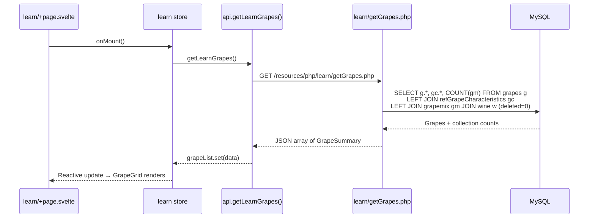
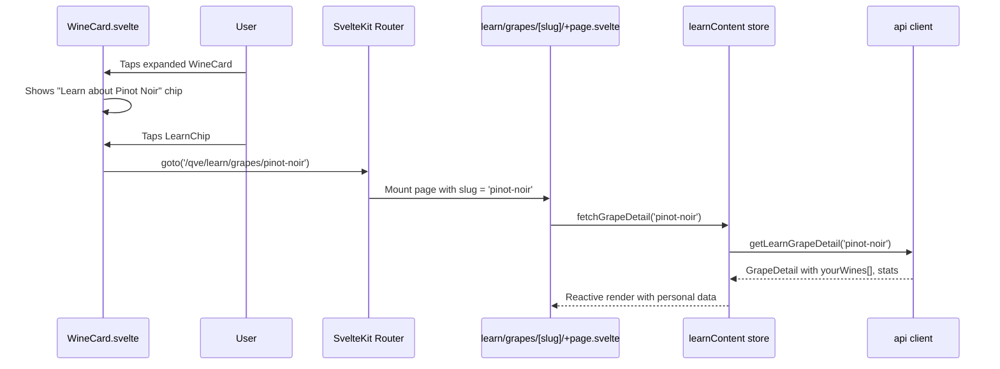
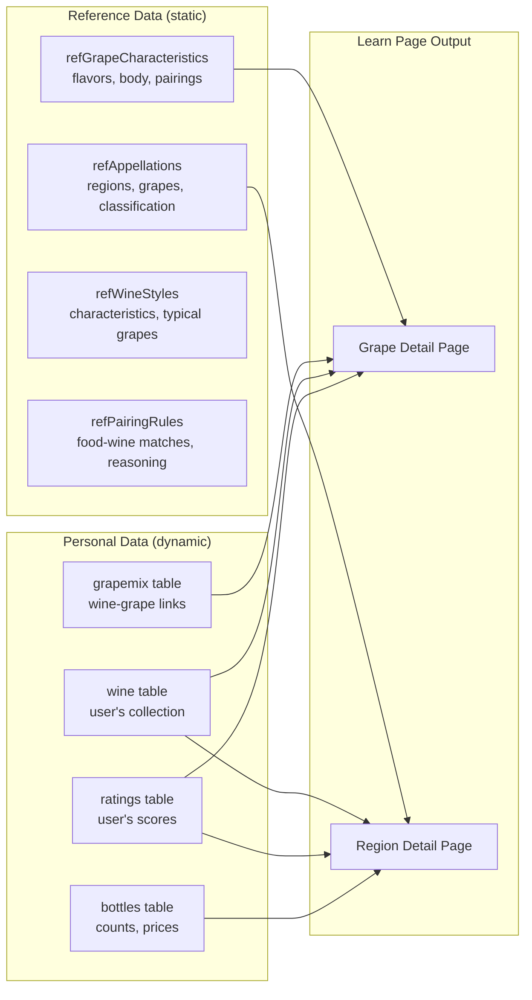
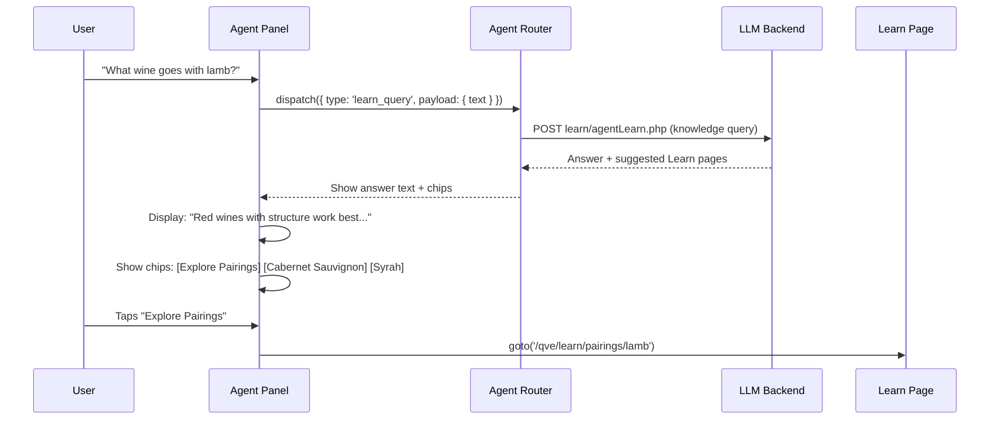

# Learn Feature - System Architecture

> **Author**: System Architect Agent
> **Date**: 2026-02-09
> **Status**: Proposal (Pre-Implementation)
> **Scope**: Full-stack architecture for a wine education "Learn" feature integrated into the Qvé wine app

---

## Table of Contents

1. [Executive Summary](#1-executive-summary)
2. [Design Philosophy](#2-design-philosophy)
3. [Navigation Strategy](#3-navigation-strategy)
4. [Route Structure](#4-route-structure)
5. [Component Architecture](#5-component-architecture)
6. [Store Design](#6-store-design)
7. [API Layer](#7-api-layer)
8. [Backend Endpoints](#8-backend-endpoints)
9. [Database Schema](#9-database-schema)
10. [Data Flow Diagrams](#10-data-flow-diagrams)
11. [Agent Integration](#11-agent-integration)
12. [Personal Collection Integration](#12-personal-collection-integration)
13. [Performance Strategy](#13-performance-strategy)
14. [Future Hooks](#14-future-hooks)
15. [Implementation Phases](#15-implementation-phases)
16. [Decision Log](#16-decision-log)

---

## 1. Executive Summary

The Learn feature transforms Qvé from a wine *tracking* app into a wine *knowledge* app by weaving educational content into the collection experience. Rather than a standalone "academy" bolted onto the side, Learn is designed as a contextual knowledge layer that surfaces relevant information where the user is already looking -- on wine cards, in the agent panel, and via dedicated exploration pages.

**Core principle**: The user's own collection is the best curriculum. A bottle of Barolo in the cellar is the perfect entry point to learn about Nebbiolo, Piedmont, and Italian wine classification -- not a generic textbook.

**What the feature delivers**:
- Browse-able reference pages for grapes, regions, appellations, wine styles, and food pairings
- Contextual "Learn about..." links from wine cards, enrichment data, and filter selections
- Personal insights derived from the user's collection data (e.g., "You tend to drink Pinot Noir from Burgundy")
- Agent-integrated Q&A ("What's the difference between Barolo and Barbaresco?")
- A foundation for future gamification, quizzes, and taste profile evolution

---

## 2. Design Philosophy

### 2.1 Collection-First Education

Every Learn page connects back to the user's cellar. A grape page for Nebbiolo does not just show generic tasting notes -- it shows how many Nebbiolo wines the user owns, their average ratings, and which specific bottles contain it. This makes learning feel personal rather than encyclopedic.

### 2.2 Progressive Disclosure

Content loads in layers: headline summary first, then expandable detail sections, then deep-dive tabs. Users who want a quick answer get it immediately; curious users can explore further without navigating away.

### 2.3 Consistency with Existing Patterns

The Learn feature reuses existing component patterns (cards, grids, filter pills, expandable sections), design tokens, store architecture, and API client conventions. No new frameworks, libraries, or architectural patterns are introduced.

### 2.4 Data Sustainability

Reference content comes from the existing database tables (`refGrapeCharacteristics`, `refAppellations`, `refWineStyles`, `refPairingRules`, `refIntensityProfiles`) plus the `grapes`, `region`, and `country` tables. No external CMS or markdown files. All content is queryable, filterable, and cache-friendly.

---

## 3. Navigation Strategy

Three options were evaluated. **Option C (Hybrid)** is recommended.

### Option A: Top-Level Route Only

**Approach**: Add `/qve/learn` as a new top-level route alongside Home, History, Add Wine. Add "Learn" to the SideMenu.

```
SideMenu:
  Cellar          → /qve/
  All Wines        → /qve/ (allWines mode)
  History          → /qve/history
  Add Wine         → /qve/add
  Learn            → /qve/learn     ← NEW
  Settings         → modal
```

**Pros**: Clean, discoverable. Users know where to find it. Follows existing navigation pattern.
**Cons**: Feels disconnected from the collection. Users must leave the cellar to learn. No contextual entry points.

### Option B: Contextual Links Only

**Approach**: No dedicated route. Instead, add "Learn about [Grape/Region/Style]" links throughout the existing UI: on WineCard expanded views, in enrichment cards, in filter dropdowns. Each link opens an overlay/modal or inline expandable panel.

**Pros**: Highly contextual. Users learn in-flow. No navigation context switch.
**Cons**: No way to browse all grapes, all regions, etc. Hard to discover. Content fragments scattered across the app. No URL-addressable pages for bookmarking or sharing.

### Option C: Hybrid (Recommended)

**Approach**: Add `/qve/learn` as a top-level route with sub-routes for content categories, AND add contextual "Learn about..." chips/links in existing views that deep-link into specific Learn pages.

```
SideMenu:
  Cellar          → /qve/
  All Wines        → /qve/ (allWines mode)
  History          → /qve/history
  Add Wine         → /qve/add
  Learn            → /qve/learn     ← NEW (top-level browse)
  Settings         → modal

Contextual links (deep-link into Learn):
  WineCard expanded   → "Learn about [Grape]" → /qve/learn/grapes/pinot-noir
  Enrichment card     → "Explore [Region]"    → /qve/learn/regions/burgundy
  Filter pill         → info icon             → /qve/learn/grapes/nebbiolo
  Agent chat          → "Tell me about..."    → inline answer + "Read more" link
```

**Pros**: Best of both worlds. Discoverable AND contextual. URL-addressable for every piece of content. Browsable and explorable. Supports future features (bookmarks, sharing, quizzes).
**Cons**: Slightly more surface area to build. Needs clear visual language for "learn" links to avoid clutter.

**Why Hybrid wins**: The contextual links are what make Learn transformative rather than just another tab. A user looking at their 2015 Barolo sees "Learn about Nebbiolo" and follows curiosity. Without contextual entry points, Learn becomes a reference manual users rarely visit. Without the top-level route, users cannot browse and discover new topics.

### Navigation Affordance Design

Contextual links use a consistent pattern:
- Small "info" icon (existing `info` icon from Icon component) + text label
- Styled as a subtle chip using `--text-tertiary` color, not competing with primary actions
- On tap: navigate to the Learn route with the entity slug
- On long-press (future): show a tooltip summary without navigating

---

## 4. Route Structure

SvelteKit file-based routing under `/qve/learn`:

```
qve/src/routes/learn/
├── +page.svelte              # Learn hub / landing page
├── +layout.svelte            # Learn-specific layout (header variant, breadcrumbs)
├── grapes/
│   ├── +page.svelte          # All grapes index (grid/list view)
│   └── [slug]/
│       └── +page.svelte      # Individual grape detail page
├── regions/
│   ├── +page.svelte          # All regions index (map or list)
│   └── [slug]/
│       └── +page.svelte      # Individual region detail page
├── styles/
│   ├── +page.svelte          # All wine styles index
│   └── [slug]/
│       └── +page.svelte      # Individual style detail page
├── pairings/
│   ├── +page.svelte          # Food pairing explorer
│   └── [food]/
│       └── +page.svelte      # Specific food pairing page
└── appellations/
    ├── +page.svelte          # Appellations index
    └── [slug]/
        └── +page.svelte      # Individual appellation detail
```

**URL examples**:
```
/qve/learn                          → Hub page with category cards
/qve/learn/grapes                   → All grapes grid
/qve/learn/grapes/pinot-noir        → Pinot Noir detail page
/qve/learn/regions                  → All regions list
/qve/learn/regions/burgundy         → Burgundy detail page
/qve/learn/styles/full-bodied-red   → Full-bodied red style page
/qve/learn/pairings                 → Pairing explorer
/qve/learn/pairings/grilled-steak   → Best wines for grilled steak
/qve/learn/appellations/barolo      → Barolo appellation page
```

### Layout Hierarchy

```
+layout.svelte (root)                          # Theme, menu, toast, modal, agent
└── learn/+layout.svelte                       # Learn-specific header, breadcrumbs
    ├── learn/+page.svelte                     # Hub
    ├── learn/grapes/+page.svelte              # Index
    ├── learn/grapes/[slug]/+page.svelte       # Detail
    └── ...
```

The `learn/+layout.svelte` provides:
- A Header variant with "Learn" as the title in CollectionRow
- Breadcrumb navigation (Learn > Grapes > Pinot Noir)
- No FilterBar (Learn pages use their own browse/search UI)
- Back navigation to the referring context (if deep-linked from a wine card)

---

## 5. Component Architecture

### 5.1 New Component Tree

```
qve/src/lib/components/learn/
├── index.ts                        # Barrel exports
│
├── hub/
│   ├── LearnHub.svelte            # Landing page with category cards
│   ├── CategoryCard.svelte        # Card for each Learn category
│   ├── PersonalInsight.svelte     # "Your collection" stat widget
│   └── RecentlyViewed.svelte      # Recently viewed topics (localStorage)
│
├── grapes/
│   ├── GrapeGrid.svelte           # Grid of grape cards
│   ├── GrapeCard.svelte           # Grape summary card (image, name, color, flavor tags)
│   ├── GrapeDetail.svelte         # Full grape detail page layout
│   ├── GrapeFlavorProfile.svelte  # Flavor wheel / tag cloud for a grape
│   ├── GrapePairings.svelte       # Classic pairings for a grape
│   └── GrapeYourWines.svelte      # "Your [Grape] wines" collection subset
│
├── regions/
│   ├── RegionGrid.svelte          # Grid of region cards
│   ├── RegionCard.svelte          # Region summary card (name, country flag, grape icons)
│   ├── RegionDetail.svelte        # Full region detail page layout
│   ├── RegionClimate.svelte       # Climate / terroir section
│   ├── RegionGrapes.svelte        # Key grapes for this region
│   └── RegionYourWines.svelte     # "Your wines from [Region]"
│
├── styles/
│   ├── StyleGrid.svelte           # Grid of wine style cards
│   ├── StyleCard.svelte           # Style summary card
│   └── StyleDetail.svelte         # Full style detail with characteristics
│
├── pairings/
│   ├── PairingExplorer.svelte     # Interactive pairing browser
│   ├── PairingCard.svelte         # Food-wine pairing card
│   ├── PairingDetail.svelte       # Full pairing detail with reasoning
│   └── PairingWheel.svelte        # Visual food-wine wheel (future)
│
├── appellations/
│   ├── AppellationGrid.svelte     # Grid of appellation cards
│   ├── AppellationCard.svelte     # Appellation summary card
│   └── AppellationDetail.svelte   # Full appellation detail
│
└── shared/
    ├── LearnBreadcrumbs.svelte    # Breadcrumb navigation (Learn > Grapes > Pinot Noir)
    ├── LearnSearchBar.svelte      # Topic search across all categories
    ├── LearnChip.svelte           # Contextual "Learn about..." chip (used outside Learn)
    ├── FlavorTag.svelte           # Colored flavor tag (e.g., "blackcurrant", "cedar")
    ├── BodyScale.svelte           # Visual body scale (light → full)
    ├── TanninScale.svelte         # Visual tannin scale (low → high)
    ├── AcidityScale.svelte        # Visual acidity scale (low → high)
    ├── ContentSection.svelte      # Expandable content section with progressive disclosure
    └── YourCollectionBadge.svelte # "3 in your cellar" badge overlay
```

### 5.2 Contextual Components (added to existing views)

These are small additions to existing components, NOT new pages:

| Existing Component | Addition | Behavior |
|---|---|---|
| `WineCard.svelte` (expanded) | `LearnChip` for primary grape | Navigate to `/qve/learn/grapes/[slug]` |
| `WineCard.svelte` (expanded) | `LearnChip` for region | Navigate to `/qve/learn/regions/[slug]` |
| `EnrichmentCard` sections | "Learn more" links in GrapeComposition, StyleProfile | Deep-link to relevant Learn page |
| `FilterPill.svelte` | Optional info icon (for non-search filters) | Navigate to Learn page for that filter's entity |
| `SideMenu.svelte` | "Learn" menu item with `info` icon | Navigate to `/qve/learn` |

### 5.3 Component Reuse

Many Learn components reuse existing primitives:

| Learn Component | Reuses |
|---|---|
| `GrapeGrid` | `WineGrid` layout pattern (responsive columns) |
| `GrapeCard` | `WineCard` structure (image + metadata) |
| `ContentSection` | `AIExpandedSection` expand/collapse pattern |
| `LearnSearchBar` | `SearchDropdown` component pattern |
| `FlavorTag` | Chip/pill styling from `FilterPill` |
| `BodyScale`, `TanninScale`, `AcidityScale` | `RatingDots` / `MiniRatingDots` visual pattern |
| `PairingCard` | `HistoryCard` structure |

---

## 6. Store Design

### 6.1 New Stores

Two new stores following existing patterns:

#### `learn.ts` - Learn Navigation and State

```typescript
// stores/learn.ts

import { writable, derived } from 'svelte/store';
import type { LearnCategory, LearnBreadcrumb } from '$api/types';

// ── Navigation State ──
export const learnCategory = writable<LearnCategory | null>(null);
export const learnBreadcrumbs = writable<LearnBreadcrumb[]>([]);

// ── Search ──
export const learnSearchQuery = writable<string>('');
export const learnSearchResults = writable<LearnSearchResult[]>([]);
export const learnSearchLoading = writable<boolean>(false);

// ── Recently Viewed (persisted to localStorage) ──
export const recentlyViewedTopics = writable<RecentTopic[]>([]);

// ── Derived ──
export const hasLearnSearch = derived(learnSearchQuery, ($q) => $q.length >= 2);

// ── Actions ──
export function setLearnBreadcrumbs(crumbs: LearnBreadcrumb[]): void { ... }
export function addRecentTopic(topic: RecentTopic): void { ... }
export function clearRecentTopics(): void { ... }
export function searchLearnTopics(query: string): Promise<void> { ... }

// ── Types ──
export type LearnCategory = 'grapes' | 'regions' | 'styles' | 'pairings' | 'appellations';

export interface LearnBreadcrumb {
  label: string;
  href: string;
}

export interface RecentTopic {
  slug: string;
  name: string;
  category: LearnCategory;
  viewedAt: number; // timestamp
}

export interface LearnSearchResult {
  slug: string;
  name: string;
  category: LearnCategory;
  snippet: string;
}
```

#### `learnContent.ts` - Content Data Cache

```typescript
// stores/learnContent.ts

import { writable, derived } from 'svelte/store';
import { api } from '$api';

// ── Grape Data ──
export const grapeList = writable<GrapeSummary[]>([]);
export const grapeListLoading = writable<boolean>(false);
export const grapeDetail = writable<GrapeDetail | null>(null);
export const grapeDetailLoading = writable<boolean>(false);

// ── Region Data ──
export const regionList = writable<RegionSummary[]>([]);
export const regionListLoading = writable<boolean>(false);
export const regionDetail = writable<RegionDetail | null>(null);
export const regionDetailLoading = writable<boolean>(false);

// ── Style Data ──
export const styleList = writable<StyleSummary[]>([]);
export const styleDetail = writable<StyleDetail | null>(null);

// ── Pairing Data ──
export const pairingCategories = writable<PairingCategory[]>([]);
export const pairingDetail = writable<PairingDetail | null>(null);

// ── Appellation Data ──
export const appellationList = writable<AppellationSummary[]>([]);
export const appellationDetail = writable<AppellationDetail | null>(null);

// ── Derived: Collection Stats ──
// These blend reference data with the user's personal collection
export const grapeCollectionStats = derived(
  [grapeDetail, /* wines from wines store */],
  ([$grape]) => {
    // Computed: how many wines in user's collection use this grape,
    // average rating, favorite producers, etc.
  }
);

// ── Fetch Actions ──
export async function fetchGrapeList(): Promise<void> { ... }
export async function fetchGrapeDetail(slug: string): Promise<void> { ... }
export async function fetchRegionList(): Promise<void> { ... }
export async function fetchRegionDetail(slug: string): Promise<void> { ... }
export async function fetchStyleList(): Promise<void> { ... }
export async function fetchPairingCategories(): Promise<void> { ... }
export async function fetchPairingDetail(food: string): Promise<void> { ... }
export async function fetchAppellationList(): Promise<void> { ... }
export async function fetchAppellationDetail(slug: string): Promise<void> { ... }

// ── Types (detail shapes) ──
export interface GrapeSummary {
  slug: string;
  name: string;
  color: 'red' | 'white' | 'pink';
  body: string;
  primaryFlavors: string[];
  pictureURL: string | null;
  wineCountInCellar: number;     // From user's collection
}

export interface GrapeDetail extends GrapeSummary {
  alternateNames: string[] | null;
  tannin: string | null;
  acidity: string;
  sweetness: string;
  secondaryFlavors: string[] | null;
  agingPotential: string;
  classicPairings: string[];
  description: string;
  // Personal collection data
  yourWines: WineInCollection[];   // Wines containing this grape
  avgRatingForGrape: number | null;
  topProducers: string[];
}

export interface RegionSummary {
  slug: string;
  name: string;
  countryName: string;
  countryCode: string;
  climate: string | null;
  keyGrapes: string[];
  wineCountInCellar: number;
}

export interface RegionDetail extends RegionSummary {
  description: string | null;
  soil: string | null;
  appellations: AppellationSummary[];
  yourWines: WineInCollection[];
  avgRatingForRegion: number | null;
}

export interface StyleSummary {
  slug: string;
  name: string;
  wineType: string;
  characteristics: Record<string, string>;
  typicalGrapes: string[];
}

export interface AppellationSummary {
  slug: string;
  name: string;
  country: string;
  region: string;
  classificationLevel: string;
  primaryGrapes: string[];
  wineTypes: string[];
}

export interface PairingCategory {
  category: string;
  subcategories: string[];
  topPairings: PairingSummary[];
}

export interface PairingSummary {
  foodItem: string;
  slug: string;
  wineTypes: string[];
  topGrapes: string[];
  reasoning: string;
}

export interface WineInCollection {
  wineID: number;
  wineName: string;
  producerName: string;
  year: string | null;
  avgRating: number | null;
  pictureURL: string | null;
}
```

### 6.2 Store Registration

Both stores are added to the barrel export in `stores/index.ts`:

```typescript
// Add to stores/index.ts
export * from './learn';
export * from './learnContent';
```

### 6.3 Persistence Strategy

| Data | Storage | Rationale |
|---|---|---|
| Recently viewed topics | localStorage | Survives sessions, low-volume data |
| Content list caches | In-memory (writable) | Re-fetched on page visit, cached for session |
| Detail page data | In-memory (writable) | Re-fetched per slug, not worth persisting |
| Search results | In-memory (writable) | Ephemeral, cleared on new search |

---

## 7. API Layer

### 7.1 New Client Methods

Added to `WineApiClient` in `lib/api/client.ts`:

```typescript
class WineApiClient {
  // ... existing methods ...

  // ── Learn: Grapes ──

  /** Fetch all grapes with collection stats */
  async getLearnGrapes(signal?: AbortSignal): Promise<GrapeSummary[]> {
    return this.fetchJSON<GrapeSummary[]>(`${this.baseURL}learn/getGrapes.php`, { signal });
  }

  /** Fetch single grape detail with personal collection data */
  async getLearnGrapeDetail(slug: string, signal?: AbortSignal): Promise<GrapeDetail> {
    return this.fetchJSON<GrapeDetail>(
      `${this.baseURL}learn/getGrapeDetail.php?slug=${encodeURIComponent(slug)}`,
      { signal }
    );
  }

  // ── Learn: Regions ──

  async getLearnRegions(signal?: AbortSignal): Promise<RegionSummary[]> {
    return this.fetchJSON<RegionSummary[]>(`${this.baseURL}learn/getRegions.php`, { signal });
  }

  async getLearnRegionDetail(slug: string, signal?: AbortSignal): Promise<RegionDetail> {
    return this.fetchJSON<RegionDetail>(
      `${this.baseURL}learn/getRegionDetail.php?slug=${encodeURIComponent(slug)}`,
      { signal }
    );
  }

  // ── Learn: Styles ──

  async getLearnStyles(signal?: AbortSignal): Promise<StyleSummary[]> {
    return this.fetchJSON<StyleSummary[]>(`${this.baseURL}learn/getStyles.php`, { signal });
  }

  async getLearnStyleDetail(slug: string, signal?: AbortSignal): Promise<StyleDetail> {
    return this.fetchJSON<StyleDetail>(
      `${this.baseURL}learn/getStyleDetail.php?slug=${encodeURIComponent(slug)}`,
      { signal }
    );
  }

  // ── Learn: Pairings ──

  async getLearnPairings(signal?: AbortSignal): Promise<PairingCategory[]> {
    return this.fetchJSON<PairingCategory[]>(`${this.baseURL}learn/getPairings.php`, { signal });
  }

  async getLearnPairingDetail(food: string, signal?: AbortSignal): Promise<PairingDetail> {
    return this.fetchJSON<PairingDetail>(
      `${this.baseURL}learn/getPairingDetail.php?food=${encodeURIComponent(food)}`,
      { signal }
    );
  }

  // ── Learn: Appellations ──

  async getLearnAppellations(signal?: AbortSignal): Promise<AppellationSummary[]> {
    return this.fetchJSON<AppellationSummary[]>(`${this.baseURL}learn/getAppellations.php`, { signal });
  }

  async getLearnAppellationDetail(slug: string, signal?: AbortSignal): Promise<AppellationDetail> {
    return this.fetchJSON<AppellationDetail>(
      `${this.baseURL}learn/getAppellationDetail.php?slug=${encodeURIComponent(slug)}`,
      { signal }
    );
  }

  // ── Learn: Search ──

  async searchLearnTopics(query: string, signal?: AbortSignal): Promise<LearnSearchResult[]> {
    return this.fetchJSON<LearnSearchResult[]>(
      `${this.baseURL}learn/search.php?q=${encodeURIComponent(query)}`,
      { signal }
    );
  }
}
```

### 7.2 Type Additions

Added to `lib/api/types.ts`:

```typescript
// ── Learn Types ──

export interface GrapeSummary { ... }  // As defined in store section
export interface GrapeDetail extends GrapeSummary { ... }
export interface RegionSummary { ... }
export interface RegionDetail extends RegionSummary { ... }
export interface StyleSummary { ... }
export interface StyleDetail extends StyleSummary { ... }
export interface AppellationSummary { ... }
export interface AppellationDetail extends AppellationSummary { ... }
export interface PairingCategory { ... }
export interface PairingDetail { ... }
export interface LearnSearchResult { ... }
```

---

## 8. Backend Endpoints

### 8.1 New PHP Endpoints

All Learn endpoints are read-only (GET) and placed in a new subdirectory:

```
resources/php/learn/
├── _helpers.php               # Shared: slugify(), collectionStats()
├── getGrapes.php             # GET: All grapes with collection stats
├── getGrapeDetail.php        # GET: Single grape by slug
├── getRegions.php            # GET: All regions with collection stats
├── getRegionDetail.php       # GET: Single region by slug
├── getStyles.php             # GET: All wine styles
├── getStyleDetail.php        # GET: Single style by slug
├── getPairings.php           # GET: Pairing categories
├── getPairingDetail.php      # GET: Specific food pairing detail
├── getAppellations.php       # GET: All appellations
├── getAppellationDetail.php  # GET: Single appellation by slug
└── search.php                # GET: Cross-category search
```

### 8.2 Endpoint Design Pattern

Each endpoint follows the existing Qvé PHP pattern:

```php
<?php
// learn/getGrapeDetail.php
require_once __DIR__ . '/../databaseConnection.php';
require_once __DIR__ . '/../validators.php';
require_once __DIR__ . '/_helpers.php';

$slug = $_GET['slug'] ?? '';
if (empty($slug)) {
    http_response_code(400);
    echo json_encode(['error' => 'Missing slug parameter']);
    exit;
}

$pdo = getConnection();

// 1. Fetch grape reference data
$stmt = $pdo->prepare("
    SELECT g.grapeID, g.grapeName, g.description, g.picture,
           gc.color, gc.body, gc.tannin, gc.acidity, gc.sweetness,
           gc.primaryFlavors, gc.secondaryFlavors, gc.agingPotential,
           gc.classicPairings, gc.alternateNames
    FROM grapes g
    LEFT JOIN refGrapeCharacteristics gc ON g.grapeName = gc.grapeName
    WHERE slugify(g.grapeName) = :slug
    LIMIT 1
");
$stmt->execute([':slug' => $slug]);
$grape = $stmt->fetch(PDO::FETCH_ASSOC);

if (!$grape) {
    http_response_code(404);
    echo json_encode(['error' => 'Grape not found']);
    exit;
}

// 2. Fetch user's wines containing this grape
$stmt = $pdo->prepare("
    SELECT w.wineID, w.wineName, p.producerName, w.year,
           w.rating AS avgRating, w.pictureURL
    FROM grapemix gm
    JOIN wine w ON gm.wineID = w.wineID AND w.deleted = 0
    JOIN producers p ON w.producerID = p.producerID
    WHERE gm.grapeID = :grapeID
    ORDER BY w.rating DESC
");
$stmt->execute([':grapeID' => $grape['grapeID']]);
$yourWines = $stmt->fetchAll(PDO::FETCH_ASSOC);

// 3. Compute collection statistics
$avgRating = null;
$topProducers = [];
if (count($yourWines) > 0) {
    $ratings = array_filter(array_column($yourWines, 'avgRating'));
    $avgRating = count($ratings) > 0 ? round(array_sum($ratings) / count($ratings), 1) : null;
    $topProducers = array_values(array_unique(
        array_slice(array_column($yourWines, 'producerName'), 0, 5)
    ));
}

// 4. Build response
$response = [
    'slug' => $slug,
    'name' => $grape['grapeName'],
    'color' => $grape['color'] ?? 'unknown',
    'body' => $grape['body'],
    'tannin' => $grape['tannin'],
    'acidity' => $grape['acidity'],
    'sweetness' => $grape['sweetness'],
    'primaryFlavors' => json_decode($grape['primaryFlavors'] ?? '[]'),
    'secondaryFlavors' => json_decode($grape['secondaryFlavors'] ?? '[]'),
    'agingPotential' => $grape['agingPotential'],
    'classicPairings' => json_decode($grape['classicPairings'] ?? '[]'),
    'alternateNames' => json_decode($grape['alternateNames'] ?? 'null'),
    'description' => $grape['description'],
    'pictureURL' => $grape['picture'],
    'yourWines' => $yourWines,
    'wineCountInCellar' => count($yourWines),
    'avgRatingForGrape' => $avgRating,
    'topProducers' => $topProducers
];

header('Content-Type: application/json');
echo json_encode($response);
```

### 8.3 Search Endpoint

The search endpoint queries across all reference tables using MySQL `LIKE`:

```php
// learn/search.php
// Searches grapes, regions, appellations, wine styles, and pairing rules
// Returns unified results sorted by relevance

$query = $_GET['q'] ?? '';
$results = [];

// Search grapes
$stmt = $pdo->prepare("
    SELECT grapeName AS name, 'grapes' AS category,
           SUBSTRING(description, 1, 120) AS snippet
    FROM grapes
    WHERE grapeName LIKE :q OR description LIKE :q2
    LIMIT 10
");
$likeQuery = "%{$query}%";
$stmt->execute([':q' => $likeQuery, ':q2' => $likeQuery]);
$results = array_merge($results, $stmt->fetchAll(PDO::FETCH_ASSOC));

// Search regions, appellations, styles, pairings similarly...
// Apply slugify() to name for slug field
// Sort by exact match first, then partial match
```

### 8.4 Vite Proxy Update

The existing proxy configuration at `/resources/php` already covers the new `learn/` subdirectory, so no changes needed:

```typescript
// qve/vite.config.ts — no change needed
'/resources/php': {
  target: 'http://localhost:8000',
  changeOrigin: true
}
```

### 8.5 Caching Strategy

Learn content is mostly static reference data. The Workbox runtime cache already handles GET endpoints:

```typescript
// Already in vite.config.ts — matches learn/get*.php
urlPattern: /\/resources\/php\/get\w+\.php/i,
handler: 'NetworkFirst',
options: {
  cacheName: 'api-cache',
  expiration: { maxEntries: 50, maxAgeSeconds: 60 * 5 }
}
```

For Learn specifically, we could extend the cache TTL since reference data changes rarely. This is a future optimization -- the existing 5-minute NetworkFirst cache is sufficient for launch.

---

## 9. Database Schema

### 9.1 Existing Tables Leveraged (No Schema Changes)

The Learn feature uses **existing** database tables with no modifications needed:

| Table | Learn Usage | Row Count |
|---|---|---|
| `grapes` | Grape names, descriptions, images | 42 |
| `refGrapeCharacteristics` | Body, tannin, acidity, flavors, pairings | 29 |
| `refAppellations` | Appellations with grapes, classification, hierarchy | 47 |
| `refWineStyles` | Wine style definitions and characteristics | 30 |
| `refPairingRules` | Food-wine pairing rules with reasoning | 58 |
| `refIntensityProfiles` | Intensity profiles for pairing algorithm | 25 |
| `region` | Region names, climate, soil, descriptions | 46 |
| `country` | Country names, ISO codes, wine world classification | 33 |
| `worlds` | Old World / New World / Other World | 3 |
| `wine` | User's wines (for collection overlay) | varies |
| `grapemix` | Wine-grape relationships (for collection overlay) | varies |
| `bottles` | Bottle counts (for collection stats) | varies |
| `ratings` | User ratings (for collection stats) | varies |

### 9.2 Future Schema Additions (Phase 2+)

If the feature expands beyond what the current reference data supports:

```sql
-- Learning progress tracking (future)
CREATE TABLE learnProgress (
    id INT AUTO_INCREMENT PRIMARY KEY,
    category ENUM('grapes', 'regions', 'styles', 'pairings', 'appellations'),
    entitySlug VARCHAR(100) NOT NULL,
    viewedAt DATETIME DEFAULT CURRENT_TIMESTAMP,
    quizScore TINYINT NULL,             -- Future: quiz results (0-100)
    bookmarked TINYINT DEFAULT 0,       -- Future: bookmarks
    UNIQUE KEY (category, entitySlug)
);

-- Taste profile evolution (leverages existing agentUserTasteProfile)
-- The agentUserTasteProfile table already has:
--   preferredTypes (JSON), preferredCountries (JSON), priceRange
-- Future: Add columns or a new table for learning-derived insights
```

### 9.3 Slug Generation

Slugs are generated from entity names using a PHP helper:

```php
// learn/_helpers.php
function slugify(string $text): string {
    $text = transliterator_transliterate(
        'Any-Latin; Latin-ASCII; Lower()',
        $text
    );
    $text = preg_replace('/[^a-z0-9]+/', '-', $text);
    return trim($text, '-');
}
```

**Examples**: `Pinot Noir` → `pinot-noir`, `Côte-Rôtie` → `cote-rotie`, `Grüner Veltliner` → `gruner-veltliner`

---

## 10. Data Flow Diagrams

### 10.1 Learn Hub Page Load



### 10.2 Contextual Deep-Link Flow



### 10.3 Personal + Reference Data Blending



---

## 11. Agent Integration

### 11.1 Agent "Learn" Questions

The existing agent already has a `learn` action (in `enrichment.ts` handler) that triggers wine enrichment. We extend this to also handle general wine knowledge questions.

**New agent capability**: When the user asks a non-identification question like "What's the difference between Barolo and Barbaresco?" or "What wine goes with steak?", the agent detects this as a **learn intent** rather than an identification intent.

### 11.2 Intent Detection Extension

In `resources/php/agent/Identification/IntentDetector.php`, add a new intent classification:

```
INTENTS:
  - identify:   "Chateau Margaux 2015" → wine identification
  - learn:      "What grapes are in Chianti?" → knowledge question
  - pair:       "What wine goes with salmon?" → pairing recommendation
  - compare:    "Barolo vs Barbaresco" → comparison
```

### 11.3 Agent Learn Handler

New handler module at `lib/agent/handlers/learn.ts`:

```typescript
// handlers/learn.ts
type LearnActionType = 'learn_query' | 'learn_navigate';

export function isLearnAction(type: string): type is LearnActionType {
  return ['learn_query', 'learn_navigate'].includes(type);
}

export async function handleLearnAction(action: AgentAction): Promise<void> {
  switch (action.type) {
    case 'learn_query':
      // Call LLM with knowledge question
      // Show answer in agent panel as text message
      // Add "Read more" chip linking to relevant Learn page
      break;
    case 'learn_navigate':
      // Navigate to a specific Learn page
      // Used when agent suggests "You might want to explore Nebbiolo"
      break;
  }
}
```

### 11.4 Agent ↔ Learn Interaction Pattern



### 11.5 Post-Enrichment Learn Suggestions

After the agent enriches a wine, it can suggest relevant Learn pages:

```
Agent: "Here's what I found about your 2019 Barolo..."
[Enrichment Card]
Chips: [Add to Cellar] [Learn about Nebbiolo] [Explore Piedmont]
```

The "Learn about Nebbiolo" chip dispatches `learn_navigate` which calls `goto('/qve/learn/grapes/nebbiolo')`.

---

## 12. Personal Collection Integration

### 12.1 "Your Collection" Overlay

Every Learn detail page includes a "Your Collection" section showing how the reference topic relates to the user's wines. This is the differentiator from a generic wine encyclopedia.

**Grape Detail Page - "Your Nebbiolo Wines"**:
```
┌─────────────────────────────────┐
│  Your Nebbiolo Wines (4)        │
│  ┌───────┬──────────────────┐   │
│  │ [img] │ Barolo 2015      │   │
│  │       │ Giacomo Conterno │   │
│  │       │ ★ 9.0            │   │
│  └───────┴──────────────────┘   │
│  ┌───────┬──────────────────┐   │
│  │ [img] │ Barbaresco 2017  │   │
│  │       │ Gaja             │   │
│  │       │ ★ 8.5            │   │
│  └───────┴──────────────────┘   │
│  ...                            │
│  Avg rating: 8.8                │
│  Top producer: Giacomo Conterno │
└─────────────────────────────────┘
```

**Region Detail Page - "Your Burgundy Wines"**:
```
┌─────────────────────────────────┐
│  Your Burgundy Collection       │
│  12 wines · 8 bottles in cellar │
│  Avg rating: 8.2                │
│  Most common grape: Pinot Noir  │
│  [View in Cellar →]             │
└─────────────────────────────────┘
```

### 12.2 Cellar-to-Learn Navigation

The "View in Cellar" link navigates back to the home page with a pre-set filter:

```typescript
// In RegionYourWines.svelte
function viewInCellar() {
  setFilter('regionDropdown', regionName);
  goto(`${base}/`);
}
```

This creates a bidirectional relationship: Cellar → Learn (via LearnChip) and Learn → Cellar (via "View in Cellar").

### 12.3 Empty Collection States

When the user has no wines matching a topic, the Learn page still shows full reference content with a contextual prompt:

```
"You don't have any Nebbiolo wines yet."
[Add Wine →]  [Ask Sommelier →]
```

---

## 13. Performance Strategy

### 13.1 Code Splitting

All Learn routes use SvelteKit's automatic code splitting. The Learn feature adds zero bytes to the initial bundle because:
- Learn components are only imported in Learn route files
- Learn stores are only imported when a Learn page mounts
- The `LearnChip` component (used in existing views) is tiny (~1KB)

### 13.2 Lazy Loading

```typescript
// In learn/+layout.svelte
// Content loads on-demand per route
onMount(() => {
  // Only fetch what this specific page needs
  // No prefetching of all categories
});
```

### 13.3 Image Strategy

Grape images come from the existing `grapes.picture` column (Wikipedia URLs). For performance:
- Use `loading="lazy"` on all grape images
- Set explicit `width` and `height` to prevent layout shift
- Fall back to a colored grape silhouette SVG (by color: red/white/pink)

### 13.4 Content Caching

| Data | Cache Strategy | TTL |
|---|---|---|
| Grape list (42 items) | In-memory + Workbox NetworkFirst | 5 min (existing) |
| Grape detail | In-memory per slug | Session lifetime |
| Region list | In-memory + Workbox NetworkFirst | 5 min |
| Region detail | In-memory per slug | Session lifetime |
| Pairing categories | In-memory + Workbox NetworkFirst | 5 min |
| Search results | Not cached (ephemeral) | N/A |
| Personal collection stats | Re-fetched with each detail request | Fresh per load |

### 13.5 Bundle Size Budget

| Addition | Estimated Size |
|---|---|
| Learn components (~30 files) | ~25KB gzipped (lazy-loaded) |
| Learn stores (2 files) | ~3KB gzipped |
| Learn route pages (11 files) | ~15KB gzipped (code-split per route) |
| API client additions | ~1KB gzipped |
| LearnChip (contextual) | ~0.5KB gzipped |
| **Total initial bundle increase** | **~0.5KB** (only LearnChip) |
| **Total lazy-loaded** | **~44KB** (loaded only when visiting /qve/learn) |

---

## 14. Future Hooks

### 14.1 Gamification / Quizzes

The architecture supports adding quizzes without structural changes:

```
routes/learn/quiz/
├── +page.svelte              # Quiz hub (daily quiz, topic quizzes)
├── [topic]/
│   └── +page.svelte          # Topic-specific quiz
```

Quiz data can be generated from existing reference tables:
- "What grape is Barolo made from?" (from `refAppellations.primaryGrapes`)
- "Match the flavor to the grape" (from `refGrapeCharacteristics.primaryFlavors`)
- "What wine pairs with grilled steak?" (from `refPairingRules`)

Progress stored in `learnProgress` table.

### 14.2 Taste Profile Evolution

Leverage the existing `agentUserTasteProfile` table (currently unused):

```typescript
// Future: derive taste profile from collection + ratings
interface TasteProfile {
  preferredBody: 'light' | 'medium' | 'full';
  preferredAcidity: 'low' | 'medium' | 'high';
  topGrapes: string[];       // derived from grapemix + ratings
  topRegions: string[];      // derived from wine + region + ratings
  adventurousness: number;   // variety of grapes/regions tried
  experienceLevel: 'beginner' | 'intermediate' | 'advanced'; // derived from collection size + diversity
}
```

A "Your Palate" page at `/qve/learn/palate` could visualize this profile with radar charts.

### 14.3 Social Sharing

Each Learn page has a clean URL suitable for sharing:
- `/qve/learn/grapes/pinot-noir` can generate an Open Graph card
- PWA share target could capture shared wine articles and suggest related Learn pages

### 14.4 Wine Recommendations

The pairing and intensity data enables a recommendation engine:

```
"Based on your love of Nebbiolo (avg rating 8.8), you might enjoy:
 - Barolo from Giacomo Conterno (you haven't tried their 2016)
 - Barbaresco from Produttori del Barbaresco
 - Etna Rosso (Nerello Mascalese shares Nebbiolo's elegance)"
```

### 14.5 Cellar Insights Dashboard

A future `/qve/learn/insights` page could show:
- Collection diversity score (how many different grapes, regions, countries)
- Rating distribution patterns
- Drinking window alerts (wines approaching optimal window)
- Price-to-rating analysis
- "Blind spots" (popular regions/grapes the user hasn't explored)

### 14.6 Wine Embeddings

The existing `agentWineEmbeddings` table (currently unused) could power:
- "Similar wines" suggestions on Learn pages
- Semantic search ("wines like this but cheaper")
- Taste profile clustering

---

## 15. Implementation Phases

### Phase 1: Foundation (Sprint 1-2)

**Goal**: Core infrastructure + one complete vertical (Grapes)

- [ ] Create `learn/` route directory with layout
- [ ] Add "Learn" to SideMenu with `info` icon
- [ ] Implement `learn.ts` and `learnContent.ts` stores
- [ ] Build `LearnHub` page with category cards
- [ ] Build `GrapeGrid`, `GrapeCard`, `GrapeDetail` components
- [ ] Build PHP endpoints: `getGrapes.php`, `getGrapeDetail.php`
- [ ] Build `LearnBreadcrumbs`, `FlavorTag`, `BodyScale` shared components
- [ ] Add `LearnChip` component
- [ ] Add `LearnChip` to WineCard expanded view (grape link)
- [ ] Add API client methods for grapes

### Phase 2: Content Expansion (Sprint 3-4)

**Goal**: Remaining content categories

- [ ] Build Region pages (`RegionGrid`, `RegionCard`, `RegionDetail`)
- [ ] Build Appellation pages
- [ ] Build Wine Style pages
- [ ] Build Pairing Explorer
- [ ] Build PHP endpoints for all categories
- [ ] Add search endpoint and `LearnSearchBar`
- [ ] Add `LearnChip` to enrichment cards (region, grape links)
- [ ] Add "recently viewed" localStorage tracking

### Phase 3: Agent Integration (Sprint 5)

**Goal**: Agent can answer knowledge questions and link to Learn

- [ ] Add learn intent detection to backend IntentDetector
- [ ] Add `handlers/learn.ts` agent handler
- [ ] Add post-enrichment Learn suggestion chips
- [ ] Build `learn/agentLearn.php` endpoint (LLM-powered Q&A)
- [ ] Register learn handler in router

### Phase 4: Personal Insights (Sprint 6+)

**Goal**: Collection-derived analytics

- [ ] Build "Your Palate" profile page
- [ ] Implement taste profile derivation from collection data
- [ ] Add collection diversity score
- [ ] Add "blind spots" recommendations
- [ ] Leverage `agentUserTasteProfile` and `agentWineEmbeddings` tables

---

## 16. Decision Log

| # | Decision | Rationale | Alternatives Considered |
|---|---|---|---|
| 1 | **Hybrid navigation** (top-level route + contextual links) | Maximizes discoverability AND contextual relevance | Top-level only (disconnected), Contextual only (undiscoverable) |
| 2 | **Reuse existing reference tables** rather than creating new content tables | 42 grapes, 47 appellations, 58 pairing rules already seeded. Avoids data migration. | New `learnContent` table with Markdown; External CMS |
| 3 | **PHP endpoints per category** rather than a single generic endpoint | Follows existing pattern (`getWines`, `getCountries`, etc.). Each endpoint can optimize its own JOINs. | Single `getLearnContent.php?type=grapes&slug=x` |
| 4 | **Slug-based URLs** (`/learn/grapes/pinot-noir`) rather than ID-based | Human-readable, bookmarkable, shareable. SEO-friendly if app ever becomes public. | `/learn/grapes/1` (opaque), `/learn/grapes?name=Pinot+Noir` (ugly) |
| 5 | **Personal collection blended into each detail page** rather than a separate "My Stats" section | Makes learning feel personal by default. User sees relevance immediately. | Separate "My Collection" tab; Overlay badge only |
| 6 | **Two new stores** (`learn.ts` + `learnContent.ts`) rather than one monolithic store | Follows existing separation pattern (e.g., `agent.ts` vs `agentConversation.ts`). Navigation state is independent of content data. | Single `learn.ts` with everything; One store per category (too many) |
| 7 | **LearnChip as minimal contextual component** rather than inline expanded content | Keeps existing views uncluttered. Single tap navigates to full Learn page. | Inline accordion with summary; Tooltip popup; Modal overlay |
| 8 | **No new database tables for Phase 1** | Existing reference data is rich enough. Avoids migration complexity. `learnProgress` added in Phase 4. | Schema-first approach with migrations upfront |
| 9 | **Agent learn handler as a separate module** rather than extending enrichment | `learn` (user knowledge question) vs `learn` (enrichment action) are semantically different. Clean separation avoids confusion. | Overload existing `enrichment.ts` handler |
| 10 | **Server-side collection stats** (computed in PHP per request) rather than client-side derivation | Keeps expensive JOINs on the server. Client receives pre-computed stats. Avoids loading full wine list into Learn pages. | Client-side: import wines store, compute in derived store (couples Learn to Cellar loading) |

---

## Appendix A: Complete File Inventory

### New Files Created

| Category | Path | Purpose |
|---|---|---|
| **Routes** (11) | `qve/src/routes/learn/+page.svelte` | Hub page |
| | `qve/src/routes/learn/+layout.svelte` | Learn layout |
| | `qve/src/routes/learn/grapes/+page.svelte` | Grapes index |
| | `qve/src/routes/learn/grapes/[slug]/+page.svelte` | Grape detail |
| | `qve/src/routes/learn/regions/+page.svelte` | Regions index |
| | `qve/src/routes/learn/regions/[slug]/+page.svelte` | Region detail |
| | `qve/src/routes/learn/styles/+page.svelte` | Styles index |
| | `qve/src/routes/learn/styles/[slug]/+page.svelte` | Style detail |
| | `qve/src/routes/learn/pairings/+page.svelte` | Pairings index |
| | `qve/src/routes/learn/pairings/[food]/+page.svelte` | Pairing detail |
| | `qve/src/routes/learn/appellations/+page.svelte` | Appellations index |
| **Components** (~30) | `qve/src/lib/components/learn/` | All Learn components |
| **Stores** (2) | `qve/src/lib/stores/learn.ts` | Navigation state |
| | `qve/src/lib/stores/learnContent.ts` | Content data |
| **API** | (additions to existing `client.ts` and `types.ts`) | 12 new methods |
| **PHP** (12) | `resources/php/learn/` | All Learn endpoints |

### Existing Files Modified

| File | Change |
|---|---|
| `qve/src/lib/components/layout/SideMenu.svelte` | Add "Learn" menu item |
| `qve/src/lib/api/client.ts` | Add 12 Learn API methods |
| `qve/src/lib/api/types.ts` | Add Learn type definitions |
| `qve/src/lib/stores/index.ts` | Export new learn stores |
| `qve/src/lib/components/index.ts` | Export LearnChip |
| `qve/src/lib/components/wine/WineCard.svelte` | Add LearnChip (grape, region) |
| `qve/src/lib/agent/handlers/index.ts` | Register learn handler |
| `qve/src/lib/agent/router.ts` | Add learn handler routing |

### Approximate Effort

| Phase | New Files | Modified Files | Estimated Components |
|---|---|---|---|
| Phase 1 (Foundation + Grapes) | ~18 | ~4 | ~12 |
| Phase 2 (Content Expansion) | ~15 | ~2 | ~15 |
| Phase 3 (Agent Integration) | ~3 | ~4 | ~2 |
| Phase 4 (Personal Insights) | ~5 | ~2 | ~4 |
| **Total** | **~41** | **~12** | **~33** |
