# Remember Feature — System Architecture Proposal

**Author**: system-architect
**Date**: 2026-02-12
**Status**: DRAFT — Pending team review
**Related**: [DATA_MODEL.md](./DATA_MODEL.md) (data-architect), [MOCKUPS.md](./mockups/) (designer)

---

## Table of Contents

1. [Executive Summary](#1-executive-summary)
2. [Design Goals & Constraints](#2-design-goals--constraints)
3. [Architectural Approaches](#3-architectural-approaches)
4. [Recommended Architecture](#4-recommended-architecture)
5. [Database Layer](#5-database-layer)
6. [PHP Backend — New Endpoints](#6-php-backend--new-endpoints)
7. [Frontend — Svelte Stores](#7-frontend--svelte-stores)
8. [Frontend — Routes & Pages](#8-frontend--routes--pages)
9. [Frontend — Components](#9-frontend--components)
10. [Agent Integration](#10-agent-integration)
11. [Learn Module Integration](#11-learn-module-integration)
12. [Image & Media Handling](#12-image--media-handling)
13. [Search & Discovery](#13-search--discovery)
14. [Session Persistence & Offline](#14-session-persistence--offline)
15. [Implementation Roadmap](#15-implementation-roadmap)
16. [Open Questions](#16-open-questions)

---

## 1. Executive Summary

The **Remember** feature transforms Qve from a cellar inventory tool into a personal wine journal. Users can capture wine experiences — tastings at restaurants, memorable bottles at dinner parties, wines spotted on a shelf — without the commitment of adding them to their cellar. Memories are timestamped, taggable, searchable, and connected to the existing wine knowledge graph.

**Key integration points:**
- The AI agent gains a `save_memory` action after identification/enrichment (alongside "Add to Cellar")
- Memories can link to cellar wines, enrichment data, and ratings
- The Learn module can reference memories for personalized lessons ("You tried a Barolo in Turin last October...")
- A new `/qve/remember` route provides timeline, search, and scrapbook views

---

## 2. Design Goals & Constraints

### Goals
1. **Low friction capture** — Creating a memory should be faster than adding to cellar (no entity matching, no bottle form)
2. **Rich context** — Photos, location, occasion, companions, tasting notes, mood — all optional
3. **Connected** — Memories link to cellar wines, enrichment data, and other memories
4. **Discoverable** — Timeline, map, tag cloud, and full-text search
5. **Agent-native** — The agent can both create and recall memories conversationally

### Constraints
- **Single-user app** — No sharing/social features (keeps auth simple)
- **Existing PHP backend** — No framework, standalone endpoint scripts
- **MySQL 8** — Available JSON columns, CTEs, full-text indexes
- **Mobile-first** — Must work well on iOS Safari (camera capture, scroll, etc.)
- **sessionStorage budget** — Memories with images can be large; respect quota limits
- **PHP single-threaded dev server** — Sequential awaits, no parallel API calls in dev

---

## 3. Architectural Approaches

Three approaches were evaluated. Each trades off complexity against flexibility.

### Approach A: Simple CRUD (Recommended for MVP)

A flat `memories` table with optional FK to `wine` table. PHP CRUD endpoints. Svelte store with client-side filtering.

| Pros | Cons |
|------|------|
| Fastest to build | No built-in versioning or event history |
| Matches existing app patterns exactly | Tags require a join table |
| Easy to understand and debug | Limited relationship modeling |
| Works with existing `fetchJSON` pattern | Harder to add collaborative features later |

**Verdict**: Best for MVP. The app is single-user, and CRUD covers all core use cases.

### Approach B: Event-Sourced Timeline

An `memory_events` table where every action (create, edit, add photo, tag, link) is an immutable event. The current state is derived by replaying events.

| Pros | Cons |
|------|------|
| Full audit trail and undo support | Significant complexity increase |
| Natural timeline representation | Requires projection layer (read models) |
| Easy to add "On this day" features | Over-engineered for single-user app |
| Eventual consistency patterns | PHP has no event sourcing libraries |

**Verdict**: Over-engineered. The audit_log table already captures changes. Event sourcing adds complexity without clear single-user benefit.

### Approach C: Graph-Based Connections

A `memory_nodes` + `memory_edges` graph structure where memories, wines, people, places, and occasions are all nodes connected by typed edges.

| Pros | Cons |
|------|------|
| Rich relationship modeling | Requires custom graph traversal logic |
| "6 degrees of wine" exploration | MySQL is not a graph database |
| Natural for "wines I had with person X" | Complex queries with multiple JOINs |
| Future-proof for recommendations | Steep learning curve |

**Verdict**: Intriguing for V3 but premature. Could be layered on top of CRUD later via a `memory_connections` join table.

### Recommendation

**Start with Approach A (CRUD) for MVP**, with the schema designed to support Approach C extensions later. Specifically:
- Use a `memory_tags` join table (not JSON column) for tags — enables efficient querying
- Use a `memory_connections` table for wine/memory/memory links — enables graph-like traversal later
- Include `latitude`/`longitude` columns from day one — hard to backfill

---

## 4. Recommended Architecture

### System Context


### Data Flow: Creating a Memory

```mermaid
sequenceDiagram
    participant User
    participant Agent as Agent Panel
    participant Store as memory store
    participant API as api.saveMemory()
    participant PHP as saveMemory.php
    participant DB as MySQL

    User->>Agent: "Remember this wine"
    Agent->>Agent: Collect context (identification result, enrichment, photos)
    Agent->>Store: saveMemory(memoryData)
    Store->>API: POST saveMemory.php
    API->>PHP: { wineData, photos, tags, notes, occasion, location }
    PHP->>DB: BEGIN TRANSACTION
    PHP->>DB: INSERT INTO memories (...)
    PHP->>DB: INSERT INTO memory_photos (...) — for each photo
    PHP->>DB: INSERT INTO memory_tags (...) — for each tag
    PHP->>DB: INSERT INTO memory_connections (...) — if linked to cellar wine
    PHP->>DB: COMMIT
    DB-->>PHP: memoryID
    PHP-->>API: { success: true, memoryId }
    API-->>Store: Update memories list
    Store-->>Agent: Show confirmation + memory card
```



---

## 5. Database Layer

> **Coordination note**: See `DATA_MODEL.md` from data-architect for canonical schema DDL, indexes, and migration scripts. This section describes the logical model from the architecture perspective.

### Core Tables

#### `memories`

The primary entity. Stores the wine snapshot (denormalized from identification) plus context.

| Column | Type | Notes |
|--------|------|-------|
| `memoryID` | INT AUTO_INCREMENT PK | |
| `wineID` | INT NULL FK → wine | Links to cellar wine if one exists |
| `title` | VARCHAR(255) NULL | Optional user title; auto-generated if blank |
| `producer` | VARCHAR(255) NULL | Snapshot — may not match a cellar producer |
| `wineName` | VARCHAR(255) NULL | Snapshot |
| `vintage` | YEAR NULL | |
| `wineType` | VARCHAR(50) NULL | Red, White, Sparkling, etc. |
| `region` | VARCHAR(255) NULL | |
| `country` | VARCHAR(255) NULL | |
| `countryCode` | CHAR(2) NULL | ISO alpha-2 for flag display |
| `appellation` | VARCHAR(255) NULL | |
| `occasion` | VARCHAR(100) NULL | restaurant, dinner_party, tasting, travel, gift, shop, bar, other |
| `location` | VARCHAR(255) NULL | Free-text place name |
| `latitude` | DECIMAL(10,7) NULL | For future map view |
| `longitude` | DECIMAL(10,7) NULL | |
| `companions` | VARCHAR(500) NULL | Free-text; comma-separated names |
| `notes` | TEXT NULL | Personal tasting notes / thoughts |
| `mood` | VARCHAR(50) NULL | Optional emotional tag |
| `rating` | TINYINT NULL | Quick 1-10 rating (simpler than full rating form) |
| `priceRange` | VARCHAR(20) NULL | $, $$, $$$, $$$$ — approximate |
| `source` | ENUM('agent', 'manual', 'quick') | How the memory was created |
| `intent` | ENUM('experienced', 'want_to_try', 'want_to_buy', 'want_to_revisit') DEFAULT 'experienced' | Memory type / wish list dimension |
| `status` | ENUM('draft', 'identified', 'enriched') DEFAULT 'draft' | AI processing state (draft = pending/failed ID) |
| `enrichmentSnapshot` | JSON NULL | Cached enrichment data at time of memory |
| `identificationSnapshot` | JSON NULL | Cached identification result |
| `memoryDate` | DATE NOT NULL | When the experience happened |
| `createdAt` | TIMESTAMP DEFAULT CURRENT_TIMESTAMP | |
| `updatedAt` | TIMESTAMP ON UPDATE CURRENT_TIMESTAMP | |
| `deleted` | TINYINT(1) DEFAULT 0 | Soft delete (matches existing pattern) |

**Design decisions:**
- Wine data is **denormalized** (producer, wineName, vintage stored directly) because memories may reference wines not in the cellar. The optional `wineID` FK links to cellar wines when a match exists.
- `enrichmentSnapshot` and `identificationSnapshot` are JSON columns that capture the AI data at the time of creation. This means memories are self-contained — they don't break if enrichment cache is cleared or wine data changes.
- `occasion` uses VARCHAR not ENUM to allow easy addition of new occasion types without schema migration.

#### `memory_photos`

Multiple photos per memory. Reuses the existing image upload pipeline.

| Column | Type | Notes |
|--------|------|-------|
| `photoID` | INT AUTO_INCREMENT PK | |
| `memoryID` | INT FK → memories | |
| `filename` | VARCHAR(255) NOT NULL | Path in `images/memories/` |
| `caption` | VARCHAR(500) NULL | Optional caption |
| `isPrimary` | TINYINT(1) DEFAULT 0 | Cover photo flag |
| `sortOrder` | TINYINT DEFAULT 0 | Display order |
| `createdAt` | TIMESTAMP DEFAULT CURRENT_TIMESTAMP | |

**Why not reuse `wine.pictureURL`?** Memories can have multiple photos (the label, the setting, the food pairing), and a memory may not be linked to a cellar wine at all.

#### `memory_tags`

Tags for filtering and discovery. Uses a normalized join table (not JSON array) for efficient querying.

| Column | Type | Notes |
|--------|------|-------|
| `tagID` | INT AUTO_INCREMENT PK | |
| `memoryID` | INT FK → memories | |
| `tag` | VARCHAR(100) NOT NULL | Lowercase, trimmed |
| UNIQUE | (`memoryID`, `tag`) | No duplicate tags per memory |

**Index**: `idx_tag` on (`tag`) for tag cloud queries.

#### `memory_connections`

Links memories to cellar wines, enrichment data, or other memories.

| Column | Type | Notes |
|--------|------|-------|
| `connectionID` | INT AUTO_INCREMENT PK | |
| `memoryID` | INT FK → memories | Source memory |
| `targetType` | ENUM('wine', 'memory', 'producer', 'region') | What it links to |
| `targetID` | INT NOT NULL | ID of the target entity |
| `relationship` | VARCHAR(50) NULL | 'same_wine', 'same_occasion', 'similar', 'follow_up' |
| `createdAt` | TIMESTAMP DEFAULT CURRENT_TIMESTAMP | |

**This table enables future graph-like features:**
- "Other memories of this wine"
- "Wines from the same trip"
- "Follow-up: you said you'd try X — here it is"

---

## 6. PHP Backend — New Endpoints

All endpoints follow the existing pattern: standalone PHP scripts in `resources/php/`, using `databaseConnection.php`, returning JSON via `ApiResponse`. Agent-specific memory endpoints go in `resources/php/agent/` and use `_bootstrap.php`.

### Endpoint Summary

| Endpoint | Method | Auth | Purpose |
|----------|--------|------|---------|
| `getMemories.php` | POST | API Key | List/search/filter memories |
| `getMemory.php` | POST | API Key | Single memory with photos + tags |
| `saveMemory.php` | POST | API Key | Create new memory (transaction) |
| `updateMemory.php` | POST | API Key | Update memory details |
| `deleteMemory.php` | POST | API Key | Soft delete |
| `getMemoryTags.php` | POST | API Key | Tag cloud with counts |
| `getMemoryTimeline.php` | POST | API Key | Timeline data (grouped by month) |
| `agent/saveAgentMemory.php` | POST | API Key | Agent-initiated memory save |

### `getMemories.php` — List / Search / Filter

**Request:**
```json
{
  "page": 1,
  "limit": 20,
  "sortKey": "memoryDate",
  "sortDir": "desc",
  "search": "barolo tuscany",
  "tags": ["travel", "restaurant"],
  "occasion": "restaurant",
  "country": "Italy",
  "wineType": "Red",
  "dateFrom": "2025-01-01",
  "dateTo": "2025-12-31",
  "hasWineLink": true,
  "hasPhotos": true
}
```

**Response:**
```json
{
  "success": true,
  "message": "OK",
  "data": {
    "memories": [
      {
        "memoryID": 42,
        "title": "Barolo at Osteria Francescana",
        "producer": "Giacomo Conterno",
        "wineName": "Monfortino",
        "vintage": 2015,
        "wineType": "Red",
        "region": "Piedmont",
        "country": "Italy",
        "countryCode": "IT",
        "occasion": "restaurant",
        "location": "Modena, Italy",
        "notes": "Extraordinary depth. The truffle pairing was perfect.",
        "rating": 9,
        "priceRange": "$$$$",
        "memoryDate": "2025-10-14",
        "wineID": null,
        "primaryPhoto": "memories/mem_42_001.jpg",
        "photoCount": 3,
        "tags": ["travel", "restaurant", "barolo", "italy"],
        "createdAt": "2025-10-14T22:30:00Z"
      }
    ],
    "pagination": {
      "page": 1,
      "limit": 20,
      "total": 47,
      "totalPages": 3
    },
    "filterOptions": {
      "occasions": [
        { "value": "restaurant", "count": 15 },
        { "value": "dinner_party", "count": 8 }
      ],
      "countries": [
        { "value": "Italy", "count": 12 },
        { "value": "France", "count": 10 }
      ],
      "wineTypes": [
        { "value": "Red", "count": 25 },
        { "value": "White", "count": 12 }
      ],
      "tags": [
        { "value": "travel", "count": 8 },
        { "value": "restaurant", "count": 15 }
      ]
    }
  }
}
```

**Implementation notes:**
- Server-side pagination with LIMIT/OFFSET (same pattern as `getDrunkWines.php`)
- Full-text search on `title`, `producer`, `wineName`, `notes`, `location` using MySQL FULLTEXT index
- Cascading filter options (same pattern as cellar filter endpoints)
- Sort whitelist: `memoryDate`, `rating`, `wineName`, `producer`, `country`, `createdAt`
- Primary photo is a subquery: `SELECT filename FROM memory_photos WHERE memoryID = m.memoryID AND isPrimary = 1 LIMIT 1`

### `saveMemory.php` — Create Memory

**Request:**
```json
{
  "title": "Barolo at Osteria Francescana",
  "producer": "Giacomo Conterno",
  "wineName": "Monfortino",
  "vintage": 2015,
  "wineType": "Red",
  "region": "Piedmont",
  "country": "Italy",
  "countryCode": "IT",
  "appellation": "Barolo DOCG",
  "occasion": "restaurant",
  "location": "Modena, Italy",
  "latitude": 44.6471,
  "longitude": 10.9254,
  "companions": "Sarah, Marco",
  "notes": "Extraordinary depth. The truffle pairing was perfect.",
  "mood": "celebratory",
  "rating": 9,
  "priceRange": "$$$$",
  "memoryDate": "2025-10-14",
  "source": "agent",
  "wineID": null,
  "tags": ["travel", "restaurant", "barolo", "italy"],
  "photos": ["memories/mem_temp_001.jpg"],
  "enrichmentSnapshot": { "...cached enrichment data..." },
  "identificationSnapshot": { "...cached identification result..." }
}
```

**Response:**
```json
{
  "success": true,
  "message": "Memory saved",
  "data": {
    "memoryID": 42,
    "photoCount": 1
  }
}
```

**Implementation:**
- Transaction: INSERT memory → INSERT photos → INSERT tags → INSERT connections (if wineID provided)
- Auto-generate title if not provided: `"{producer} {wineName} {vintage}"` or `"{occasion} — {location}"` or `"Wine Memory — {date}"`
- Tags are lowercased and trimmed; duplicates silently ignored (UNIQUE constraint)
- Photos: filenames reference already-uploaded files (uploaded via `upload.php` beforehand)

### `agent/saveAgentMemory.php` — Agent-Initiated Save

A thin wrapper around `saveMemory.php` that uses `_bootstrap.php` for agent error handling. The agent handler pre-populates from the current identification/enrichment state.

**Additional behavior:**
- Auto-extracts wine data from `identificationSnapshot`
- Auto-links to cellar wine if `checkDuplicate` finds an exact match
- Returns the same response as `saveMemory.php`

### `getMemoryTimeline.php` — Timeline Data

**Request:**
```json
{
  "year": 2025,
  "groupBy": "month"
}
```

**Response:**
```json
{
  "success": true,
  "data": {
    "timeline": [
      {
        "period": "2025-10",
        "label": "October 2025",
        "count": 5,
        "memories": [
          { "memoryID": 42, "title": "...", "primaryPhoto": "...", "memoryDate": "2025-10-14" }
        ]
      }
    ],
    "years": [2025, 2024]
  }
}
```

### `getMemoryTags.php` — Tag Cloud

**Response:**
```json
{
  "success": true,
  "data": {
    "tags": [
      { "tag": "restaurant", "count": 15 },
      { "tag": "travel", "count": 8 },
      { "tag": "birthday", "count": 3 }
    ]
  }
}
```

---

## 7. Frontend — Svelte Stores

### New Store: `memory` (`stores/memory.ts`)

Follows the existing store pattern — writable stores with exported action functions.

```typescript
// ── Writable stores ──
memories              // writable<Memory[]> — current page of memories
memoriesLoading       // writable<boolean>
memoriesError         // writable<string | null>
memoryDetail          // writable<MemoryDetail | null> — single memory view
memoryPagination      // writable<PaginationMeta>

// ── Filter/Sort state ──
memoryFilters         // writable<MemoryFilters>
memorySortKey         // writable<MemorySortKey> — default: 'memoryDate'
memorySortDir         // writable<MemorySortDir> — default: 'desc'
memorySearchQuery     // writable<string>

// ── Derived stores ──
hasMemoryFilters      // derived<boolean>
activeMemoryFilterCount // derived<number>
memoryCount           // derived<number> — from pagination.total

// ── Action functions ──
fetchMemories(): Promise<void>        // Load with current filters/sort/page
fetchMemory(id: number): Promise<void> // Load single memory
saveMemory(data: SaveMemoryPayload): Promise<number>  // Returns memoryID
updateMemory(id: number, data: Partial<SaveMemoryPayload>): Promise<void>
deleteMemory(id: number): Promise<void>
setMemoryFilter(key: keyof MemoryFilters, value: string | undefined): void
clearMemoryFilters(): void
setMemorySort(key: MemorySortKey, dir?: MemorySortDir): void
setMemoryPage(page: number): void

// ── Types ──
interface Memory {
  memoryID: number;
  title: string | null;
  producer: string | null;
  wineName: string | null;
  vintage: number | null;
  wineType: string | null;
  region: string | null;
  country: string | null;
  countryCode: string | null;
  occasion: string | null;
  location: string | null;
  notes: string | null;
  rating: number | null;
  priceRange: string | null;
  memoryDate: string;
  wineID: number | null;
  primaryPhoto: string | null;
  photoCount: number;
  tags: string[];
  createdAt: string;
}

interface MemoryDetail extends Memory {
  latitude: number | null;
  longitude: number | null;
  companions: string | null;
  mood: string | null;
  source: 'agent' | 'manual' | 'quick';
  enrichmentSnapshot: AgentEnrichmentData | null;
  identificationSnapshot: AgentIdentificationResult | null;
  photos: MemoryPhoto[];
  connections: MemoryConnection[];
}

interface MemoryPhoto {
  photoID: number;
  filename: string;
  caption: string | null;
  isPrimary: boolean;
}

interface MemoryConnection {
  connectionID: number;
  targetType: 'wine' | 'memory' | 'producer' | 'region';
  targetID: number;
  relationship: string | null;
  targetName: string; // Resolved name for display
}

type MemorySortKey = 'memoryDate' | 'rating' | 'wineName' | 'producer' | 'country' | 'createdAt';
type MemorySortDir = 'asc' | 'desc';

interface MemoryFilters {
  occasion?: string;
  country?: string;
  wineType?: string;
  tag?: string;
  dateFrom?: string;
  dateTo?: string;
  hasWineLink?: boolean;
  hasPhotos?: boolean;
}
```

### Store Interactions


**Key interaction patterns:**
1. **Agent → Memory**: When user taps "Remember" chip, the agent handler reads from `agentIdentification` and `agentEnrichment` stores, constructs the memory payload, and calls `memory.saveMemory()`.
2. **Memory → Wines**: When a memory is linked to a cellar wine (`wineID` is set), tapping the wine link navigates to the edit page or opens the wine card.
3. **Memory → Toast**: Save/update/delete operations show toast notifications via the existing `toasts` store.

### Agent Store Extension: `agentMemory` (V2)

In V2, a dedicated `agentMemory` store could be added for the agent's memory recall capabilities:

```typescript
// V2: stores/agentMemory.ts
interface AgentMemoryState {
  isRecalling: boolean;
  recalledMemories: Memory[];
  memoryContext: MemoryContext | null; // For Learn module
}
```

For MVP, the existing enrichment handler's `handleRemember()` function is extended to actually save instead of showing "coming soon".

---

## 8. Frontend — Routes & Pages

### New Route: `/qve/remember`

```
qve/src/routes/
├── remember/
│   ├── +page.svelte          # Memory list/timeline (main view)
│   └── [id]/
│       └── +page.svelte      # Single memory detail/edit
```

### `/qve/remember` — Memory List Page

The main Remember page with three view modes toggled by tabs:

1. **Timeline** (default) — Memories grouped by month, most recent first. Visual timeline with photo thumbnails and wine type color coding.
2. **Grid** — Card grid similar to the cellar WineGrid, but for memories. Shows primary photo, title, occasion icon, and date.
3. **List** — Compact list view for quick scanning. Shows date, wine name, occasion, rating.

**Page structure:**
```
Header.svelte (reused)
├── header-top: Menu + Logo + Density Toggle + Search
├── CollectionRow: "Wine Memories" + Memory Count
└── MemoryFilterBar: Occasion | Country | Type | Tag | Date Range | Sort
MemoryTimeline / MemoryGrid / MemoryList (view-dependent)
└── MemoryCard.svelte (shared card component)
MemoryFAB (Floating Action Button → quick memory creation)
```

### `/qve/remember/[id]` — Memory Detail Page

Full memory view with:
- Photo gallery (swipeable on mobile)
- Wine info card (reuses agent WineCard pattern)
- Tasting notes
- Tags (tappable → filters to that tag)
- Location
- Occasion + companions
- Enrichment data (if available, shown in EnrichmentCard)
- Connected wines/memories
- Edit/Delete actions

### Route Registration

Add to the SideMenu navigation:
```
Home (Cellar)
History
Remember        ← NEW
Add Wine
Settings
```

---

## 9. Frontend — Components

### New Components

```
qve/src/lib/components/
├── memory/                        # NEW directory
│   ├── MemoryCard.svelte         # Card for grid/timeline — photo, title, occasion, date
│   ├── MemoryGrid.svelte         # Responsive grid layout (reuses WineGrid pattern)
│   ├── MemoryTimeline.svelte     # Grouped-by-month timeline
│   ├── MemoryList.svelte         # Compact list view
│   ├── MemoryFilterBar.svelte    # Filter pills + sort (reuses FilterBar patterns)
│   ├── MemoryDetail.svelte       # Full memory view
│   ├── MemoryPhotoGallery.svelte # Swipeable photo gallery
│   ├── MemoryForm.svelte         # Create/edit memory form
│   ├── MemoryQuickCapture.svelte # Minimal form for quick memories
│   ├── MemoryTagInput.svelte     # Tag input with autocomplete from existing tags
│   ├── OccasionPicker.svelte     # Icon-based occasion selector
│   └── MemoryWineLink.svelte     # Shows linked cellar wine with navigation
```

### Reused Existing Components

| Component | Usage in Remember |
|-----------|------------------|
| `Header.svelte` | Page header with filter bar |
| `FilterPill.svelte` | Occasion, country, type filter pills |
| `FilterDropdown.svelte` | Tag and date range dropdowns |
| `RatingDisplay.svelte` | Memory rating display |
| `Icon.svelte` | Occasion icons, action icons |
| `WineImage.svelte` | Wine photo in memory card |
| `Toast.svelte` | Save/delete confirmations |
| `ConfirmModal.svelte` | Delete confirmation |
| `ImageLightboxModal.svelte` | Full-screen photo view |

### MemoryCard.svelte — Key Component

The memory card is the primary display unit. It adapts based on view density:

**Compact mode** (grid view):
```
┌─────────────────────────┐
│  [Photo or Wine Color]  │
│                         │
├─────────────────────────┤
│ 🍷 Monfortino 2015     │
│ Giacomo Conterno        │
│ 📍 Modena  🍽 Restaurant│
│ Oct 14, 2025    ●● 9/10│
└─────────────────────────┘
```

**Timeline mode** (horizontal card):
```
┌──────┬────────────────────────────────────┐
│      │ Monfortino 2015                     │
│ [img]│ Giacomo Conterno · Piedmont         │
│      │ 📍 Modena · 🍽 Restaurant · Oct 14  │
│      │ "Extraordinary depth..."    ●● 9/10 │
│      │ #travel #restaurant #barolo         │
└──────┴────────────────────────────────────┘
```

### Component Architecture Decisions

1. **MemoryForm.svelte** handles both create and edit (same pattern as DrinkRateModal). An `isEditMode` prop switches between POST/PUT behavior.
2. **MemoryQuickCapture.svelte** is a stripped-down form for the FAB: just wine name, photo, rating, and occasion. Everything else is optional and can be added later.
3. **MemoryPhotoGallery.svelte** uses CSS scroll-snap for swipeable photos on mobile, with dot indicators. Tapping opens ImageLightboxModal.

---

## 10. Agent Integration

### New Agent Actions

| Action | Handler | Description |
|--------|---------|-------------|
| `save_memory` | `memory.ts` (new handler) | Save current identification/enrichment as memory |
| `quick_memory` | `memory.ts` | Quick save with minimal data |
| `recall_memories` | `memory.ts` (V2) | Search memories by wine/occasion/date |
| `link_to_cellar` | `memory.ts` (V2) | Link memory to existing cellar wine |

### Handler: `memory.ts` (new)

```
qve/src/lib/agent/handlers/memory.ts
```

```typescript
type MemoryActionType =
  | 'save_memory'      // Full save with form
  | 'quick_memory'     // Quick save (no form)
  | 'recall_memories'  // V2: Search memories
  | 'link_to_cellar';  // V2: Link to cellar wine

export function isMemoryAction(type: string): type is MemoryActionType {
  return ['save_memory', 'quick_memory', 'recall_memories', 'link_to_cellar'].includes(type);
}
```

### Agent Flow: "Remember" Action (MVP)

Currently `handleRemember()` in `enrichment.ts` shows "coming soon". The new flow:


### State Machine Updates

New transitions:
```
confirming → saving_memory     (save_memory action)
saving_memory → complete       (memory saved successfully)
saving_memory → error          (save failed)
```

Or, simpler for MVP: reuse the existing `confirming` phase and show the memory form as a form message (similar to BottleDetailsForm).

### Chip Configuration Updates

**Post-identification chips** (currently: Add to Cellar / Learn More / Remember):
- "Remember" chip changes from placeholder to functional `save_memory` action

**Post-enrichment chips** (currently: Add to Cellar / Remember):
- Same — "Remember" becomes functional

**Post-save-memory chips**:
- "View Memory" → navigates to `/qve/remember/{id}`
- "Identify Another" → `start_over`
- "Add to Cellar Too" → `add_to_cellar` (if not already in cellar)

### Message Keys

New message keys for `messageKeys.ts`:

```typescript
// Memory messages
MEMORY_FORM_PROMPT = 'memory_form_prompt',       // "Add some details about this wine experience"
MEMORY_SAVING = 'memory_saving',                 // "Saving your wine memory..."
MEMORY_SAVED = 'memory_saved',                   // "Memory saved! You can find it in your wine journal."
MEMORY_SAVE_ERROR = 'memory_save_error',         // "Couldn't save that memory. Want to try again?"
MEMORY_RECALLED = 'memory_recalled',             // V2: "I found X memories of {wine}..."
```

### Personality Messages

Quentin Verre-Epais examples:
```typescript
memory_form_prompt: [
  "A wine worth noting! Shall we capture the moment?",
  "Let's preserve this one for the archives, shall we?",
],
memory_saved: (ctx) =>
  `${ctx.wineName} is now etched in your wine journal. A memory worth keeping.`,
```

---

## 11. Learn Module Integration

> The Learn module is planned but not yet implemented. This section describes how Remember would integrate with it.

### Memory-Enriched Lessons

When the Learn module teaches about a topic, it can query the user's memories for personal context:

```
Learn module: "Today let's explore Barolo..."
→ Query: SELECT * FROM memories WHERE region = 'Piedmont' AND wineType = 'Red'
→ Result: "You actually tried a Barolo last October at Osteria Francescana — you rated it 9/10!"
```

### API Support

A dedicated endpoint for the Learn module to query memories:

```php
// agent/queryMemories.php
// Called by Learn module handlers
// Input: { wineType?, region?, country?, grape?, producer? }
// Output: Matching memories with dates and ratings
```

### Cross-Reference Patterns

| Learn Topic | Memory Query | Personalization |
|------------|--------------|-----------------|
| "About Barolo" | region=Piedmont, type=Red | "You tried Conterno's Monfortino — that's one of the best!" |
| "About Champagne" | type=Sparkling, country=France | "Remember that Krug at Sarah's wedding?" |
| "Food Pairing" | occasion=restaurant | "At Francescana, you paired Barolo with truffle — a classic." |
| "Wine Regions" | country=Italy | "You've explored 3 Italian regions so far: Piedmont, Tuscany, Veneto" |

### Memory Statistics for Learn

```sql
-- User's most experienced wine types
SELECT wineType, COUNT(*) as count, AVG(rating) as avgRating
FROM memories WHERE deleted = 0
GROUP BY wineType ORDER BY count DESC;

-- Countries explored
SELECT country, COUNT(*) as count
FROM memories WHERE deleted = 0 AND country IS NOT NULL
GROUP BY country;

-- Occasion patterns
SELECT occasion, COUNT(*) as count
FROM memories WHERE deleted = 0
GROUP BY occasion;
```

---

## 12. Image & Media Handling

### Reusing Existing Pipeline

The existing `upload.php` endpoint handles image upload with 800x800 resize. For memories, we extend it slightly:

**Change to `upload.php`:**
```php
// Add 'type' parameter to control output directory
$type = $_POST['type'] ?? 'wine';  // 'wine' or 'memory'
$uploadDir = $type === 'memory' ? 'images/memories/' : 'images/wines/';
```

**Or**: Create a new `uploadMemoryPhoto.php` endpoint that wraps the same resize logic with a different output directory. This avoids changing the existing endpoint.

### Photo Storage

```
images/
├── wines/          # Existing wine label photos
└── memories/       # NEW — memory photos
    ├── mem_42_001.jpg
    ├── mem_42_002.jpg
    └── ...
```

**Naming convention**: `mem_{memoryID}_{sequence}.jpg`
- For photos uploaded before the memory is saved (during form fill), use a temp prefix: `mem_temp_{uuid}.jpg`
- After memory is saved, rename to `mem_{memoryID}_{sequence}.jpg` (or keep temp names — simpler)

### Multiple Photo Upload

The memory form allows up to 5 photos per memory. Upload flow:

1. User taps "Add Photo" in MemoryForm
2. Photo is compressed client-side (reuse `compressImageForIdentification()` with larger MAX_SIZE = 1200)
3. Upload via `upload.php?type=memory` (or new endpoint)
4. Server returns filename
5. Filename is stored in form state
6. On memory save, filenames are included in the `photos` array
7. PHP inserts into `memory_photos` table

### Photo from Agent

When saving a memory from the agent, the identification image is already available as base64 in `agentIdentification.lastImageData`. The handler:
1. Re-uploads the base64 as a memory photo (or copies the file if already on server)
2. Includes the filename in the memory payload

### Deployment

The deploy script needs a new entry for memory images:
```powershell
# MERGE (add new, never overwrite) — same as wine images
Robocopy "$LocalRoot\images\memories" "$RemoteRoot\images\memories" /MIR /XO
```

---

## 13. Search & Discovery

### Full-Text Search

MySQL FULLTEXT index on `memories` table:
```sql
ALTER TABLE memories ADD FULLTEXT idx_memory_search (title, producer, wineName, notes, location);
```

Search endpoint uses `MATCH ... AGAINST` in boolean mode:
```sql
SELECT * FROM memories
WHERE MATCH(title, producer, wineName, notes, location) AGAINST('+barolo +tuscany' IN BOOLEAN MODE)
AND deleted = 0
ORDER BY memoryDate DESC;
```

### Tag-Based Discovery

The tag cloud component (`MemoryTagInput.svelte`) shows popular tags with proportional sizing. Tapping a tag filters the memory list.

```sql
SELECT tag, COUNT(*) as count
FROM memory_tags mt
JOIN memories m ON mt.memoryID = m.memoryID
WHERE m.deleted = 0
GROUP BY tag
ORDER BY count DESC
LIMIT 30;
```

### "On This Day" (V2)

A derived query for the Learn module or dashboard:
```sql
SELECT * FROM memories
WHERE MONTH(memoryDate) = MONTH(CURDATE())
  AND DAY(memoryDate) = DAY(memoryDate)
  AND YEAR(memoryDate) < YEAR(CURDATE())
  AND deleted = 0;
```

### Connected Memories (V2)

Using `memory_connections`:
```sql
-- Other memories of the same wine
SELECT m.* FROM memories m
JOIN memory_connections mc ON m.memoryID = mc.memoryID
WHERE mc.targetType = 'wine' AND mc.targetID = :wineID
  AND m.deleted = 0;

-- All memories from the same trip (same location + date range)
SELECT * FROM memories
WHERE location = :location
  AND memoryDate BETWEEN :startDate AND :endDate
  AND deleted = 0;
```

---

## 14. Session Persistence & Offline

### Memory Form Persistence

The memory creation form should survive iOS Safari tab switches (same pattern as agent persistence):

```typescript
// In memory store — persist form state to sessionStorage
const MEMORY_FORM_KEY = 'qve_memory_form_draft';

function persistDraft(data: Partial<SaveMemoryPayload>): void {
  try {
    sessionStorage.setItem(MEMORY_FORM_KEY, JSON.stringify(data));
  } catch {
    // Quota exceeded — drop photo data, keep text
    const { photos, ...textOnly } = data;
    sessionStorage.setItem(MEMORY_FORM_KEY, JSON.stringify(textOnly));
  }
}

function loadDraft(): Partial<SaveMemoryPayload> | null {
  const raw = sessionStorage.getItem(MEMORY_FORM_KEY);
  return raw ? JSON.parse(raw) : null;
}

function clearDraft(): void {
  sessionStorage.removeItem(MEMORY_FORM_KEY);
}
```

### Offline Quick Capture (V3)

Future enhancement using Service Worker + IndexedDB:
- User captures a memory while offline (e.g., in a wine cellar with no signal)
- Memory is saved to IndexedDB with photos as blobs
- When connectivity resumes, the Service Worker syncs to the backend
- This requires the Background Sync API — not in MVP scope

---

## 15. Implementation Roadmap

### Phase MVP: Core CRUD + Agent Integration

**Scope:** Create, read, update, delete memories. Agent "Remember" action works. Basic list view.

**Backend:**
- [ ] Create `memories`, `memory_tags`, `memory_photos`, `memory_connections` tables
- [ ] `saveMemory.php` — transaction insert
- [ ] `getMemories.php` — list with pagination, basic filters
- [ ] `getMemory.php` — single memory with photos/tags
- [ ] `updateMemory.php` — update details
- [ ] `deleteMemory.php` — soft delete
- [ ] `getMemoryTags.php` — tag cloud
- [ ] Extend `upload.php` for memory photos (or new endpoint)

**Frontend:**
- [ ] `stores/memory.ts` — memory store
- [ ] `api/types.ts` — Memory types
- [ ] `api/client.ts` — memory API methods
- [ ] `/qve/remember` route — memory list page
- [ ] `/qve/remember/[id]` route — memory detail page
- [ ] `MemoryCard.svelte` — card component
- [ ] `MemoryGrid.svelte` — grid layout
- [ ] `MemoryForm.svelte` — create/edit form
- [ ] `MemoryFilterBar.svelte` — filter pills
- [ ] `MemoryTagInput.svelte` — tag input
- [ ] `OccasionPicker.svelte` — occasion selector
- [ ] SideMenu navigation link

**Agent:**
- [ ] `handlers/memory.ts` — new handler module
- [ ] Update `enrichment.ts` — replace "coming soon" with real save
- [ ] Add `save_memory` to action catalog and router
- [ ] Add memory message keys and personality messages
- [ ] Update chip generator for post-memory-save chips
- [ ] Memory form as form message in agent panel

**Estimated scope:** ~15-20 files, medium complexity. Builds on existing patterns throughout.

### Phase V2: Rich Discovery + Agent Recall

**Scope:** Timeline view, tag cloud, full-text search, agent memory recall, "On This Day".

- [ ] `MemoryTimeline.svelte` — grouped timeline view
- [ ] `getMemoryTimeline.php` — timeline data endpoint
- [ ] Full-text search integration
- [ ] Tag cloud component
- [ ] Agent `recall_memories` action
- [ ] "On This Day" widget on home page
- [ ] Memory statistics for Learn module
- [ ] `MemoryPhotoGallery.svelte` — swipeable gallery
- [ ] `MemoryList.svelte` — compact list view
- [ ] Date range filter
- [ ] `memory_connections` for cross-referencing

### Phase V3: Map View + Offline + Smart Features

**Scope:** Map visualization, offline capture, AI-powered memory suggestions.

- [ ] Map view with memory pins (Leaflet or Mapbox)
- [ ] Geolocation capture on mobile
- [ ] Offline quick capture with Background Sync
- [ ] AI "memory assistant" — suggests connections, generates annual reviews
- [ ] "Wine journey" visualization — timeline + map combined
- [ ] Export/share individual memories
- [ ] Memory-based wine recommendations

---

## 16. Open Questions

1. **Photo storage limits**: Should we cap photos per memory? (Proposed: 5 per memory, configurable)
2. **Memory from cellar**: Should users be able to create memories from existing cellar wines? (e.g., "I just drank this bottle and want to remember it beyond the rating") — This could integrate with DrinkRateModal.
3. **Quick capture UX**: Is a FAB (floating action button) the right entry point for quick memories, or should it be in the SideMenu?
4. **Memory templates**: Should we offer occasion-specific templates (restaurant template has "dish pairing" field; travel template has "city" field)?
5. **Data migration**: Should existing ratings (from History) be importable as memories? This would give users an instant scrapbook from their drinking history.
6. **Privacy**: If the app becomes multi-user, should memories be private by default? (Current assumption: single-user, no privacy needed)
7. **Tag vocabulary**: Should we provide suggested tags per occasion, or let users create freely? (Proposed: free-form with autocomplete from existing tags)
8. **Enrichment data staleness**: The `enrichmentSnapshot` is frozen at creation time. Should there be a "refresh enrichment" option on old memories?

---

## Appendix A: File Inventory

### New Files (MVP)

```
# Backend
resources/php/saveMemory.php
resources/php/getMemories.php
resources/php/getMemory.php
resources/php/updateMemory.php
resources/php/deleteMemory.php
resources/php/getMemoryTags.php
resources/php/agent/saveAgentMemory.php

# Frontend — Stores
qve/src/lib/stores/memory.ts

# Frontend — API
(extend existing client.ts and types.ts)

# Frontend — Routes
qve/src/routes/remember/+page.svelte
qve/src/routes/remember/[id]/+page.svelte

# Frontend — Components
qve/src/lib/components/memory/MemoryCard.svelte
qve/src/lib/components/memory/MemoryGrid.svelte
qve/src/lib/components/memory/MemoryForm.svelte
qve/src/lib/components/memory/MemoryFilterBar.svelte
qve/src/lib/components/memory/MemoryTagInput.svelte
qve/src/lib/components/memory/OccasionPicker.svelte
qve/src/lib/components/memory/MemoryWineLink.svelte
qve/src/lib/components/memory/MemoryDetail.svelte

# Frontend — Agent
qve/src/lib/agent/handlers/memory.ts

# Database
resources/sql/migrations/remember_tables.sql

# Documentation
docs/remember/ARCHITECTURE_PROPOSAL.md (this file)
```

### Modified Files (MVP)

```
# Frontend — API layer
qve/src/lib/api/client.ts               # Add memory API methods
qve/src/lib/api/types.ts                # Add Memory types

# Frontend — Stores
qve/src/lib/stores/index.ts             # Export memory store

# Frontend — Components
qve/src/lib/components/index.ts         # Export memory components
qve/src/lib/components/layout/SideMenu.svelte  # Add Remember nav link

# Frontend — Agent
qve/src/lib/agent/handlers/index.ts     # Register memory handler
qve/src/lib/agent/handlers/enrichment.ts # Replace "coming soon" with save_memory
qve/src/lib/agent/router.ts             # Add memory handler to routing
qve/src/lib/agent/types.ts              # Add memory action types
qve/src/lib/agent/messageKeys.ts        # Add memory message keys
qve/src/lib/agent/messages/sommelier.ts # Add memory personality messages
qve/src/lib/agent/messages/neutral.ts   # Add memory neutral messages
qve/src/lib/agent/services/chipGenerator.ts # Add memory chip generators
qve/src/lib/agent/services/chipRegistry.ts  # Add memory chip keys

# Deployment
scripts/deploy.ps1                       # Add images/memories/ sync
```

---

## Appendix B: Coordination Notes

### For data-architect
- The schema in Section 5 is the architecture-level view. Please align the canonical DDL in `DATA_MODEL.md` with these columns and types, adding indexes, constraints, and migration scripts.
- Key question: Should `enrichmentSnapshot` and `identificationSnapshot` be JSON columns or separate tables? JSON is simpler and keeps memories self-contained; separate tables enable querying enrichment data across memories.
- The `memory_connections` table is intentionally generic (targetType + targetID) to support future graph features without schema changes.

### For designer
- The MemoryCard in Section 9 has two layout modes (compact grid and timeline horizontal). Please consider how these work with the existing design language (WineCard compact/medium patterns).
- Occasion icons need to be added to `Icon.svelte`. Suggested: restaurant (fork+knife), travel (plane), gift (box), party (confetti), shop (bag), bar (cocktail), tasting (swirl).
- The FAB for quick capture needs to coexist with the Agent bubble. Position: bottom-left for FAB, bottom-right for Agent bubble?

### For persona agents
- The MemoryForm fields in Section 6 (`saveMemory.php` request) are designed to cover both the obsessive scrapbooker (who fills every field) and the casual wine lover (who takes a photo and moves on). The `source` field (`agent`/`manual`/`quick`) tracks the creation path for analytics.
- The "Quick Capture" flow (MemoryQuickCapture.svelte) is specifically for the casual user: photo + wine name + rating + occasion. Everything else is optional.

---

## Appendix C: Persona-Driven Refinements

> Added after reviewing the casual wine lover persona (`PERSONA_WINE_LOVER.md`). These refinements ensure the architecture supports the "under 5 seconds" capture requirement and the "stories not catalog data" recall model.

### C.1 "Save First, Identify Later" Pattern

The original architecture assumed synchronous identification before saving. The casual user persona makes clear this must be decoupled:

**New flow for quick capture:**
1. **Instant save** (< 1s): Save memory row with just photo, timestamp, GPS, optional note/vibe/occasion
2. **Background identification** (2-5s, non-blocking): Fire identification request after save returns; update memory row when AI result arrives
3. **Identification failure is invisible**: If AI can't identify the wine, the memory is still saved with just the photo. No error, no retry prompt.

**Database change**: Add `status` column to `memories` table:
```sql
ALTER TABLE memories ADD COLUMN status ENUM('draft', 'identified', 'enriched') DEFAULT 'draft';
```
- `draft`: Just captured, AI identification pending or failed
- `identified`: AI has filled in wine fields
- `enriched`: Full enrichment data attached

**Frontend change**: MemoryCard shows a subtle shimmer/pulse animation on the wine name area while `status = 'draft'`, then animates the wine details appearing when identification completes. No loading spinner, no blocking.

**Store change**: `quickCapture()` function in memory store handles the two-phase flow:
```typescript
async function quickCapture(photo: File, note?: string, vibe?: VibeRating, occasion?: string): Promise<number> {
  const filename = await api.uploadImage(photo);
  const location = await captureLocation(); // Non-blocking, 3s timeout

  const memoryId = await api.saveMemory({
    photos: [filename],
    notes: note,
    rating: vibeToRating(vibe),
    occasion,
    memoryDate: todayISO(),
    latitude: location?.lat,
    longitude: location?.lng,
    source: 'quick',
    status: 'draft'
  });

  // Non-blocking background identification
  identifyAndUpdateAsync(memoryId, photo);
  return memoryId;
}
```

### C.2 Vibe Rating Component

The existing `RatingDots` (1-10 scale) is too granular for casual users. New component:

**`VibeRating.svelte`** — 4-level visual rating:

| Vibe | Icon | Stored Value | Description |
|------|------|-------------|-------------|
| Loved | Heart (filled) | 9 | Would buy again immediately |
| Liked | Thumbs up | 7 | Good, would have again |
| Meh | Neutral face | 5 | Fine, nothing special |
| Nope | Thumbs down | 3 | Not for me |

- Single-tap selection (tap again to deselect)
- Horizontal layout, fits in one row
- Optional — can skip entirely
- Values map to numeric rating for sorting/aggregation with the existing rating-based queries

### C.3 Cellar-to-Memory Bridge

After the existing `DrinkRateModal` completes successfully, offer a non-blocking prompt:

```
┌─────────────────────────────────────┐
│ Rated 8/10 — Want to save           │
│ this as a wine memory?              │
│                                     │
│ [Save Memory]  [Skip]               │
└─────────────────────────────────────┘
```

If "Save Memory" is tapped:
- Pre-fill from existing data: wine name, producer, vintage, region, country, wine type, rating, drink date
- Show only: occasion chips + optional note + optional photo
- No wine identification needed (data already exists)
- Link memory to cellar wine via `wineID` FK
- This is the **lowest-friction path to a rich memory** for existing cellar users

**Implementation**: Toast-like prompt after DrinkRateModal closes, or a chip in the DrinkRateModal success state. The `drinkWine` store would need a small extension to trigger the memory save flow.

### C.4 LLM-Powered Memory Recall (V2)

For natural language memory search ("what was that wine from Sarah's dinner?"), the agent uses LLM structured output to convert the query into database filters:

**Agent flow:**
1. User types natural language query in agent panel
2. `IntentDetector` classifies as `recall` intent (new intent type)
3. Handler sends query to `agent/queryMemories.php`
4. PHP sends query to Gemini with a structured output schema:
```json
{
  "type": "object",
  "properties": {
    "companions": { "type": "string", "nullable": true },
    "occasion": { "type": "string", "nullable": true },
    "location": { "type": "string", "nullable": true },
    "wineType": { "type": "string", "nullable": true },
    "country": { "type": "string", "nullable": true },
    "dateFrom": { "type": "string", "nullable": true },
    "dateTo": { "type": "string", "nullable": true },
    "freeText": { "type": "string", "nullable": true }
  }
}
```
5. The structured filter is applied to the memories table
6. Results are returned to the agent and presented conversationally

This reuses the existing `GeminiAdapter`, `response_schema` pattern, and agent handler framework. The key insight is that the LLM bridges the gap between story-based thinking ("Sarah's dinner last summer") and structured database queries.

### C.5 GPS Location Capture Strategy

```typescript
// Capture location on Remember page mount (not per-memory)
// This avoids permission prompts during the capture flow

let cachedLocation: { lat: number; lng: number } | null = null;

onMount(async () => {
  if (localStorage.getItem('qve_location_denied') === 'true') return;
  try {
    const pos = await new Promise<GeolocationPosition>((resolve, reject) => {
      navigator.geolocation.getCurrentPosition(resolve, reject, {
        enableHighAccuracy: false,
        timeout: 3000,
        maximumAge: 60000
      });
    });
    cachedLocation = { lat: pos.coords.latitude, lng: pos.coords.longitude };
  } catch (e) {
    if (e instanceof GeolocationPositionError && e.code === e.PERMISSION_DENIED) {
      localStorage.setItem('qve_location_denied', 'true');
    }
    // Silently skip — never block the user
  }
});
```

- Request permission once when the Remember page loads (not on every capture)
- Cache the position for the session (60s `maximumAge` allows reuse)
- If denied, remember the denial in localStorage and never ask again
- Reverse geocoding to place name happens async after save (not blocking)
- On the PWA (installed to home screen), permission prompt only appears once total
