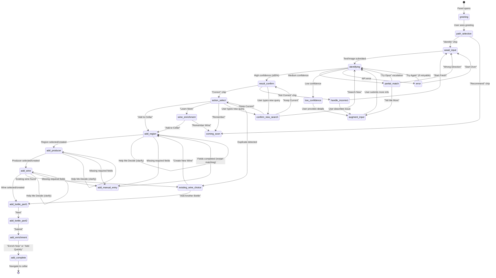
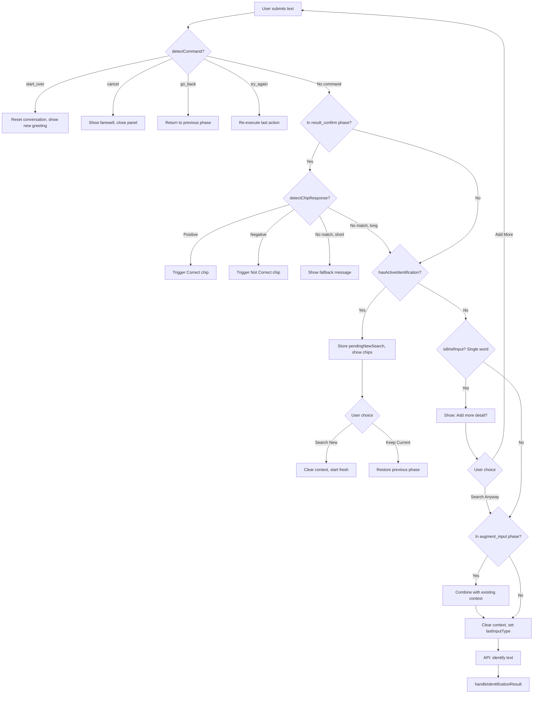
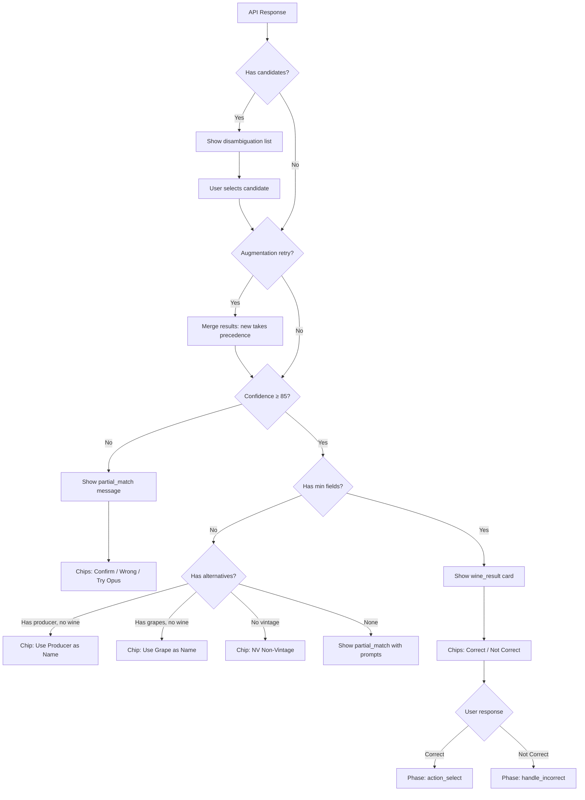
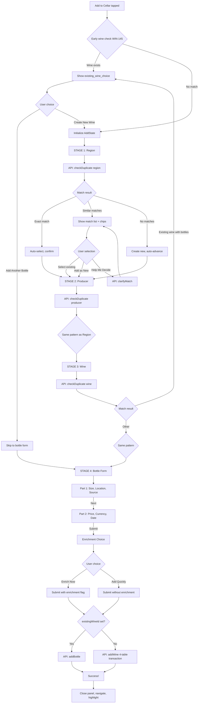
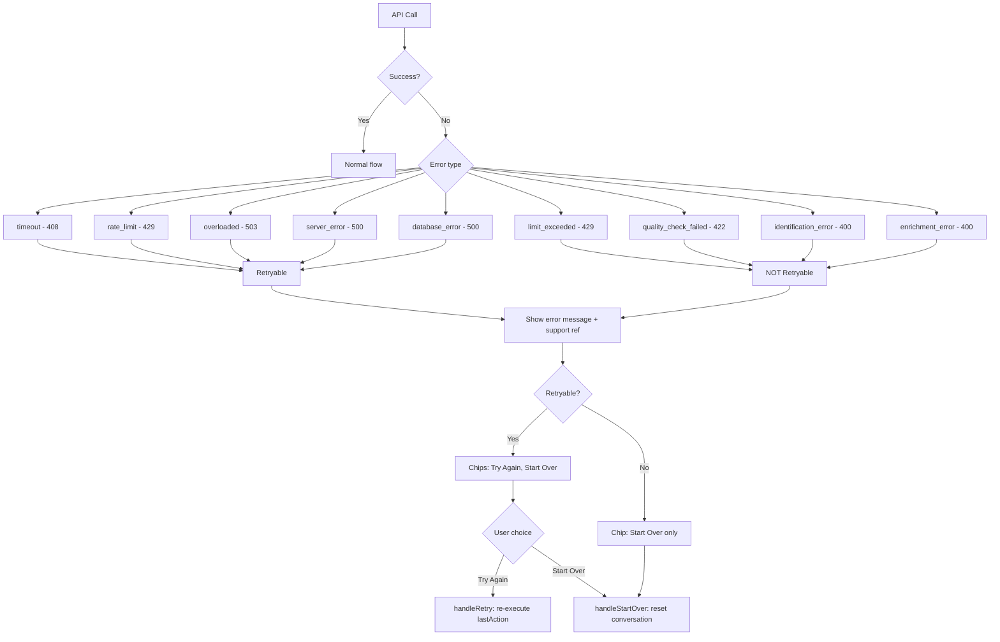
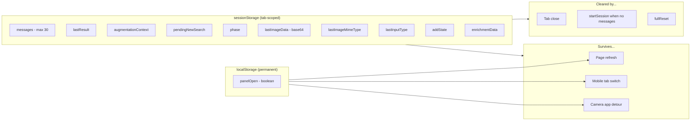

# Wine Agent Flow Documentation

This document provides comprehensive flow diagrams and reference tables for the Wine Agent's multi-path conversation logic.

**Key Files:**
- Store: [`stores/agent.ts`](../src/lib/stores/agent.ts)
- Panel: [`components/agent/AgentPanel.svelte`](../src/lib/components/agent/AgentPanel.svelte)
- Messages: [`components/agent/ChatMessage.svelte`](../src/lib/components/agent/ChatMessage.svelte)
- Commands: [`utils/commandDetector.ts`](../src/lib/utils/commandDetector.ts)

---

## Table of Contents

1. [Phase State Machine](#1-phase-state-machine)
2. [Text Input Decision Tree](#2-text-input-decision-tree)
3. [Identification Result Routing](#3-identification-result-routing)
4. [Add Wine Pipeline](#4-add-wine-pipeline)
5. [Error Handling](#5-error-handling)
6. [Session Persistence](#6-session-persistence)
7. [Agent Phrases by Phase](#7-agent-phrases-by-phase)
8. [LLM Prompt Templates](#8-llm-prompt-templates)

---

## 1. Phase State Machine

The agent operates through distinct phases. This diagram shows all valid transitions.



### Phase Definitions

| Phase | Description | User Input |
|-------|-------------|------------|
| `greeting` | Time-aware sommelier greeting | None (auto) |
| `path_selection` | Choose Identify or Recommend | Chip tap |
| `await_input` | Ready for text or image | Text/Image/Chip |
| `identifying` | Processing identification | Disabled |
| `result_confirm` | Show result, await confirmation | "Correct"/"Not Correct" |
| `partial_match` | Medium confidence, needs clarification | Chips or text |
| `low_confidence` | Low confidence, needs more info | Text |
| `handle_incorrect` | User said result was wrong | Text describing issue |
| `augment_input` | Collecting additional details | Text or image |
| `action_select` | Wine confirmed, choose action | Action chips |
| `confirm_new_search` | User typed during active result | "Search New"/"Keep Current" |
| `existing_wine_choice` | Duplicate wine found (WIN-145) | "Add Bottle"/"Create New" |
| `add_region` | Matching/creating region | Selection, "Add New", or "Help Me Decide" |
| `add_producer` | Matching/creating producer | Selection, "Add New", or "Help Me Decide" |
| `add_wine` | Matching/creating wine | Selection, "Add New", or "Help Me Decide" |
| `add_bottle_part1` | Bottle size, location, source | Form input |
| `add_bottle_part2` | Price, currency, date | Form input |
| `add_enrichment` | Choose enrichment timing | "Enrich Now"/"Add Quickly" |
| `add_manual_entry` | Fill missing required fields (from any entity stage) | Form input |
| `add_complete` | Success message | None (auto-navigate) |
| `wine_enrichment` | Displaying enrichment data | Action chips |
| `coming_soon` | Placeholder for future features | None |
| `error` | Error with retry options | "Try Again"/"Start Over" |

---

## 2. Text Input Decision Tree

This diagram shows all decision points when user submits text via `handleTextSubmit()`.



### Command Detection Priority

Commands are detected in this order (first match wins):

1. **Wine indicators** checked first - prevents "Château Cancel" from triggering cancel
2. **Long text** (>6 words) - assumed to be wine query
3. **Pattern matching** - exact, substring, spaceless variations
4. **Fallback** - treat as wine query

| Command | Triggers |
|---------|----------|
| `start_over` | "start", "start over", "restart", "reset", "new wine" |
| `cancel` | "stop", "cancel", "never mind", "quit", "exit" |
| `go_back` | "back", "go back", "undo", "previous" |
| `try_again` | "try again", "retry", "one more time" |

### Chip Response Detection

Only active in `result_confirm` phase:

| Response Type | Triggers | Action |
|---------------|----------|--------|
| Positive | "yes", "yep", "ok", "correct", "that's right" | Trigger Correct chip |
| Negative | "no", "wrong", "not right", "incorrect" | Trigger Not Correct chip |

Includes typo tolerance: "yse", "corectt", "worng"

---

## 3. Identification Result Routing

How `handleIdentificationResult()` processes API responses.



### Minimum Required Fields

A wine is considered "complete" when it has:
- `producer` (non-null, non-placeholder)
- `wineName` (non-null, non-placeholder)
- `region` (non-null)
- `wineType` (non-null)

### Quick-Fill Chips

When fields are missing but alternatives exist:

| Condition | Chip Offered |
|-----------|--------------|
| Has producer, no wineName | "Use [Producer] as Name" |
| Has primary grape, no wineName | "Use [Grape] as Name" |
| No vintage | "NV (Non-Vintage)" |

---

## 4. Add Wine Pipeline

The 4-stage entity matching flow when user taps "Add to Cellar".



### Entity Matching Chips

| Chip | Action |
|------|--------|
| `select_match:{type}:{id}` | Select existing entity |
| `add_new:{type}` | Create new entity |
| `clarify:{type}` | Call LLM for explanation |

### Bottle Form Fields

| Part 1 (Required) | Part 2 (Optional) |
|-------------------|-------------------|
| Bottle size | Price |
| Storage location | Currency |
| Source (purchased/gift/etc) | Purchase date |

---

## 5. Error Handling

Error classification and retry flow.



### Error Types Reference

| Type | HTTP | Retryable | Sommelier Message |
|------|------|-----------|-------------------|
| `timeout` | 408 | Yes | "Our sommelier is taking longer than expected..." |
| `rate_limit` | 429 | Yes | "Our sommelier is quite busy at the moment..." |
| `overloaded` | 503 | Yes | "Our sommelier is quite busy at the moment..." |
| `server_error` | 500 | Yes | "Something unexpected happened..." |
| `database_error` | 500 | Yes | "Something went wrong..." |
| `limit_exceeded` | 429 | No | "We've reached our tasting limit for today..." |
| `quality_check_failed` | 422 | No | "That image is a bit unclear..." |
| `identification_error` | 400 | No | "I couldn't identify this wine..." |
| `enrichment_error` | 400 | No | "I couldn't find additional information..." |

### Support Reference

Exception errors include a support reference: `ERR-XXXXXXXX`

- Generated from: `MD5(timestamp + errorType + endpoint)`
- Logged server-side with full stack trace
- Displayed to user for support tickets

---

## 6. Session Persistence

What data persists where and survives what events.



### Persistence Timing

| Data | Timing | Rationale |
|------|--------|-----------|
| Messages, phase, form data | Debounced (500ms) | Reduce writes |
| augmentationContext | Immediate | Critical for retry |
| pendingNewSearch | Immediate | Critical for mobile |
| lastResult | Immediate | Critical for flow |
| lastImageData | Immediate | Critical for retry |

### Quota Handling

When sessionStorage quota exceeded:

1. First: Drop `lastImageData` (largest item)
2. Still exceeded: Keep only last 10 messages
3. Always preserve: `augmentationContext`, `pendingNewSearch`

### Mobile Tab Switch Resilience

- Images stored as base64 data URLs (not ObjectURLs)
- `pendingNewSearch` survives camera app detour
- Augmentation context preserved for retry after interruption

---

## 7. Agent Phrases by Phase

All sommelier-style messages organized by context.

### Greetings (Time-Aware)

| Time Range | Messages |
|------------|----------|
| Morning (6 AM - 12 PM) | "Good morning. What shall we uncork today?"<br/>"A fresh day for discoveries. What are you considering?"<br/>"Morning light reveals the finest vintages. What catches your eye?" |
| Afternoon (12 PM - 5 PM) | "Good afternoon. Shall we explore your cellar?"<br/>"The light is perfect. What vintage intrigues you?"<br/>"A fine hour for contemplation. What wine has your attention?" |
| Evening (5 PM - 6 AM) | "Good evening. The cellar awaits your curiosity."<br/>"A fine hour for wine. What catches your eye?"<br/>"Evening sips begin with discovery. What shall we find?" |

### Identification Flow

| Scenario | Message |
|----------|---------|
| High confidence result | "Is this the wine you're seeking?" |
| Disambiguation (multiple) | "I found a few possibilities. Does one of these look right?" |
| Partial match | Context-aware: "I found something but I'm not certain..." |
| Request more info | "Tell me more — the producer name, vintage, region, or grape variety would help." |
| Request more info (image) | "Share an image, or type what you know." |

### Confirmation Responses

| User Action | Agent Response |
|-------------|----------------|
| "Correct" chip | "Excellent. What would you like to do?" |
| "Not Correct" chip | "I apologize for the confusion. Let's try a different approach." |
| Cancel command | "No problem. I'll be here when you need me." |
| Go back command | "Of course. Let's revisit that." |
| Try again command | "Let's try a different approach." |

### Add Wine Flow

| Phase | Message |
|-------|---------|
| Duplicate found (WIN-145) | "I found \"[wine]\" by [producer] already in your cellar with X bottle(s)." |
| Region matching | "I found some regions that might match \"[region]\"." |
| No matches | "I'll create a new [type] entry." |
| Match confirmed | "Got it - using \"[entity]\"." |
| Bottle form | "Now let's record the bottle details." |
| Bottle form part 2 | "And the purchase details?" |
| Enrichment choice | "Would you like me to research this wine now, or add it quickly and enrich later?" |
| Success | "Perfect! I've added \"[wine]\" to your cellar." |

### Brief Input Confirmation

| Scenario | Message |
|----------|---------|
| Single word input | "Just \"[input]\"? Adding more detail like the producer, vintage, or region will improve the match." |

### New Search Confirmation

| Scenario | Message |
|----------|---------|
| User types during active result | "I have a wine ready. Did you want to search for something new instead?" |

### Error Messages

| Error Type | Message |
|------------|---------|
| Timeout | "Our sommelier is taking longer than expected. Please try again or start over." |
| Rate limit | "Our sommelier is quite busy at the moment. Please try again in a moment." |
| Quota exceeded | "We've reached our tasting limit for today. Please try again tomorrow." |
| Poor image | "That image is a bit unclear. Could you try a clearer photo?" |
| Identification failed | "I couldn't identify this wine. Please try again with a clearer image or more details." |
| Add wine failed | "Something went wrong adding the wine." |
| Generic | "[Error message]\n\nReference: [ERR-XXXXXXXX]" |

### Coming Soon Placeholder

| Feature | Message |
|---------|---------|
| Recommendations | "Recommendations are being prepared for a future vintage." |
| Remember/Wishlist | "The wishlist feature is coming soon! For now, you can add this wine to your cellar." |

---

## 8. LLM Prompt Templates

Documentation of prompts sent to the AI backend.

### Text Identification Prompt

**File:** `resources/php/agent/prompts/text_identify.txt`

**Role:** "wine identification expert"

**Key Instructions:**
- Extract: producer, wineName, vintage, region, country, wineType, grapes
- For Bordeaux: producer IS usually the wine name (e.g., "Château Margaux")
- Recognize appellation hints (e.g., "Margaux" implies Bordeaux, France)
- Infer grape varieties from region knowledge

**Confidence Scoring (Critical):**

| Score | Definition |
|-------|------------|
| 80-100 (HIGH) | Wine RECOGNIZED as real, existing wine |
| 50-79 (MEDIUM) | Producer recognized but wine uncertain, or input ambiguous |
| 0-49 (LOW) | Producer/wine NOT recognized as real |

**Critical Rule:** "Do NOT give high confidence just because you can fill in fields with plausible regional data."

**Output Format:**
```json
{
  "producer": "string or null",
  "wineName": "string or null",
  "vintage": "string or null",
  "region": "string or null",
  "country": "string or null",
  "wineType": "string or null",
  "grapes": ["array"] or null,
  "confidence": number
}
```

### Vision/Image Identification Prompt

**File:** `resources/php/agent/prompts/vision_identify.txt`

**Role:** "wine label identification expert"

**Key Instructions:**
- Read all text visible on the wine label
- Identify producer (usually most prominent text)
- Find vintage year (front or neck label)
- Determine region/appellation from label text
- Use visual cues: label design style, bottle shape, medallions

**Quality-Based Confidence:**
- Clear Bordeaux label → 85-95
- Blurry but readable → 50-70
- Distance photo → 40-60
- Not a wine label → 0

### Escalation Prompt (Tier 1.5+)

**Role:** "master sommelier with expertise"

**Additional Context Prepended:**
```
Previous attempt found: Producer={producer}, Wine={wineName},
Region={region} (confidence: {confidence}%).
Please analyze more carefully and look for details that might have been missed.
```

**Enhanced Instructions:**
- Expand abbreviations: "Chx" = Château, "Dom" = Domaine
- Recognize First Growth Bordeaux by name alone
- Consider appellation rules to deduce grape varieties

### Enrichment Prompt

**File:** `resources/php/agent/prompts/enrichment_search.txt`

**Web Search Enabled:** Yes (Google Search grounding)

**Data to Extract:**
1. Grape varieties with percentages
2. Official appellation/AVA
3. Alcohol content (ABV%)
4. Drink window (start/end years, maturity)
5. Critic scores: WS, RP, Decanter, JS (100-point scale only)
6. Production method notes
7. Style profile: body, tannin, acidity, sweetness
8. Overview (3-4 sentences, 60-120 words)
9. Tasting notes (3-4 sentences, 60-120 words)
10. Food pairings (3-4 sentences, 60-100 words)

**Output Format:**
```json
{
  "grapeVarieties": [{"grape": "string", "percentage": number}],
  "appellation": "string",
  "alcoholContent": number,
  "drinkWindow": {"start": year, "end": year, "maturity": "young|ready|peak|declining"},
  "criticScores": [{"critic": "WS|RP|Decanter|JS", "score": number, "year": number}],
  "productionMethod": "string",
  "body": "string",
  "tannin": "string",
  "acidity": "string",
  "sweetness": "string",
  "overview": "string",
  "tastingNotes": "string",
  "pairingNotes": "string"
}
```

### Clarification Prompt ("Help Me Decide")

**File:** `resources/php/agent/clarifyMatch.php`

**Dynamic Prompt:**
```
You are an expert sommelier helping a wine collector.

The user is trying to add: {producer} - {wineName} ({vintage})
Region: {region}

I found these existing {type} entries in their collection:
{optionsList}

Task: In 1-2 sentences, explain which option best matches what they're
adding, or if they should create a new entry. Be concise and complete
your thought.
```

### LLM Configuration by Task

| Task | Model | Temperature | Max Tokens | Timeout | Notes |
|------|-------|-------------|------------|---------|-------|
| Text identification | Gemini | 0.3 | 1,000 | 30s | Low variance |
| Image identification | Gemini Vision | 0.3 | 4,000 | 45s | Vision model |
| Opus escalation | Claude Opus | 0.3 | 4,000 | 60s | Premium tier |
| Enrichment | Gemini | 1.0 | 10,000 | 90s | Web search requires temp=1.0 |
| Clarification | Gemini | default | 500 | 30s | Short response |

---

## Quick Reference: Chip Actions

| Chip ID | Phase | Action |
|---------|-------|--------|
| `identify` | greeting, path_selection | Show input options |
| `recommend` | greeting, path_selection | Show "Coming soon" |
| `correct` | result_confirm | Proceed to action_select |
| `not_correct` | result_confirm | Handle incorrect flow |
| `try_opus` | partial_match | Escalate to Opus model |
| `confirm_direction` | partial_match | Request more details |
| `wrong_direction` | partial_match | Clear result, keep input |
| `add` | action_select | Start add wine flow |
| `learn` | action_select | Trigger enrichment |
| `remember` | action_select | Show "Coming soon" |
| `add_bottle_existing` | existing_wine_choice | Add bottle to existing wine |
| `create_new_wine` | existing_wine_choice | Create new wine entry |
| `select_match:{type}:{id}` | match_selection | Select existing entity |
| `add_new:{type}` | match_selection | Create new entity |
| `clarify:{type}` | match_selection | Get LLM explanation |
| `bottle_next` | add_bottle_part1 | Advance to part 2 |
| `bottle_submit` | add_bottle_part2 | Show enrichment choice |
| `enrich_now` | add_enrichment | Submit with enrichment |
| `add_quickly` | add_enrichment | Submit without enrichment |
| `retry` | error | Re-execute last action |
| `start_over` | various | Reset conversation |
| `confirm_new_search` | confirm_new_search | Start new identification |
| `continue_current` | confirm_new_search | Return to previous phase |
| `confirm_brief_search` | brief_input | Proceed with single word |
| `add_more_detail` | brief_input | Prompt for more input |

---

*Last updated: 2026-02-01*
